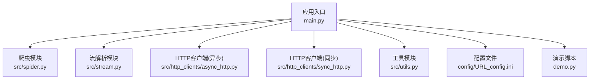
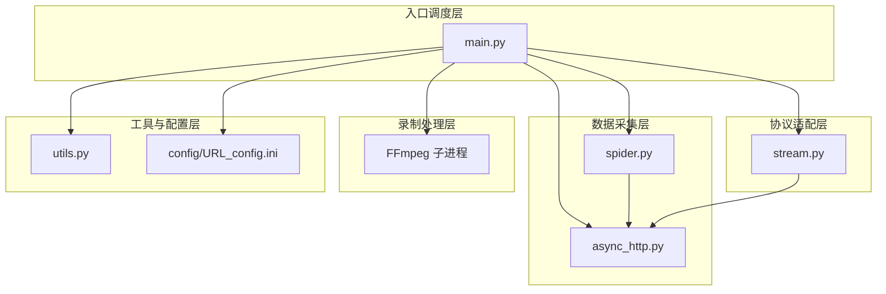
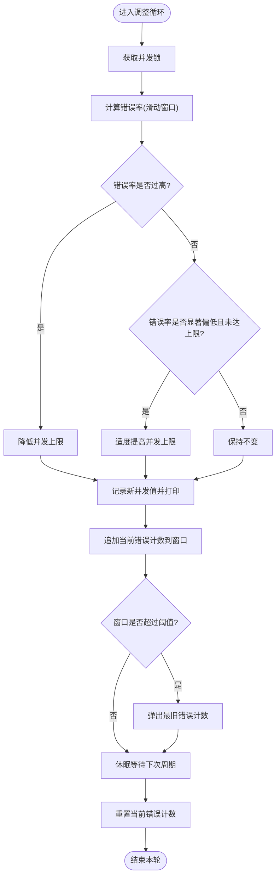
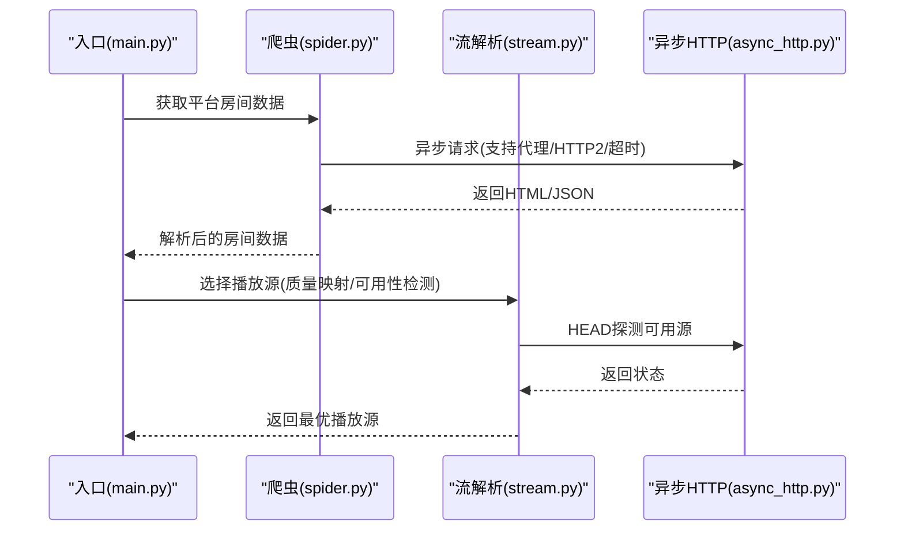
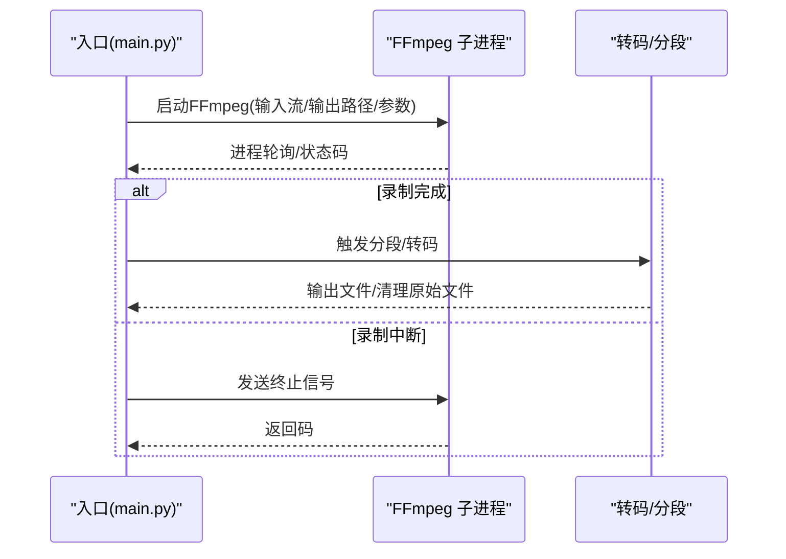
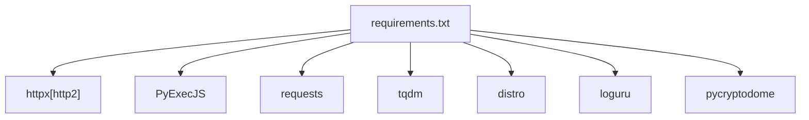

# 性能优化

<cite>
**本文引用的文件**
- [main.py](file://main.py)
- [src/spider.py](file://src/spider.py)
- [src/stream.py](file://src/stream.py)
- [src/http_clients/async_http.py](file://src/http_clients/async_http.py)
- [src/http_clients/sync_http.py](file://src/http_clients/sync_http.py)
- [src/utils.py](file://src/utils.py)
- [requirements.txt](file://requirements.txt)
- [config/URL_config.ini](file://config/URL_config.ini)
- [demo.py](file://demo.py)
</cite>

## 目录
1. [简介](#简介)
2. [项目结构](#项目结构)
3. [核心组件](#核心组件)
4. [架构总览](#架构总览)
5. [详细组件分析](#详细组件分析)
6. [依赖分析](#依赖分析)
7. [性能考量](#性能考量)
8. [故障排查指南](#故障排查指南)
9. [结论](#结论)
10. [附录](#附录)

## 简介
本指南围绕 DouyinLiveRecorder 的并发控制、录制性能、内存与 CPU 使用、网络性能以及监控分析等方面，结合源码实现给出系统化的性能优化策略与最佳实践。内容涵盖异步任务调度、线程池配置、连接池管理、资源限制、FFmpeg 参数调优、编码格式与分辨率选择、码率控制、内存泄漏预防、垃圾回收优化、CPU 密集型任务处理、多核利用、连接复用、请求合并、缓存策略、带宽管理、系统监控指标、性能基准测试与瓶颈识别方法。

## 项目结构
该项目采用模块化设计，按职责划分为：
- 应用入口与主流程：负责并发调度、录制生命周期管理、FFmpeg 子进程控制、动态并发调节、日志与通知等
- 爬虫与流解析：针对不同直播平台的房间信息与播放源解析
- HTTP 客户端：异步与同步 HTTP 请求封装，支持代理、HTTP/2、重定向与 Cookie 返回
- 工具与通用能力：配置读写、磁盘容量检测、代理地址规范化、随机字符串生成、查询参数解析等
- 配置与演示：URL 列表配置、平台示例与测试脚本

图表来源
- [main.py:1-200](file://main.py#L1-L200)
- [src/spider.py:1-120](file://src/spider.py#L1-L120)
- [src/stream.py:1-60](file://src/stream.py#L1-L60)
- [src/http_clients/async_http.py:1-60](file://src/http_clients/async_http.py#L1-L60)
- [src/http_clients/sync_http.py:1-89](file://src/http_clients/sync_http.py#L1-L89)
- [src/utils.py:1-80](file://src/utils.py#L1-L80)
- [config/URL_config.ini:1-5](file://config/URL_config.ini#L1-L5)
- [demo.py:1-60](file://demo.py#L1-L60)

章节来源
- [main.py:1-200](file://main.py#L1-L200)
- [src/spider.py:1-120](file://src/spider.py#L1-L120)
- [src/stream.py:1-60](file://src/stream.py#L1-L60)
- [src/http_clients/async_http.py:1-60](file://src/http_clients/async_http.py#L1-L60)
- [src/http_clients/sync_http.py:1-89](file://src/http_clients/sync_http.py#L1-L89)
- [src/utils.py:1-80](file://src/utils.py#L1-L80)
- [config/URL_config.ini:1-5](file://config/URL_config.ini#L1-L5)
- [demo.py:1-60](file://demo.py#L1-L60)

## 核心组件
- 并发调度与动态限流：通过共享变量与锁控制同时访问网络的线程数量，并基于滑动窗口计算错误率进行自适应调整
- 异步 HTTP 客户端：统一的异步请求封装，支持代理、HTTP/2、超时、重定向与 Cookie 返回
- 流解析与质量选择：针对各平台的播放源解析与质量映射，支持自动探测可用源
- FFmpeg 录制与转码：子进程调用 FFmpeg 进行录制、分段、转码与后处理
- 工具与配置：磁盘容量检测、代理地址规范化、配置读写、查询参数解析等

章节来源
- [main.py:297-325](file://main.py#L297-L325)
- [src/http_clients/async_http.py:10-47](file://src/http_clients/async_http.py#L10-L47)
- [src/spider.py:68-141](file://src/spider.py#L68-L141)
- [src/stream.py:40-78](file://src/stream.py#L40-L78)
- [main.py:420-491](file://main.py#L420-L491)
- [src/utils.py:149-159](file://src/utils.py#L149-L159)
- [src/utils.py:162-168](file://src/utils.py#L162-L168)
- [src/utils.py:85-108](file://src/utils.py#L85-L108)
- [src/utils.py:197-206](file://src/utils.py#L197-L206)

## 架构总览
整体架构由“入口调度层”“数据采集层”“协议适配层”“录制处理层”“工具与配置层”构成。入口层负责并发与录制生命周期；数据采集层通过异步 HTTP 客户端抓取平台页面与 API；协议适配层解析播放源并选择合适质量；录制处理层调用 FFmpeg 进行录制与转码；工具与配置层提供通用能力与持久化配置。

图表来源
- [main.py:1-200](file://main.py#L1-L200)
- [src/http_clients/async_http.py:1-60](file://src/http_clients/async_http.py#L1-L60)
- [src/spider.py:1-120](file://src/spider.py#L1-L120)
- [src/stream.py:1-60](file://src/stream.py#L1-L60)
- [src/utils.py:1-80](file://src/utils.py#L1-L80)
- [config/URL_config.ini:1-5](file://config/URL_config.ini#L1-L5)

## 详细组件分析

### 并发控制与动态限流
- 全局并发上限：通过共享变量与锁保护，避免过度并发导致平台风控或本地资源耗尽
- 错误率滑动窗口：维护固定长度的错误计数窗口，根据错误率动态增减并发上限
- 线程安全：所有对并发上限与错误窗口的修改均在锁内进行

图表来源
- [main.py:297-325](file://main.py#L297-L325)

章节来源
- [main.py:48-54](file://main.py#L48-L54)
- [main.py:297-325](file://main.py#L297-L325)

### 异步任务调度与 HTTP 客户端
- 异步请求封装：统一处理 GET/POST、代理、HTTP/2、超时、重定向与 Cookie 返回
- 平台解析：针对抖音、TikTok、快手、虎牙、斗鱼、YY、B站、小红书等平台的房间信息与播放源解析
- 源质量选择：按质量映射与可用性检测选择最优播放源

图表来源
- [src/spider.py:68-141](file://src/spider.py#L68-L141)
- [src/stream.py:40-78](file://src/stream.py#L40-L78)
- [src/http_clients/async_http.py:10-47](file://src/http_clients/async_http.py#L10-L47)

章节来源
- [src/http_clients/async_http.py:10-47](file://src/http_clients/async_http.py#L10-L47)
- [src/spider.py:68-141](file://src/spider.py#L68-L141)
- [src/stream.py:40-78](file://src/stream.py#L40-L78)

### FFmpeg 录制与转码
- 录制流程：启动 FFmpeg 子进程，拉流并写入本地文件；支持录制分段、生成时间文件、转码为 MP4 或 AAC
- 分段策略：按设定时长切片，保留关键帧与空容器标志，减少重排成本
- 转码参数：可选重新编码为 H.264，设置预设与 CRF，保证兼容性与体积平衡

图表来源
- [main.py:420-491](file://main.py#L420-L491)
- [main.py:189-217](file://main.py#L189-L217)
- [main.py:219-251](file://main.py#L219-L251)
- [main.py:254-271](file://main.py#L254-L271)

章节来源
- [main.py:189-217](file://main.py#L189-L217)
- [main.py:219-251](file://main.py#L219-L251)
- [main.py:254-271](file://main.py#L254-L271)
- [main.py:420-491](file://main.py#L420-L491)

### 工具与配置
- 磁盘容量检测：在录制前检查目标目录剩余空间，避免磁盘满导致录制失败
- 代理地址规范化：统一添加 http 前缀，支持无代理场景
- 配置读写：提供配置项读取与更新，用于保存平台 Cookie 与授权令牌
- 查询参数解析：从 URL 中提取指定参数，便于调试与参数追踪

章节来源
- [src/utils.py:149-159](file://src/utils.py#L149-L159)
- [src/utils.py:162-168](file://src/utils.py#L162-L168)
- [src/utils.py:85-108](file://src/utils.py#L85-L108)
- [src/utils.py:197-206](file://src/utils.py#L197-L206)

## 依赖分析
- 第三方依赖：requests、httpx[http2]、PyExecJS、loguru、pycryptodome、distro、tqdm
- 关键依赖作用：
  - httpx：异步 HTTP 客户端，支持 HTTP/2、超时与代理
  - PyExecJS：执行平台反爬逻辑中的 JS 计算
  - requests/tqdm/distropy：辅助下载与进度显示、系统信息获取

图表来源
- [requirements.txt:1-7](file://requirements.txt#L1-L7)

章节来源
- [requirements.txt:1-7](file://requirements.txt#L1-L7)

## 性能考量

### 并发控制优化策略
- 动态并发上限：基于错误率滑动窗口自适应调整，避免平台风控与本地资源争用
- 线程安全：所有并发变量修改均在锁内进行，防止竞态条件
- 并发粒度：将“获取房间数据”“选择播放源”“拉流录制”等步骤拆分为独立任务，避免阻塞

章节来源
- [main.py:297-325](file://main.py#L297-L325)
- [main.py:48-54](file://main.py#L48-L54)

### 录制性能优化
- FFmpeg 参数调优：
  - 分段录制：启用关键帧与空容器标志，减少切片开销
  - 转码策略：仅在必要时重新编码，优先复制视频/音频流以节省 CPU
  - 预设与 CRF：在兼容性与体积之间权衡
- 编码格式与分辨率：
  - 优先选择平台原生编码，避免二次转码
  - 根据网络带宽与设备性能选择合适分辨率与码率
- 码率控制：结合平台提供的多码率源，按质量映射与可用性检测选择最优

章节来源
- [main.py:189-217](file://main.py#L189-L217)
- [main.py:219-251](file://main.py#L219-L251)
- [src/stream.py:40-78](file://src/stream.py#L40-L78)

### 内存管理与 CPU 使用优化
- 内存泄漏预防：
  - 使用 with 上下文管理异步 HTTP 客户端，确保连接释放
  - 对大对象（如 JSON）及时释放引用，避免长时间驻留
- 垃圾回收优化：合理控制对象生命周期，避免频繁创建临时对象
- CPU 密集型任务：
  - 将 JS 计算与加密解密等任务放在独立模块中，避免阻塞主线程
  - 使用多核时注意任务拆分与结果聚合的成本
- 多核利用：FFmpeg 本身具备多核能力，可通过参数调优发挥硬件潜力

章节来源
- [src/http_clients/async_http.py:30-34](file://src/http_clients/async_http.py#L30-L34)
- [src/spider.py:144-226](file://src/spider.py#L144-L226)
- [src/utils.py:38-51](file://src/utils.py#L38-L51)

### 网络性能优化
- 连接复用：httpx 支持 HTTP/2，可在同一连接上复用多个请求
- 请求合并：对同平台的多次请求进行去重与合并，减少握手开销
- 缓存策略：对静态资源与配置文件进行本地缓存，降低重复请求
- 带宽管理：根据平台质量映射与可用性检测，选择更稳定的源，避免频繁切换

章节来源
- [src/http_clients/async_http.py:20-24](file://src/http_clients/async_http.py#L20-L24)
- [src/spider.py:68-141](file://src/spider.py#L68-L141)
- [src/stream.py:40-78](file://src/stream.py#L40-L78)

### 性能监控与分析
- 系统监控指标：并发线程数、录制时长、磁盘剩余空间、错误率、FFmpeg 返回码
- 性能基准测试：对不同分辨率与码率组合进行录制时延与资源占用对比
- 瓶颈识别方法：通过日志与错误率滑动窗口定位并发上限与网络波动的关联
- 优化效果评估：对比优化前后录制成功率、平均时延与资源消耗

章节来源
- [main.py:90-135](file://main.py#L90-L135)
- [src/utils.py:149-159](file://src/utils.py#L149-L159)
- [main.py:297-325](file://main.py#L297-L325)

## 故障排查指南
- 平台风控与网络异常：
  - 检查代理配置与平台访问限制
  - 适当降低并发上限，缓解风控触发
- FFmpeg 录制失败：
  - 核对输入源可用性与格式
  - 调整分段参数与转码策略
- 配置更新与持久化：
  - 使用配置读写工具更新 Cookie 与授权令牌
  - 监控配置文件变更并自动备份

章节来源
- [src/utils.py:85-108](file://src/utils.py#L85-L108)
- [main.py:688-691](file://main.py#L688-L691)
- [main.py:751-752](file://main.py#L751-L752)
- [main.py:781-782](file://main.py#L781-L782)
- [main.py:803-804](file://main.py#L803-L804)

## 结论
通过对并发控制、HTTP 客户端、流解析与 FFmpeg 录制的系统化优化，可显著提升录制稳定性与资源利用率。建议在生产环境中结合动态并发调节、HTTP/2 连接复用、合理的分段与转码策略、磁盘容量监控与配置持久化，形成一套可量化的性能优化体系。

## 附录

### 优化案例与参数建议
- 并发控制
  - 初始并发上限：依据平台与网络状况设置为中等值，随后由错误率滑动窗口自适应
  - 窗口大小与阈值：窗口长度与错误阈值需结合平台风控强度与网络波动调整
- FFmpeg 参数
  - 分段：启用关键帧与空容器标志，按需设置切片时长
  - 转码：优先复制流，必要时使用较快速预设与合理 CRF
- 编码与分辨率
  - 优先选择平台原生编码，避免二次转码
  - 根据带宽与设备性能选择分辨率与码率
- 网络优化
  - 开启 HTTP/2，使用稳定代理节点
  - 对同平台请求进行去重与合并

### 最佳实践清单
- 使用异步 HTTP 客户端并启用 HTTP/2
- 在录制前检查磁盘容量
- 通过滑动窗口动态调节并发上限
- 仅在必要时进行转码，优先复制流
- 对配置文件变更进行监控与备份
- 使用日志与错误率指标持续评估优化效果