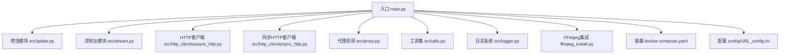
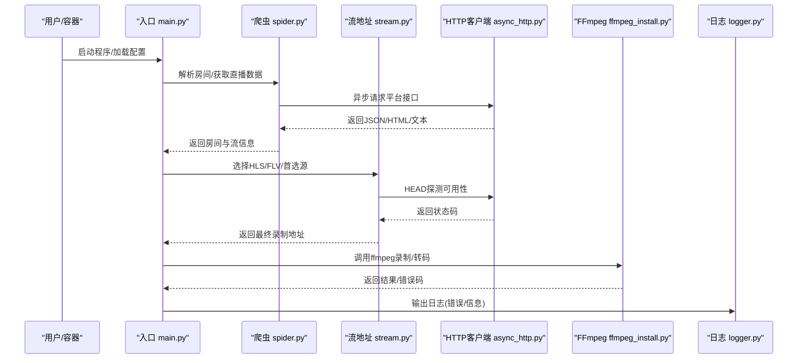
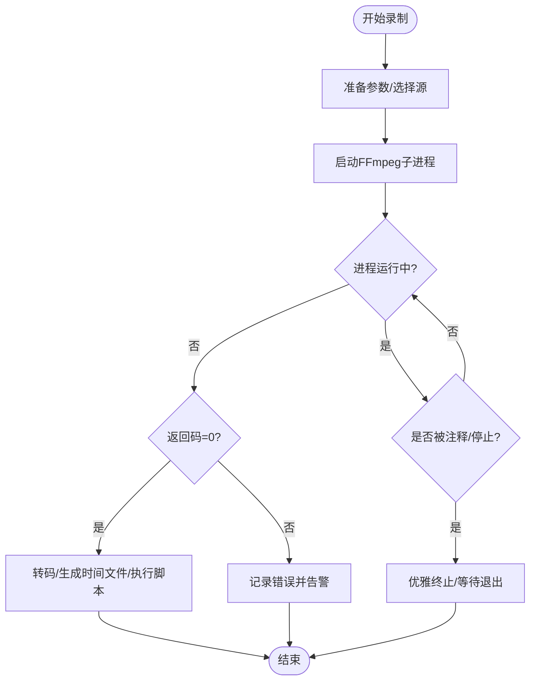
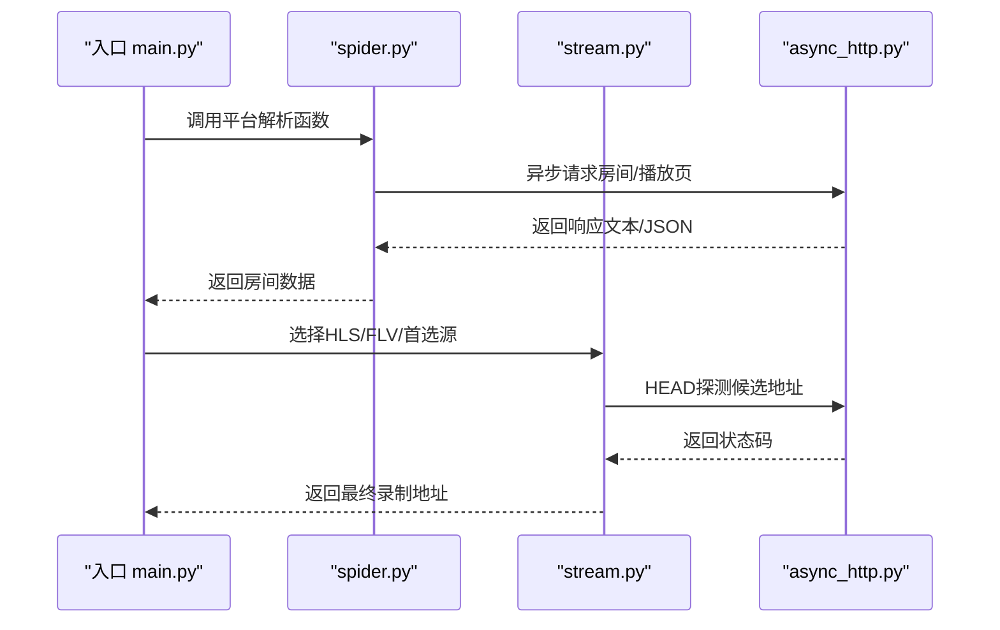
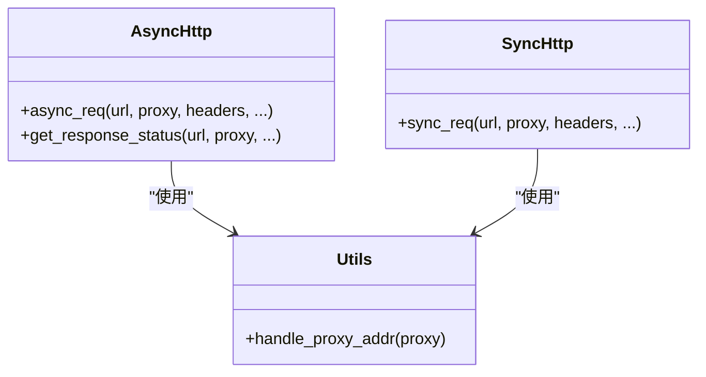
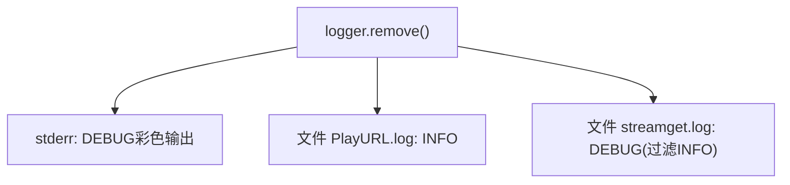
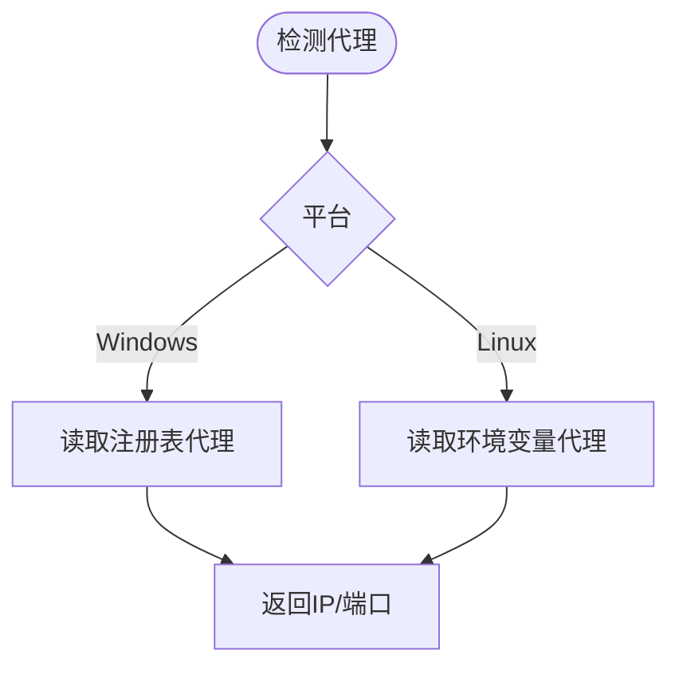
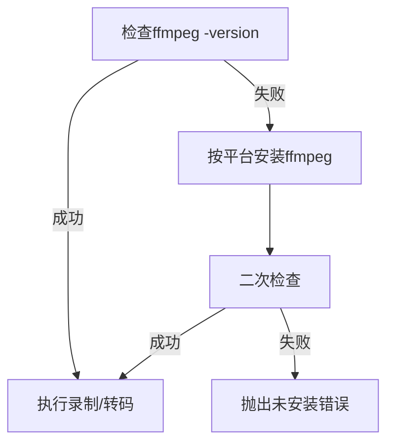
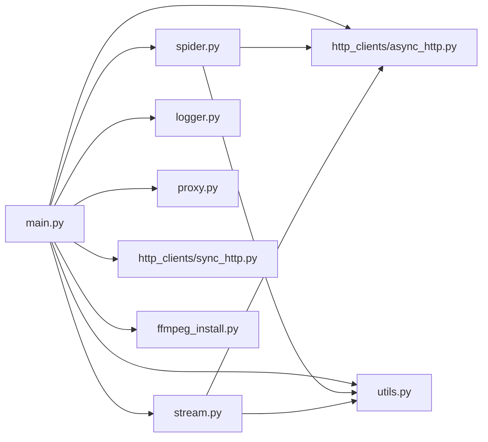

# 故障排除

<cite>
**本文引用的文件**   
- [README.md](file://README.md)
- [main.py](file://main.py)
- [src/logger.py](file://src/logger.py)
- [src/proxy.py](file://src/proxy.py)
- [src/spider.py](file://src/spider.py)
- [src/stream.py](file://src/stream.py)
- [src/utils.py](file://src/utils.py)
- [src/http_clients/async_http.py](file://src/http_clients/async_http.py)
- [src/http_clients/sync_http.py](file://src/http_clients/sync_http.py)
- [ffmpeg_install.py](file://ffmpeg_install.py)
- [docker-compose.yaml](file://docker-compose.yaml)
- [config/URL_config.ini](file://config/URL_config.ini)
</cite>

## 目录
1. [简介](#简介)
2. [项目结构](#项目结构)
3. [核心组件](#核心组件)
4. [架构总览](#架构总览)
5. [详细组件分析](#详细组件分析)
6. [依赖分析](#依赖分析)
7. [性能考虑](#性能考虑)
8. [故障排除指南](#故障排除指南)
9. [结论](#结论)
10. [附录](#附录)

## 简介
本指南面向使用“抖音直播录制器”项目的运维与使用者，提供系统化的故障排除方法与最佳实践。内容覆盖安装与环境问题、配置问题、录制问题、网络问题、日志分析、性能优化、网络诊断工具使用、问题排查流程与预防措施等。文中所有技术细节均基于仓库源码与配置文件的实际实现。

## 项目结构
项目采用模块化设计，核心逻辑集中在入口脚本与若干子模块：
- 入口与控制流：main.py
- 日志系统：src/logger.py
- 网络与代理：src/http_clients/*、src/proxy.py
- 平台解析与直播源获取：src/spider.py、src/stream.py
- 工具与通用能力：src/utils.py
- FFmpeg集成与安装：ffmpeg_install.py
- 容器编排：docker-compose.yaml
- 配置文件：config/URL_config.ini

图表来源
- [main.py:1-200](file://main.py#L1-L200)
- [src/spider.py:1-100](file://src/spider.py#L1-L100)
- [src/stream.py:1-100](file://src/stream.py#L1-L100)
- [src/http_clients/async_http.py:1-60](file://src/http_clients/async_http.py#L1-L60)
- [src/http_clients/sync_http.py:1-89](file://src/http_clients/sync_http.py#L1-L89)
- [src/proxy.py:1-93](file://src/proxy.py#L1-L93)
- [src/utils.py:1-200](file://src/utils.py#L1-L200)
- [src/logger.py:1-44](file://src/logger.py#L1-L44)
- [ffmpeg_install.py:1-222](file://ffmpeg_install.py#L1-L222)
- [docker-compose.yaml:1-16](file://docker-compose.yaml#L1-L16)
- [config/URL_config.ini:1-5](file://config/URL_config.ini#L1-L5)

章节来源
- [README.md:72-100](file://README.md#L72-L100)
- [main.py:1-200](file://main.py#L1-L200)

## 核心组件
- 录制控制与调度：负责并发控制、录制流程、分段与转码、消息推送、脚本钩子等。
- 爬虫与直播源解析：针对不同平台的房间信息与流地址解析，含质量选择与可用性探测。
- HTTP客户端：异步与同步请求封装，支持代理、重定向、SSL校验与HTTP/2开关。
- 日志系统：多通道日志输出，包含错误日志与播放URL日志，支持轮转与保留策略。
- 代理检测：跨平台读取系统代理配置，辅助判断代理启用状态与地址。
- 工具集：配置读写、磁盘容量检查、随机字符串生成、查询参数解析、代理地址规范化等。
- FFmpeg集成：自动检测与安装、版本校验、录制命令拼装与转码流程。
- 容器编排：挂载配置、日志、备份与下载目录，便于容器化部署与持久化。

章节来源
- [main.py:298-325](file://main.py#L298-L325)
- [src/spider.py:68-141](file://src/spider.py#L68-L141)
- [src/stream.py:40-78](file://src/stream.py#L40-L78)
- [src/http_clients/async_http.py:10-46](file://src/http_clients/async_http.py#L10-L46)
- [src/http_clients/sync_http.py:20-88](file://src/http_clients/sync_http.py#L20-L88)
- [src/logger.py:11-43](file://src/logger.py#L11-L43)
- [src/proxy.py:27-93](file://src/proxy.py#L27-L93)
- [src/utils.py:65-108](file://src/utils.py#L65-L108)
- [ffmpeg_install.py:161-222](file://ffmpeg_install.py#L161-L222)
- [docker-compose.yaml:11-16](file://docker-compose.yaml#L11-L16)

## 架构总览
下图展示从入口到平台解析、网络请求、录制与日志的关键交互：

图表来源
- [main.py:545-800](file://main.py#L545-L800)
- [src/spider.py:68-141](file://src/spider.py#L68-L141)
- [src/stream.py:40-78](file://src/stream.py#L40-L78)
- [src/http_clients/async_http.py:10-46](file://src/http_clients/async_http.py#L10-L46)
- [ffmpeg_install.py:174-222](file://ffmpeg_install.py#L174-L222)
- [src/logger.py:11-43](file://src/logger.py#L11-L43)

## 详细组件分析

### 组件A：录制流程与并发控制
- 动态并发调整：通过计数窗口与阈值动态调节同时访问网络的线程数，降低错误率。
- 录制生命周期：准备FFmpeg命令、启动子进程、监控进程退出码、按需转码与执行外部脚本。
- 停止机制：支持注释URL、全局停止信号、Windows/Linux信号中断，保证录制文件完整性。

图表来源
- [main.py:420-492](file://main.py#L420-L492)
- [main.py:298-325](file://main.py#L298-L325)

章节来源
- [main.py:298-325](file://main.py#L298-L325)
- [main.py:420-492](file://main.py#L420-L492)

### 组件B：平台解析与直播源选择
- 平台识别与数据获取：根据URL特征路由到对应平台解析函数，支持Web/App两种入口。
- 质量映射与回退：将中文质量映射为内部编码，优先选择HLS，必要时回退到次高质量。
- 可用性探测：对候选地址进行HEAD探测，确保可访问后再选择。

图表来源
- [main.py:580-800](file://main.py#L580-L800)
- [src/spider.py:68-141](file://src/spider.py#L68-L141)
- [src/stream.py:40-78](file://src/stream.py#L40-L78)
- [src/http_clients/async_http.py:49-59](file://src/http_clients/async_http.py#L49-L59)

章节来源
- [src/spider.py:68-141](file://src/spider.py#L68-L141)
- [src/stream.py:40-78](file://src/stream.py#L40-L78)
- [src/http_clients/async_http.py:49-59](file://src/http_clients/async_http.py#L49-L59)

### 组件C：HTTP客户端与代理
- 异步请求：支持GET/POST、自动跟随重定向、可选HTTP/2、可关闭SSL校验。
- 同步请求：兼容旧场景，支持代理、gzip解压、超时控制。
- 代理处理：统一规范化代理地址，支持http/https前缀补全。

图表来源
- [src/http_clients/async_http.py:10-46](file://src/http_clients/async_http.py#L10-L46)
- [src/http_clients/sync_http.py:20-88](file://src/http_clients/sync_http.py#L20-L88)
- [src/utils.py:162-168](file://src/utils.py#L162-L168)

章节来源
- [src/http_clients/async_http.py:10-46](file://src/http_clients/async_http.py#L10-L46)
- [src/http_clients/sync_http.py:20-88](file://src/http_clients/sync_http.py#L20-L88)
- [src/utils.py:162-168](file://src/utils.py#L162-L168)

### 组件D：日志系统
- 多通道输出：stderr与文件；文件通道区分错误与信息级别。
- 轮转与保留：按大小轮转、保留最近1天。
- 结构化格式：包含时间、级别、名称/函数/行号、消息。

图表来源
- [src/logger.py:7-31](file://src/logger.py#L7-L31)

章节来源
- [src/logger.py:7-31](file://src/logger.py#L7-L31)

### 组件E：代理检测
- Windows：读取注册表代理配置，提取IP与端口。
- Linux：读取环境变量http/https/ftp代理。
- 校验：返回启用状态与代理信息，辅助录制流程选择代理。

图表来源
- [src/proxy.py:27-93](file://src/proxy.py#L27-L93)

章节来源
- [src/proxy.py:27-93](file://src/proxy.py#L27-L93)

### 组件F：FFmpeg集成
- 自动检测：通过子进程调用ffmpeg -version。
- 安装流程：Windows/类Unix平台分别处理，支持Homebrew/apt/yum。
- 包装装饰器：ensure_ffmpeg_installed在缺失时触发安装并重试。

图表来源
- [ffmpeg_install.py:174-222](file://ffmpeg_install.py#L174-L222)
- [ffmpeg_install.py:202-222](file://ffmpeg_install.py#L202-L222)

章节来源
- [ffmpeg_install.py:174-222](file://ffmpeg_install.py#L174-L222)
- [ffmpeg_install.py:202-222](file://ffmpeg_install.py#L202-L222)

## 依赖分析
- 模块耦合
  - main.py高度依赖spider/stream模块进行平台解析与源选择，依赖utils进行配置与工具操作，依赖logger进行日志输出。
  - spider/stream依赖async_http/sync_http进行网络请求，依赖utils进行参数处理。
  - proxy模块独立，供main.py在代理选择时调用。
  - ffmpeg_install.py与main.py存在运行期依赖（录制前检查）。
- 外部依赖
  - httpx、requests、loguru、execjs等第三方库。
  - FFmpeg二进制工具。

图表来源
- [main.py:1-200](file://main.py#L1-L200)
- [src/spider.py:1-100](file://src/spider.py#L1-L100)
- [src/stream.py:1-100](file://src/stream.py#L1-L100)
- [src/http_clients/async_http.py:1-60](file://src/http_clients/async_http.py#L1-L60)
- [src/http_clients/sync_http.py:1-89](file://src/http_clients/sync_http.py#L1-89)
- [src/utils.py:1-200](file://src/utils.py#L1-L200)
- [src/logger.py:1-44](file://src/logger.py#L1-L44)
- [src/proxy.py:1-93](file://src/proxy.py#L1-L93)
- [ffmpeg_install.py:1-222](file://ffmpeg_install.py#L1-L222)

章节来源
- [main.py:1-200](file://main.py#L1-L200)
- [src/spider.py:1-100](file://src/spider.py#L1-L100)
- [src/stream.py:1-100](file://src/stream.py#L1-L100)
- [src/http_clients/async_http.py:1-60](file://src/http_clients/async_http.py#L1-L60)
- [src/http_clients/sync_http.py:1-89](file://src/http_clients/sync_http.py#L1-L89)
- [src/utils.py:1-200](file://src/utils.py#L1-L200)
- [src/logger.py:1-44](file://src/logger.py#L1-L44)
- [src/proxy.py:1-93](file://src/proxy.py#L1-L93)
- [ffmpeg_install.py:1-222](file://ffmpeg_install.py#L1-L222)

## 性能考虑
- 并发与限速
  - 动态并发：通过错误率滑动窗口与阈值动态调整最大并发，避免触发风控或服务端限流。
  - 建议：合理设置循环间隔与并发上限，结合平台特性调整质量与分辨率。
- 存储与IO
  - 分段录制：按时间切片减少单文件体积，便于后续转码与传输。
  - 转码策略：仅在需要时进行h264转码，避免不必要的CPU消耗。
- 网络与代理
  - 代理启用：对海外平台或受限区域启用代理，减少直连失败。
  - HTTP/2：在支持的平台开启HTTP/2可提升请求效率。
- 资源监控
  - 建议：监控CPU、内存、磁盘剩余空间与网络带宽，预留缓冲。

章节来源
- [main.py:298-325](file://main.py#L298-L325)
- [main.py:189-251](file://main.py#L189-L251)
- [src/stream.py:65-78](file://src/stream.py#L65-L78)

## 故障排除指南

### 一、安装与环境问题
- 症状
  - 程序启动后提示未安装FFmpeg或无法找到ffmpeg命令。
- 诊断
  - 检查系统PATH是否包含ffmpeg路径，确认ffmpeg -version是否可用。
  - 查看日志文件streamget.log中关于ffmpeg安装与版本检查的记录。
- 解决
  - 使用内置安装流程自动安装（Windows/类Unix平台），或手动安装后重启终端。
  - 容器模式下确认卷挂载downloads/logs/backup_config/config有效。
- 预防
  - 首次运行前执行安装流程，或在CI/CD中预热镜像包含ffmpeg。

章节来源
- [ffmpeg_install.py:174-222](file://ffmpeg_install.py#L174-L222)
- [ffmpeg_install.py:202-222](file://ffmpeg_install.py#L202-L222)
- [docker-compose.yaml:11-16](file://docker-compose.yaml#L11-L16)

### 二、配置问题
- 症状
  - 录制列表为空、URL无效、画质选择不生效。
- 诊断
  - 检查URL_config.ini中URL格式与注释符使用，确认每行一个URL。
  - 在日志PlayURL.log中查看是否输出了目标URL与解析结果。
- 解决
  - 修正URL格式，移除无效注释；为特定URL添加“画质,URL”格式以覆盖默认画质。
  - 对海外平台在配置中开启代理并正确填写代理地址。
- 预防
  - 使用稳定版本的URL，避免短链与主页链接；定期清理重复URL。

章节来源
- [config/URL_config.ini:1-5](file://config/URL_config.ini#L1-L5)
- [src/logger.py:33-43](file://src/logger.py#L33-L43)
- [main.py:113-119](file://main.py#L113-L119)

### 三、录制问题
- 症状
  - 录制启动后立即退出、返回码非0、文件损坏或为空。
- 诊断
  - 查看streamget.log中的错误信息与行号，定位具体模块。
  - 检查FFmpeg命令拼装与返回码，确认分段/转码参数是否正确。
- 解决
  - 优先使用ts格式保存，避免中途中断导致损坏。
  - 出现h265 FLV不支持时，切换到HLS源或关闭h265强制回退。
  - 对异常中断，使用Windows VB脚本或Ctrl+C安全停止。
- 预防
  - 启用分段录制与转码时注意磁盘空间与CPU占用。
  - 对不稳定网络启用代理与HTTP/2。

章节来源
- [main.py:420-492](file://main.py#L420-L492)
- [main.py:534-543](file://main.py#L534-L543)
- [src/stream.py:65-78](file://src/stream.py#L65-L78)

### 四、网络问题
- 症状
  - 请求超时、403/429、平台不可达、海外平台无法访问。
- 诊断
  - 使用代理检测模块确认系统代理状态与地址。
  - 在async_http/sync_http中检查超时、SSL校验与HTTP/2设置。
- 解决
  - 对海外平台启用代理并在配置中设置proxy_addr；必要时使用备用代理。
  - 调整超时与重试策略，避免频繁请求触发风控。
- 预防
  - 定期轮换代理IP，避免单一代理耗尽。
  - 在容器中固定代理配置并验证连通性。

章节来源
- [src/proxy.py:27-93](file://src/proxy.py#L27-L93)
- [src/http_clients/async_http.py:10-46](file://src/http_clients/async_http.py#L10-L46)
- [src/http_clients/sync_http.py:20-88](file://src/http_clients/sync_http.py#L20-L88)

### 五、日志分析方法
- 日志级别与输出
  - 错误日志：streamget.log，包含DEBUG与ERROR，按大小轮转、保留1天。
  - 信息日志：PlayURL.log，仅输出INFO级别，便于追踪播放URL。
- 关键信息定位
  - 时间戳与行号：通过logger格式定位异常发生位置。
  - Traceback：trace_error_decorator捕获异常并记录函数名与行号。
- 性能分析
  - 观察瞬时错误数与动态并发调整日志，评估网络压力与风控风险。
- 建议
  - 生产环境保持DEBUG级别，问题定位后可降级至INFO。

章节来源
- [src/logger.py:11-43](file://src/logger.py#L11-L43)
- [src/utils.py:38-51](file://src/utils.py#L38-L51)
- [main.py:90-135](file://main.py#L90-L135)

### 六、网络诊断工具使用
- 代理配置检查
  - Windows：读取注册表代理项，确认ProxyEnable与ProxyServer。
  - Linux：检查http_proxy/https_proxy/ftp_proxy环境变量。
- DNS解析测试
  - 使用nslookup/dig解析目标域名，确认解析成功与延迟。
- 连接超时处理
  - 调整async_http/sync_http的timeout参数，必要时关闭SSL校验进行对比测试。
- 防火墙配置
  - 开放出站TCP端口（80/443/代理端口），允许ffmpeg与Python进程访问外网。

章节来源
- [src/proxy.py:38-93](file://src/proxy.py#L38-L93)
- [src/http_clients/async_http.py:16-23](file://src/http_clients/async_http.py#L16-L23)
- [src/http_clients/sync_http.py:26-30](file://src/http_clients/sync_http.py#L26-L30)

### 七、性能优化策略
- 并发调优
  - 动态并发：根据错误率滑动窗口调整max_request，避免过度并发。
  - 质量选择：优先HLS，必要时回退到次高质量，减少解码压力。
- 资源监控
  - 磁盘：使用磁盘容量检查函数，预留充足空间。
  - CPU：仅在必要时进行h264转码，避免高负载。
- 内存管理
  - 控制同时录制的房间数量，避免内存峰值过高。
- CPU使用率优化
  - 合理设置FFmpeg编码参数，避免过高的CRF或低级preset。
  - 对大文件转码采用后台任务或分批处理。

章节来源
- [main.py:298-325](file://main.py#L298-L325)
- [src/utils.py:149-159](file://src/utils.py#L149-L159)
- [main.py:222-240](file://main.py#L222-L240)

### 八、系统性排查流程
- 第一步：环境与依赖
  - 确认ffmpeg可用、Python依赖安装完成、容器卷挂载正确。
- 第二步：配置核对
  - 校验URL格式、注释符、代理设置、画质参数。
- 第三步：网络连通
  - 代理检测、DNS解析、超时与HTTP/2验证。
- 第四步：录制验证
  - 启动单个房间录制，观察日志与文件生成情况。
- 第五步：性能与稳定性
  - 调整并发、质量与分段策略，监控资源占用。
- 第六步：恢复与回滚
  - 失败时回退到上一个稳定配置，保留日志与备份。

章节来源
- [ffmpeg_install.py:174-222](file://ffmpeg_install.py#L174-L222)
- [docker-compose.yaml:11-16](file://docker-compose.yaml#L11-L16)
- [config/URL_config.ini:1-5](file://config/URL_config.ini#L1-5)
- [src/proxy.py:27-93](file://src/proxy.py#L27-L93)
- [main.py:545-800](file://main.py#L545-L800)

### 九、紧急处理方案
- 立即停止录制
  - Windows：执行StopRecording.vbs；其他平台：Ctrl+C或SIGINT。
- 保护录制文件
  - 使用ts格式保存，避免中途中断导致损坏。
- 切换代理
  - 对海外平台启用代理，必要时切换备用代理。
- 临时降级
  - 降低并发、关闭转码、提高超时，缓解网络压力。

章节来源
- [main.py:436-448](file://main.py#L436-L448)
- [main.py:113-119](file://main.py#L113-L119)
- [README.md:474-481](file://README.md#L474-L481)

## 结论
本指南基于仓库源码与配置文件，提供了从安装、配置、录制、网络到日志与性能的全链路故障排除方法。建议在生产环境中遵循“先验证、后扩大”的原则，结合动态并发与代理策略，确保录制稳定性与可维护性。

## 附录
- 常用命令与路径
  - FFmpeg版本检查：ffmpeg -version
  - 容器启动：docker-compose up -d
  - 日志查看：logs/streamget.log、logs/PlayURL.log
- 参考配置
  - URL_config.ini：每行一个直播URL，支持注释与画质前缀。
  - docker-compose.yaml：挂载config/logs/backup_config/downloads。

章节来源
- [ffmpeg_install.py:202-222](file://ffmpeg_install.py#L202-L222)
- [docker-compose.yaml:11-16](file://docker-compose.yaml#L11-L16)
- [config/URL_config.ini:1-5](file://config/URL_config.ini#L1-L5)