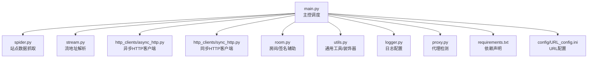
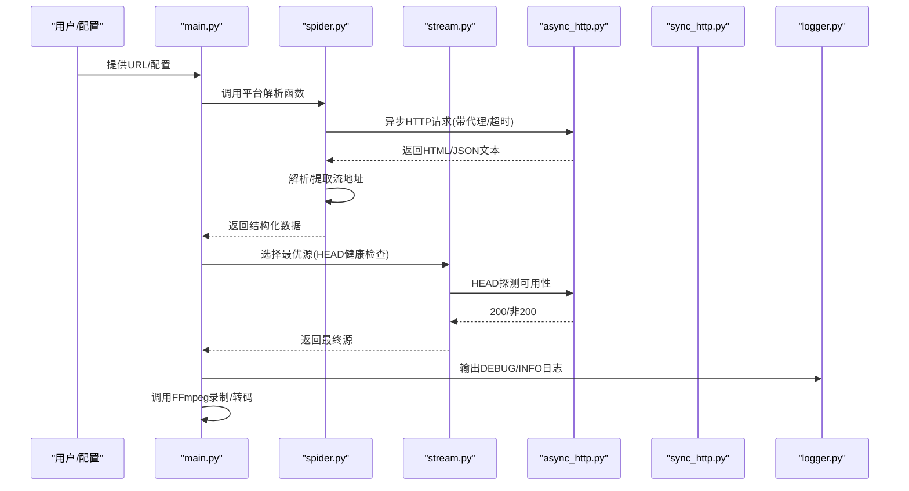

# 调试技巧

<cite>
**本文引用的文件**
- [README.md](file://README.md)
- [main.py](file://main.py)
- [src/logger.py](file://src/logger.py)
- [src/utils.py](file://src/utils.py)
- [src/http_clients/async_http.py](file://src/http_clients/async_http.py)
- [src/http_clients/sync_http.py](file://src/http_clients/sync_http.py)
- [src/spider.py](file://src/spider.py)
- [src/stream.py](file://src/stream.py)
- [src/room.py](file://src/room.py)
- [src/proxy.py](file://src/proxy.py)
- [requirements.txt](file://requirements.txt)
- [config/URL_config.ini](file://config/URL_config.ini)
</cite>

## 目录
1. [引言](#引言)
2. [项目结构](#项目结构)
3. [核心组件](#核心组件)
4. [架构总览](#架构总览)
5. [详细组件分析](#详细组件分析)
6. [依赖分析](#依赖分析)
7. [性能考量](#性能考量)
8. [故障排查指南](#故障排查指南)
9. [结论](#结论)
10. [附录](#附录)

## 引言
本指南围绕 DouyinLiveRecorder 的调试实践，系统讲解日志体系、网络请求调试、Python 开发调试工具与方法、以及面向生产环境的问题排查流程。读者无需深入代码即可掌握定位问题、分析异常、识别性能瓶颈与网络风险的方法。

## 项目结构
该项目采用模块化设计，按职责划分为日志、HTTP 客户端、爬虫抓取、流地址解析、代理检测、主控调度等模块；同时提供 FFmpeg 录制与消息推送能力。整体结构如下：

图表来源
- [main.py](file://main.py)
- [src/spider.py](file://src/spider.py)
- [src/stream.py](file://src/stream.py)
- [src/http_clients/async_http.py](file://src/http_clients/async_http.py)
- [src/http_clients/sync_http.py](file://src/http_clients/sync_http.py)
- [src/room.py](file://src/room.py)
- [src/utils.py](file://src/utils.py)
- [src/logger.py](file://src/logger.py)
- [src/proxy.py](file://src/proxy.py)
- [requirements.txt](file://requirements.txt)
- [config/URL_config.ini](file://config/URL_config.ini)

章节来源
- [README.md](file://README.md)
- [main.py](file://main.py)

## 核心组件
- 日志系统：统一输出到标准错误与文件，区分 DEBUG/INFO 级别，支持滚动与保留策略。
- HTTP 客户端：异步/同步两套实现，支持代理、重定向、超时、SSL 关闭等参数。
- 爬虫模块：针对多平台直播源的数据抓取与解析，包含错误装饰器与异常处理。
- 流地址解析：按平台与画质选择最优源，支持 HEAD 健康检查与备用策略。
- 代理检测：跨平台读取系统代理配置，辅助网络调试。
- 主控调度：并发控制、录制流程、消息推送、FFmpeg 调用与文件处理。

章节来源
- [src/logger.py](file://src/logger.py)
- [src/http_clients/async_http.py](file://src/http_clients/async_http.py)
- [src/http_clients/sync_http.py](file://src/http_clients/sync_http.py)
- [src/spider.py](file://src/spider.py)
- [src/stream.py](file://src/stream.py)
- [src/proxy.py](file://src/proxy.py)
- [main.py](file://main.py)

## 架构总览
下图展示从入口到录制的关键调用链路与调试关注点：

图表来源
- [main.py](file://main.py)
- [src/spider.py](file://src/spider.py)
- [src/stream.py](file://src/stream.py)
- [src/http_clients/async_http.py](file://src/http_clients/async_http.py)
- [src/http_clients/sync_http.py](file://src/http_clients/sync_http.py)
- [src/logger.py](file://src/logger.py)

## 详细组件分析

### 日志系统与调试要点
- 日志级别与输出
  - 控制台：彩色输出，时间、级别、消息。
  - 文件：stderr 与本地 logs 目录，分别写入 streamget.log 与 PlayURL.log。
- 日志格式与过滤
  - streamget.log：包含时间、级别、模块名:函数:行号，便于快速定位。
  - PlayURL.log：仅记录 INFO 级别，聚焦关键播放信息。
- 日志滚动与保留
  - 按大小滚动（约 300KB），保留最近 1 天，避免磁盘占用过大。
- 调试建议
  - 通过 DEBUG 级别观察请求参数、响应长度、异常堆栈行号。
  - 通过 INFO 级别核对最终播放 URL 与画质选择结果。
  - 结合文件滚动策略，定位“最近一次”问题发生的时间窗口。

章节来源
- [src/logger.py](file://src/logger.py)
- [src/utils.py](file://src/utils.py)

### 网络请求调试（HTTP/HTTPS/代理/SSL）
- 异步请求
  - 支持 GET/POST、headers、data/json、超时、跟随重定向、HTTP/2、SSL 校验开关。
  - HEAD 健康检查用于判断源可用性。
- 同步请求
  - 支持 urllib/requests 两种路径，适配 abroad 场景与 gzip 响应。
- 代理与 SSL
  - 代理地址标准化处理（自动补全 http:// 前缀）。
  - SSL 关闭（verify=False）用于规避证书问题，但仅限调试阶段使用。
- 调试建议
  - 使用 HEAD 检查替代 GET，减少流量与时间成本。
  - 在海外平台或受限区域启用代理，结合 abroad 标志位。
  - 临时关闭 SSL 校验验证证书链问题，上线前务必恢复校验。

章节来源
- [src/http_clients/async_http.py](file://src/http_clients/async_http.py)
- [src/http_clients/sync_http.py](file://src/http_clients/sync_http.py)
- [src/utils.py](file://src/utils.py)

### 爬虫与流地址解析调试
- 错误装饰器
  - 自动捕获异常并记录错误类型、消息与所在函数及行号，便于快速定位。
- 平台差异
  - 针对抖音/TikTok/快手/虎牙/斗鱼/B站/YY/小红书等平台分别实现解析逻辑。
  - 部分平台存在风控与反爬机制，需配合代理与 UA/Headers。
- 调试建议
  - 在装饰器捕获异常处设置断点，观察返回空列表的兜底行为。
  - 对解析失败的 URL，优先打印原始 HTML/JSON 文本片段，辅助定位字段变化。

章节来源
- [src/spider.py](file://src/spider.py)
- [src/stream.py](file://src/stream.py)
- [src/utils.py](file://src/utils.py)

### 代理检测与网络连通性
- 跨平台代理读取
  - Windows：注册表读取 ProxyEnable/ProxyServer。
  - Linux：读取 http_proxy/https_proxy/ftp_proxy 环境变量。
- 调试建议
  - 在请求前打印代理地址，确认是否生效。
  - 对特定平台启用独立代理（如海外站点），避免全局代理影响本地站点。

章节来源
- [src/proxy.py](file://src/proxy.py)
- [src/utils.py](file://src/utils.py)

### 主控调度与录制流程
- 并发与动态限速
  - 动态调整并发请求数，依据错误率窗口平滑升降，降低被封风险。
- 录制与转码
  - FFmpeg 直播流直录，支持分段、转码、生成时间文件等。
- 调试建议
  - 观察“瞬时错误数”与“并发线程数”的联动变化，评估网络压力。
  - 录制完成后检查输出文件完整性，必要时开启 TS 格式以提升鲁棒性。

章节来源
- [main.py](file://main.py)

## 依赖分析
- 第三方库
  - httpx：异步 HTTP 客户端，支持 HTTP/2。
  - requests：同步 HTTP 客户端，适配 urllib 与 gzip。
  - loguru：高性能日志库，支持多 sink、旋转、过滤。
  - PyExecJS：执行 JavaScript（用于签名/加密场景）。
  - pycryptodome、distro、tqdm 等辅助库。
- 调试建议
  - 通过 requirements.txt 核对版本，避免因库版本差异导致行为不一致。
  - 在容器或隔离环境中复现问题，确保依赖一致。

章节来源
- [requirements.txt](file://requirements.txt)

## 性能考量
- 请求并发与限速
  - 通过动态窗口计算错误率，自动增减并发，平衡吞吐与稳定性。
- HEAD 健康检查
  - 优先 HEAD 探测可用性，减少无效下载。
- IO 与磁盘
  - 日志滚动与保留策略降低 IO 压力；录制完成后及时清理临时文件。
- CPU/网络
  - 转码与分段录制会消耗 CPU，建议在资源充足的服务器上运行。

章节来源
- [main.py](file://main.py)
- [src/stream.py](file://src/stream.py)
- [src/logger.py](file://src/logger.py)

## 故障排查指南

### 一、日志定位法
- 步骤
  - 启用 DEBUG 级别，复现问题，观察 streamget.log 中的“模块名:函数:行号”。
  - 关注 INFO 级别 PlayURL.log，核对最终播放 URL 与画质。
  - 利用滚动与保留策略，对比“最近一次”与“上一次”的差异。
- 关键信息
  - 请求 URL、状态码、异常类型、堆栈行号、代理地址、SSL 校验开关。

章节来源
- [src/logger.py](file://src/logger.py)

### 二、网络请求追踪法
- 步骤
  - 使用异步/同步 HTTP 客户端分别尝试，确认是否为客户端差异导致。
  - 对受限区域启用代理，验证 abroad 标志位与代理地址格式。
  - 临时关闭 SSL 校验排查证书问题，上线前恢复校验。
- 关键信息
  - 代理地址、超时、重定向、HTTP/2、verify 标志。

章节来源
- [src/http_clients/async_http.py](file://src/http_clients/async_http.py)
- [src/http_clients/sync_http.py](file://src/http_clients/sync_http.py)
- [src/utils.py](file://src/utils.py)

### 三、爬虫解析与异常解读法
- 步骤
  - 在装饰器捕获异常处设置断点，观察错误类型与消息。
  - 打印原始 HTML/JSON 片段，比对字段是否变化。
  - 对风控/验证码场景，检查 UA/Headers/cookies 是否正确。
- 关键信息
  - trace_error_decorator 记录的函数名与行号，异常类型与消息。

章节来源
- [src/spider.py](file://src/spider.py)
- [src/utils.py](file://src/utils.py)

### 四、代理与系统环境法
- 步骤
  - 使用代理检测模块读取系统代理，确认是否启用与格式正确。
  - 对特定平台启用独立代理，避免全局代理影响。
- 关键信息
  - Windows 注册表项、Linux 环境变量、代理地址标准化。

章节来源
- [src/proxy.py](file://src/proxy.py)

### 五、录制与转码问题法
- 步骤
  - 检查 FFmpeg 返回码，关注分段与转码过程。
  - 使用 TS 格式提升鲁棒性，避免中途中断导致文件损坏。
- 关键信息
  - FFmpeg 命令、返回码、输出文件路径。

章节来源
- [main.py](file://main.py)

### 六、系统性问题排查流程
- 复现步骤
  - 准备最小化 URL 列表（config/URL_config.ini），逐个验证。
  - 关闭非必要功能（如消息推送、转码），排除干扰因素。
- 信息收集
  - 日志文件（streamget.log、PlayURL.log）、网络抓包（可选）、FFmpeg 输出。
- 根因分析
  - 从日志定位到具体函数与行号；结合网络请求参数与响应状态码；必要时回退到上一版本对比。
- 解决方案验证
  - 修复后在相同 URL 上重复验证，确认问题不再出现；回归自动化脚本。

章节来源
- [config/URL_config.ini](file://config/URL_config.ini)
- [main.py](file://main.py)

## 结论
通过统一的日志体系、完善的 HTTP 客户端、平台化的爬虫与流解析、代理检测与主控调度，本项目形成了可操作的调试闭环。遵循本文提供的方法，可高效定位问题、理解异常、识别性能瓶颈，并建立系统性的排查流程。

## 附录

### A. 日志级别与输出位置对照
- DEBUG/INFO 级别：stderr 控制台彩色输出
- 文件 sink：streamget.log（含模块名:函数:行号）
- 文件 sink：PlayURL.log（仅 INFO）

章节来源
- [src/logger.py](file://src/logger.py)

### B. 关键调试参数清单
- HTTP 客户端
  - 超时、代理、重定向、HTTP/2、verify
- 代理
  - 标准化地址、平台级代理启用
- SSL
  - 临时关闭校验用于调试
- 录制
  - FFmpeg 返回码、分段/转码参数

章节来源
- [src/http_clients/async_http.py](file://src/http_clients/async_http.py)
- [src/http_clients/sync_http.py](file://src/http_clients/sync_http.py)
- [src/utils.py](file://src/utils.py)
- [main.py](file://main.py)