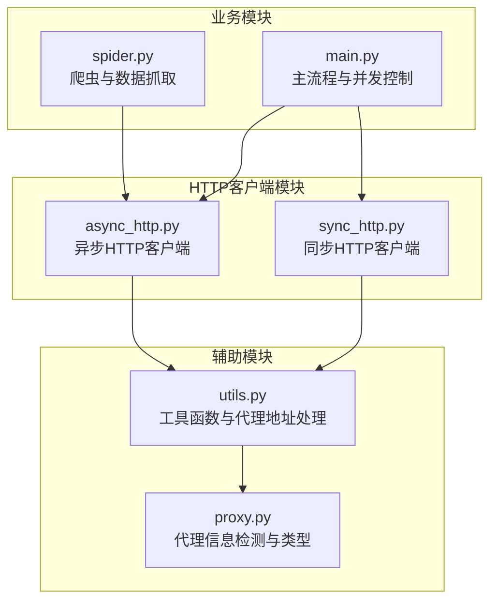
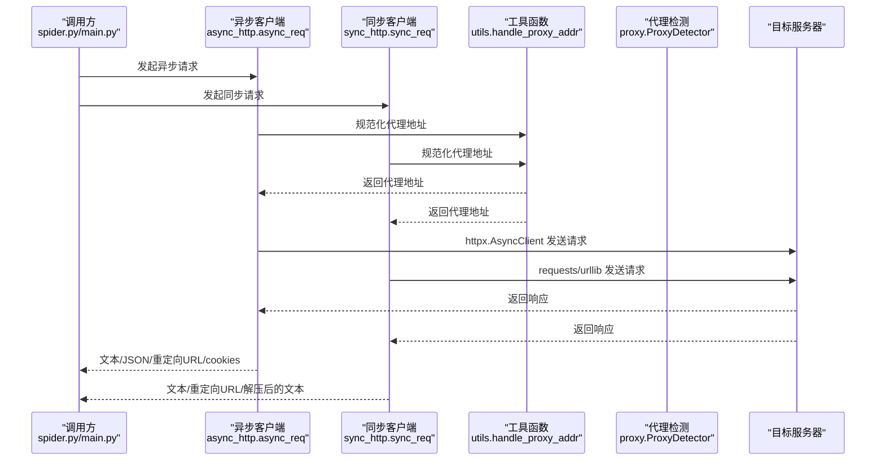
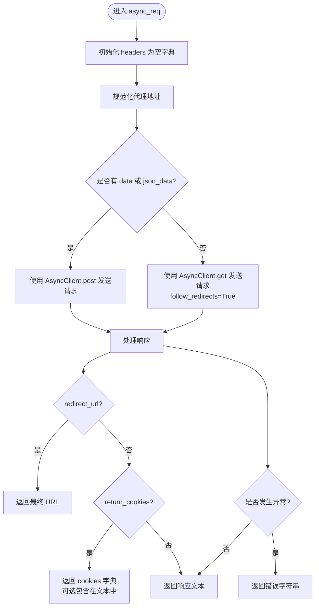
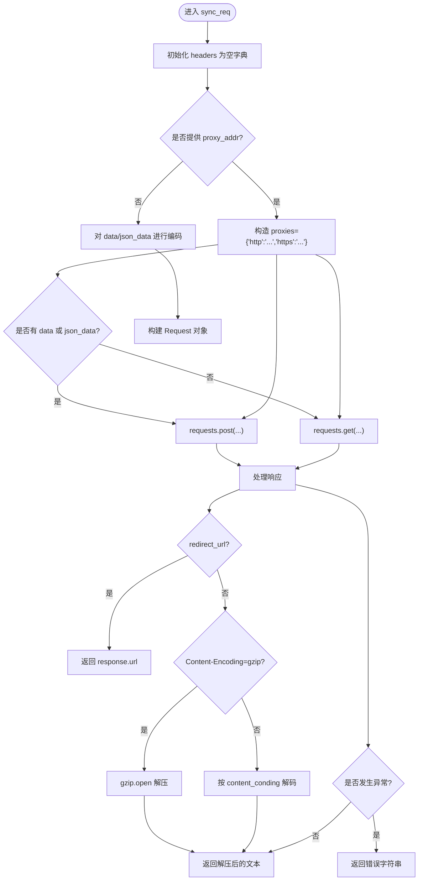
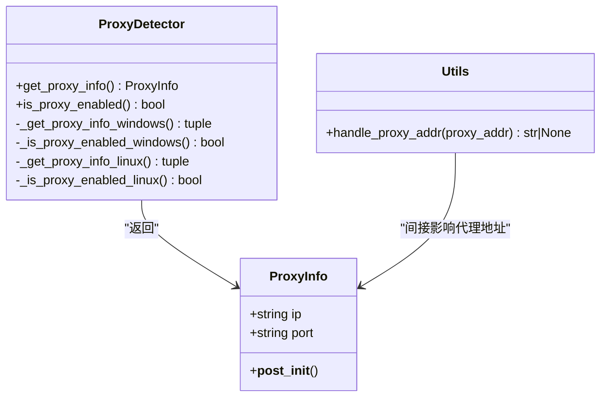
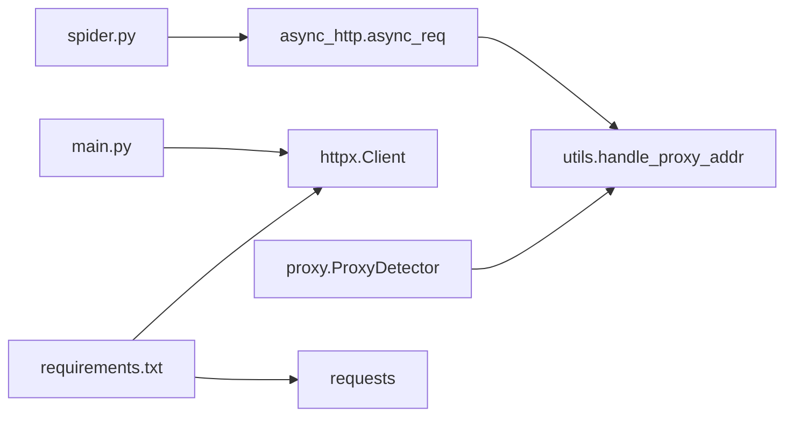

# HTTP客户端模块

<cite>
**本文档引用的文件**
- [async_http.py](file://src/http_clients/async_http.py)
- [sync_http.py](file://src/http_clients/sync_http.py)
- [utils.py](file://src/utils.py)
- [proxy.py](file://src/proxy.py)
- [spider.py](file://src/spider.py)
- [main.py](file://src/main.py)
- [requirements.txt](file://requirements.txt)
- [demo.py](file://demo.py)
</cite>

## 目录
1. [简介](#简介)
2. [项目结构](#项目结构)
3. [核心组件](#核心组件)
4. [架构总览](#架构总览)
5. [详细组件分析](#详细组件分析)
6. [依赖关系分析](#依赖关系分析)
7. [性能考量](#性能考量)
8. [故障排查指南](#故障排查指南)
9. [结论](#结论)
10. [附录](#附录)

## 简介
本文件为 DouyinLiveRecorder 的 HTTP 客户端模块提供系统化技术文档，重点覆盖：
- 异步 HTTP 请求实现（async_http.py）
- 同步 HTTP 请求处理（sync_http.py）
- HTTP 客户端配置项、请求头管理、代理支持与错误处理机制
- 并发控制、连接池管理、超时处理等关键技术
- 使用示例、性能优化建议与故障排查指南

HTTP 客户端模块位于 src/http_clients 目录，配合 utils、proxy、spider 等模块共同完成直播数据抓取与流媒体下载。

## 项目结构
HTTP 客户端模块位于 src/http_clients，主要包含两个文件：
- async_http.py：基于 httpx 的异步 HTTP 客户端封装
- sync_http.py：基于 requests/urllib 的同步 HTTP 客户端封装

图表来源
- [async_http.py:1-60](file://src/http_clients/async_http.py#L1-L60)
- [sync_http.py:1-89](file://src/http_clients/sync_http.py#L1-L89)
- [utils.py:162-168](file://src/utils.py#L162-L168)
- [proxy.py:1-93](file://src/proxy.py#L1-L93)
- [spider.py:31-32](file://src/spider.py#L31-L32)
- [main.py:388-418](file://src/main.py#L388-L418)

章节来源
- [async_http.py:1-60](file://src/http_clients/async_http.py#L1-L60)
- [sync_http.py:1-89](file://src/http_clients/sync_http.py#L1-L89)
- [utils.py:162-168](file://src/utils.py#L162-L168)
- [proxy.py:1-93](file://src/proxy.py#L1-L93)
- [spider.py:31-32](file://src/spider.py#L31-L32)
- [main.py:388-418](file://src/main.py#L388-L418)

## 核心组件
- 异步客户端 async_req：支持 GET/POST、重定向、Cookie 返回、SSL 验证开关、HTTP/2 开关、超时控制等
- 同步客户端 sync_req：支持 GET/POST、代理、gzip 解压、异常捕获与编码处理
- 工具函数 handle_proxy_addr：统一代理地址格式
- 代理检测 ProxyDetector：跨平台代理信息读取（Windows 注册表、Linux 环境变量）

章节来源
- [async_http.py:10-60](file://src/http_clients/async_http.py#L10-L60)
- [sync_http.py:20-89](file://src/http_clients/sync_http.py#L20-L89)
- [utils.py:162-168](file://src/utils.py#L162-L168)
- [proxy.py:27-93](file://src/proxy.py#L27-L93)

## 架构总览
HTTP 客户端模块在项目中的位置与调用关系如下：

图表来源
- [spider.py:50-65](file://src/spider.py#L50-L65)
- [async_http.py:25-46](file://src/http_clients/async_http.py#L25-L46)
- [sync_http.py:33-88](file://src/http_clients/sync_http.py#L33-L88)
- [utils.py:162-168](file://src/utils.py#L162-L168)

## 详细组件分析

### 异步 HTTP 客户端 async_http.async_req
- 功能特性
  - 支持 GET/POST 请求，自动根据是否存在请求体选择方法
  - 支持 follow_redirects、redirect_url 返回最终 URL
  - 支持 return_cookies 返回 Cookie 字典，可选择是否包含在响应文本中
  - 支持 timeout、verify、http2 等参数
  - 异常统一捕获并返回字符串形式的错误信息
- 关键参数
  - url：目标地址
  - proxy_addr：代理地址（自动补全 http:// 前缀）
  - headers：请求头字典
  - data/json_data：请求体（二选一或都不传）
  - timeout：超时秒数
  - redirect_url：是否返回最终 URL
  - return_cookies/include_cookies：是否返回 Cookie，以及是否包含在文本中
  - abroad：是否用于海外场景（在其他模块中使用）
  - content_conding：文本编码（主要用于同步客户端）
  - verify：SSL 证书验证开关
  - http2：启用 HTTP/2
- 错误处理
  - 捕获异常并返回错误字符串，便于上层统一处理
- 性能与并发
  - 使用 httpx.AsyncClient，适合高并发场景
  - follow_redirects 自动处理重定向，减少额外往返

图表来源
- [async_http.py:10-60](file://src/http_clients/async_http.py#L10-L60)

章节来源
- [async_http.py:10-60](file://src/http_clients/async_http.py#L10-L60)

### 同步 HTTP 客户端 sync_http.sync_req
- 功能特性
  - 支持 GET/POST，支持代理（requests 或 urllib）
  - 自动处理 gzip 响应解压
  - 支持 abroad 参数切换 urllib.open 或 opener.open
  - 统一异常处理与编码解码
- 关键参数
  - url、proxy_addr、headers、data、json_data、timeout
  - redirect_url：是否返回最终 URL
  - abroad：是否使用 urllib.urlopen
  - content_conding：文本编码
- 错误处理
  - 捕获 HTTPError/URLError/Exception，打印错误并返回错误字符串
- 编码与压缩
  - 自动识别 Content-Encoding=gzip 并解压
  - 支持对 data/json_data 进行编码

图表来源
- [sync_http.py:20-89](file://src/http_clients/sync_http.py#L20-L89)

章节来源
- [sync_http.py:20-89](file://src/http_clients/sync_http.py#L20-L89)

### 工具函数与代理支持
- utils.handle_proxy_addr
  - 若未提供代理地址，返回 None
  - 若代理地址不以 http/https 开头，自动补全为 http://
- proxy.ProxyDetector
  - Windows：从注册表读取 ProxyEnable/ProxyServer
  - Linux：从 http_proxy/https_proxy/ftp_proxy 环境变量提取 IP:PORT
  - 提供 is_proxy_enabled 判断代理是否启用

图表来源
- [proxy.py:27-93](file://src/proxy.py#L27-L93)
- [utils.py:162-168](file://src/utils.py#L162-L168)

章节来源
- [utils.py:162-168](file://src/utils.py#L162-L168)
- [proxy.py:27-93](file://src/proxy.py#L27-L93)

### 在项目中的使用示例
- 异步请求在爬虫模块中广泛使用，例如获取 m3u8 播放列表、抖音 Web/App 数据等
- 主流程中使用 httpx.Client 进行直播流直链下载，支持超时与 follow_redirects
- demo.py 展示了如何调用平台函数并传入 proxy_addr 与 cookies

章节来源
- [spider.py:50-65](file://src/spider.py#L50-L65)
- [main.py:388-418](file://src/main.py#L388-L418)
- [demo.py:213-228](file://demo.py#L213-L228)

## 依赖关系分析
- 第三方库依赖
  - httpx[http2]：异步 HTTP 客户端，支持 HTTP/2
  - requests：同步 HTTP 客户端
  - PyExecJS：JavaScript 执行（与 HTTP 客户端无直接耦合）
- 模块间依赖
  - spider.py 依赖 async_http.async_req
  - main.py 在直播流下载时直接使用 httpx.Client
  - utils 为 HTTP 客户端提供代理地址规范化
  - proxy 为系统代理检测提供支持

图表来源
- [spider.py:31-32](file://src/spider.py#L31-L32)
- [main.py:388-396](file://src/main.py#L388-L396)
- [utils.py:162-168](file://src/utils.py#L162-L168)
- [proxy.py:1-93](file://src/proxy.py#L1-L93)
- [requirements.txt:1-7](file://requirements.txt#L1-L7)

章节来源
- [requirements.txt:1-7](file://requirements.txt#L1-L7)
- [spider.py:31-32](file://src/spider.py#L31-L32)
- [main.py:388-396](file://src/main.py#L388-L396)
- [utils.py:162-168](file://src/utils.py#L162-L168)
- [proxy.py:1-93](file://src/proxy.py#L1-L93)

## 性能考量
- 异步并发控制
  - 项目通过信号量与动态调整 max_request 实现并发控制，避免过度请求导致风控或服务端压力过大
  - 参考：main.py 中的并发控制与错误率反馈机制
- 连接池与复用
  - 异步客户端使用 httpx.AsyncClient，内部具备连接池与复用能力
  - 直播流下载使用 httpx.Client 的 stream 接口，按块读取，降低内存占用
- 超时与重试策略
  - 异步/同步客户端均支持 timeout 参数；结合业务层重试策略可提升鲁棒性
- 代理与地域
  - 通过 utils.handle_proxy_addr 与 proxy.ProxyDetector 统一代理地址格式与检测，有助于规避地域限制

章节来源
- [main.py:298-325](file://src/main.py#L298-L325)
- [main.py:388-418](file://src/main.py#L388-L418)
- [async_http.py:25-34](file://src/http_clients/async_http.py#L25-L34)
- [sync_http.py:33-44](file://src/http_clients/sync_http.py#L33-L44)

## 故障排查指南
- 代理相关
  - 确认代理地址格式：若未以 http/https 开头，会被自动补全为 http://
  - Windows/Linux 下代理检测逻辑不同，优先检查系统代理设置
- SSL 证书
  - verify 参数可关闭证书校验，仅在测试或特殊网络环境下使用
- 编码与压缩
  - 同步客户端会自动识别 gzip 并解压；若非 gzip，按 content_conding 解码
- 异常处理
  - 异步客户端捕获异常并返回错误字符串；同步客户端打印错误并返回错误字符串
  - 若出现 400 错误，同步客户端会尝试读取响应体并按编码解码
- 超时与重定向
  - 异步客户端默认 follow_redirects=True；如需获取最终 URL，可设置 redirect_url=True
- 并发与风控
  - 若频繁请求触发风控，适当降低并发（max_request）或增加请求间隔

章节来源
- [utils.py:162-168](file://src/utils.py#L162-L168)
- [proxy.py:45-93](file://src/proxy.py#L45-L93)
- [async_http.py:25-46](file://src/http_clients/async_http.py#L25-L46)
- [sync_http.py:63-83](file://src/http_clients/sync_http.py#L63-L83)

## 结论
HTTP 客户端模块提供了简洁、稳健的异步与同步请求封装，配合代理与错误处理机制，满足多平台直播数据抓取与流媒体下载的需求。通过合理的并发控制与超时策略，可在保证稳定性的同时提升吞吐能力。建议在生产环境中：
- 明确代理与 SSL 配置
- 合理设置超时与重试
- 控制并发，避免触发风控
- 使用异步客户端处理高并发场景，同步客户端处理简单场景

## 附录
- 使用示例（路径）
  - 异步请求：[async_http.async_req:10-60](file://src/http_clients/async_http.py#L10-L60)
  - 同步请求：[sync_http.sync_req:20-89](file://src/http_clients/sync_http.py#L20-L89)
  - 爬虫调用异步客户端：[spider.get_play_url_list:50-65](file://src/spider.py#L50-L65)
  - 直播流下载：[main.direct_download_stream:385-418](file://src/main.py#L385-L418)
  - demo 示例：[demo.test_live_stream:213-228](file://demo.py#L213-L228)