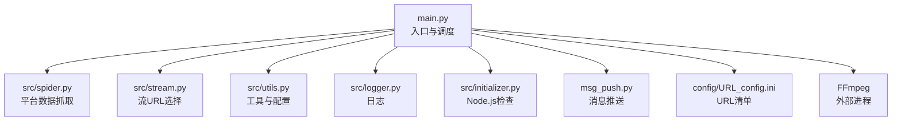
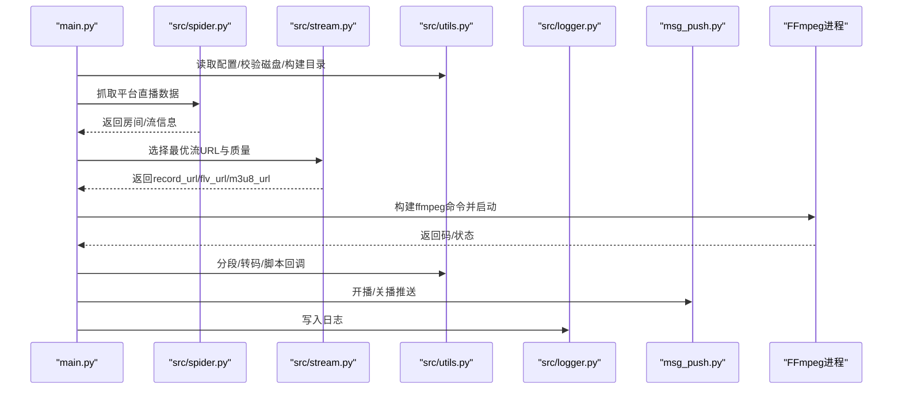
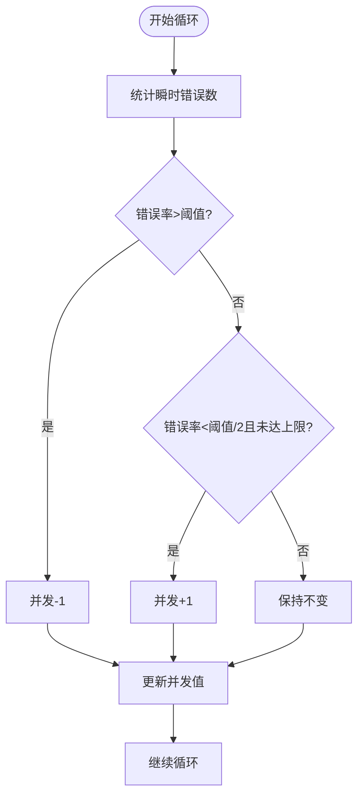
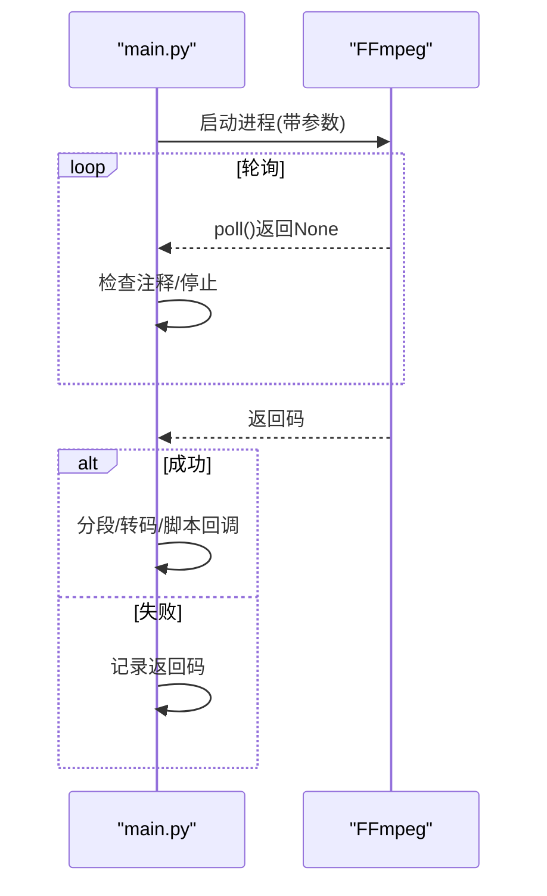
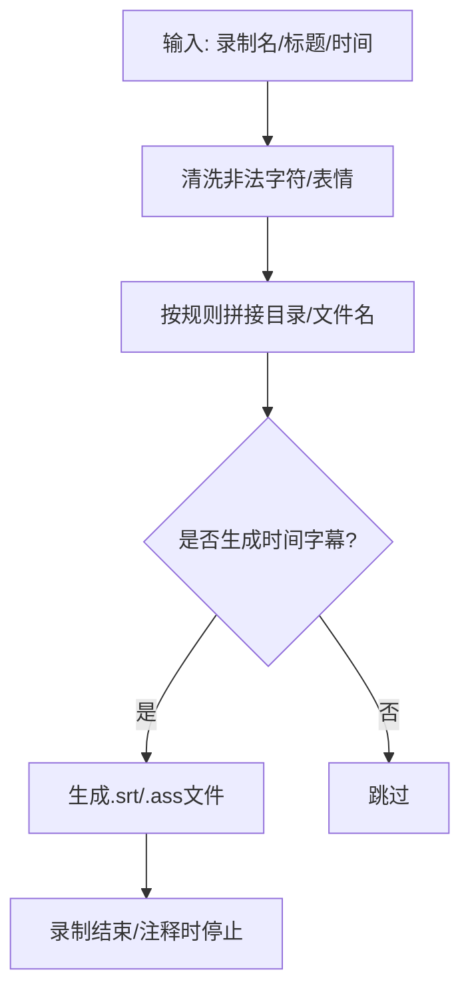
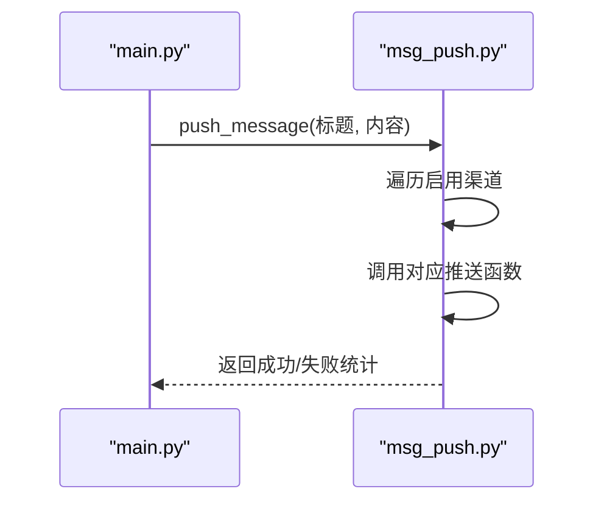
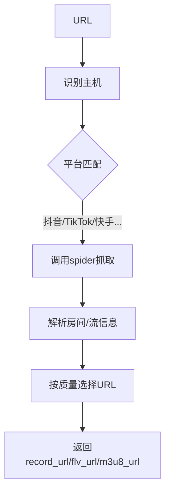
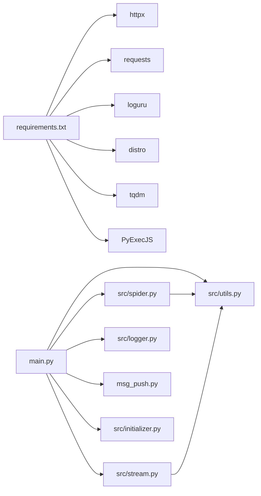

# 主程序架构

<cite>
**本文引用的文件**
- [main.py](file://main.py)
- [src/__init__.py](file://src/__init__.py)
- [src/initializer.py](file://src/initializer.py)
- [src/logger.py](file://src/logger.py)
- [src/utils.py](file://src/utils.py)
- [src/spider.py](file://src/spider.py)
- [src/stream.py](file://src/stream.py)
- [msg_push.py](file://msg_push.py)
- [config/URL_config.ini](file://config/URL_config.ini)
- [requirements.txt](file://requirements.txt)
</cite>

## 目录
1. [简介](#简介)
2. [项目结构](#项目结构)
3. [核心组件](#核心组件)
4. [架构总览](#架构总览)
5. [详细组件分析](#详细组件分析)
6. [依赖关系分析](#依赖关系分析)
7. [性能考量](#性能考量)
8. [故障排查指南](#故障排查指南)
9. [结论](#结论)
10. [附录](#附录)

## 简介
本文件面向DouyinLiveRecorder主程序的架构与实现，重点解析main.py中的调度机制、并发控制、任务管理、信号处理、显示信息、文件操作、视频转换、消息推送、录制控制流程、FFmpeg集成、分段录制与字幕生成等核心能力，并提供API接口说明、参数配置详解与使用示例、错误处理策略、性能优化建议与故障排查指南。文档力求对非专业读者也具备可读性。

## 项目结构
项目采用“入口脚本 + 模块化子系统”的组织方式：
- 入口脚本：main.py，负责配置加载、任务调度、并发控制、FFmpeg录制、消息推送、显示与日志等。
- 子模块：
  - src/spider.py：各平台爬虫与数据抓取。
  - src/stream.py：流URL选择与质量映射。
  - src/utils.py：通用工具、颜色输出、配置读写、磁盘容量检查等。
  - src/logger.py：统一日志输出与落盘。
  - src/initializer.py：Node.js环境检查与安装辅助。
  - msg_push.py：多渠道消息推送（钉钉、微信、TG、邮箱、Bark、Ntfy、PushPlus）。
  - config/URL_config.ini：待录制URL清单与注释。
  - requirements.txt：第三方依赖。

图表来源
- [main.py:1713-2155](file://main.py#L1713-L2155)
- [src/spider.py:1-200](file://src/spider.py#L1-L200)
- [src/stream.py:1-200](file://src/stream.py#L1-L200)
- [src/utils.py:1-206](file://src/utils.py#L1-L206)
- [src/logger.py:1-44](file://src/logger.py#L1-L44)
- [src/initializer.py:1-221](file://src/initializer.py#L1-L221)
- [msg_push.py:1-296](file://msg_push.py#L1-L296)
- [config/URL_config.ini:1-5](file://config/URL_config.ini#L1-L5)

章节来源
- [main.py:1713-2155](file://main.py#L1713-L2155)
- [config/URL_config.ini:1-5](file://config/URL_config.ini#L1-L5)

## 核心组件
- 调度与并发控制
  - 通过线程池与信号量控制并发，动态调整最大并发数以适配网络错误率。
  - 每个URL独立线程执行录制循环，避免阻塞。
- FFmpeg集成
  - 构造ffmpeg命令，支持HLS/FLV/MKV/TS/MP4/音频等格式；支持分段录制、代理、头部、超时参数等。
- 录制控制流程
  - 平台识别与数据抓取 → 流URL选择与质量映射 → 构建ffmpeg命令 → 启动录制 → 分段/转码/脚本回调 → 结束清理。
- 文件操作与字幕
  - 统一文件路径构建、重复行去重、备份配置、生成时间字幕文件。
- 消息推送
  - 支持多渠道推送，按配置开关与模板文本发送开播/关播通知。
- 显示与日志
  - 定时显示监控/录制状态、瞬时错误数、录制耗时等；日志分级落盘。

章节来源
- [main.py:298-325](file://main.py#L298-L325)
- [main.py:545-1646](file://main.py#L545-L1646)
- [main.py:1175-1195](file://main.py#L1175-L1195)
- [main.py:137-161](file://main.py#L137-L161)
- [main.py:273-296](file://main.py#L273-L296)
- [src/logger.py:1-44](file://src/logger.py#L1-L44)

## 架构总览
下图展示主程序与各子系统的交互关系与数据流。

图表来源
- [main.py:545-1646](file://main.py#L545-L1646)
- [src/spider.py:68-141](file://src/spider.py#L68-L141)
- [src/stream.py:40-78](file://src/stream.py#L40-L78)
- [src/utils.py:110-115](file://src/utils.py#L110-L115)
- [src/logger.py:1-44](file://src/logger.py#L1-L44)
- [msg_push.py:25-249](file://msg_push.py#L25-L249)

## 详细组件分析

### 调度与并发控制
- 动态并发调节
  - 周期性统计瞬时错误率，超过阈值降低并发，低于阈值提升并发，保证稳定性。
- 并发上限
  - 通过信号量限制同时访问网络的线程数，默认值来自配置。
- 线程模型
  - 每个URL一个守护线程，循环检测直播状态与录制。

图表来源
- [main.py:298-325](file://main.py#L298-L325)

章节来源
- [main.py:298-325](file://main.py#L298-L325)
- [main.py:1813-1814](file://main.py#L1813-L1814)

### FFmpeg集成与录制控制
- 命令构造
  - 设置用户代理、协议白名单、缓冲区、重连策略、时间戳修正等参数。
  - 根据平台与保存格式拼接不同参数（如分段、复制编码、重新编码、音频编码等）。
- 启动与监控
  - 以子进程启动ffmpeg，轮询进程状态；支持注释/停止信号优雅退出。
- 结束处理
  - 成功：触发转码/分段/脚本回调；失败：记录错误码。
- 分段录制
  - 通过segment模块按设定秒数切片，支持TS/FLV/MKV/MP4等格式。
- 转码与删除
  - 可选将TS/FLV转为MP4，或仅复制编码；可选删除原始文件。

图表来源
- [main.py:420-491](file://main.py#L420-L491)
- [main.py:1175-1195](file://main.py#L1175-L1195)
- [main.py:1820-1828](file://main.py#L1820-L1828)

章节来源
- [main.py:420-491](file://main.py#L420-L491)
- [main.py:1175-1599](file://main.py#L1175-L1599)

### 文件操作与字幕生成
- 文件路径与命名
  - 支持按作者、时间、标题、标题前缀等规则构建目录与文件名；支持清理表情符号。
- 字符串清洗
  - 清理非法字符、替换全角括号、可选移除表情。
- 时间字幕
  - 生成.srt/.ass时间轴文件，每秒一条，随录制结束自动停止。
- 配置备份
  - 定时检查MD5，变更时备份到backup_config目录，保留最近若干份。

图表来源
- [main.py:494-500](file://main.py#L494-L500)
- [main.py:273-296](file://main.py#L273-L296)
- [main.py:1648-1691](file://main.py#L1648-L1691)

章节来源
- [main.py:137-161](file://main.py#L137-L161)
- [main.py:273-296](file://main.py#L273-L296)
- [main.py:1648-1691](file://main.py#L1648-L1691)

### 消息推送系统
- 支持平台
  - 钉钉、微信、Telegram、邮箱、Bark、Ntfy、PushPlus。
- 触发时机
  - 开播/关播推送，可配置推送模板文本与开关。
- 执行方式
  - 多线程异步调用，聚合成功/失败统计。

图表来源
- [main.py:327-354](file://main.py#L327-L354)
- [msg_push.py:25-249](file://msg_push.py#L25-L249)

章节来源
- [main.py:327-354](file://main.py#L327-L354)
- [msg_push.py:25-249](file://msg_push.py#L25-L249)

### 平台识别与数据抓取
- 平台识别
  - 依据URL主机匹配平台，覆盖抖音、快手、虎牙、斗鱼、B站、小红书、Bigo、网易CC、千度热播、猫耳FM、Look、TwitCasting、百度、微博、酷狗、花椒、流星、Acfun、畅聊、映客、音播、知乎、嗨秀、VV星球、17Live、浪Live、漂漂、六间房、乐嗨、花猫、淘宝、京东、咪咕、连接、来秀、TikTok、SOOP、PandaTV、WinkTV、FlexTV、PopkonTV、TwitchTV、LiveMe、ShowRoom、CHZZK、Shopee、Youtube、Faceit、Picarto等。
- 数据抓取
  - 对应平台调用spider模块的异步抓取函数，返回房间/流信息。
- 流URL选择
  - 根据质量映射与可用性选择m3u8/flv/record_url，必要时回退。

图表来源
- [main.py:580-801](file://main.py#L580-L801)
- [src/spider.py:68-141](file://src/spider.py#L68-L141)
- [src/stream.py:40-78](file://src/stream.py#L40-L78)

章节来源
- [main.py:580-801](file://main.py#L580-L801)
- [src/spider.py:68-141](file://src/spider.py#L68-L141)
- [src/stream.py:40-78](file://src/stream.py#L40-L78)

### 显示信息与日志
- 显示信息
  - 定时打印监控数量、并发、代理、分段、时间文件、质量、格式、瞬时错误、当前时间、正在录制列表等。
- 日志
  - 控制台彩色输出与文件落盘，分别记录调试与播放URL信息。

章节来源
- [main.py:90-135](file://main.py#L90-L135)
- [src/logger.py:1-44](file://src/logger.py#L1-L44)

## 依赖关系分析
- 外部依赖
  - httpx、requests、loguru、distro、tqdm、PyExecJS等。
- 内部依赖
  - main.py依赖spider/stream/utils/logger/msg_push；spider/stream依赖utils；initializer负责Node.js环境准备。

图表来源
- [requirements.txt:1-7](file://requirements.txt#L1-L7)
- [main.py:30-39](file://main.py#L30-L39)
- [src/spider.py:27-32](file://src/spider.py#L27-L32)
- [src/stream.py:20-24](file://src/stream.py#L20-L24)

章节来源
- [requirements.txt:1-7](file://requirements.txt#L1-L7)
- [main.py:30-39](file://main.py#L30-L39)

## 性能考量
- 并发与错误率自适应
  - 通过滑动窗口计算错误率，动态增减并发，避免网络抖动导致的资源浪费或失败率上升。
- FFmpeg参数优化
  - 设置合理的缓冲区、重连策略、时间戳修正、队列大小，减少断流与卡顿。
- 分段录制
  - 按固定秒数切片，便于后续转码与存储管理，降低单文件过大风险。
- 磁盘空间检查
  - 启动时检查剩余空间，低于阈值时提前终止，避免磁盘满导致异常。
- 线程与锁
  - 使用信号量与锁保护共享状态，避免竞态；显示线程与调整线程分离，降低阻塞。

章节来源
- [main.py:298-325](file://main.py#L298-L325)
- [main.py:1175-1195](file://main.py#L1175-L1195)
- [main.py:1934-1939](file://main.py#L1934-L1939)

## 故障排查指南
- FFmpeg缺失
  - 启动时检查ffmpeg是否存在，不存在则退出。
- 网络异常/风控
  - 平台数据抓取可能触发风控或网络不可达，需检查代理与Cookie配置。
- 磁盘空间不足
  - 剩余空间低于阈值时会提前退出，需清理空间或调整阈值。
- 录制失败
  - 查看返回码与日志；检查URL格式、平台支持情况、代理与Headers。
- 推送失败
  - 检查对应渠道的API/Token/账号配置；查看返回的错误信息。
- 字幕/分段/转码问题
  - 确认分段与转码开关；检查FFmpeg参数与格式兼容性。

章节来源
- [main.py:1722-1724](file://main.py#L1722-L1724)
- [main.py:1606-1610](file://main.py#L1606-L1610)
- [main.py:1934-1939](file://main.py#L1934-L1939)
- [msg_push.py:25-249](file://msg_push.py#L25-L249)

## 结论
main.py通过清晰的模块划分与稳健的并发控制，实现了对多平台直播的稳定录制。其FFmpeg集成、分段录制、字幕生成、消息推送与日志体系共同构成了完整的录制闭环。建议在生产环境中结合实际网络状况动态调整并发与分段参数，并完善代理与Cookie配置以提升成功率。

## 附录

### API接口说明（main.py）
- start_record(url_data, count_variable=-1)
  - 功能：根据URL元组启动录制循环，内部完成平台识别、数据抓取、流选择、FFmpeg启动、分段/转码/脚本回调与推送。
  - 参数：
    - url_data：(quality_zh, url, anchor_name)
    - count_variable：计数变量
  - 返回：无（线程内循环）
- check_subprocess(record_name, record_url, ffmpeg_command, save_type, script_command=None)
  - 功能：启动FFmpeg子进程并监控，处理注释/停止、转码/分段、脚本回调与返回码处理。
  - 返回：布尔值（是否因注释而提前结束）
- segment_video/converts_mp4/converts_m4a/generate_subtitles/run_script/push_message/clear_record_info/direct_download_stream
  - 功能：分段录制、MP4转码、M4A提取、时间字幕生成、脚本执行、消息推送、清理录制信息、直链下载FLV等。
  - 返回：无或结果字典/布尔值

章节来源
- [main.py:545-1646](file://main.py#L545-L1646)
- [main.py:420-491](file://main.py#L420-L491)
- [main.py:189-271](file://main.py#L189-L271)
- [main.py:327-354](file://main.py#L327-L354)
- [main.py:376-383](file://main.py#L376-L383)
- [main.py:385-418](file://main.py#L385-L418)

### 参数配置详解（config.ini）
以下为常用配置项（键名与含义），具体值通过读取函数从配置文件中获取并设置默认值：
- 录制设置
  - language(zh_cn/en)：语言
  - 是否跳过代理检测(是/否)：跳过系统代理检测
  - 直播保存路径(不填则默认)：保存根目录
  - 保存文件夹是否以作者区分(是/否)：按主播名分目录
  - 保存文件夹是否以时间区分(是/否)：按日期分目录
  - 保存文件夹是否以标题区分(是/否)：按直播标题分目录
  - 保存文件名是否包含标题(是/否)：文件名包含标题
  - 是否去除名称中的表情符号(是/否)：清洗表情
  - 视频保存格式ts|mkv|flv|mp4|mp3音频|m4a音频：录制格式
  - 原画|超清|高清|标清|流畅：录制质量
  - 是否使用代理ip(是/否)：是否使用代理
  - 代理地址：代理地址
  - 同一时间访问网络的线程数：并发上限
  - 循环时间(秒)：检测间隔
  - 排队读取网址时间(秒)：URL队列间隔
  - 是否显示循环秒数(是/否)：显示倒计时
  - 是否显示直播源地址(是/否)：显示真实源地址
  - 分段录制是否开启(是/否)：开启分段
  - 是否强制启用https录制(是/否)：强制HTTPS
  - 录制空间剩余阈值(gb)：磁盘阈值
  - 视频分段时间(秒)：分段时长
  - 录制完成后自动转为mp4格式(是/否)：转码MP4
  - mp4格式重新编码为h264(是/否)：h264重编码
  - 追加格式后删除原文件(是/否)：删除原始文件
  - 生成时间字幕文件(是/否)：生成.srt/.ass
  - 是否录制完成后执行自定义脚本(是/否)：执行脚本
  - 自定义脚本执行命令：脚本命令
  - 使用代理录制的平台(逗号分隔)：指定平台走代理
  - 额外使用代理录制的平台(逗号分隔)：备用代理平台
- 推送配置
  - 直播状态推送渠道：推送渠道集合
  - 钉钉推送接口链接：Webhook
  - 微信推送接口链接：单点推送地址
  - bark推送接口链接：Bark地址
  - bark推送中断级别：Bark级别
  - bark推送铃声：Bark铃声
  - 钉钉通知@对象(填手机号)：@手机号
  - 钉钉通知@全体(是/否)：@全体
  - tgapi令牌：Bot Token
  - tg聊天id(个人或者群组id)：Chat ID
  - SMTP邮件服务器：SMTP地址
  - 是否使用SMTP服务SSL加密(是/否)：SSL开关
  - SMTP邮件服务器端口：SMTP端口
  - 邮箱登录账号：登录账号
  - 发件人密码(授权码)：授权码
  - 发件人邮箱：发件邮箱
  - 发件人显示昵称：发件人昵称
  - 收件人邮箱：收件邮箱
  - ntfy推送地址：Ntfy地址
  - ntfy推送标签：Ntfy标签
  - ntfy推送邮箱：Ntfy邮箱
  - pushplus推送token：PushPlus Token
  - 自定义推送标题：推送标题模板
  - 自定义开播推送内容：开播模板
  - 自定义关播推送内容：关播模板
  - 只推送通知不录制(是/否)：仅推送
  - 直播推送检测频率(秒)：推送检测周期
  - 开播推送开启(是/否)：开播推送
  - 关播推送开启(是/否)：关播推送
- Cookie与账号密码
  - 各平台Cookie与账号密码键名详见主程序读取段落。

章节来源
- [main.py:1731-1926](file://main.py#L1731-L1926)

### 使用示例
- 添加待录制URL
  - 在URL配置文件中添加一行，格式为“直播URL[,主播名]”，支持中文逗号。
  - 示例：参见URL配置文件示例。
- 启动录制
  - 运行入口脚本，程序自动读取配置与URL，按平台识别与并发策略启动录制线程。
- 查看状态
  - 启动后显示监控/录制状态、并发、代理、分段、质量、格式、瞬时错误、当前时间等。
- 配置推送
  - 在推送配置中填写相应渠道的API/Token/账号，设置推送模板与开关。

章节来源
- [config/URL_config.ini:1-5](file://config/URL_config.ini#L1-L5)
- [main.py:1713-1727](file://main.py#L1713-L1727)
- [main.py:1731-1926](file://main.py#L1731-L1926)