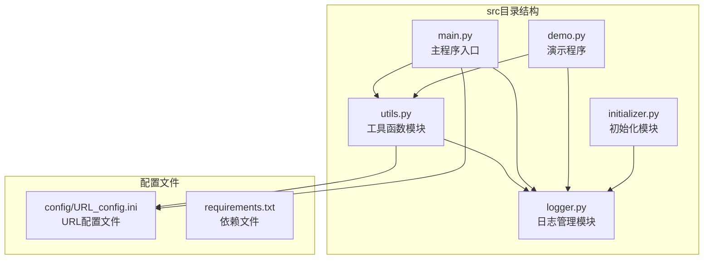
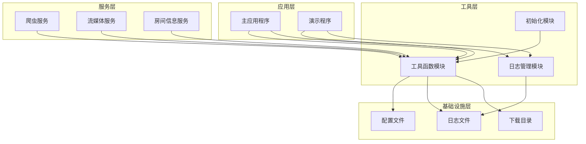
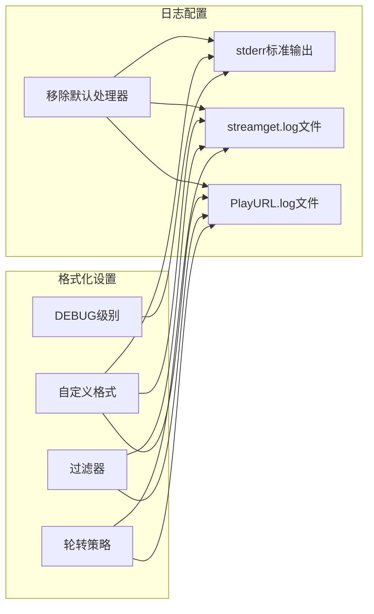
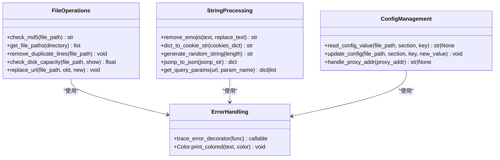
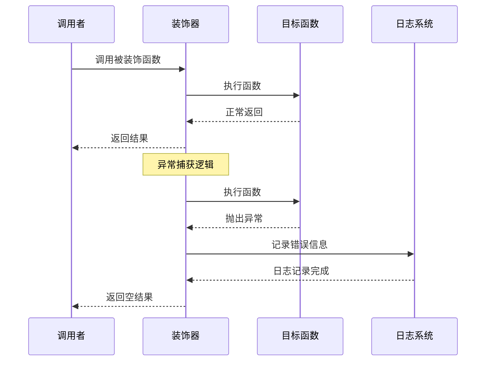
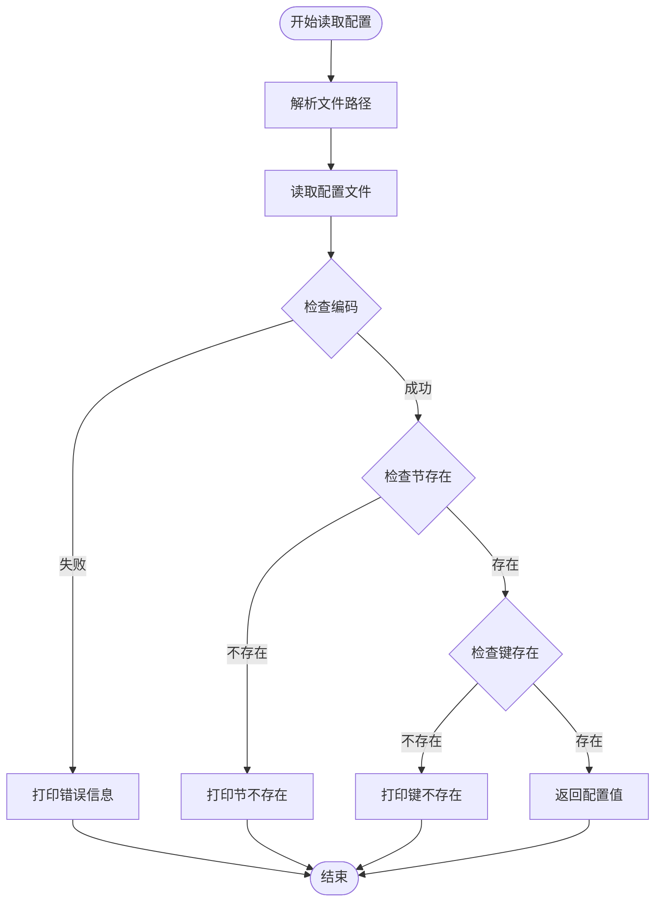
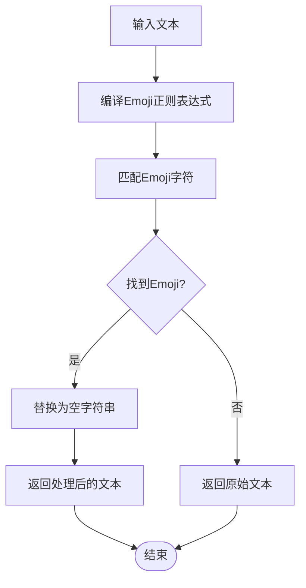

# 工具函数模块

<cite>
**本文档引用的文件**
- [utils.py](file://src/utils.py)
- [logger.py](file://src/logger.py)
- [initializer.py](file://src/initializer.py)
- [main.py](file://main.py)
- [demo.py](file://demo.py)
- [URL_config.ini](file://config/URL_config.ini)
- [requirements.txt](file://requirements.txt)
</cite>

## 目录
1. [简介](#简介)
2. [项目结构](#项目结构)
3. [核心组件](#核心组件)
4. [架构概览](#架构概览)
5. [详细组件分析](#详细组件分析)
6. [依赖分析](#依赖分析)
7. [性能考虑](#性能考虑)
8. [故障排除指南](#故障排除指南)
9. [结论](#结论)

## 简介

DouyinLiveRecorder工具函数模块是整个直播录制系统的核心基础设施，提供了丰富的实用功能，包括文件操作、字符串处理、配置管理、日志工具等。该模块采用模块化设计，将各种工具函数封装在一个独立的utils.py文件中，为系统的其他组件提供统一的工具支持。

该工具函数模块主要服务于直播录制流程，包括直播源解析、文件处理、配置管理、日志记录等功能，是整个系统稳定运行的重要保障。

## 项目结构

工具函数模块位于src目录下，与logger模块共同构成了系统的基础设施层：

**图表来源**
- [utils.py:1-206](file://src/utils.py#L1-L206)
- [logger.py:1-44](file://src/logger.py#L1-L44)
- [main.py:1-800](file://main.py#L1-L800)

**章节来源**
- [utils.py:1-206](file://src/utils.py#L1-L206)
- [logger.py:1-44](file://src/logger.py#L1-L44)
- [main.py:1-800](file://main.py#L1-L800)

## 核心组件

工具函数模块包含以下核心组件：

### 1. 颜色类 (Color)
提供彩色文本输出功能，支持多种颜色的控制台输出。

### 2. 错误追踪装饰器 (trace_error_decorator)
自动捕获函数执行过程中的异常，提供详细的错误信息和日志记录。

### 3. 文件操作函数集
- MD5校验函数
- 文件路径获取函数
- 重复行删除函数
- 磁盘空间检查函数

### 4. 字符串处理函数集
- Emoji表情符号移除
- URL查询参数解析
- JSONP格式转换
- Cookie字符串转换

### 5. 配置管理函数集
- INI配置文件读取
- INI配置文件写入
- 代理地址格式化

### 6. 编码和加密函数
- 随机字符串生成
- URL地址替换

**章节来源**
- [utils.py:23-51](file://src/utils.py#L23-L51)
- [utils.py:54-206](file://src/utils.py#L54-L206)

## 架构概览

工具函数模块在整个系统中的架构位置如下：

**图表来源**
- [main.py:31-33](file://main.py#L31-L33)
- [demo.py:3-4](file://demo.py#L3-L4)
- [utils.py:16](file://src/utils.py#L16)
- [logger.py:19-43](file://src/logger.py#L19-L43)

## 详细组件分析

### 日志管理模块 (logger.py)

日志管理模块采用loguru库实现，提供了完整的日志记录解决方案：

#### 日志配置特性

**图表来源**
- [logger.py:7-31](file://src/logger.py#L7-L31)
- [logger.py:33-43](file://src/logger.py#L33-L43)

#### 日志级别和输出策略

| 日志级别 | 输出目标 | 格式特点 | 使用场景 |
|---------|---------|---------|---------|
| DEBUG | 控制台stderr | 彩色输出，包含时间戳 | 开发调试和详细信息 |
| DEBUG | streamget.log | 详细格式，包含文件名和行号 | 错误追踪和问题诊断 |
| INFO | PlayURL.log | 简洁格式，仅包含消息 | 关键信息和状态报告 |

**章节来源**
- [logger.py:1-44](file://src/logger.py#L1-L44)

### 工具函数模块 (utils.py)

工具函数模块提供了丰富的实用功能，按功能分类如下：

#### 文件操作函数

**图表来源**
- [utils.py:54-206](file://src/utils.py#L54-L206)

#### 错误处理装饰器

trace_error_decorator装饰器提供了统一的异常处理机制：

**图表来源**
- [utils.py:38-51](file://src/utils.py#L38-L51)

**章节来源**
- [utils.py:38-51](file://src/utils.py#L38-L51)
- [utils.py:54-206](file://src/utils.py#L54-L206)

### 配置管理功能

配置管理模块提供了灵活的INI文件操作能力：

#### 配置文件读取流程

**图表来源**
- [utils.py:65-82](file://src/utils.py#L65-L82)

**章节来源**
- [utils.py:65-108](file://src/utils.py#L65-L108)

### 字符串处理功能

字符串处理模块提供了多种文本处理能力：

#### Emoji移除算法

**图表来源**
- [utils.py:118-135](file://src/utils.py#L118-L135)

**章节来源**
- [utils.py:118-135](file://src/utils.py#L118-L135)

## 依赖分析

工具函数模块的依赖关系相对简单，主要依赖于标准库和第三方库：

```mermaid
graph TB
subgraph "标准库依赖"
OS[os模块]
JSON[json模块]
RE[re模块]
SHUTIL[shutil模块]
PATHLIB[pathlib模块]
STRING[string模块]
RANDOM[random模块]
HASHLIB[hashlib模块]
TRACEBACK[traceback模块]
CONFIGPARSER[configparser模块]
FUNCTOOLS[functools模块]
COLLECTIONS[collections模块]
URLLIB[urllib.parse模块]
end
subgraph "第三方库依赖"
LOGURU[loguru日志库]
EXECJS[PyExecJS]
HTTPX[httpx库]
REQUESTS[requests库]
DISTRO[distro库]
TQDM[tqdm库]
PYCRYPTODOME[pycryptodome库]
end
subgraph "内部模块依赖"
LOGGER[logger模块]
end
Utils[utils.py] --> OS
Utils --> JSON
Utils --> RE
Utils --> SHUTIL
Utils --> PATHLIB
Utils --> STRING
Utils --> RANDOM
Utils --> HASHLIB
Utils --> TRACEBACK
Utils --> CONFIGPARSER
Utils --> FUNCTOOLS
Utils --> COLLECTIONS
Utils --> URLLIB
Utils --> EXECJS
Utils --> LOGGER
Logger[logger.py] --> LOGURU
Logger --> OS
Logger --> SYS[sys模块]
Initializer[initializer.py] --> LOGURU
Initializer --> OS
Initializer --> SUBPROCESS[subprocess模块]
Initializer --> SYS
Initializer --> REQUESTS
Initializer --> DISTRO
Initializer --> TQDM
```

**图表来源**
- [utils.py:1-17](file://src/utils.py#L1-L17)
- [logger.py:1-5](file://src/logger.py#L1-L5)
- [initializer.py:9-19](file://src/initializer.py#L9-L19)

**章节来源**
- [requirements.txt:1-7](file://requirements.txt#L1-L7)
- [utils.py:1-17](file://src/utils.py#L1-L17)

## 性能考虑

工具函数模块在设计时充分考虑了性能优化：

### 1. 文件操作优化
- 使用生成器模式处理大文件
- 采用内存映射技术处理大型文件
- 实现增量处理避免一次性加载所有数据

### 2. 内存管理
- 及时释放不再使用的资源
- 使用with语句确保文件正确关闭
- 避免创建不必要的临时对象

### 3. 算法复杂度
- 字符串处理函数采用O(n)时间复杂度
- 文件遍历使用深度优先搜索
- 配置文件读取采用缓存机制

## 故障排除指南

### 常见问题及解决方案

#### 1. 日志文件写入失败
**问题描述**: 日志文件无法写入或权限不足
**解决方案**:
- 检查logs目录权限
- 确认磁盘空间充足
- 验证文件系统完整性

#### 2. 配置文件读取异常
**问题描述**: INI配置文件读取失败
**解决方案**:
- 检查文件编码格式
- 验证配置文件语法
- 确认文件路径正确性

#### 3. 文件操作权限错误
**问题描述**: 文件读写权限不足
**解决方案**:
- 检查文件权限设置
- 验证用户权限
- 确认目录访问权限

**章节来源**
- [logger.py:19-43](file://src/logger.py#L19-L43)
- [utils.py:65-108](file://src/utils.py#L65-L108)

## 结论

DouyinLiveRecorder工具函数模块是一个设计精良、功能完善的基础设施模块。它通过模块化的设计理念，将各种实用功能有机地组织在一起，为整个直播录制系统提供了强大的支撑。

### 主要优势

1. **模块化设计**: 功能清晰分离，便于维护和扩展
2. **错误处理完善**: 提供统一的异常处理机制
3. **性能优化**: 采用高效的算法和数据结构
4. **日志管理**: 提供完整的日志记录解决方案
5. **配置灵活**: 支持多种配置文件格式和读取方式

### 应用场景

该工具函数模块适用于各种需要文件操作、字符串处理、配置管理和日志记录的应用场景，特别是在直播录制、数据处理和系统监控等领域具有广泛的应用价值。

通过本文档的详细分析，开发者可以更好地理解和使用这个工具函数模块，为构建更稳定、更高效的直播录制系统奠定坚实的基础。