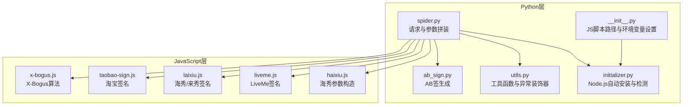
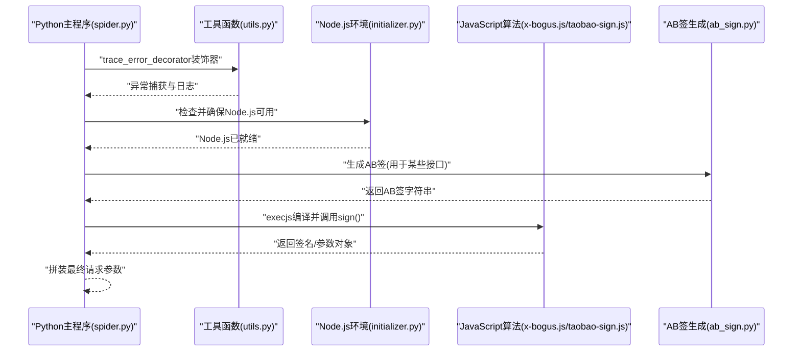
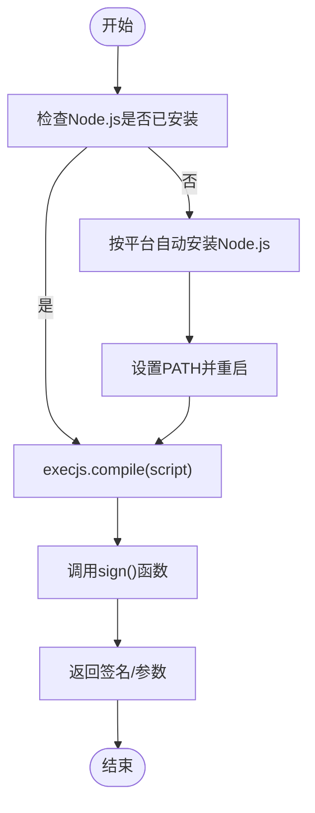
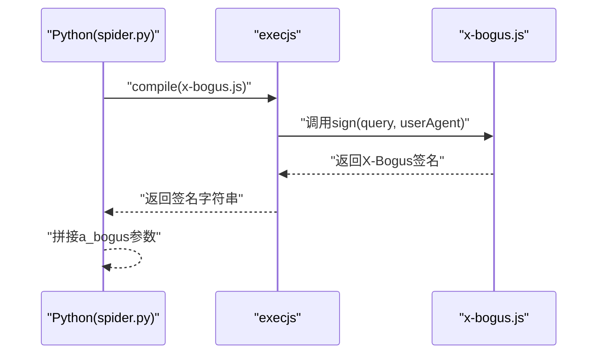
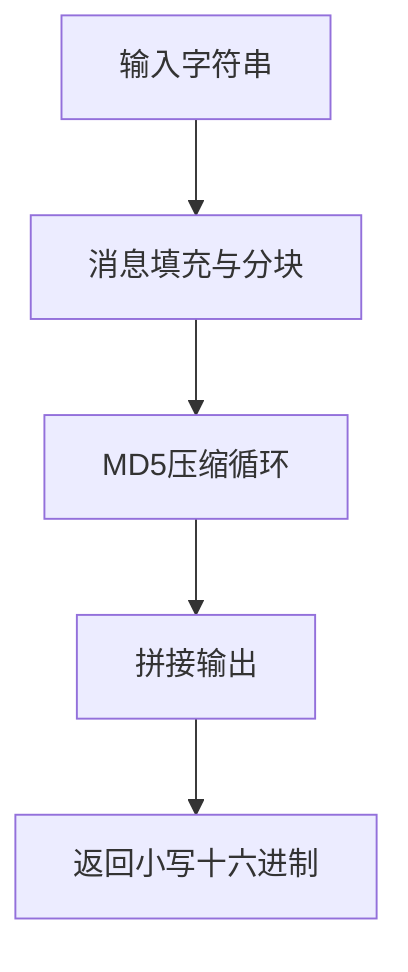
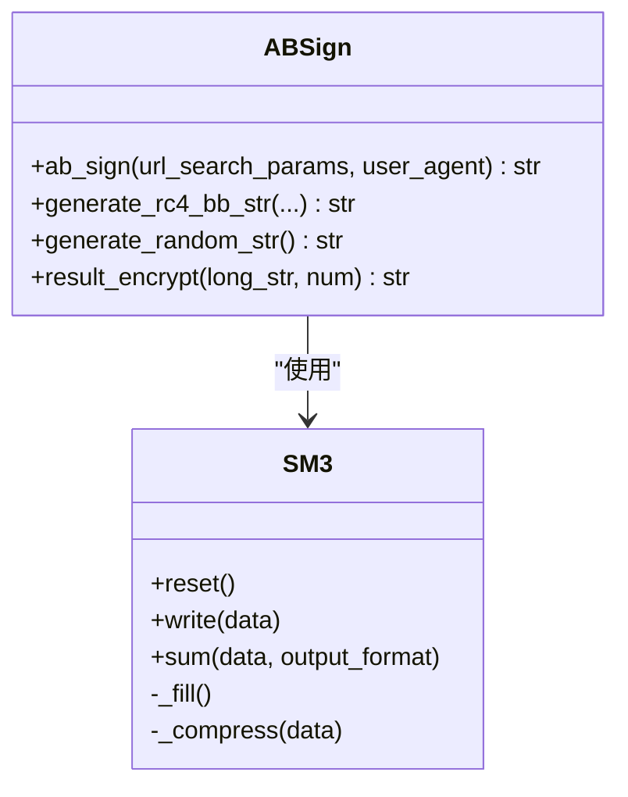
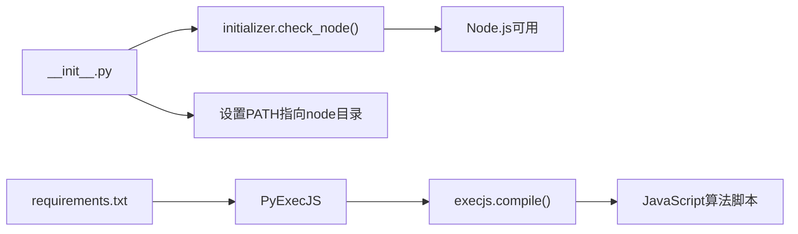

# 加密算法执行

<cite>
**本文档引用的文件**
- [x-bogus.js](file://src/javascript/x-bogus.js)
- [taobao-sign.js](file://src/javascript/taobao-sign.js)
- [ab_sign.py](file://src/ab_sign.py)
- [spider.py](file://src/spider.py)
- [utils.py](file://src/utils.py)
- [initializer.py](file://src/initializer.py)
- [__init__.py](file://src/__init__.py)
- [requirements.txt](file://requirements.txt)
- [laixiu.js](file://src/javascript/laixiu.js)
- [liveme.js](file://src/javascript/liveme.js)
- [haixiu.js](file://src/javascript/haixiu.js)
</cite>

## 目录
1. [简介](#简介)
2. [项目结构](#项目结构)
3. [核心组件](#核心组件)
4. [架构总览](#架构总览)
5. [详细组件分析](#详细组件分析)
6. [依赖分析](#依赖分析)
7. [性能考虑](#性能考虑)
8. [故障排查指南](#故障排查指南)
9. [结论](#结论)
10. [附录](#附录)

## 简介
本文件面向DouyinLiveRecorder项目中的加密算法执行模块，系统性梳理并解释以下内容：
- JavaScript加密算法在Python环境中的执行机制（PyExecJS）
- WASM模块支持现状与替代方案
- 关键算法（X-Bogus、淘宝签名、AB签）的实现原理与调用方式
- JavaScript环境配置、算法调试方法与性能优化策略
- 新加密算法的集成指南与兼容性处理方案

## 项目结构
项目采用“Python主逻辑 + JavaScript算法脚本”的混合架构。核心目录与职责如下：
- src/javascript：存放各类JavaScript加密算法脚本（如X-Bogus、淘宝签名、LiveMe、海秀等）
- src：Python主程序，负责HTTP请求、参数拼装、调用JS算法、日志与错误处理
- requirements.txt：声明PyExecJS等运行依赖

图表来源
- [spider.py:1-800](file://src/spider.py#L1-L800)
- [ab_sign.py:1-455](file://src/ab_sign.py#L1-L455)
- [utils.py:1-206](file://src/utils.py#L1-L206)
- [initializer.py:1-221](file://src/initializer.py#L1-L221)
- [__init__.py:1-15](file://src/__init__.py#L1-L15)
- [x-bogus.js:1-564](file://src/javascript/x-bogus.js#L1-L564)
- [taobao-sign.js:1-78](file://src/javascript/taobao-sign.js#L1-L78)
- [laixiu.js:1-33](file://src/javascript/laixiu.js#L1-L33)
- [liveme.js:1-426](file://src/javascript/liveme.js#L1-L426)
- [haixiu.js:1-539](file://src/javascript/haixiu.js#L1-L539)

章节来源
- [spider.py:1-800](file://src/spider.py#L1-L800)
- [__init__.py:1-15](file://src/__init__.py#L1-L15)

## 核心组件
- PyExecJS执行器：通过execjs编译并调用JavaScript算法脚本，返回签名或参数
- Node.js环境：自动检测与安装，确保execjs可调用Node环境
- Python侧工具函数：统一异常捕获、日志记录、参数处理
- AB签生成器：基于SM3、RC4与自定义编码表的复合签名算法
- 多平台JavaScript签名脚本：针对不同站点的签名策略

章节来源
- [utils.py:38-51](file://src/utils.py#L38-L51)
- [initializer.py:179-204](file://src/initializer.py#L179-L204)
- [ab_sign.py:444-455](file://src/ab_sign.py#L444-L455)

## 架构总览
下图展示从Python发起请求到调用JavaScript算法的整体流程，以及关键算法的调用点。

图表来源
- [spider.py:144-141](file://src/spider.py#L144-L141)
- [utils.py:38-51](file://src/utils.py#L38-L51)
- [initializer.py:179-204](file://src/initializer.py#L179-L204)
- [ab_sign.py:444-455](file://src/ab_sign.py#L444-L455)
- [x-bogus.js:500-564](file://src/javascript/x-bogus.js#L500-L564)
- [taobao-sign.js:1-78](file://src/javascript/taobao-sign.js#L1-L78)

## 详细组件分析

### PyExecJS执行机制与Node.js环境
- 自动安装与检测：当系统未检测到Node.js时，按平台自动下载并安装Node.js，设置PATH后重启生效
- 异常处理：装饰器捕获execjs.ProgramError并提示Node.js环境问题
- 调用方式：execjs.compile(script)后调用sign函数，传入必要参数（如用户代理、URL查询串等）

图表来源
- [initializer.py:162-221](file://src/initializer.py#L162-L221)
- [utils.py:38-51](file://src/utils.py#L38-L51)

章节来源
- [initializer.py:162-221](file://src/initializer.py#L162-L221)
- [utils.py:38-51](file://src/utils.py#L38-L51)

### X-Bogus算法执行
- 实现特征：包含复杂的虚拟机指令集、MD5辅助、自定义编码表与RC4流加密
- 调用入口：在抖音Web/APP接口中，将生成的a_bogus参数附加到URL
- 执行流程：Python侧调用execjs编译x-bogus.js，传入用户UA与URL查询串，返回签名字符串

图表来源
- [spider.py:96-97](file://src/spider.py#L96-L97)
- [x-bogus.js:500-564](file://src/javascript/x-bogus.js#L500-L564)

章节来源
- [spider.py:96-97](file://src/spider.py#L96-L97)
- [x-bogus.js:1-564](file://src/javascript/x-bogus.js#L1-L564)

### 淘宝签名算法执行
- 实现特征：纯JavaScript实现的MD5算法（非标准库），包含消息填充、分块压缩与十六进制输出
- 调用入口：在需要淘宝系接口签名时，传入原始字符串计算MD5
- 注意：该脚本不依赖外部库，但需确保execjs可加载

图表来源
- [taobao-sign.js:1-78](file://src/javascript/taobao-sign.js#L1-L78)

章节来源
- [taobao-sign.js:1-78](file://src/javascript/taobao-sign.js#L1-L78)

### AB签生成（Python侧）
- 算法组成：SM3哈希、RC4加密、自定义Base64编码表、时间戳与环境参数拼装
- 调用入口：在抖音Web接口中，将生成的a_bogus参数附加到URL
- 输出格式：以特定编码表编码并追加等号

图表来源
- [ab_sign.py:61-209](file://src/ab_sign.py#L61-L209)
- [ab_sign.py:444-455](file://src/ab_sign.py#L444-L455)

章节来源
- [ab_sign.py:61-209](file://src/ab_sign.py#L61-L209)
- [ab_sign.py:444-455](file://src/ab_sign.py#L444-L455)

### 其他JavaScript签名脚本
- 海秀/来秀：生成UUID、时间戳与MD5请求ID，依赖CryptoJS
- LiveMe：基于MD5与自定义编码表的签名流程
- 海秀参数构造：对参数进行排序、过滤与拼接，再追加特定后缀

章节来源
- [laixiu.js:1-33](file://src/javascript/laixiu.js#L1-L33)
- [liveme.js:1-426](file://src/javascript/liveme.js#L1-L426)
- [haixiu.js:1-539](file://src/javascript/haixiu.js#L1-L539)

## 依赖分析
- 运行时依赖：PyExecJS用于在Python中执行JavaScript；Node.js为JS运行时
- 平台差异：Windows/Linux/macOS分别提供自动安装脚本
- 环境变量：初始化阶段将node目录加入PATH，确保execjs可找到node命令

图表来源
- [requirements.txt:1-7](file://requirements.txt#L1-L7)
- [__init__.py:1-15](file://src/__init__.py#L1-L15)
- [initializer.py:207-221](file://src/initializer.py#L207-L221)

章节来源
- [requirements.txt:1-7](file://requirements.txt#L1-L7)
- [__init__.py:1-15](file://src/__init__.py#L1-L15)
- [initializer.py:207-221](file://src/initializer.py#L207-L221)

## 性能考虑
- Node.js启动开销：execjs每次编译JS都会启动Node进程，建议复用编译后的上下文或减少调用频次
- 算法复杂度：X-Bogus包含大量虚拟机指令与MD5操作，CPU消耗较高；可考虑缓存结果（在参数不变时）
- I/O与网络：签名生成通常远快于HTTP请求，瓶颈多在网络延迟
- 并发控制：在批量请求场景中，合理限制并发数，避免Node.js实例过多导致资源争用

## 故障排查指南
- Node.js未安装或不可用
  - 现象：execjs.ProgramError或“请检查Node.js环境”
  - 处理：运行自动安装流程，确认PATH已更新并重启终端
- JavaScript语法错误
  - 现象：execjs执行失败
  - 处理：检查脚本语法与依赖（如CryptoJS），确保路径正确
- 参数缺失或顺序错误
  - 现象：签名不匹配导致风控
  - 处理：核对URL查询串、用户UA、时间戳等参数，确保与算法要求一致
- 日志定位
  - 使用装饰器trace_error_decorator捕获异常，查看具体行号与错误类型

章节来源
- [utils.py:38-51](file://src/utils.py#L38-L51)
- [initializer.py:179-204](file://src/initializer.py#L179-L204)

## 结论
本项目通过PyExecJS桥接Python与JavaScript，实现了对多种站点签名算法的支持。X-Bogus与淘宝签名等复杂算法在Python侧得以无缝调用，同时AB签生成器提供了纯Python实现的替代方案。建议在生产环境中结合缓存、并发控制与日志监控，持续优化性能与稳定性。

## 附录

### 新加密算法集成指南
- 准备JavaScript脚本
  - 提供一个导出sign函数的模块，接收必要参数并返回签名字符串
  - 若依赖外部库（如CryptoJS），确保在脚本内通过require加载
- 在Python侧调用
  - 使用execjs.compile加载脚本
  - 调用sign函数，传入参数（如URL查询串、用户UA、时间戳等）
  - 捕获异常并记录日志
- 兼容性处理
  - 为不同站点提供独立脚本与调用入口
  - 对于仅Python可实现的算法，优先考虑纯Python实现（如AB签）
  - 保持参数命名与顺序一致，便于统一处理

章节来源
- [spider.py:524-544](file://src/spider.py#L524-L544)
- [x-bogus.js:500-564](file://src/javascript/x-bogus.js#L500-L564)
- [taobao-sign.js:1-78](file://src/javascript/taobao-sign.js#L1-L78)
- [ab_sign.py:444-455](file://src/ab_sign.py#L444-L455)