# 反爬虫处理策略

<cite>
**本文档引用的文件**
- [ab_sign.py](file://src/ab_sign.py)
- [spider.py](file://src/spider.py)
- [room.py](file://src/room.py)
- [proxy.py](file://src/proxy.py)
- [async_http.py](file://src/http_clients/async_http.py)
- [sync_http.py](file://src/http_clients/sync_http.py)
- [x-bogus.js](file://src/javascript/x-bogus.js)
- [taobao-sign.js](file://src/javascript/taobao-sign.js)
- [README.md](file://README.md)
</cite>

## 目录
1. [项目概述](#项目概述)
2. [反爬虫技术架构](#反爬虫技术架构)
3. [核心反爬虫组件](#核心反爬虫组件)
4. [签名算法实现](#签名算法实现)
5. [平台特定反爬虫机制](#平台特定反爬虫机制)
6. [反检测最佳实践](#反检测最佳实践)
7. [IP代理使用策略](#ip代理使用策略)
8. [请求频率控制](#请求频率控制)
9. [常见反爬虫场景应对](#常见反爬虫场景应对)
10. [故障排除指南](#故障排除指南)
11. [总结](#总结)

## 项目概述

DouyinLiveRecorder是一个多功能直播录制工具，支持超过50个直播平台的录制功能。该项目在设计上充分考虑了反爬虫需求，采用了多层次的反检测策略来应对各大直播平台的安全防护机制。

项目的核心特点包括：
- 支持抖音、TikTok、快手、虎牙、斗鱼等多个主流直播平台
- 实现了完整的反爬虫处理体系
- 提供了灵活的代理和请求管理机制
- 包含多种签名算法和加密解密技术

## 反爬虫技术架构

### 整体架构图

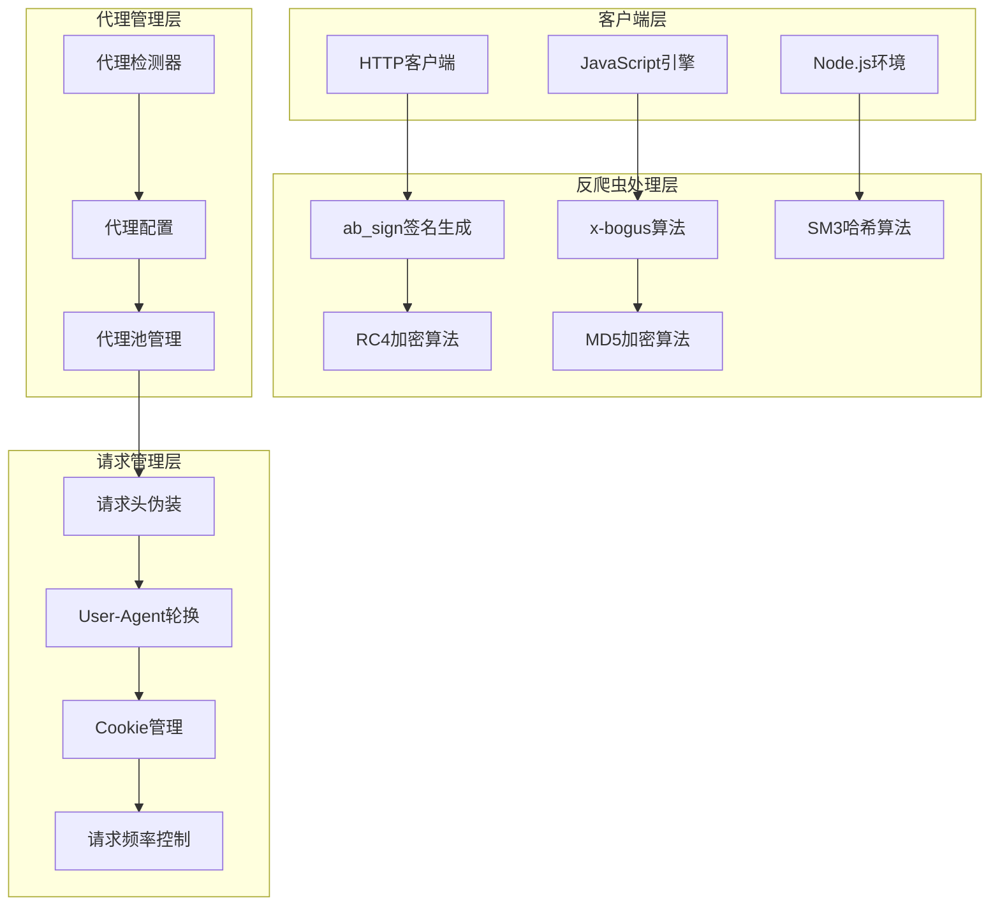
```mermaid
graph TB
subgraph "客户端层"
A[HTTP客户端]
B[JavaScript引擎]
C[Node.js环境]
end
subgraph "反爬虫处理层"
D[ab_sign签名生成]
E[x-bogus算法]
F[SM3哈希算法]
G[RC4加密算法]
H[MD5加密算法]
end
subgraph "代理管理层"
I[代理检测器]
J[代理配置]
K[代理池管理]
end
subgraph "请求管理层"
L[请求头伪装]
M[User-Agent轮换]
N[Cookie管理]
O[请求频率控制]
end
A --> D
B --> E
C --> F
D --> G
E --> H
I --> J
J --> K
K --> L
L --> M
M --> N
N --> O
```

**图表来源**
- [ab_sign.py:1-455](file://src/ab_sign.py#L1-L455)
- [spider.py:1-800](file://src/spider.py#L1-L800)
- [proxy.py:1-93](file://src/proxy.py#L1-L93)

## 核心反爬虫组件

### 1. ab_sign签名生成模块

ab_sign模块是项目中最核心的反爬虫组件，专门用于生成抖音平台的a_bogus参数。

#### 主要功能特性

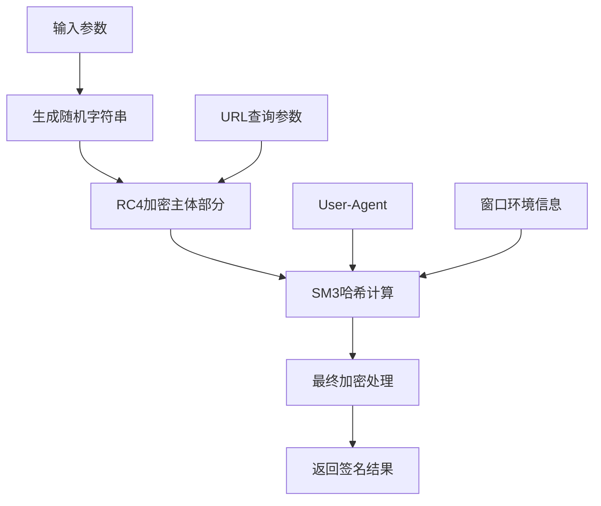
```mermaid
flowchart TD
A[输入参数] --> B[生成随机字符串]
B --> C[RC4加密主体部分]
C --> D[SM3哈希计算]
D --> E[最终加密处理]
E --> F[返回签名结果]
G[URL查询参数] --> C
H[User-Agent] --> D
I[窗口环境信息] --> D
```

**图表来源**
- [ab_sign.py:444-454](file://src/ab_sign.py#L444-L454)

#### 关键算法实现

1. **SM3哈希算法**：实现了国家密码管理局发布的SM3密码杂凑算法
2. **RC4流加密**：使用RC4算法进行数据加密
3. **魔改Base64编码**：自定义的Base64编码表
4. **时间戳处理**：精确到毫秒的时间戳生成

**章节来源**
- [ab_sign.py:1-455](file://src/ab_sign.py#L1-L455)

### 2. JavaScript加密解密模块

项目集成了多个JavaScript加密解密模块，用于处理不同平台的反爬虫机制。

#### 支持的加密算法

| 模块名称 | 加密算法 | 平台用途 | 特点 |
|---------|---------|---------|------|
| x-bogus.js | 自定义算法 | 抖音X-Bogus参数 | 复杂的JavaScript VM模拟 |
| taobao-sign.js | MD5算法 | 淘宝签名验证 | 标准MD5哈希实现 |
| laixiu.js | MD5算法 | 来秀直播 | UUID生成和MD5计算 |
| liveme.js | 多种算法 | LiveMe直播 | 综合性的签名生成 |

**章节来源**
- [x-bogus.js:1-564](file://src/javascript/x-bogus.js#L1-L564)
- [taobao-sign.js:1-78](file://src/javascript/taobao-sign.js#L1-L78)
- [laixiu.js:1-33](file://src/javascript/laixiu.js#L1-L33)
- [liveme.js:1-426](file://src/javascript/liveme.js#L1-L426)

### 3. 代理管理系统

代理系统提供了完整的代理检测和管理功能，支持多种代理协议。

#### 代理类型支持

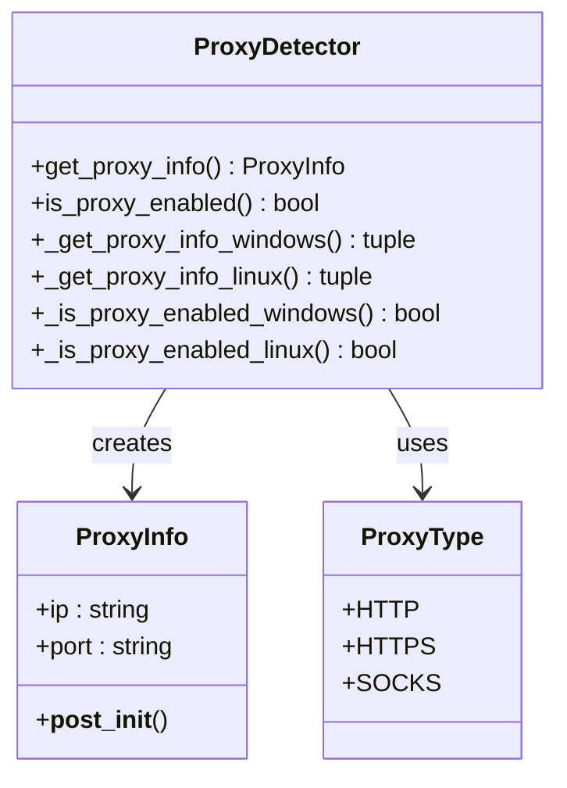
```mermaid
classDiagram
class ProxyType {
+HTTP
+HTTPS
+SOCKS
}
class ProxyInfo {
+ip : string
+port : string
+__post_init__()
}
class ProxyDetector {
+get_proxy_info() ProxyInfo
+is_proxy_enabled() bool
+_get_proxy_info_windows() tuple
+_get_proxy_info_linux() tuple
+_is_proxy_enabled_windows() bool
+_is_proxy_enabled_linux() bool
}
ProxyDetector --> ProxyInfo : creates
ProxyDetector --> ProxyType : uses
```

**图表来源**
- [proxy.py:8-93](file://src/proxy.py#L8-L93)

**章节来源**
- [proxy.py:1-93](file://src/proxy.py#L1-L93)

## 签名算法实现

### SM3密码杂凑算法

SM3是中国国家密码管理局发布的密码杂凑算法标准，具有以下特点：

#### 算法特性
- 输出长度：256位
- 填充规则：符合SM3标准
- 压缩函数：基于SHA-256的改进版本
- 初始向量：与标准SM3算法一致

#### 实现细节

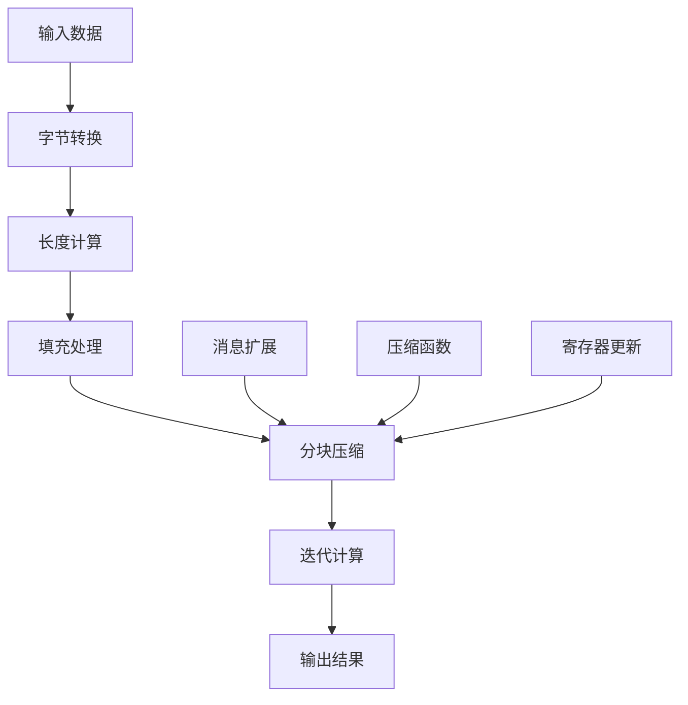
```mermaid
flowchart TD
A[输入数据] --> B[字节转换]
B --> C[长度计算]
C --> D[填充处理]
D --> E[分块压缩]
E --> F[迭代计算]
F --> G[输出结果]
H[消息扩展] --> E
I[压缩函数] --> E
J[寄存器更新] --> E
```

**图表来源**
- [ab_sign.py:61-209](file://src/ab_sign.py#L61-L209)

**章节来源**
- [ab_sign.py:61-209](file://src/ab_sign.py#L61-L209)

### RC4流加密算法

RC4是一种高效的流加密算法，广泛应用于各种加密场景。

#### 加密流程

1. **密钥调度算法(KSA)**：初始化状态数组
2. **伪随机生成算法(PRGA)**：生成密钥流
3. **异或加密**：明文与密钥流进行异或运算

#### 关键实现

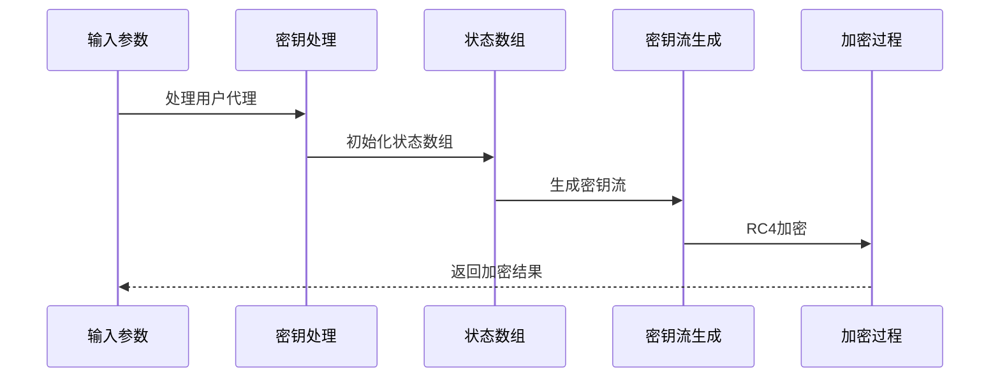
```mermaid
sequenceDiagram
participant P as 输入参数
participant K as 密钥处理
participant S as 状态数组
participant C as 密钥流生成
participant E as 加密过程
P->>K : 处理用户代理
K->>S : 初始化状态数组
S->>C : 生成密钥流
C->>E : RC4加密
E-->>P : 返回加密结果
```

**图表来源**
- [ab_sign.py:6-26](file://src/ab_sign.py#L6-L26)

**章节来源**
- [ab_sign.py:6-26](file://src/ab_sign.py#L6-L26)

## 平台特定反爬虫机制

### 抖音平台反爬虫策略

#### a_bogus参数生成

抖音平台采用了复杂的安全防护机制，主要体现在a_bogus参数的生成上：

1. **多层加密处理**：URL查询参数经过两次SM3哈希处理
2. **User-Agent混淆**：对User-Agent进行RC4加密
3. **时间戳验证**：精确的时间戳确保参数时效性
4. **环境信息验证**：包含详细的浏览器环境信息

#### 请求流程

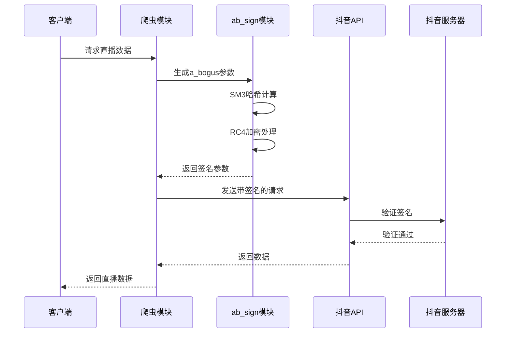
```mermaid
sequenceDiagram
participant Client as 客户端
participant Spider as 爬虫模块
participant Sign as ab_sign模块
participant API as 抖音API
participant Server as 抖音服务器
Client->>Spider : 请求直播数据
Spider->>Sign : 生成a_bogus参数
Sign->>Sign : SM3哈希计算
Sign->>Sign : RC4加密处理
Sign-->>Spider : 返回签名参数
Spider->>API : 发送带签名的请求
API->>Server : 验证签名
Server-->>API : 验证通过
API-->>Spider : 返回数据
Spider-->>Client : 返回直播数据
```

**图表来源**
- [spider.py:68-141](file://src/spider.py#L68-L141)
- [ab_sign.py:444-454](file://src/ab_sign.py#L444-L454)

**章节来源**
- [spider.py:68-141](file://src/spider.py#L68-L141)
- [ab_sign.py:298-454](file://src/ab_sign.py#L298-L454)

### TikTok平台反爬虫策略

#### X-Bogus算法实现

TikTok采用了X-Bogus算法来防止爬虫访问：

1. **JavaScript VM模拟**：完全模拟浏览器环境
2. **动态算法生成**：算法参数随时间变化
3. **多层验证机制**：包括时间戳、User-Agent等多重验证

#### 算法特点

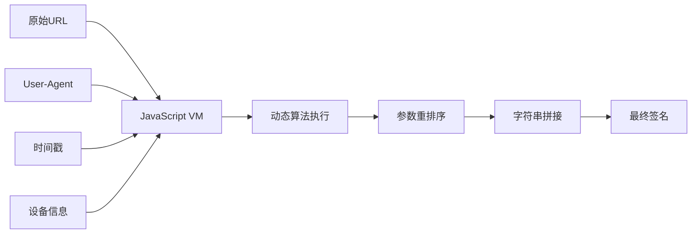
```mermaid
flowchart LR
A[原始URL] --> B[JavaScript VM]
B --> C[动态算法执行]
C --> D[参数重排序]
D --> E[字符串拼接]
E --> F[最终签名]
G[User-Agent] --> B
H[时间戳] --> B
I[设备信息] --> B
```

**图表来源**
- [x-bogus.js:500-564](file://src/javascript/x-bogus.js#L500-L564)

**章节来源**
- [x-bogus.js:1-564](file://src/javascript/x-bogus.js#L1-L564)
- [room.py:42-48](file://src/room.py#L42-L48)

### 其他平台反爬虫策略

#### 快手平台
- **参数完整性验证**：要求所有必需参数完整
- **Cookie验证**：严格的Cookie有效性检查
- **User-Agent限制**：特定的浏览器标识要求

#### 虎牙平台
- **CDN防盗链**：视频流地址包含防盗链参数
- **时间戳验证**：URL有效期限制
- **Referer检查**：严格的来源验证

#### 斗鱼平台
- **Token验证**：动态生成的访问令牌
- **MD5签名**：参数的MD5完整性校验
- **UUID生成**：唯一的设备标识符

**章节来源**
- [spider.py:315-404](file://src/spider.py#L315-L404)
- [spider.py:524-544](file://src/spider.py#L524-L544)

## 反检测最佳实践

### 1. User-Agent轮换策略

#### 实现方案

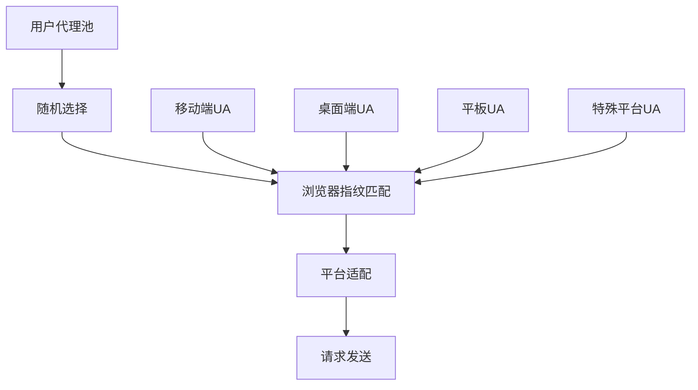
```mermaid
flowchart TD
A[用户代理池] --> B[随机选择]
B --> C[浏览器指纹匹配]
C --> D[平台适配]
D --> E[请求发送]
F[移动端UA] --> C
G[桌面端UA] --> C
H[平板UA] --> C
I[特殊平台UA] --> C
```

**图表来源**
- [spider.py:146-154](file://src/spider.py#L146-L154)
- [spider.py:231-236](file://src/spider.py#L231-L236)

#### 最佳实践建议

1. **多样化UA组合**：包含Chrome、Firefox、Safari等多种浏览器
2. **版本随机化**：不同浏览器版本随机选择
3. **平台适配**：根据目标平台选择合适的UA
4. **定期更新**：保持UA列表的时效性

**章节来源**
- [spider.py:146-154](file://src/spider.py#L146-L154)
- [spider.py:231-236](file://src/spider.py#L231-L236)

### 2. Cookie管理策略

#### Cookie生命周期管理

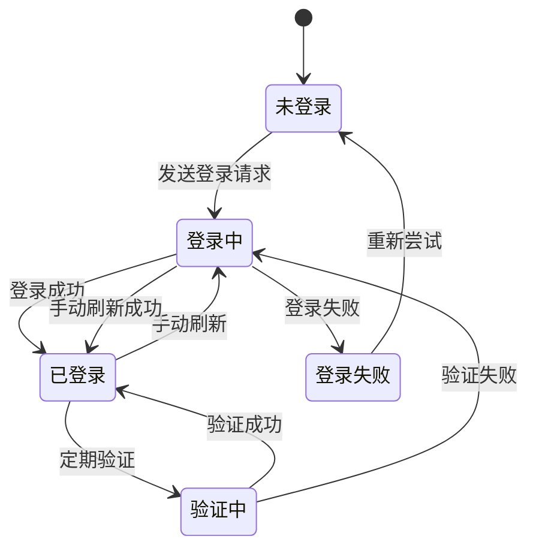
```mermaid
stateDiagram-v2
[*] --> 未登录
未登录 --> 登录中 : 发送登录请求
登录中 --> 已登录 : 登录成功
登录中 --> 登录失败 : 登录失败
登录失败 --> 未登录 : 重新尝试
已登录 --> 验证中 : 定期验证
验证中 --> 已登录 : 验证成功
验证中 --> 登录中 : 验证失败
已登录 --> 登录中 : 手动刷新
登录中 --> 已登录 : 手动刷新成功
```

**图表来源**
- [spider.py:146-154](file://src/spider.py#L146-L154)

#### 管理策略

1. **自动登录**：支持平台自动登录获取Cookie
2. **Cookie刷新**：定期刷新过期的Cookie
3. **跨平台共享**：不同平台间的Cookie共享机制
4. **安全性保障**：Cookie的加密存储和传输

**章节来源**
- [spider.py:146-154](file://src/spider.py#L146-L154)

### 3. 请求头伪装技术

#### 伪装策略

| 请求头类型 | 伪装内容 | 目的 | 实现方式 |
|-----------|----------|------|----------|
| User-Agent | 真实浏览器标识 | 防止识别爬虫 | 多样化UA池 |
| Accept-Language | 多语言支持 | 模拟真实用户 | 随机语言选择 |
| Accept-Encoding | 压缩支持 | 正常HTTP行为 | gzip, deflate等 |
| Accept-Charset | 字符编码 | 完整HTTP支持 | UTF-8, GBK等 |
| Connection | 连接管理 | 避免异常 | keep-alive |

**章节来源**
- [spider.py:68-75](file://src/spider.py#L68-L75)
- [spider.py:146-154](file://src/spider.py#L146-L154)

## IP代理使用策略

### 代理类型选择

#### 代理协议对比

| 代理类型 | 优点 | 缺点 | 适用场景 |
|---------|------|------|----------|
| HTTP代理 | 配置简单 | 功能有限 | 简单网页抓取 |
| HTTPS代理 | 安全性好 | 成本较高 | 敏感数据传输 |
| SOCKS代理 | 功能全面 | 配置复杂 | 大规模爬取 |

#### 代理质量评估

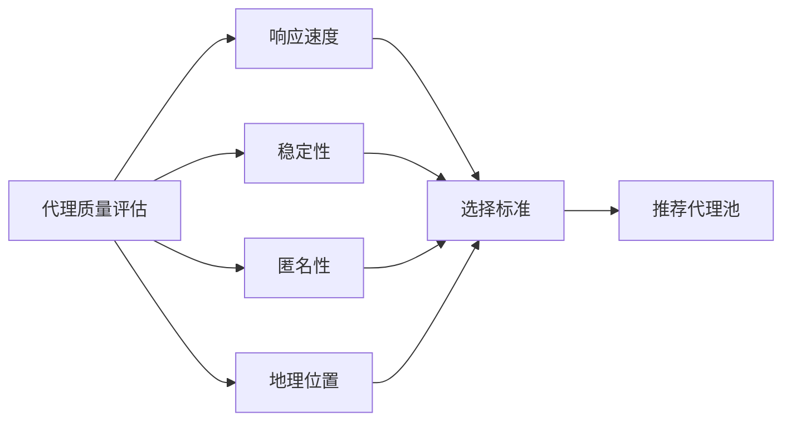
```mermaid
graph LR
A[代理质量评估] --> B[响应速度]
A --> C[稳定性]
A --> D[匿名性]
A --> E[地理位置]
B --> F[选择标准]
C --> F
D --> F
E --> F
F --> G[推荐代理池]
```

**图表来源**
- [proxy.py:8-12](file://src/proxy.py#L8-L12)

### 代理池管理

#### 动态代理池

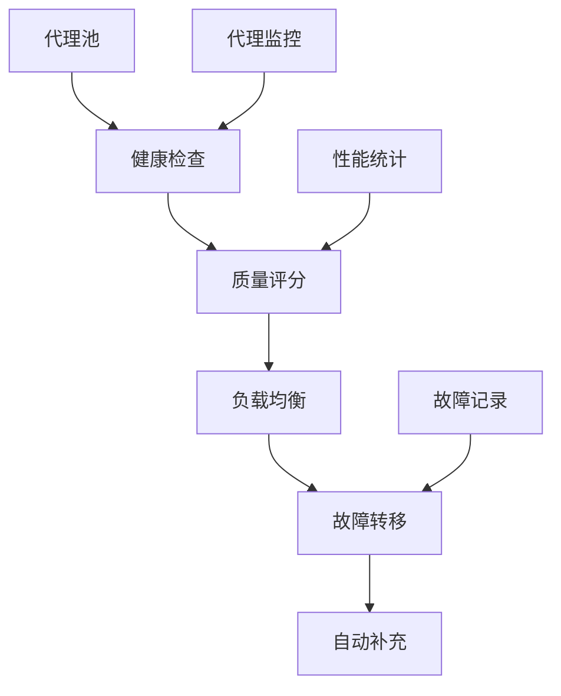
```mermaid
flowchart TD
A[代理池] --> B[健康检查]
B --> C[质量评分]
C --> D[负载均衡]
D --> E[故障转移]
E --> F[自动补充]
G[代理监控] --> B
H[性能统计] --> C
I[故障记录] --> E
```

**图表来源**
- [proxy.py:27-93](file://src/proxy.py#L27-L93)

**章节来源**
- [proxy.py:1-93](file://src/proxy.py#L1-L93)

## 请求频率控制

### 频率控制策略

#### 动态频率调节

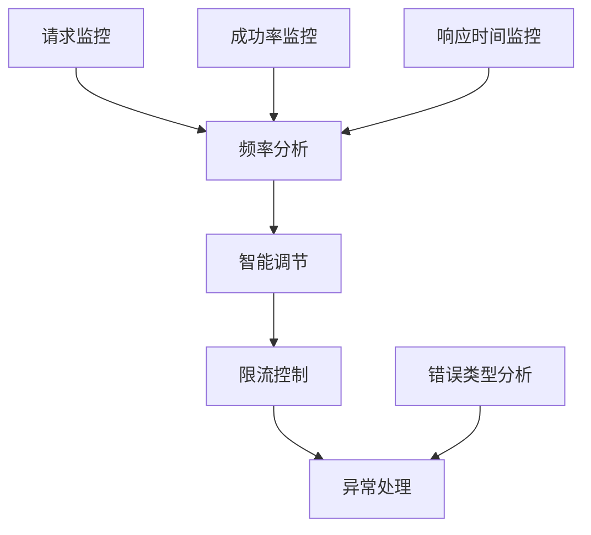
```mermaid
flowchart TD
A[请求监控] --> B[频率分析]
B --> C[智能调节]
C --> D[限流控制]
D --> E[异常处理]
F[成功率监控] --> B
G[响应时间监控] --> B
H[错误类型分析] --> E
```

#### 控制算法

1. **指数退避**：失败时增加等待时间
2. **自适应调节**：根据成功率调整请求频率
3. **并发控制**：限制同时进行的请求数量
4. **时间窗口**：在固定时间内限制请求次数

**章节来源**
- [async_http.py:10-24](file://src/http_clients/async_http.py#L10-L24)
- [sync_http.py:20-30](file://src/http_clients/sync_http.py#L20-L30)

### 超时和重试机制

#### 重试策略

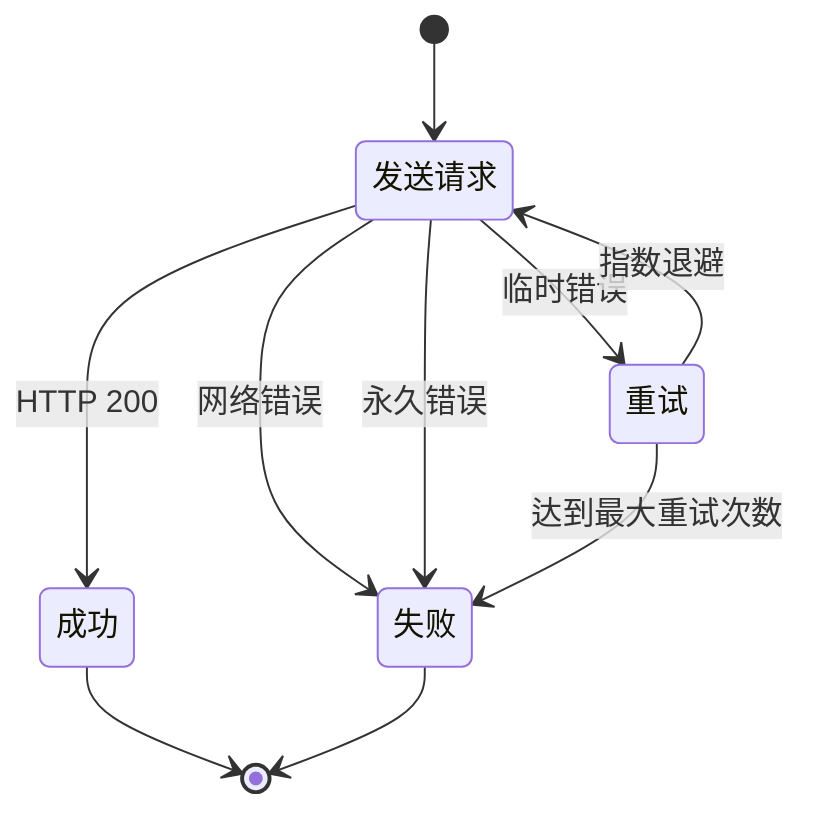
```mermaid
stateDiagram-v2
[*] --> 发送请求
发送请求 --> 成功 : HTTP 200
发送请求 --> 失败 : 网络错误
发送请求 --> 重试 : 临时错误
发送请求 --> 失败 : 永久错误
重试 --> 发送请求 : 指数退避
重试 --> 失败 : 达到最大重试次数
成功 --> [*]
失败 --> [*]
```

**图表来源**
- [async_http.py:27-46](file://src/http_clients/async_http.py#L27-L46)

**章节来源**
- [async_http.py:1-60](file://src/http_clients/async_http.py#L1-L60)

## 常见反爬虫场景应对

### 1. 风控检测应对

#### 风控特征识别

| 风控特征 | 表现形式 | 应对策略 |
|---------|---------|---------|
| 频繁请求 | 429状态码 | 实施指数退避 |
| IP封禁 | 403状态码 | 切换代理IP |
| UA检测 | 403状态码 | 轮换User-Agent |
| Cookie失效 | 401状态码 | 自动重新登录 |
| 时间戳过期 | 400状态码 | 更新时间戳 |

#### 应对流程

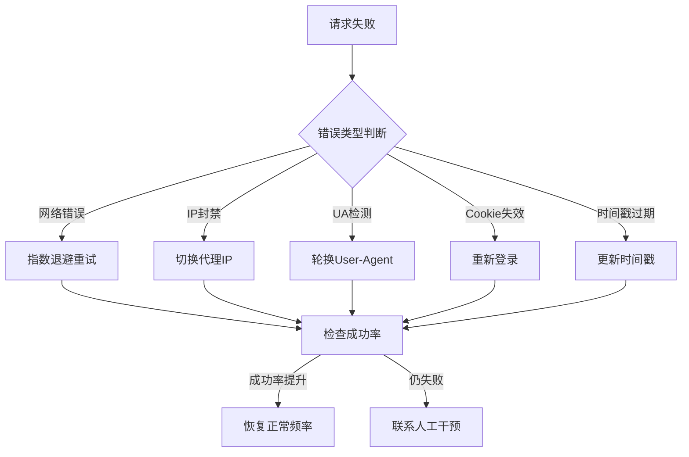
```mermaid
flowchart TD
A[请求失败] --> B{错误类型判断}
B --> |网络错误| C[指数退避重试]
B --> |IP封禁| D[切换代理IP]
B --> |UA检测| E[轮换User-Agent]
B --> |Cookie失效| F[重新登录]
B --> |时间戳过期| G[更新时间戳]
C --> H[检查成功率]
D --> H
E --> H
F --> H
G --> H
H --> |成功率提升| I[恢复正常频率]
H --> |仍失败| J[联系人工干预]
```

### 2. JavaScript渲染检测

#### 解决方案

1. **Node.js集成**：使用execjs执行JavaScript代码
2. **浏览器自动化**：集成Selenium或Puppeteer
3. **静态分析**：分析JavaScript逻辑并重实现
4. **动态代理**：使用高质量代理隐藏真实IP

**章节来源**
- [spider.py:25-27](file://src/spider.py#L25-L27)
- [room.py:42-48](file://src/room.py#L42-L48)

### 3. 行为特征检测

#### 行为模拟

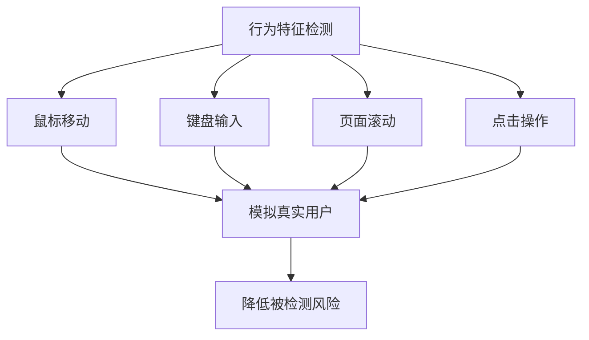
```mermaid
graph TB
A[行为特征检测] --> B[鼠标移动]
A --> C[键盘输入]
A --> D[页面滚动]
A --> E[点击操作]
B --> F[模拟真实用户]
C --> F
D --> F
E --> F
F --> G[降低被检测风险]
```

**图表来源**
- [spider.py:25-27](file://src/spider.py#L25-L27)

## 故障排除指南

### 1. 常见错误诊断

#### 错误分类和处理

| 错误类型 | 错误代码 | 可能原因 | 解决方案 |
|---------|---------|---------|---------|
| 网络错误 | 404 | URL错误或页面不存在 | 检查URL格式 |
| 权限错误 | 403 | 缺少权限或被封禁 | 检查Cookie和代理 |
| 服务器错误 | 500 | 服务器内部错误 | 稍后重试或联系管理员 |
| 超时错误 | ETIMEDOUT | 网络连接超时 | 检查网络连接和代理 |
| 签名错误 | 400 | 签名参数错误 | 检查ab_sign实现 |

#### 调试工具

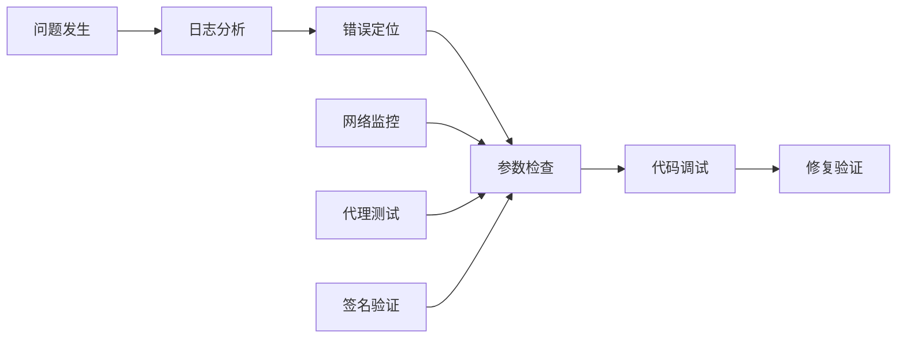
```mermaid
flowchart LR
A[问题发生] --> B[日志分析]
B --> C[错误定位]
C --> D[参数检查]
D --> E[代码调试]
E --> F[修复验证]
G[网络监控] --> D
H[代理测试] --> D
I[签名验证] --> D
```

### 2. 性能优化建议

#### 优化策略

1. **缓存机制**：合理使用缓存减少重复请求
2. **连接复用**：使用HTTP Keep-Alive减少连接开销
3. **异步处理**：采用异步I/O提高并发性能
4. **资源管理**：及时释放网络连接和内存资源

#### 监控指标

| 指标类型 | 目标值 | 监控方法 |
|---------|--------|---------|
| 请求成功率 | >95% | 定期统计 |
| 平均响应时间 | <2s | 性能监控 |
| 代理可用率 | >90% | 健康检查 |
| 错误率 | <5% | 日志分析 |

**章节来源**
- [README.md:117-118](file://README.md#L117-L118)

### 3. 维护和更新

#### 更新策略

1. **算法更新**：定期更新签名算法以应对平台升级
2. **代理池维护**：持续补充高质量代理IP
3. **配置优化**：根据实际使用情况调整配置参数
4. **错误修复**：及时修复发现的bug和问题

#### 版本管理

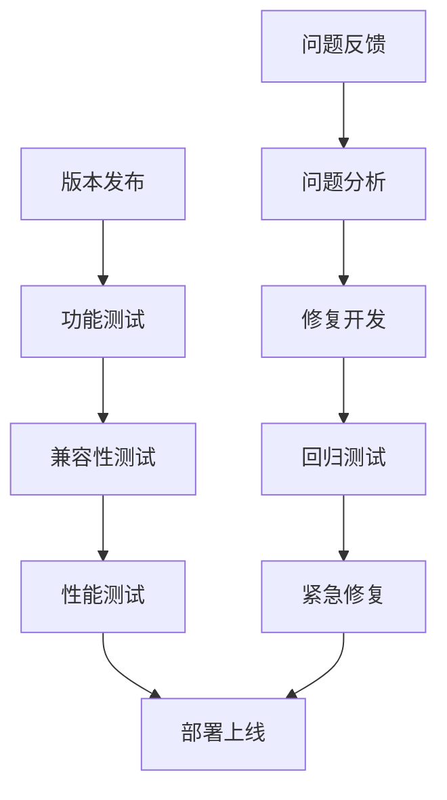
```mermaid
flowchart TD
A[版本发布] --> B[功能测试]
B --> C[兼容性测试]
C --> D[性能测试]
D --> E[部署上线]
F[问题反馈] --> G[问题分析]
G --> H[修复开发]
H --> I[回归测试]
I --> J[紧急修复]
J --> E
```

## 总结

DouyinLiveRecorder项目的反爬虫处理策略体现了现代网络爬虫技术的先进水平，主要特点包括：

### 核心优势

1. **多层次防护**：从请求头伪装到签名算法生成的全方位防护
2. **平台适配性强**：针对不同平台采用专门的反爬虫策略
3. **技术栈丰富**：集成了多种加密算法和JavaScript执行环境
4. **自动化程度高**：减少了人工干预的需求

### 技术创新点

1. **SM3算法实现**：完整实现了国家密码标准的哈希算法
2. **JavaScript VM模拟**：能够准确模拟复杂的JavaScript执行环境
3. **动态代理管理**：建立了完善的代理池管理和监控机制
4. **智能频率控制**：实现了自适应的请求频率调节算法

### 应用价值

该项目不仅为直播录制提供了可靠的技术支撑，更重要的是展示了如何在面对日益复杂的反爬虫技术时，通过技术创新和工程实践来解决问题。其经验对于其他网络爬虫项目具有重要的参考价值。

通过持续的技术更新和优化，该项目将继续在直播录制领域发挥重要作用，为用户提供稳定可靠的录制服务。