# 国内平台适配

<cite>
**本文档引用的文件**
- [README.md](file://README.md)
- [main.py](file://main.py)
- [spider.py](file://src/spider.py)
- [stream.py](file://src/stream.py)
- [room.py](file://src/room.py)
- [ab_sign.py](file://src/ab_sign.py)
- [utils.py](file://src/utils.py)
- [x-bogus.js](file://src/javascript/x-bogus.js)
- [taobao-sign.js](file://src/javascript/taobao-sign.js)
- [URL_config.ini](file://config/URL_config.ini)
- [requirements.txt](file://requirements.txt)
</cite>

## 目录
1. [简介](#简介)
2. [项目结构](#项目结构)
3. [核心组件](#核心组件)
4. [架构概览](#架构概览)
5. [详细组件分析](#详细组件分析)
6. [依赖分析](#依赖分析)
7. [性能考虑](#性能考虑)
8. [故障排除指南](#故障排除指南)
9. [结论](#结论)
10. [附录](#附录)

## 简介

DouyinLiveRecorder是一个支持多平台直播录制的工具，特别针对国内主流直播平台进行了深度适配。该项目支持抖音、快手、虎牙、斗鱼、B站、小红书等国内直播平台，同时兼容海外平台如TikTok、YouTube等。

该项目的核心优势在于其强大的反爬虫处理能力和灵活的平台适配机制。通过模拟真实用户行为、处理复杂的加密算法和动态签名生成，实现了对各大直播平台的稳定访问。

## 项目结构

项目采用模块化设计，主要包含以下核心模块：

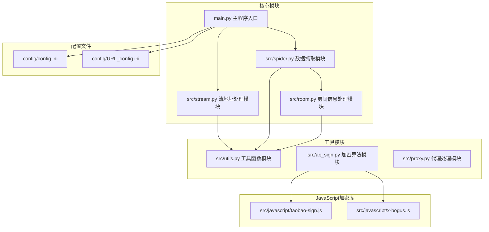

**图表来源**
- [main.py:1-100](file://main.py#L1-L100)
- [spider.py:1-50](file://src/spider.py#L1-L50)
- [stream.py:1-50](file://src/stream.py#L1-L50)

**章节来源**
- [README.md:72-100](file://README.md#L72-L100)
- [main.py:1-100](file://main.py#L1-L100)

## 核心组件

### 平台适配架构

项目采用统一的平台适配架构，通过条件判断和平台特定的处理逻辑来支持不同的直播平台：

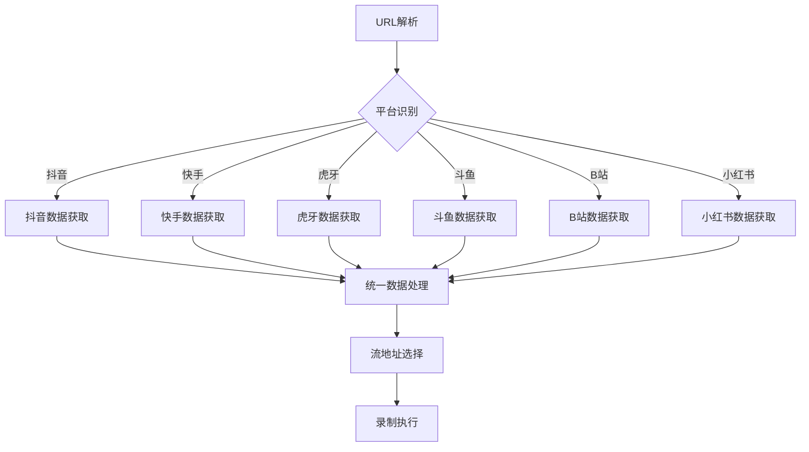

**图表来源**
- [main.py:580-665](file://main.py#L580-L665)

### 数据获取流程

每个平台都有专门的数据获取函数，负责处理平台特定的API调用和数据解析：

**章节来源**
- [spider.py:68-282](file://src/spider.py#L68-L282)
- [spider.py:315-404](file://src/spider.py#L315-L404)
- [spider.py:407-517](file://src/spider.py#L407-L517)

## 架构概览

项目采用异步非阻塞的设计模式，通过事件循环和并发处理实现高效的直播数据获取：

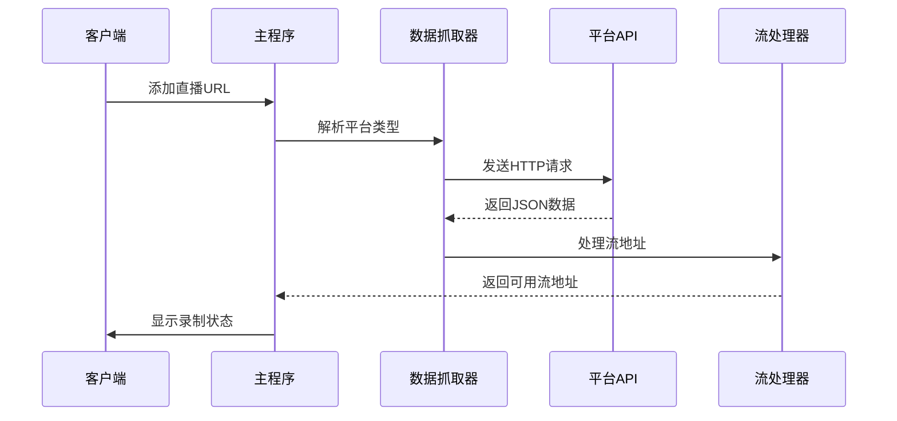

**图表来源**
- [main.py:545-665](file://main.py#L545-L665)
- [spider.py:1-50](file://src/spider.py#L1-L50)

## 详细组件分析

### 抖音平台适配

抖音平台采用了多层次的数据获取策略，支持多种URL格式和访问方式：

#### URL解析规则
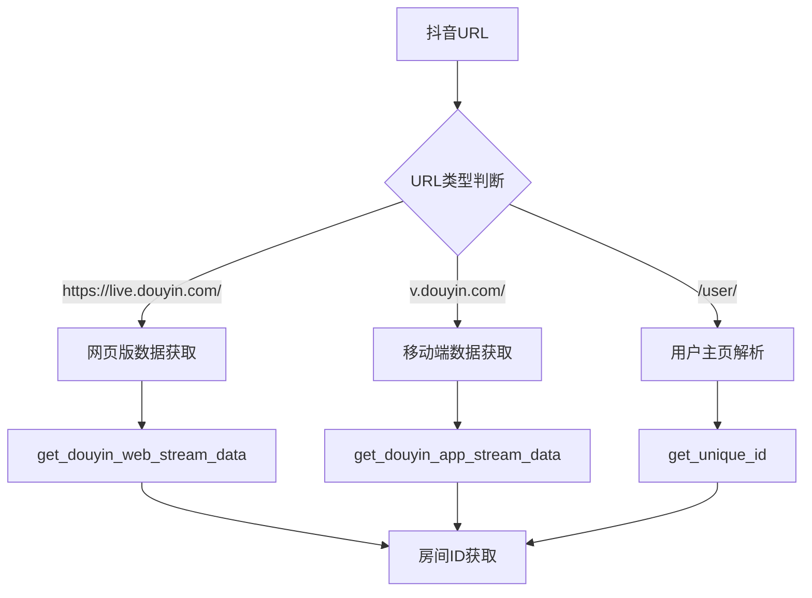

**图表来源**
- [spider.py:144-226](file://src/spider.py#L144-L226)
- [room.py:52-105](file://src/room.py#L52-L105)

#### API调用方式
抖音平台的数据获取涉及复杂的加密算法和签名生成：

**章节来源**
- [spider.py:68-141](file://src/spider.py#L68-L141)
- [spider.py:144-226](file://src/spider.py#L144-L226)

### 快手平台适配

快手平台提供了两种数据获取方式，以应对平台更新和反爬虫策略：

#### 数据获取策略
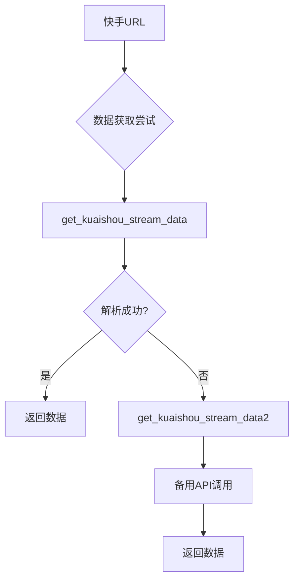

**图表来源**
- [spider.py:315-404](file://src/spider.py#L315-L404)

**章节来源**
- [spider.py:315-404](file://src/spider.py#L315-L404)

### 虎牙平台适配

虎牙平台采用了混合的数据获取策略，支持网页版和移动端两种方式：

#### 流地址处理
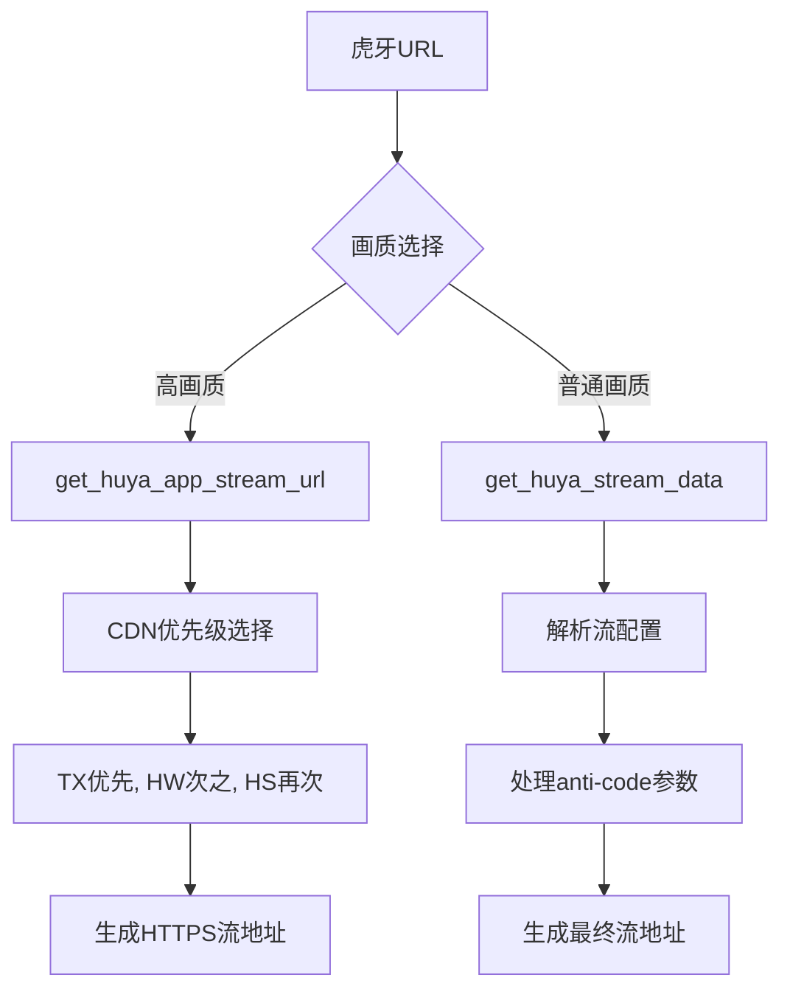

**图表来源**
- [spider.py:407-517](file://src/spider.py#L407-L517)
- [stream.py:209-299](file://src/stream.py#L209-L299)

**章节来源**
- [spider.py:407-517](file://src/spider.py#L407-L517)
- [stream.py:209-299](file://src/stream.py#L209-L299)

### 斗鱼平台适配

斗鱼平台采用了独特的加密算法来生成访问令牌：

#### 加密算法实现
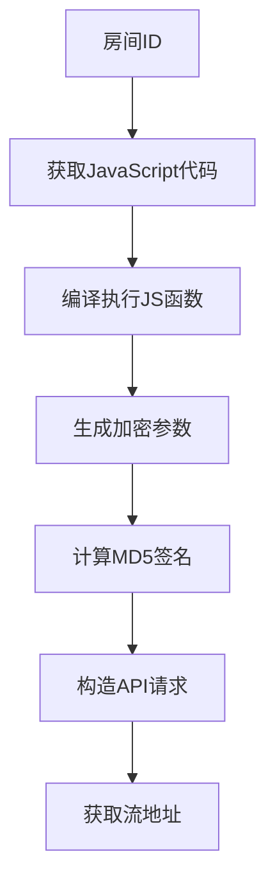

**图表来源**
- [spider.py:520-544](file://src/spider.py#L520-L544)

**章节来源**
- [spider.py:520-544](file://src/spider.py#L520-L544)

### B站平台适配

B站平台提供了两种数据获取方式，以适应不同的访问需求：

#### 数据获取策略
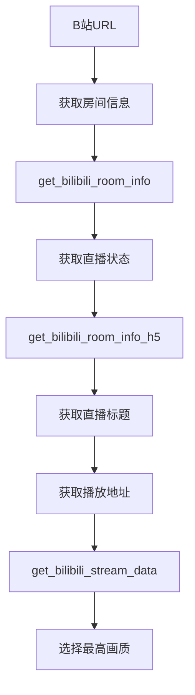

**图表来源**
- [spider.py:655-703](file://src/spider.py#L655-L703)
- [spider.py:706-766](file://src/spider.py#L706-L766)

**章节来源**
- [spider.py:655-703](file://src/spider.py#L655-L703)
- [spider.py:706-766](file://src/spider.py#L706-L766)

### 小红书平台适配

小红书平台采用了特殊的URL重定向机制：

#### URL处理流程
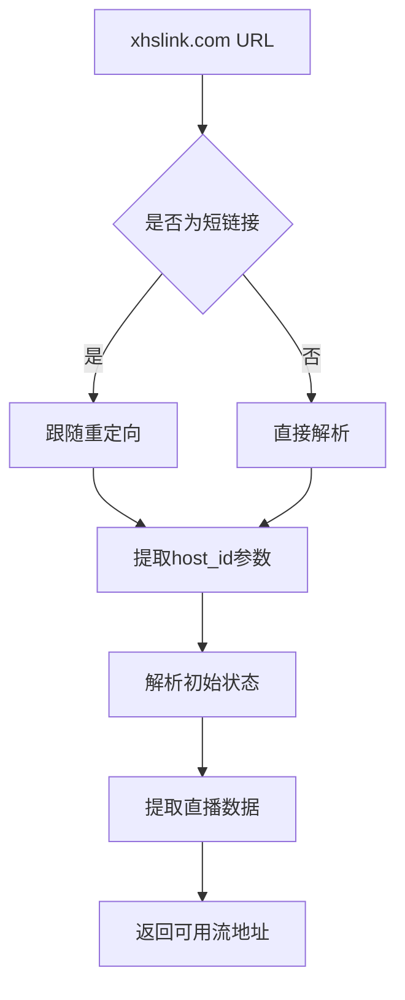

**图表来源**
- [spider.py:769-800](file://src/spider.py#L769-L800)

**章节来源**
- [spider.py:769-800](file://src/spider.py#L769-L800)

## 依赖分析

项目依赖关系复杂，涉及多个第三方库和自定义模块：

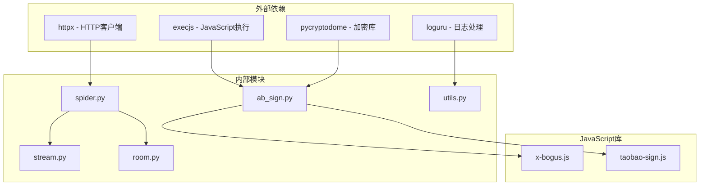

**图表来源**
- [requirements.txt:1-7](file://requirements.txt#L1-L7)
- [main.py:29-40](file://main.py#L29-L40)

**章节来源**
- [requirements.txt:1-7](file://requirements.txt#L1-L7)

## 性能考虑

### 异步并发控制

项目采用了信号量机制来控制并发请求的数量，避免过度请求导致的封禁：

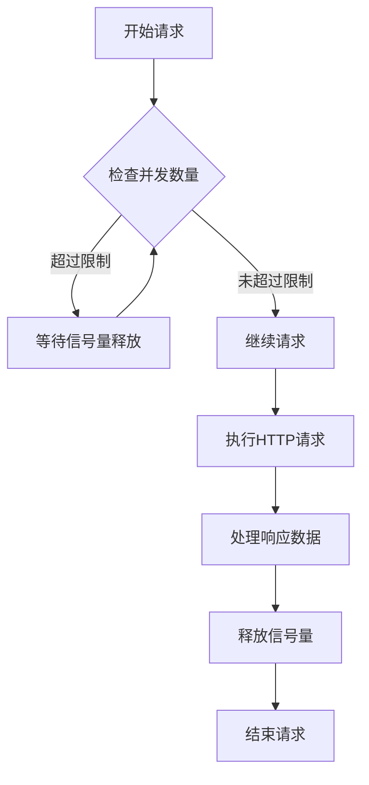

**图表来源**
- [main.py:545-595](file://main.py#L545-L595)

### 动态错误率调整

系统实现了智能的错误率监控和并发调整机制：

**章节来源**
- [main.py:298-325](file://main.py#L298-L325)

## 故障排除指南

### 常见问题及解决方案

#### 反爬虫相关问题
1. **403 Forbidden错误**：检查User-Agent和Cookie设置
2. **风控拦截**：增加请求间隔，使用代理服务器
3. **签名验证失败**：确认加密算法正确性和参数完整性

#### 数据解析问题
1. **JSON解析错误**：检查API响应格式变化
2. **URL解析失败**：验证URL格式和参数正确性
3. **流地址为空**：检查平台API更新情况

#### 录制问题
1. **录制失败**：检查FFmpeg安装和配置
2. **画质选择错误**：确认平台支持的画质选项
3. **网络连接问题**：检查代理设置和网络环境

**章节来源**
- [utils.py:38-51](file://src/utils.py#L38-L51)
- [main.py:133-135](file://main.py#L133-L135)

## 结论

DouyinLiveRecorder项目通过精心设计的架构和强大的技术实现，成功适配了国内主流直播平台。其核心优势包括：

1. **全面的平台支持**：覆盖抖音、快手、虎牙、斗鱼、B站、小红书等主要直播平台
2. **强大的反爬虫能力**：通过复杂的加密算法和签名生成实现稳定访问
3. **灵活的配置机制**：支持自定义Cookie、代理和录制参数
4. **稳定的录制性能**：通过异步并发控制和错误处理机制保证录制稳定性

该项目为国内直播平台的数据获取和录制提供了完整的解决方案，具有很高的实用价值和技术参考价值。

## 附录

### 支持的平台列表

项目明确支持的平台包括：
- 国内平台：抖音、快手、虎牙、斗鱼、YY、B站、小红书、Bigo、Blued、网易CC、千度热播、猫耳FM、Look、TwitCasting、百度、微博、酷狗、花椒、流星、Acfun、畅聊、映客、音播、知乎、嗨秀、VV星球、17Live、浪Live、漂漂、六间房、乐嗨、花猫、淘宝、京东、咪咕、连接、来秀
- 海外平台：TikTok、SOOP、PandaTV、WinkTV、FlexTV、PopkonTV、TwitchTV、LiveMe、ShowRoom、CHZZK、Shopee、Youtube、Faceit、Picarto

### 配置文件说明

项目使用INI格式的配置文件来管理各种设置：
- `URL_config.ini`：包含要录制的直播URL列表
- `config.ini`：包含各种平台的Cookie设置和录制参数

**章节来源**
- [README.md:15-68](file://README.md#L15-L68)
- [URL_config.ini:1-5](file://config/URL_config.ini#L1-L5)