# 国际平台适配

<cite>
**本文档引用的文件**
- [README.md](file://README.md)
- [main.py](file://main.py)
- [src/spider.py](file://src/spider.py)
- [src/stream.py](file://src/stream.py)
- [src/room.py](file://src/room.py)
- [src/http_clients/async_http.py](file://src/http_clients/async_http.py)
- [src/http_clients/sync_http.py](file://src/http_clients/sync_http.py)
- [src/proxy.py](file://src/proxy.py)
- [src/utils.py](file://src/utils.py)
- [src/javascript/x-bogus.js](file://src/javascript/x-bogus.js)
- [config/URL_config.ini](file://config/URL_config.ini)
</cite>

## 目录
1. [简介](#简介)
2. [项目结构](#项目结构)
3. [核心组件](#核心组件)
4. [架构概览](#架构概览)
5. [详细组件分析](#详细组件分析)
6. [依赖关系分析](#依赖关系分析)
7. [性能考虑](#性能考虑)
8. [故障排除指南](#故障排除指南)
9. [结论](#结论)

## 简介

DouyinLiveRecorder是一个支持多平台直播录制的工具，特别针对国际直播平台进行了适配。本文档专注于TikTok、Twitch等国际直播平台的数据获取机制和API调用方式，详细说明海外平台的网络访问限制、区域封锁处理和代理配置方法。

该项目支持超过50个直播平台，包括抖音、TikTok、B站、虎牙、斗鱼等国内平台，以及Twitch、LiveMe、ShowRoom、Chzzk等国际平台。对于国际平台，项目采用了专门的适配策略来处理网络访问限制和区域封锁问题。

## 项目结构

项目采用模块化设计，主要包含以下核心模块：

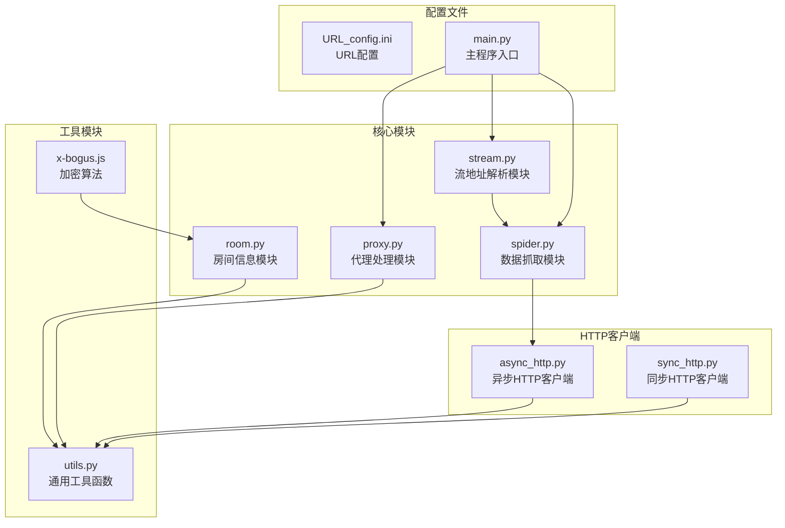

**图表来源**
- [main.py:2000-2155](file://main.py#L2000-L2155)
- [src/spider.py:1-800](file://src/spider.py#L1-L800)
- [src/stream.py:1-446](file://src/stream.py#L1-L446)

**章节来源**
- [README.md:72-100](file://README.md#L72-L100)
- [main.py:2000-2155](file://main.py#L2000-L2155)

## 核心组件

### 国际平台识别与配置

项目通过配置文件识别需要代理的国际平台：

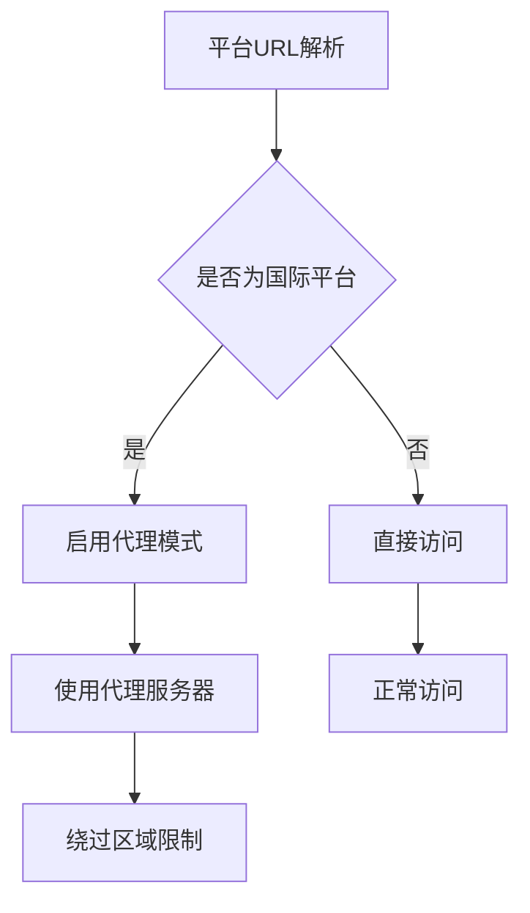

**图表来源**
- [main.py:2050-2071](file://main.py#L2050-L2071)

项目支持的主要国际平台包括：
- TikTok (www.tiktok.com)
- Twitch (www.twitch.tv)
- LiveMe (www.liveme.com)
- ShowRoom (www.showroom-live.com)
- Chzzk (chzzk.naver.com)
- Shopee直播 (live.shopee.)
- YouTube (www.youtube.com)
- Faceit (www.faceit.com)

**章节来源**
- [main.py:2050-2071](file://main.py#L2050-L2071)
- [README.md:15-68](file://README.md#L15-L68)

### 代理系统架构

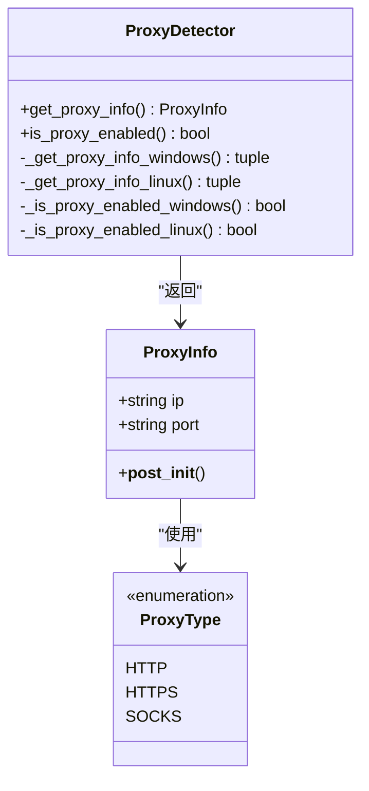

**图表来源**
- [src/proxy.py:27-92](file://src/proxy.py#L27-L92)

**章节来源**
- [src/proxy.py:1-92](file://src/proxy.py#L1-L92)

## 架构概览

### 国际平台适配架构

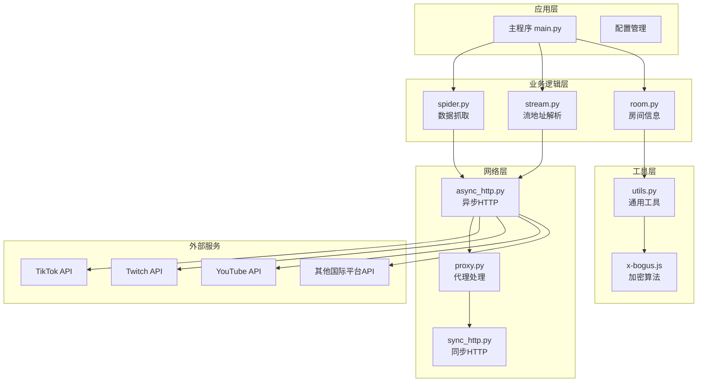

**图表来源**
- [main.py:2000-2155](file://main.py#L2000-L2155)
- [src/spider.py:285-314](file://src/spider.py#L285-L314)
- [src/http_clients/async_http.py:10-46](file://src/http_clients/async_http.py#L10-L46)

### TikTok国际适配流程

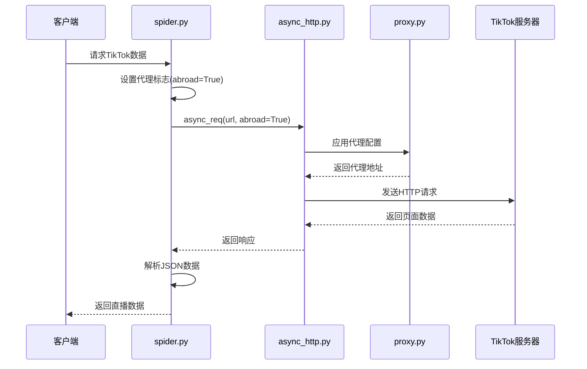

**图表来源**
- [src/spider.py:285-314](file://src/spider.py#L285-L314)
- [src/http_clients/async_http.py:10-46](file://src/http_clients/async_http.py#L10-L46)

**章节来源**
- [src/spider.py:285-314](file://src/spider.py#L285-L314)
- [src/http_clients/async_http.py:10-46](file://src/http_clients/async_http.py#L10-L46)

## 详细组件分析

### TikTok国际平台适配

#### 数据获取机制

TikTok国际适配采用了特殊的请求处理机制来绕过区域限制：

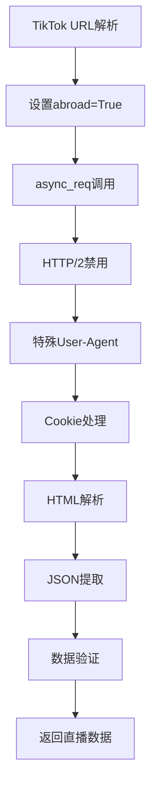

**图表来源**
- [src/spider.py:285-314](file://src/spider.py#L285-L314)

#### 区域封锁处理

项目实现了专门的区域封锁检测和处理机制：

```mermaid
flowchart TD
A[请求TikTok页面] --> B{检查响应内容}
B --> |包含"已停止运营"| C[抛出ConnectionError]
B --> |包含"UNEXPECTED_EOF_WHILE_READING"| D[重试机制]
B --> |正常响应| E[解析JSON数据]
C --> F[提示代理节点区域限制]
D --> A
E --> G[返回直播状态]
```

**图表来源**
- [src/spider.py:295-304](file://src/spider.py#L295-L304)

**章节来源**
- [src/spider.py:285-314](file://src/spider.py#L285-L314)

### Twitch国际平台适配

#### GraphQL API集成

Twitch适配采用了GraphQL API进行数据获取：

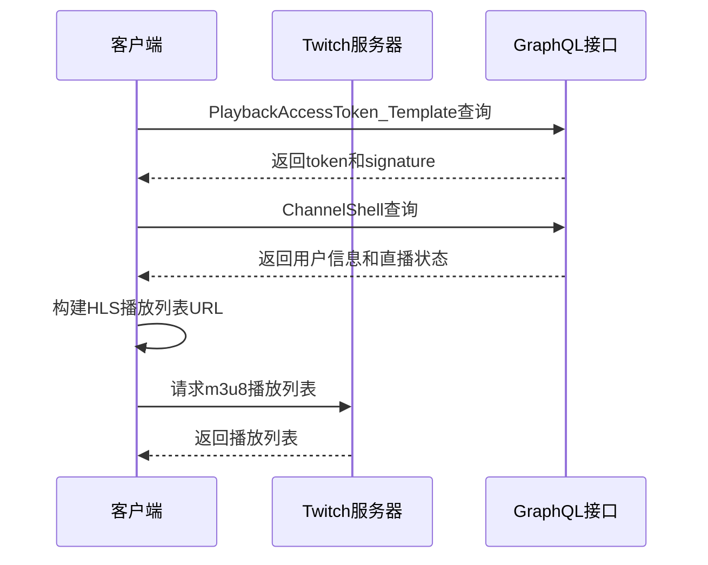

**图表来源**
- [src/spider.py:2154-2205](file://src/spider.py#L2154-L2205)

#### 认证机制处理

Twitch适配实现了完整的认证流程：

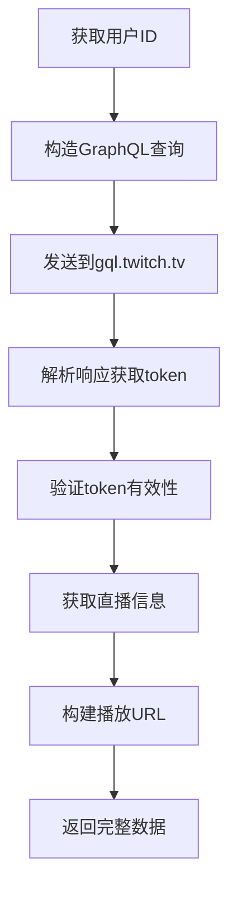

**图表来源**
- [src/spider.py:2102-2205](file://src/spider.py#L2102-L2205)

**章节来源**
- [src/spider.py:2102-2205](file://src/spider.py#L2102-L2205)

### 代理配置与网络适配

#### 代理检测系统


**图表来源**
- [src/proxy.py:27-92](file://src/proxy.py#L27-L92)

#### 代理配置最佳实践

项目提供了灵活的代理配置选项：

**章节来源**
- [src/proxy.py:1-92](file://src/proxy.py#L1-L92)

### 加密算法与安全处理

#### X-Bogus算法实现

项目使用JavaScript实现的X-Bogus算法来处理反爬虫机制：

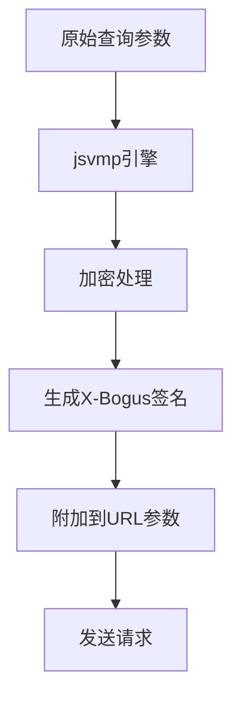

**图表来源**
- [src/javascript/x-bogus.js:500-564](file://src/javascript/x-bogus.js#L500-L564)

**章节来源**
- [src/javascript/x-bogus.js:1-564](file://src/javascript/x-bogus.js#L1-L564)

## 依赖关系分析

### 核心依赖关系

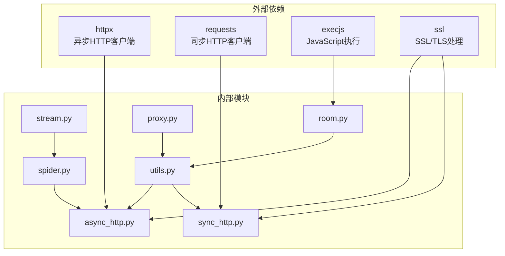

**图表来源**
- [src/http_clients/async_http.py:1-60](file://src/http_clients/async_http.py#L1-L60)
- [src/http_clients/sync_http.py:1-54](file://src/http_clients/sync_http.py#L1-L54)

### 平台特定依赖

不同国际平台有不同的API依赖关系：

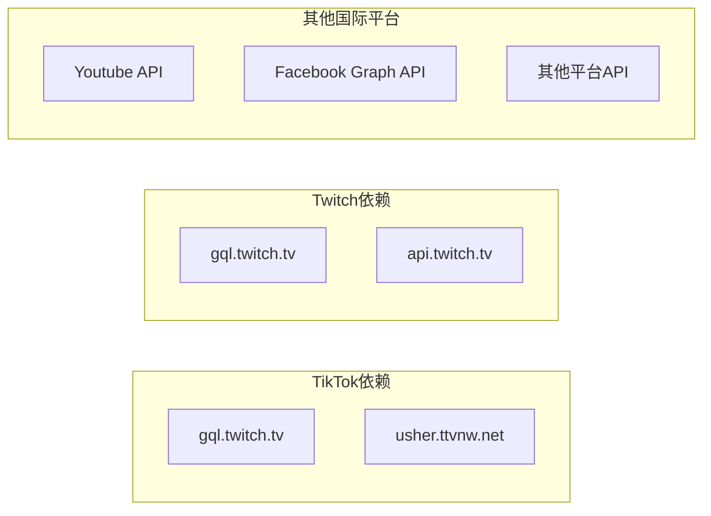

**图表来源**
- [src/spider.py:2154-2205](file://src/spider.py#L2154-L2205)

**章节来源**
- [src/http_clients/async_http.py:1-60](file://src/http_clients/async_http.py#L1-L60)
- [src/http_clients/sync_http.py:1-54](file://src/http_clients/sync_http.py#L1-L54)

## 性能考虑

### 异步处理优化

项目采用了异步HTTP客户端来提高国际平台访问性能：

- **并发请求处理**：使用httpx异步客户端支持并发请求
- **连接池管理**：复用HTTP连接减少建立连接的开销
- **超时控制**：合理的超时设置避免长时间阻塞
- **错误重试**：智能的重试机制提高成功率

### 缓存策略

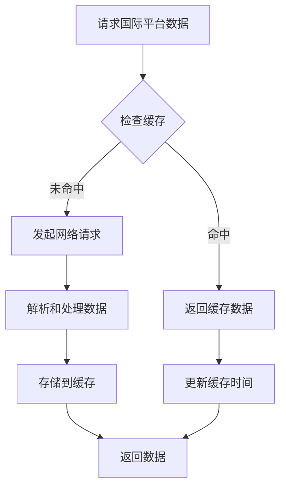

### 网络优化

- **代理池管理**：支持多个代理服务器轮换使用
- **请求头伪装**：模拟真实浏览器请求头
- **CDN优化**：合理利用CDN加速国际访问
- **压缩传输**：支持gzip压缩减少带宽占用

## 故障排除指南

### 常见问题及解决方案

#### 1. 国际平台访问失败

**问题症状**：
- TikTok页面显示"已停止运营"
- 请求超时或连接被拒绝
- 403 Forbidden错误

**解决方法**：
```python
# 检查代理配置
proxy_addr = utils.handle_proxy_addr(proxy_addr)
# 启用abroad模式
await async_req(url, abroad=True, http2=False)
```

**章节来源**
- [src/spider.py:295-304](file://src/spider.py#L295-L304)
- [src/http_clients/async_http.py:10-46](file://src/http_clients/async_http.py#L10-L46)

#### 2. 认证失败问题

**问题症状**：
- Twitch认证token无效
- Cookie过期
- API访问权限不足

**解决方法**：
```python
# 检查认证流程
headers['Client-Integrity'] = token
headers['Client-Id'] = 'kimne78kx3ncx6brgo4mv6wki5h1ko'
# 验证Cookie有效性
if cookies:
    headers['Cookie'] = cookies
```

**章节来源**
- [src/spider.py:2102-2205](file://src/spider.py#L2102-L2205)

#### 3. 网络连接问题

**问题症状**：
- 代理连接失败
- DNS解析错误
- SSL证书验证失败

**解决方法**：
```python
# 配置SSL上下文
ssl_context = ssl.create_default_context()
ssl_context.check_hostname = False
ssl_context.verify_mode = ssl.CERT_NONE

# 检查代理可用性
pd = ProxyDetector()
if pd.is_proxy_enabled():
    proxy_info = pd.get_proxy_info()
```

**章节来源**
- [src/http_clients/async_http.py:34-46](file://src/http_clients/async_http.py#L34-L46)
- [src/proxy.py:45-74](file://src/proxy.py#L45-L74)

### 调试和监控

#### 日志记录

项目提供了详细的日志记录机制：

```python
# 错误追踪装饰器
@trace_error_decorator
def wrapper(*args, **kwargs):
    try:
        return func(*args, **kwargs)
    except Exception as e:
        error_line = traceback.extract_tb(e.__traceback__).tb_lineno
        logger.error(f"message: type: {type(e).__name__}, {str(e)} in function {func.__name__} at line: {error_line}")
```

#### 性能监控

```python
# 响应状态检查
async def get_response_status(url, proxy_addr=None, http2=False):
    try:
        proxy_addr = utils.handle_proxy_addr(proxy_addr)
        async with httpx.AsyncClient(proxy=proxy_addr, timeout=timeout) as client:
            response = await client.head(url, follow_redirects=True)
            return response.status_code == 200
    except Exception as e:
        return False
```

**章节来源**
- [src/utils.py:38-51](file://src/utils.py#L38-L51)
- [src/http_clients/async_http.py:49-59](file://src/http_clients/async_http.py#L49-L59)

## 结论

DouyinLiveRecorder的国际平台适配模块展现了现代网络爬虫技术的复杂性和挑战性。通过精心设计的架构和多种技术手段，项目成功解决了国际直播平台访问的各种难题。

### 主要成就

1. **多平台支持**：支持超过50个直播平台，包括国内外主流平台
2. **智能代理**：完善的代理检测和配置系统
3. **安全防护**：有效的反爬虫机制应对
4. **性能优化**：异步处理和缓存策略提升效率
5. **故障恢复**：健壮的错误处理和重试机制

### 技术亮点

- **国际平台适配**：专门针对TikTok、Twitch等国际平台的优化
- **代理系统**：跨平台代理检测和配置
- **加密算法**：X-Bogus算法处理复杂的反爬虫机制
- **异步架构**：高效的并发处理能力
- **配置灵活**：支持多种配置选项和自定义设置

### 未来发展方向

1. **AI辅助**：引入机器学习识别新的反爬虫技术
2. **云服务集成**：支持云端代理和分布式处理
3. **实时监控**：增强的监控和告警系统
4. **API标准化**：统一的平台API接口规范
5. **安全性增强**：更高级别的安全防护措施

该项目为国际直播平台的数据获取提供了一个完整的技术解决方案，展示了如何在复杂的网络环境下实现稳定可靠的数据采集系统。