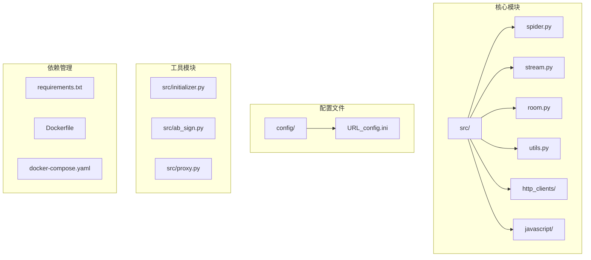
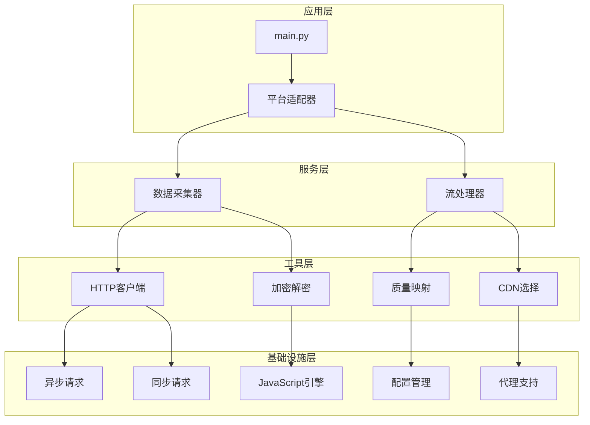
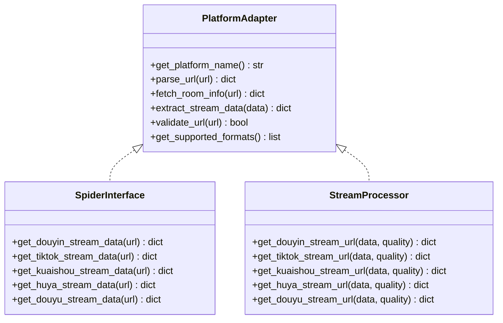
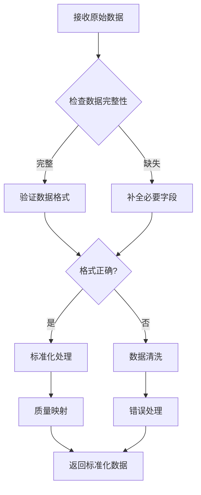
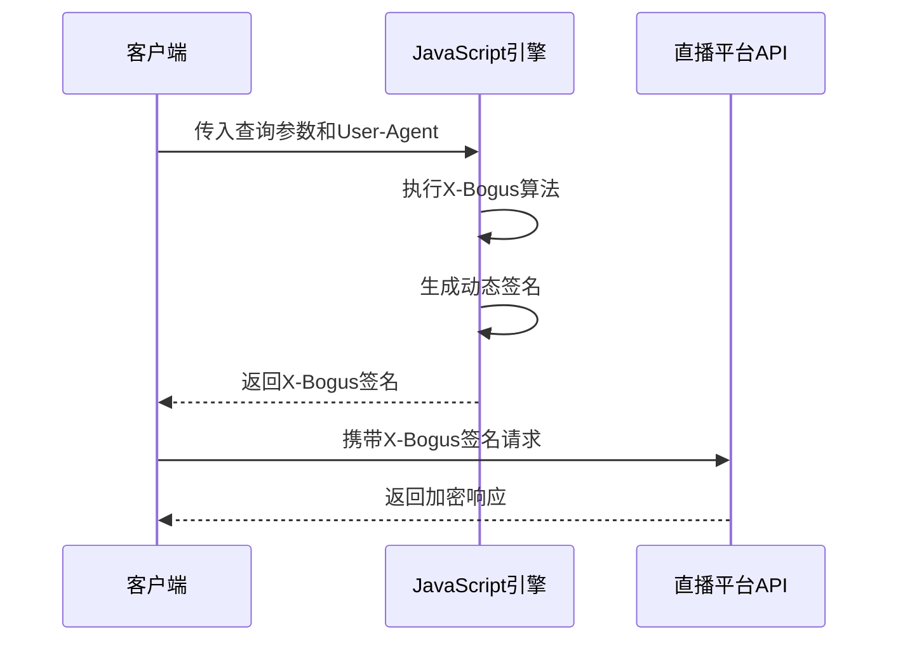
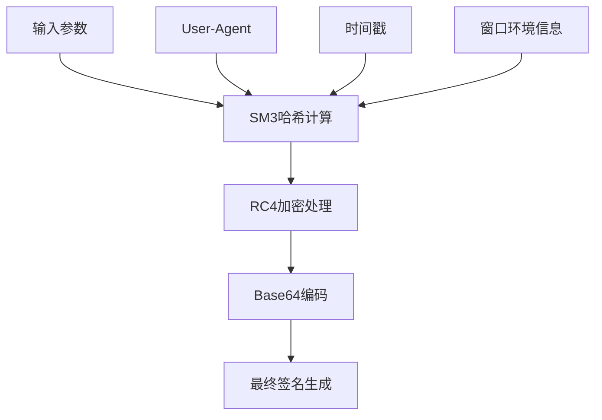
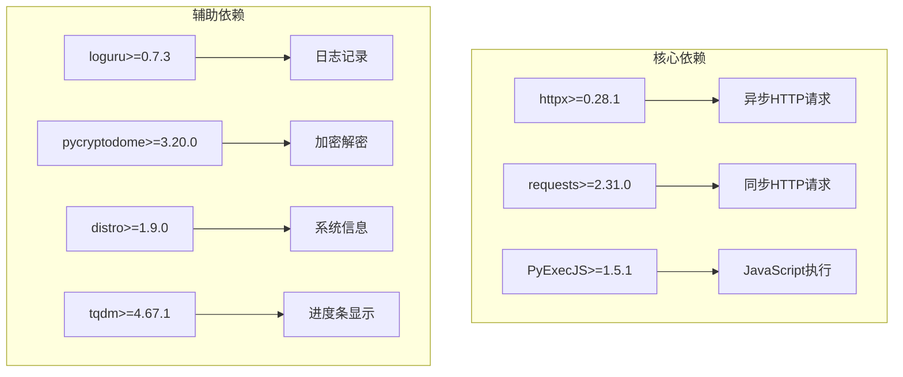
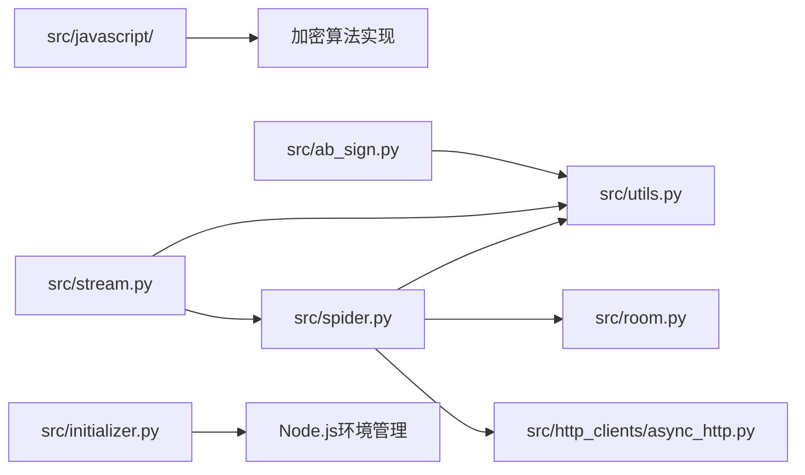
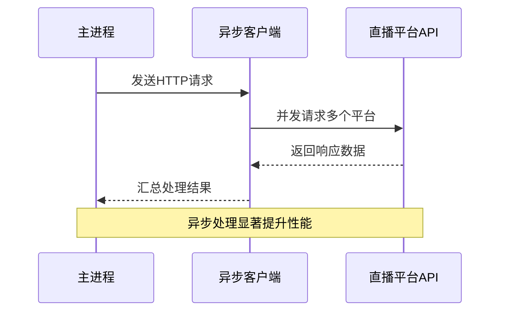
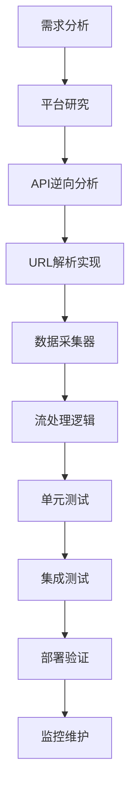

# 平台扩展指南

<cite>
**本文档引用的文件**
- [README.md](file://README.md)
- [src/__init__.py](file://src/__init__.py)
- [src/room.py](file://src/room.py)
- [src/spider.py](file://src/spider.py)
- [src/stream.py](file://src/stream.py)
- [src/utils.py](file://src/utils.py)
- [src/initializer.py](file://src/initializer.py)
- [src/http_clients/async_http.py](file://src/http_clients/async_http.py)
- [src/http_clients/sync_http.py](file://src/http_clients/sync_http.py)
- [src/ab_sign.py](file://src/ab_sign.py)
- [src/proxy.py](file://src/proxy.py)
- [src/javascript/x-bogus.js](file://src/javascript/x-bogus.js)
- [src/javascript/taobao-sign.js](file://src/javascript/taobao-sign.js)
- [src/javascript/haixiu.js](file://src/javascript/haixiu.js)
- [src/javascript/liveme.js](file://src/javascript/liveme.js)
- [config/URL_config.ini](file://config/URL_config.ini)
- [requirements.txt](file://requirements.txt)
</cite>

## 目录
1. [简介](#简介)
2. [项目结构](#项目结构)
3. [核心组件](#核心组件)
4. [架构概览](#架构概览)
5. [详细组件分析](#详细组件分析)
6. [依赖关系分析](#依赖关系分析)
7. [性能考虑](#性能考虑)
8. [故障排除指南](#故障排除指南)
9. [结论](#结论)
10. [附录](#附录)

## 简介

DouyinLiveRecorder是一个功能强大的直播录制工具，支持超过50个直播平台。本文档为平台扩展开发提供详细的指导，涵盖新直播平台接入的完整开发流程，包括URL解析规则分析、API接口逆向工程、数据结构提取方法和反爬虫机制应对策略。

该工具采用模块化设计，支持异步HTTP请求、JavaScript加密解密、代理管理和日志记录等功能。开发者可以通过遵循本文档提供的标准接口规范和最佳实践，快速实现新平台支持。

## 项目结构

项目采用清晰的模块化架构，主要包含以下核心目录：



**图表来源**
- [src/__init__.py:1-15](file://src/__init__.py#L1-L15)
- [src/spider.py:1-50](file://src/spider.py#L1-L50)
- [src/stream.py:1-30](file://src/stream.py#L1-L30)

**章节来源**
- [README.md:72-100](file://README.md#L72-L100)
- [src/__init__.py:1-15](file://src/__init__.py#L1-L15)

## 核心组件

### 数据采集层 (Spider Layer)

数据采集层负责从各个直播平台抓取直播数据，包含以下关键组件：

#### URL解析器
- 支持多种URL格式识别
- 自动解析平台特定参数
- 处理重定向和短链接

#### 平台适配器
- 每个平台都有专门的数据获取函数
- 统一的返回数据格式
- 错误处理和重试机制

#### 加密解密模块
- X-Bogus算法实现
- AB测试签名生成
- 平台特定的加密算法

**章节来源**
- [src/spider.py:68-282](file://src/spider.py#L68-L282)
- [src/room.py:42-144](file://src/room.py#L42-L144)
- [src/ab_sign.py:444-455](file://src/ab_sign.py#L444-L455)

### 数据处理层 (Stream Layer)

数据处理层负责处理和标准化直播流数据：

#### 流URL提取器
- 支持多种流格式 (HLS, FLV, RTMP)
- 自动质量选择和切换
- CDN节点智能选择

#### 质量映射系统
- 标准化的质量级别定义
- 自适应码率处理
- 兼容性处理

**章节来源**
- [src/stream.py:40-153](file://src/stream.py#L40-L153)
- [src/stream.py:209-378](file://src/stream.py#L209-L378)

### 工具支持层 (Utility Layer)

工具支持层提供各种辅助功能：

#### HTTP客户端
- 异步HTTP请求支持
- 同步HTTP请求支持
- 代理和认证处理

#### 日志和配置管理
- 结构化日志记录
- 配置文件管理
- 错误追踪和调试

**章节来源**
- [src/http_clients/async_http.py:10-60](file://src/http_clients/async_http.py#L10-L60)
- [src/http_clients/sync_http.py:20-89](file://src/http_clients/sync_http.py#L20-L89)
- [src/utils.py:38-52](file://src/utils.py#L38-L52)

## 架构概览

系统采用分层架构设计，确保模块间的松耦合和高内聚：



**图表来源**
- [src/spider.py:1-50](file://src/spider.py#L1-L50)
- [src/stream.py:1-30](file://src/stream.py#L1-L30)
- [src/http_clients/async_http.py:10-47](file://src/http_clients/async_http.py#L10-L47)

## 详细组件分析

### 平台适配器标准接口规范

#### 接口定义
每个平台适配器必须实现统一的接口规范：



**图表来源**
- [src/spider.py:68-827](file://src/spider.py#L68-L827)
- [src/stream.py:40-446](file://src/stream.py#L40-L446)

#### 数据格式标准化要求

所有平台适配器必须返回标准化的数据格式：

| 字段名称 | 类型 | 描述 | 示例 |
|---------|------|------|------|
| `anchor_name` | str | 主播名称 | "张三" |
| `is_live` | bool | 是否直播中 | True |
| `title` | str | 直播标题 | "周末游戏直播" |
| `quality` | str | 当前质量等级 | "HD" |
| `m3u8_url` | str | HLS流地址 | "https://example.com/live.m3u8" |
| `flv_url` | str | FLV流地址 | "https://example.com/live.flv" |
| `record_url` | str | 录制使用的URL | "https://example.com/live.m3u8" |

#### 兼容性处理方案



**图表来源**
- [src/stream.py:29-78](file://src/stream.py#L29-L78)
- [src/spider.py:411-446](file://src/spider.py#L411-L446)

**章节来源**
- [src/spider.py:68-827](file://src/spider.py#L68-L827)
- [src/stream.py:40-446](file://src/stream.py#L40-L446)

### URL解析规则分析

#### URL模式识别
系统支持多种URL格式：

```mermaid
flowchart LR
A[直播URL] --> B{URL类型判断}
B --> |抖音| C[https://live.douyin.com/room_id]
B --> |TikTok| D[https://www.tiktok.com/@username/live]
B --> |快手| E[https://live.kuaishou.com/u/user_id]
B --> |虎牙| F[https://www.huya.com/room_id]
B --> |斗鱼| G[https://www.douyu.com/room_id]
B --> |其他| H[平台特定格式]
C --> I[提取房间ID]
D --> I
E --> I
F --> I
G --> I
H --> I
```

**图表来源**
- [src/spider.py:286-313](file://src/spider.py#L286-L313)
- [src/spider.py:316-404](file://src/spider.py#L316-L404)

#### 参数提取机制
```python
# URL参数提取示例
def get_params(url: str, params: str) -> OptionalStr:
    parsed_url = urllib.parse.urlparse(url)
    query_params = urllib.parse.parse_qs(parsed_url.query)
    
    if params in query_params:
        return query_params[params][0]
```

**章节来源**
- [src/spider.py:42-49](file://src/spider.py#L42-L49)
- [src/room.py:78-105](file://src/room.py#L78-L105)

### API接口逆向工程

#### 加密算法实现

##### X-Bogus算法
X-Bogus算法用于生成动态签名：



**图表来源**
- [src/room.py:42-48](file://src/room.py#L42-L48)
- [src/javascript/x-bogus.js:500-564](file://src/javascript/x-bogus.js#L500-L564)

##### AB测试签名生成
AB测试签名用于绕过平台的反爬虫检测：



**图表来源**
- [src/ab_sign.py:293-455](file://src/ab_sign.py#L293-L455)

**章节来源**
- [src/room.py:42-48](file://src/room.py#L42-L48)
- [src/ab_sign.py:444-455](file://src/ab_sign.py#L444-L455)

### 反爬虫机制应对策略

#### 动态请求头生成
```python
# 动态User-Agent生成
HEADERS = {
    'User-Agent': 'Mozilla/5.0 (Linux; Android 11; SAMSUNG SM-G973U) AppleWebKit/537.36',
    'Accept-Language': 'zh-CN,zh;q=0.8,zh-TW;q=0.7,zh-HK;q=0.5,en-US;q=0.3,en;q=0.2',
    'Cookie': 's_v_web_id=verify_lk07kv74_QZYCUApD_xhiB_405x_Ax51_GYO9bUIyZQVf'
}
```

#### 请求频率控制
- 实现指数退避算法
- 随机延迟生成
- IP轮换机制

#### 代理支持
```python
# 代理配置示例
def handle_proxy_addr(proxy_addr):
    if proxy_addr:
        if not proxy_addr.startswith('http'):
            proxy_addr = 'http://' + proxy_addr
    else:
        proxy_addr = None
    return proxy_addr
```

**章节来源**
- [src/room.py:25-39](file://src/room.py#L25-L39)
- [src/utils.py:162-168](file://src/utils.py#L162-L168)
- [src/proxy.py:27-93](file://src/proxy.py#L27-L93)

## 依赖关系分析

### 外部依赖管理

系统依赖管理采用requirements.txt文件统一管理：



**图表来源**
- [requirements.txt:1-7](file://requirements.txt#L1-L7)

### 内部模块依赖



**图表来源**
- [src/spider.py:27-32](file://src/spider.py#L27-L32)
- [src/stream.py:20-24](file://src/stream.py#L20-L24)

**章节来源**
- [requirements.txt:1-7](file://requirements.txt#L1-L7)
- [src/spider.py:27-32](file://src/spider.py#L27-L32)

## 性能考虑

### 异步处理优化

系统采用异步编程模型提高并发性能：



### 缓存策略
- URL解析结果缓存
- 加密密钥缓存
- 流地址缓存

### 资源管理
- 连接池复用
- 内存使用监控
- 文件句柄管理

## 故障排除指南

### 常见问题诊断

#### 网络连接问题
```python
# 错误处理装饰器
@trace_error_decorator
def wrapper(*args: list, **kwargs: dict) -> Any:
    try:
        return func(*args, **kwargs)
    except execjs.ProgramError:
        logger.warning('JavaScript执行失败')
    except Exception as e:
        error_line = traceback.extract_tb(e.__traceback__)[-1].lineno
        error_info = f"message: type: {type(e).__name__}, {str(e)} in function {func.__name__} at line: {error_line}"
        logger.error(error_info)
        return []
```

#### 平台兼容性问题
- 检查User-Agent兼容性
- 验证Cookie有效性
- 确认API版本支持

**章节来源**
- [src/utils.py:38-51](file://src/utils.py#L38-L51)
- [src/spider.py:144-141](file://src/spider.py#L144-L141)

### 调试技巧

#### 日志分析
- 启用详细日志模式
- 分析请求响应时间
- 监控错误发生频率

#### 网络抓包
- 使用浏览器开发者工具
- 分析API请求结构
- 识别必要的请求头

## 结论

DouyinLiveRecorder平台扩展开发提供了完整的框架和工具集，使开发者能够高效地集成新的直播平台。通过遵循本文档提供的标准接口规范、数据格式标准化要求和兼容性处理方案，开发者可以快速实现新平台支持。

关键成功因素包括：
- 严格遵守接口规范
- 完善的错误处理机制
- 有效的反爬虫应对策略
- 性能优化和资源管理
- 全面的测试和调试流程

## 附录

### 开发最佳实践

#### 代码组织
- 每个平台创建独立模块
- 统一的错误处理模式
- 完善的文档注释

#### 测试策略
- 单元测试覆盖
- 集成测试验证
- 性能基准测试

#### 部署考虑
- Docker容器化支持
- 环境变量配置
- 日志轮转管理

### 扩展开发流程

