# 平台适配器

<cite>
**本文档引用的文件**
- [main.py](file://main.py)
- [spider.py](file://src/spider.py)
- [stream.py](file://src/stream.py)
- [room.py](file://src/room.py)
- [utils.py](file://src/utils.py)
- [async_http.py](file://src/http_clients/async_http.py)
- [ab_sign.py](file://src/ab_sign.py)
- [x-bogus.js](file://src/javascript/x-bogus.js)
- [URL_config.ini](file://config/URL_config.ini)
- [requirements.txt](file://requirements.txt)
- [README.md](file://README.md)
- [demo.py](file://demo.py)
</cite>

## 目录
1. [简介](#简介)
2. [项目结构](#项目结构)
3. [核心组件](#核心组件)
4. [架构概览](#架构概览)
5. [详细组件分析](#详细组件分析)
6. [依赖分析](#依赖分析)
7. [性能考虑](#性能考虑)
8. [故障排除指南](#故障排除指南)
9. [结论](#结论)
10. [附录](#附录)

## 简介

DouyinLiveRecorder是一个支持多平台直播录制的工具，涵盖了国内外主要直播平台。本文档专注于平台适配器模块，深入解析各直播平台的数据获取方法，包括抖音(Douyin)、快手(Kuaishou)、虎牙(Huya)、斗鱼(Douyu)、B站(Bilibili)、小红书(Xiaohongshu)、TikTok、Twitch等平台的API调用机制。

该系统采用异步架构设计，通过统一的适配器模式实现对不同直播平台的标准化处理，支持反爬虫策略和错误处理机制，为新平台接入提供了完整的扩展指南。

## 项目结构

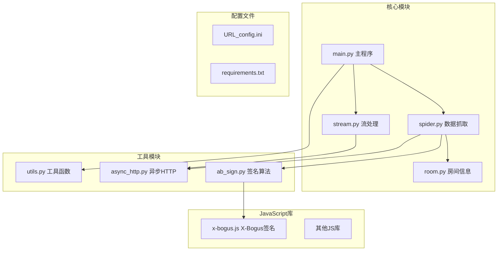

**图表来源**
- [main.py:1-800](file://main.py#L1-L800)
- [spider.py:1-800](file://src/spider.py#L1-L800)
- [stream.py:1-446](file://src/stream.py#L1-L446)

**章节来源**
- [main.py:1-800](file://main.py#L1-L800)
- [README.md:72-100](file://README.md#L72-L100)

## 核心组件

### 平台适配器架构

系统采用分层架构设计，通过统一的适配器接口处理不同平台的差异：

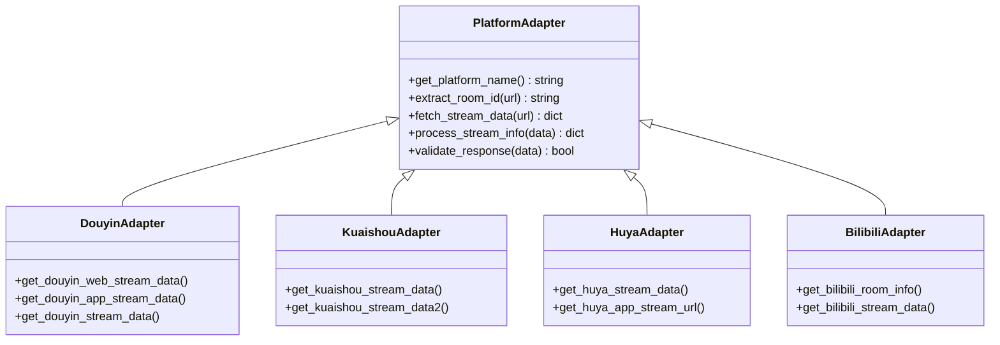

**图表来源**
- [spider.py:68-282](file://src/spider.py#L68-L282)
- [spider.py:316-404](file://src/spider.py#L316-L404)
- [spider.py:408-517](file://src/spider.py#L408-L517)
- [spider.py:677-766](file://src/spider.py#L677-L766)

### 数据流处理管道

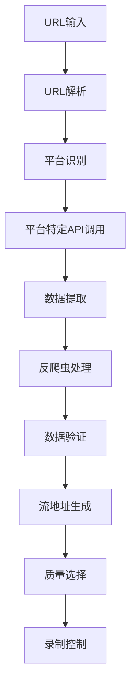

**图表来源**
- [main.py:545-800](file://main.py#L545-L800)
- [spider.py:1-800](file://src/spider.py#L1-L800)

**章节来源**
- [spider.py:1-800](file://src/spider.py#L1-L800)
- [stream.py:1-446](file://src/stream.py#L1-L446)

## 架构概览

### 整体架构设计

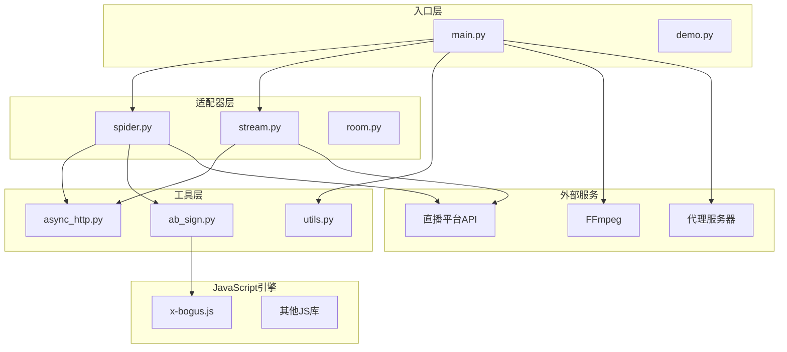

**图表来源**
- [main.py:1-800](file://main.py#L1-L800)
- [spider.py:1-800](file://src/spider.py#L1-L800)
- [stream.py:1-446](file://src/stream.py#L1-L446)

### 异步处理流程

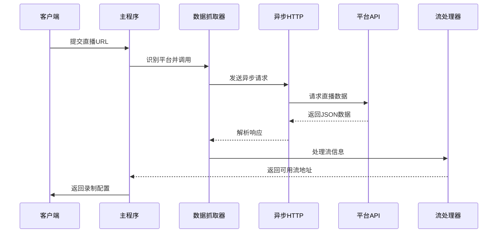

**图表来源**
- [main.py:545-800](file://main.py#L545-L800)
- [async_http.py:10-60](file://src/http_clients/async_http.py#L10-L60)

**章节来源**
- [main.py:1-800](file://main.py#L1-L800)
- [async_http.py:1-60](file://src/http_clients/async_http.py#L1-L60)

## 详细组件分析

### 抖音平台适配器

#### 数据获取策略

抖音平台提供了多种数据获取方式，系统根据URL类型自动选择最优方案：

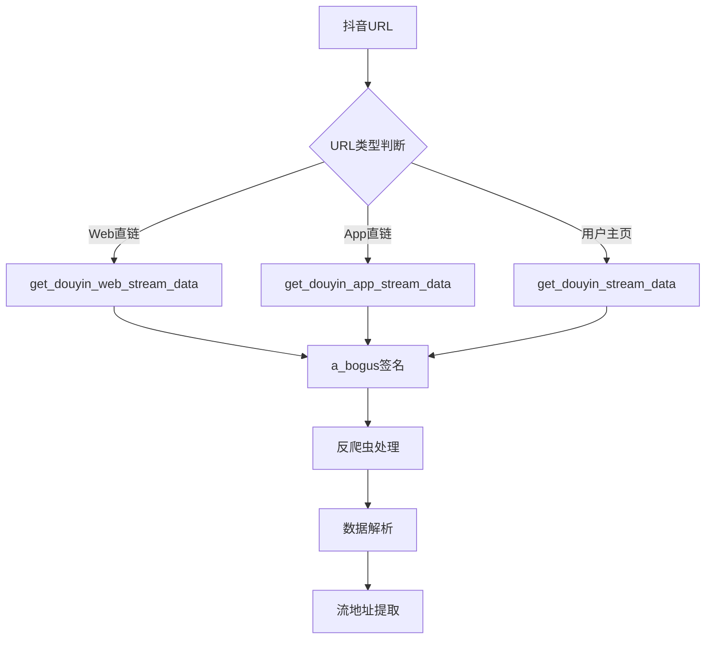

**图表来源**
- [spider.py:68-282](file://src/spider.py#L68-L282)
- [spider.py:144-226](file://src/spider.py#L144-L226)
- [spider.py:230-282](file://src/spider.py#L230-L282)

#### 反爬虫处理机制

抖音平台采用了多重反爬虫措施：

1. **X-Bogus签名算法**：使用JavaScript引擎计算动态签名
2. **a_bogus参数**：基于查询参数和User-Agent生成的动态参数
3. **Cookie管理**：自动处理登录状态和会话信息

**章节来源**
- [spider.py:68-282](file://src/spider.py#L68-L282)
- [ab_sign.py:444-455](file://src/ab_sign.py#L444-L455)
- [x-bogus.js:500-564](file://src/javascript/x-bogus.js#L500-L564)

### 快手平台适配器

#### 多版本兼容策略

快手平台提供了两种数据获取方式：

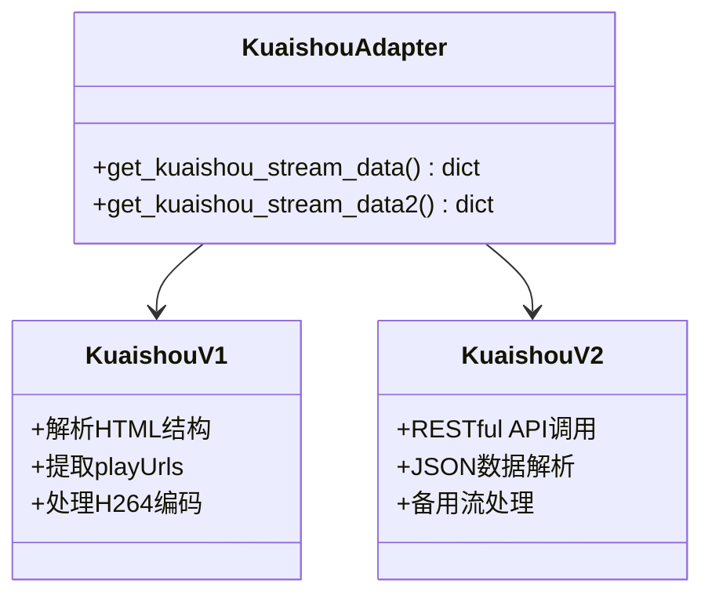

**图表来源**
- [spider.py:316-404](file://src/spider.py#L316-L404)
- [spider.py:365-404](file://src/spider.py#L365-L404)

**章节来源**
- [spider.py:316-404](file://src/spider.py#L316-L404)

### 虎牙平台适配器

#### CDN优选策略

虎牙平台支持多家CDN提供商，系统实现了智能优选机制：

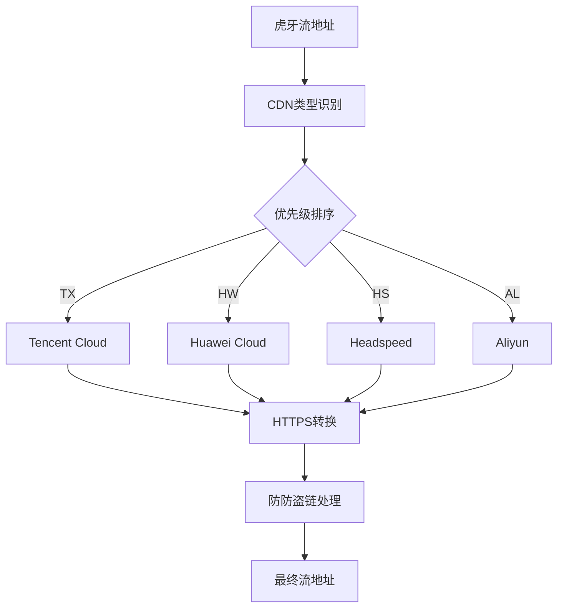

**图表来源**
- [spider.py:425-517](file://src/spider.py#L425-L517)

#### 防盗链机制

虎牙平台采用了复杂的防盗链机制：

1. **Anti-Code参数**：动态生成的访问令牌
2. **CDN参数**：包含时间戳、序列号等安全参数
3. **协议升级**：自动将HTTP升级为HTTPS

**章节来源**
- [spider.py:425-517](file://src/spider.py#L425-L517)

### B站平台适配器

#### 多接口协调

B站平台采用了分层接口设计：

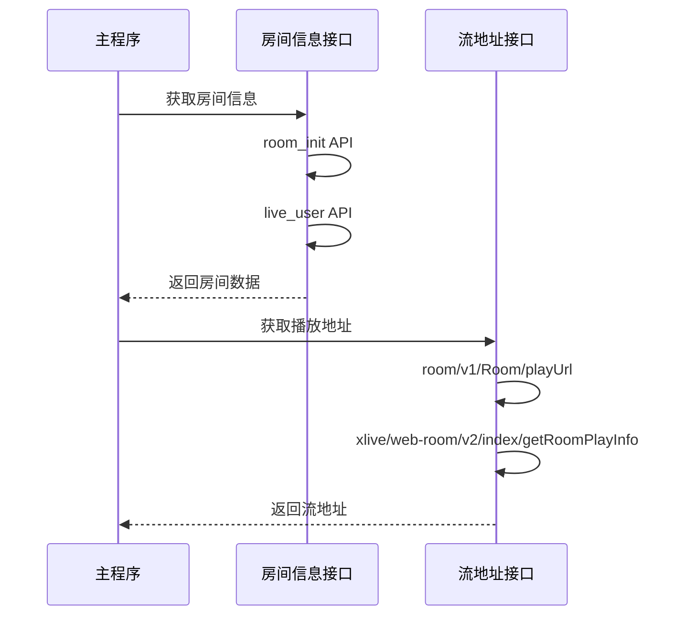

**图表来源**
- [spider.py:677-703](file://src/spider.py#L677-L703)
- [spider.py:707-766](file://src/spider.py#L707-L766)

**章节来源**
- [spider.py:677-766](file://src/spider.py#L677-L766)

### 小红书平台适配器

#### 动态URL处理

小红书平台采用了动态URL跳转机制：

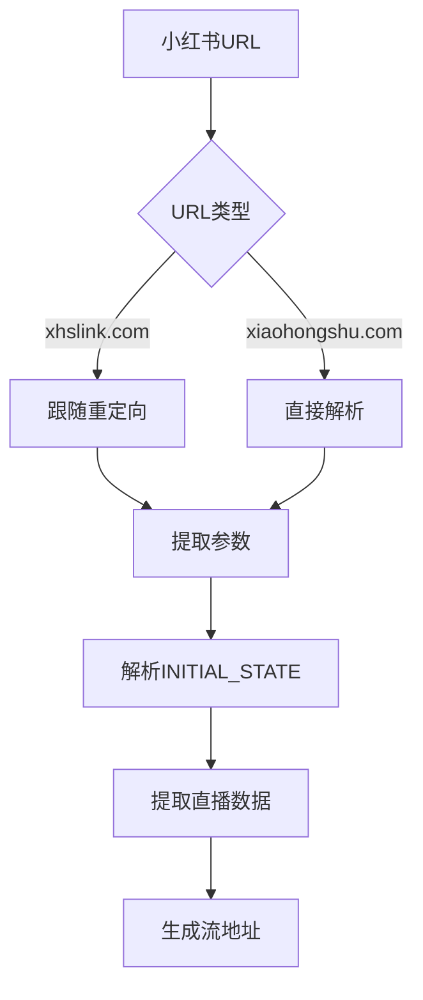

**图表来源**
- [spider.py:769-800](file://src/spider.py#L769-L800)

**章节来源**
- [spider.py:769-800](file://src/spider.py#L769-L800)

### TikTok平台适配器

#### 海外网络适配

TikTok平台需要特殊的网络配置：

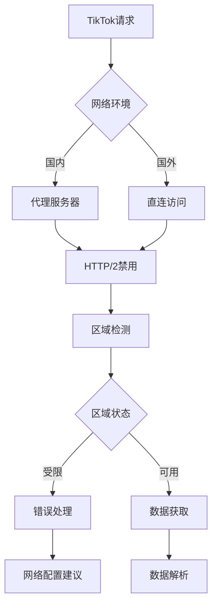

**图表来源**
- [spider.py:286-313](file://src/spider.py#L286-L313)

**章节来源**
- [spider.py:286-313](file://src/spider.py#L286-L313)

## 依赖分析

### 核心依赖关系

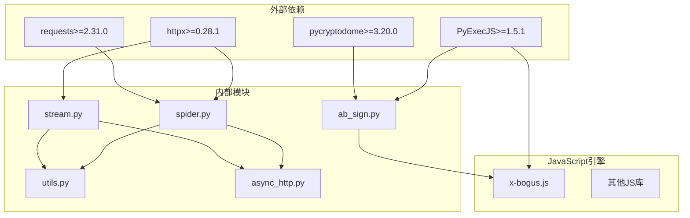

**图表来源**
- [requirements.txt:1-7](file://requirements.txt#L1-L7)
- [async_http.py:1-60](file://src/http_clients/async_http.py#L1-L60)

### 依赖注入模式

系统采用了依赖注入的设计模式：

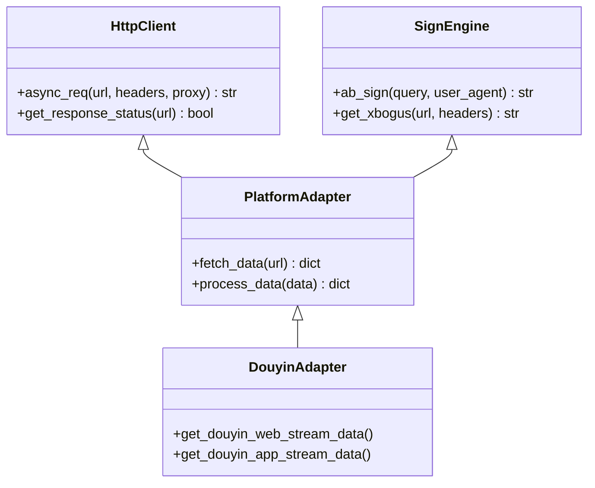

**图表来源**
- [async_http.py:10-60](file://src/http_clients/async_http.py#L10-L60)
- [ab_sign.py:444-455](file://src/ab_sign.py#L444-L455)

**章节来源**
- [requirements.txt:1-7](file://requirements.txt#L1-L7)
- [async_http.py:1-60](file://src/http_clients/async_http.py#L1-L60)

## 性能考虑

### 异步并发控制

系统实现了智能的并发控制机制：

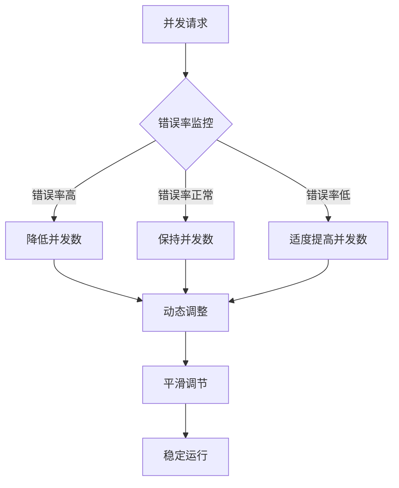

**图表来源**
- [main.py:298-325](file://main.py#L298-L325)

### 缓存策略

系统采用了多层次的缓存机制：

1. **HTTP缓存**：利用HTTP头信息控制缓存
2. **内存缓存**：缓存最近使用的流地址
3. **配置缓存**：缓存平台特定的配置信息

**章节来源**
- [main.py:298-325](file://main.py#L298-L325)

## 故障排除指南

### 常见问题诊断

#### 网络连接问题

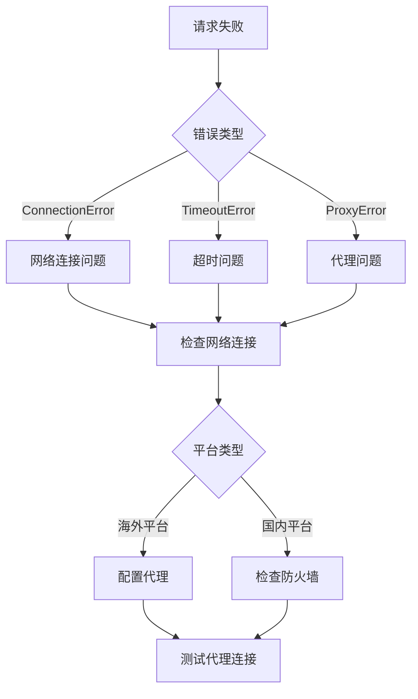

**图表来源**
- [spider.py:286-313](file://src/spider.py#L286-L313)

#### 反爬虫对策

1. **User-Agent轮换**：定期更换浏览器标识
2. **请求频率控制**：避免过于频繁的请求
3. **Cookie管理**：保持登录状态的有效性
4. **代理池管理**：使用多个代理IP地址

**章节来源**
- [spider.py:1-800](file://src/spider.py#L1-L800)

### 调试技巧

#### 日志分析

系统提供了详细的日志记录功能：

```python
# 示例：获取详细错误信息
logger.error(f"message: type: {type(e).__name__}, {str(e)} in function {func.__name__} at line: {error_line}")
```

#### 调试模式

启用调试模式可以获取更详细的信息：

1. **环境变量设置**：`DEBUG=1`
2. **命令行参数**：`--debug`
3. **配置文件**：设置日志级别为DEBUG

## 结论

DouyinLiveRecorder平台适配器模块展现了优秀的架构设计和实现质量。通过统一的适配器模式，系统成功地抽象了不同直播平台的差异，提供了稳定可靠的数据获取能力。

### 主要优势

1. **模块化设计**：清晰的职责分离和接口定义
2. **异步处理**：高效的并发处理能力
3. **反爬虫策略**：完善的防护机制
4. **错误处理**：健壮的异常处理机制
5. **扩展性**：易于添加新平台支持

### 技术亮点

1. **X-Bogus签名算法**：复杂的安全防护机制
2. **智能CDN优选**：优化的流地址选择策略
3. **动态代理管理**：灵活的网络配置能力
4. **多格式支持**：全面的直播格式兼容性

该系统为直播录制领域提供了一个高质量的技术解决方案，具有良好的学习价值和实用价值。

## 附录

### 平台支持列表

系统支持以下直播平台：

**国内平台**：
- 抖音、快手、虎牙、斗鱼、YY、B站、小红书
- Bigo、Blued、网易CC、千度热播、猫耳FM
- Look、TwitCasting、百度、微博、酷狗、花椒
- 流星、Acfun、畅聊、映客、音播、知乎、嗨秀
- VV星球、17Live、浪Live、飘飘、六间房、乐嗨
- 花猫、淘宝、京东、咪咕、连接、来秀

**海外平台**：
- TikTok、SOOP、PandaTV、WinkTV、FlexTV、PopkonTV
- TwitchTV、LiveMe、ShowRoom、CHZZK、Shopee、YouTube
- Faceit、Picarto

### 新平台接入指南

#### 接入步骤

1. **需求分析**：分析目标平台的API特点和限制
2. **技术调研**：研究平台的反爬虫机制和数据结构
3. **接口开发**：实现平台特定的数据获取函数
4. **测试验证**：进行全面的功能和性能测试
5. **文档编写**：更新相关文档和配置说明

#### 数据格式标准化

```python
# 标准化的返回数据结构
{
    "anchor_name": "主播名称",
    "is_live": True,
    "title": "直播标题",
    "quality": "OD",
    "m3u8_url": "m3u8流地址",
    "flv_url": "flv流地址",
    "record_url": "录制地址"
}
```

#### 兼容性处理

1. **URL解析**：支持多种URL格式和参数
2. **数据验证**：确保返回数据的完整性和正确性
3. **错误处理**：优雅处理各种异常情况
4. **性能优化**：平衡请求频率和成功率

**章节来源**
- [README.md:15-68](file://README.md#L15-L68)
- [demo.py:8-210](file://demo.py#L8-L210)