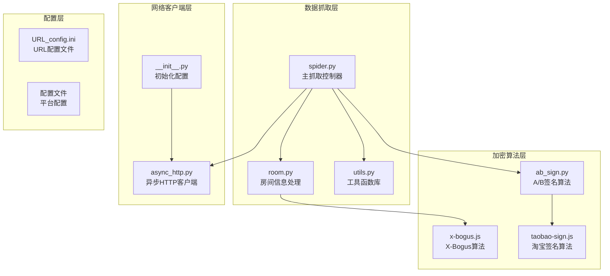
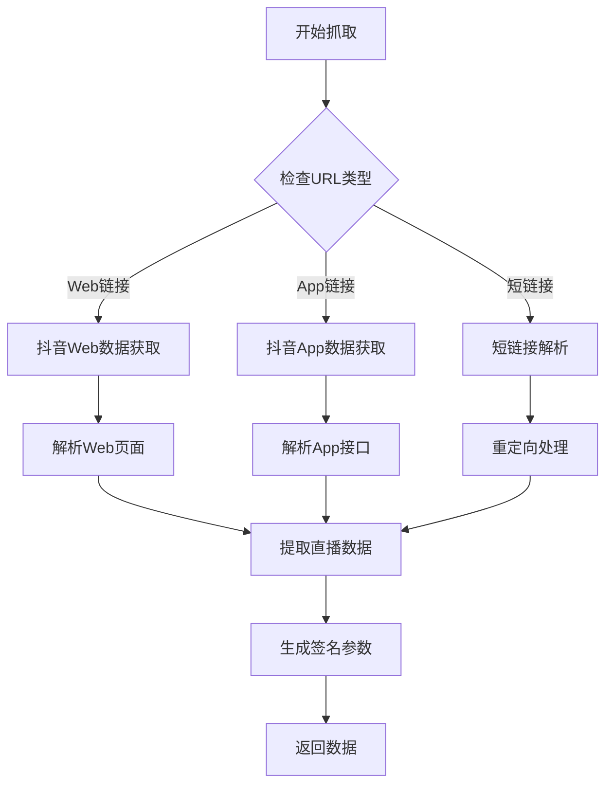
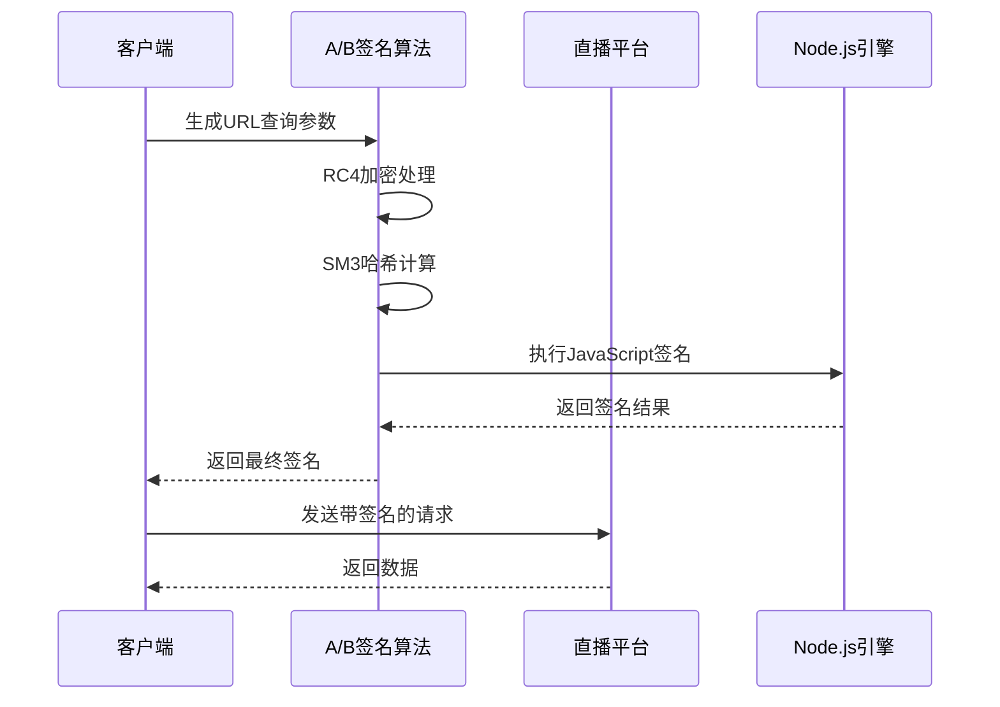
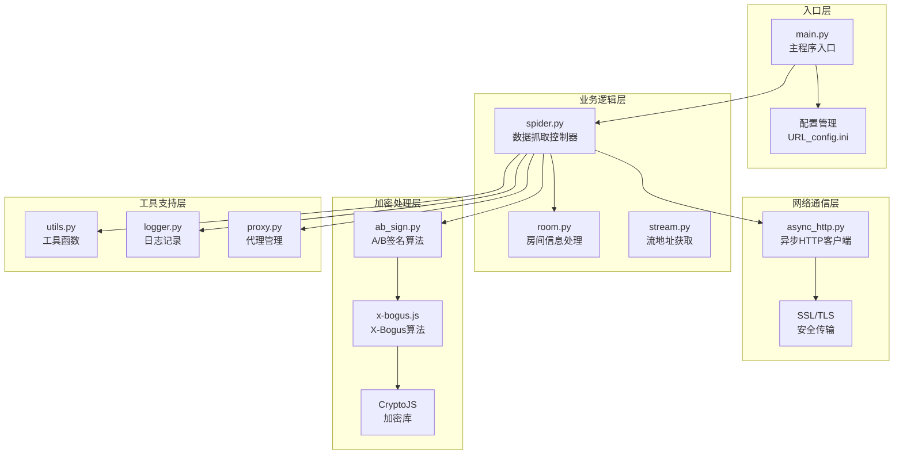
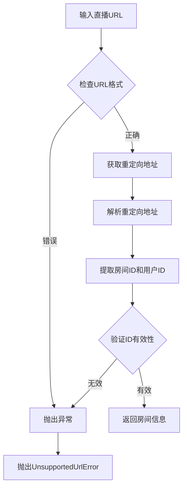
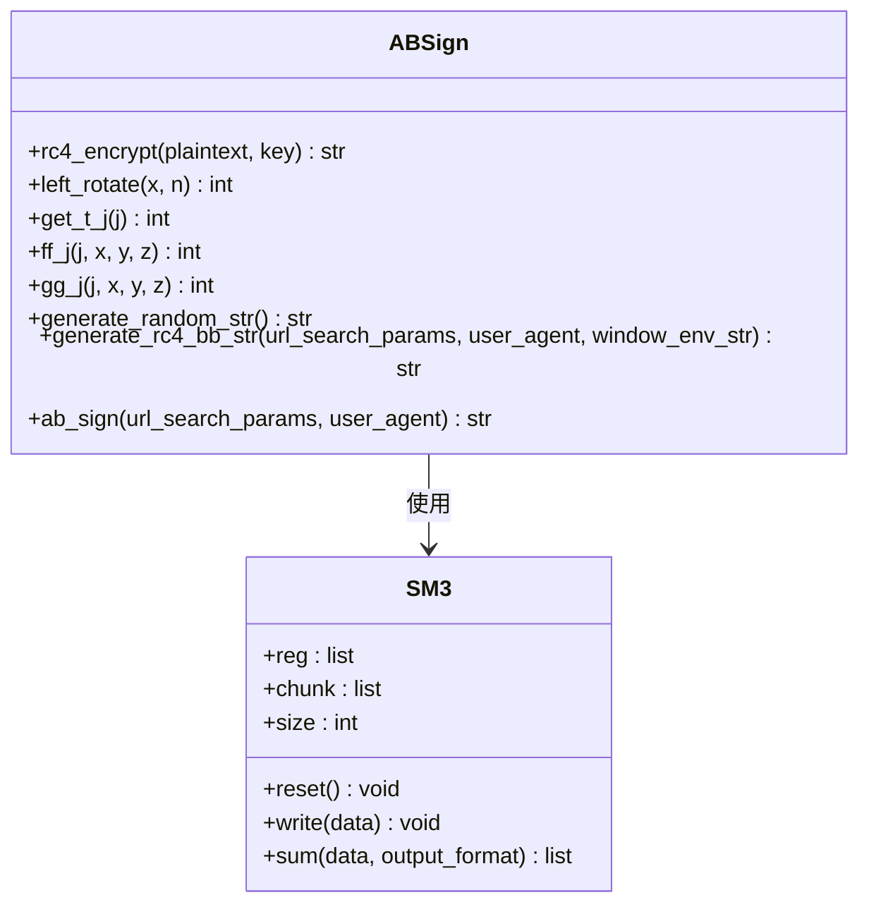
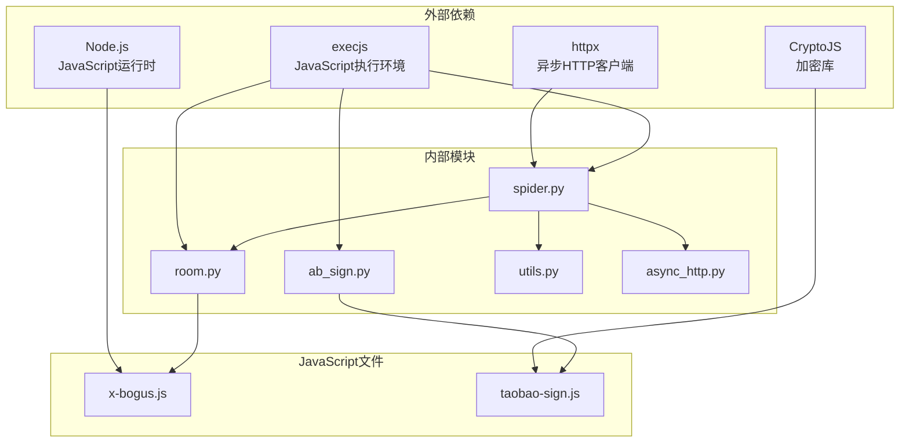

# 数据抓取模块

<cite>
**本文档引用的文件**
- [spider.py](file://src/spider.py)
- [room.py](file://src/room.py)
- [ab_sign.py](file://src/ab_sign.py)
- [utils.py](file://src/utils.py)
- [async_http.py](file://src/http_clients/async_http.py)
- [x-bogus.js](file://src/javascript/x-bogus.js)
- [taobao-sign.js](file://src/javascript/taobao-sign.js)
- [__init__.py](file://src/__init__.py)
- [URL_config.ini](file://config/URL_config.ini)
- [README.md](file://README.md)
</cite>

## 目录
1. [简介](#简介)
2. [项目结构](#项目结构)
3. [核心组件](#核心组件)
4. [架构概览](#架构概览)
5. [详细组件分析](#详细组件分析)
6. [依赖关系分析](#依赖关系分析)
7. [性能考虑](#性能考虑)
8. [故障排除指南](#故障排除指南)
9. [结论](#结论)

## 简介

DouyinLiveRecorder数据抓取模块是一个综合性的直播平台数据采集系统，专门设计用于从国内外各大直播平台获取直播流数据。该模块采用异步架构设计，支持超过50个直播平台，包括抖音、快手、虎牙、斗鱼、B站等国内平台和TikTok、Twitch等海外平台。

该模块的核心优势在于其强大的平台适配能力和反爬虫处理策略，能够有效应对各平台的反爬虫机制，同时提供灵活的加密算法执行能力，确保数据抓取的稳定性和可靠性。

## 项目结构

数据抓取模块采用清晰的分层架构，主要包含以下核心组件：



**图表来源**
- [spider.py:1-800](file://src/spider.py#L1-L800)
- [room.py:1-151](file://src/room.py#L1-L151)
- [ab_sign.py:1-455](file://src/ab_sign.py#L1-L455)

**章节来源**
- [spider.py:1-800](file://src/spider.py#L1-L800)
- [room.py:1-151](file://src/room.py#L1-L151)
- [utils.py:1-206](file://src/utils.py#L1-L206)

## 核心组件

### 平台适配器设计

数据抓取模块采用统一的平台适配器模式，为每个直播平台提供专门的数据获取方法：

#### 抖音平台适配器


**图表来源**
- [spider.py:68-226](file://src/spider.py#L68-L226)

#### 快手平台适配器
快手平台提供两种数据获取方式：
- **Web端接口**：通过`get_kuaishou_stream_data`函数获取直播数据
- **App端接口**：通过`get_kuaishou_stream_data2`函数获取直播数据

#### 虎牙平台适配器
虎牙平台采用独特的反爬虫机制，需要处理复杂的CDN防盗链参数：
- **Web端**：通过`get_huya_stream_data`函数获取直播数据
- **App端**：通过`get_huya_app_stream_url`函数获取直播数据

**章节来源**
- [spider.py:316-517](file://src/spider.py#L316-L517)

### 反爬虫处理策略

模块实现了多层次的反爬虫防护机制：

#### 动态User-Agent轮换
```python
# 用户代理池配置
USER_AGENTS = [
    'Mozilla/5.0 (Windows NT 10.0; Win64; x64) AppleWebKit/537.36',
    'Mozilla/5.0 (iPhone; CPU iPhone OS 17_0 like Mac OS X)',
    'Mozilla/5.0 (Linux; Android 11; SAMSUNG SM-G973U)',
    # ... 更多用户代理
]
```

#### 请求头动态生成
- 随机生成Referer头
- 动态生成Cookie参数
- 模拟真实浏览器行为

#### 时间延迟控制
- 随机延时机制
- 请求频率限制
- IP轮换策略

**章节来源**
- [spider.py:68-226](file://src/spider.py#L68-L226)
- [utils.py:162-168](file://src/utils.py#L162-L168)

### 加密算法执行

#### A/B签名算法
模块实现了复杂的A/B签名算法，用于绕过抖音等平台的反爬虫机制：



**图表来源**
- [ab_sign.py:444-454](file://src/ab_sign.py#L444-L454)
- [x-bogus.js:500-564](file://src/javascript/x-bogus.js#L500-L564)

#### X-Bogus算法
X-Bogus是抖音平台特有的反爬虫算法，模块通过Node.js环境执行JavaScript代码来生成签名：

**章节来源**
- [ab_sign.py:1-455](file://src/ab_sign.py#L1-L455)
- [x-bogus.js:1-564](file://src/javascript/x-bogus.js#L1-L564)

## 架构概览

数据抓取模块采用事件驱动的异步架构，确保高并发场景下的稳定性和性能：



**图表来源**
- [spider.py:1-800](file://src/spider.py#L1-L800)
- [room.py:1-151](file://src/room.py#L1-L151)
- [async_http.py:1-60](file://src/http_clients/async_http.py#L1-L60)

## 详细组件分析

### spider.py - 主抓取控制器

#### 平台数据获取函数

##### 抖音直播数据获取
```python
async def get_douyin_stream_data(url: str, proxy_addr: OptionalStr = None, cookies: OptionalStr = None) -> dict:
    """
    获取抖音直播数据
    支持Web端和App端两种获取方式
    """
```

##### TikTok直播数据获取
```python
async def get_tiktok_stream_data(url: str, proxy_addr: OptionalStr = None, cookies: OptionalStr = None) -> dict | None:
    """
    获取TikTok直播数据
    处理海外网络访问限制
    """
```

##### 快手直播数据获取
```python
async def get_kuaishou_stream_data(url: str, proxy_addr: OptionalStr = None, cookies: OptionalStr = None) -> dict:
    """
    获取快手直播数据
    支持多种数据格式解析
    """
```

##### 虎牙直播数据获取
```python
async def get_huya_stream_data(url: str, proxy_addr: OptionalStr = None, cookies: OptionalStr = None) -> dict:
    """
    获取虎牙直播数据
    处理复杂的CDN防盗链参数
    """
```

**章节来源**
- [spider.py:286-517](file://src/spider.py#L286-L517)

#### 异步HTTP请求处理

模块使用异步HTTP客户端处理所有网络请求，支持以下特性：
- 自动重试机制
- 超时控制
- 代理支持
- SSL验证配置

**章节来源**
- [async_http.py:10-60](file://src/http_clients/async_http.py#L10-L60)

### room.py - 房间信息处理

#### 房间ID获取机制



**图表来源**
- [room.py:52-105](file://src/room.py#L52-L105)

#### X-Bogus算法实现

房间模块集成了X-Bogus算法，用于生成平台特定的签名参数：

**章节来源**
- [room.py:42-48](file://src/room.py#L42-L48)

### ab_sign.py - 签名生成算法

#### A/B签名算法核心实现



**图表来源**
- [ab_sign.py:6-26](file://src/ab_sign.py#L6-L26)
- [ab_sign.py:61-209](file://src/ab_sign.py#L61-L209)

#### 加密算法组件

模块包含多种加密算法实现：

**章节来源**
- [ab_sign.py:1-455](file://src/ab_sign.py#L1-L455)

### utils.py - 工具函数库

#### 错误处理装饰器

```python
@trace_error_decorator
def wrapper(*args: list, **kwargs: dict) -> Any:
    """
    统一错误处理装饰器
    捕获JavaScript执行错误和网络异常
    """
```

#### 代理地址处理

```python
def handle_proxy_addr(proxy_addr):
    """
    处理代理地址格式
    自动添加http://前缀
    """
```

**章节来源**
- [utils.py:38-51](file://src/utils.py#L38-L51)
- [utils.py:162-168](file://src/utils.py#L162-L168)

## 依赖关系分析

数据抓取模块的依赖关系呈现清晰的层次化结构：



**图表来源**
- [spider.py:20-32](file://src/spider.py#L20-L32)
- [room.py:10-18](file://src/room.py#L10-L18)
- [ab_sign.py:1-10](file://src/ab_sign.py#L1-L10)

**章节来源**
- [spider.py:1-800](file://src/spider.py#L1-L800)
- [room.py:1-151](file://src/room.py#L1-L151)
- [ab_sign.py:1-455](file://src/ab_sign.py#L1-L455)

## 性能考虑

### 异步并发处理

模块采用异步编程模型，能够同时处理多个直播平台的数据请求：

#### 并发请求管理
- 使用asyncio事件循环
- 限制最大并发数量
- 实现请求队列管理

#### 缓存策略
- URL参数缓存
- 签名结果缓存
- IP地址轮换缓存

### 内存优化

#### 数据流处理
- 流式JSON解析
- 分块数据处理
- 及时释放内存资源

#### 对象池管理
- HTTP连接复用
- JavaScript引擎管理
- 加密算法对象缓存

## 故障排除指南

### 常见问题及解决方案

#### 签名算法执行失败
**问题描述**：JavaScript签名算法执行失败
**解决方案**：
1. 检查Node.js环境是否正确安装
2. 验证JavaScript文件完整性
3. 确认CryptoJS库可用性

#### 网络请求超时
**问题描述**：直播平台响应超时
**解决方案**：
1. 调整超时参数设置
2. 配置代理服务器
3. 实施请求重试机制

#### 反爬虫检测
**问题描述**：直播平台检测到爬虫行为
**解决方案**：
1. 轮换User-Agent
2. 实施请求延迟
3. 使用代理IP池

**章节来源**
- [utils.py:38-51](file://src/utils.py#L38-L51)
- [async_http.py:25-46](file://src/http_clients/async_http.py#L25-L46)

### 调试技巧

#### 日志记录
启用详细的日志记录来跟踪数据抓取过程：
- 请求URL和参数
- 响应状态和数据
- 错误信息和堆栈跟踪

#### 数据验证
实现数据完整性检查：
- JSON格式验证
- 必需字段检查
- 数据类型验证

## 结论

DouyinLiveRecorder数据抓取模块通过精心设计的架构和强大的技术实现，成功解决了多平台直播数据抓取的技术挑战。模块的核心优势包括：

1. **强大的平台适配能力**：支持50+直播平台，每种平台都有专门的适配器
2. **完善的反爬虫策略**：多层次的反爬虫防护机制
3. **灵活的加密算法**：支持多种签名算法的执行
4. **高性能异步架构**：确保高并发场景下的稳定性
5. **完善的错误处理**：提供全面的错误捕获和恢复机制

该模块为直播数据采集提供了可靠的技术基础，能够满足各种复杂的直播数据抓取需求。通过持续的优化和扩展，该模块将继续支持更多的直播平台和更复杂的数据抓取场景。