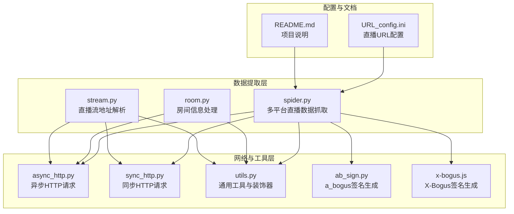
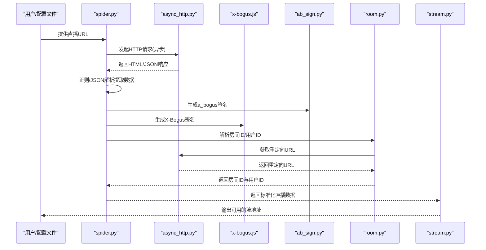
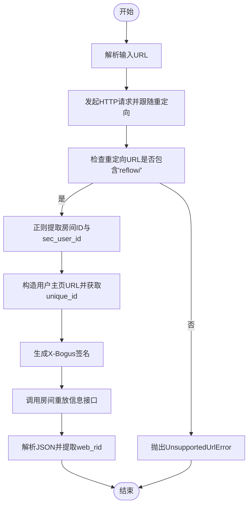
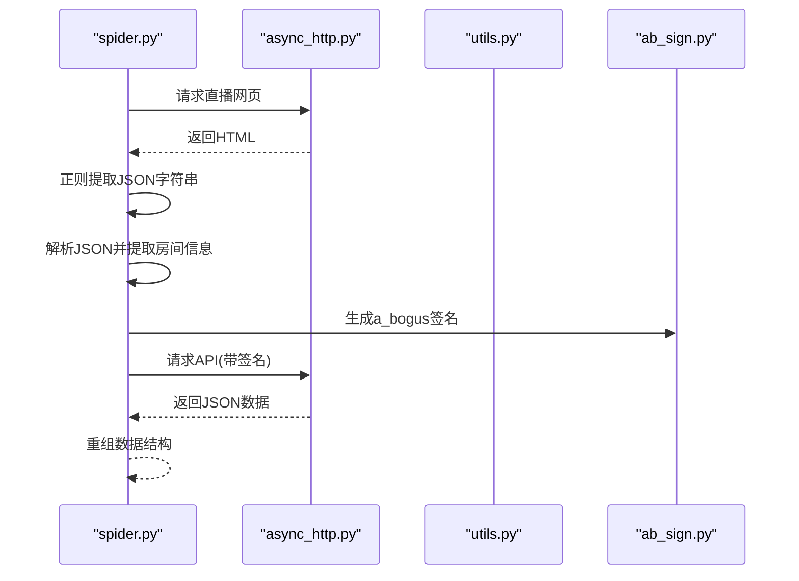
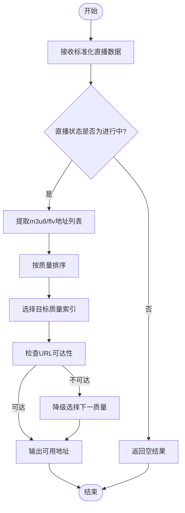
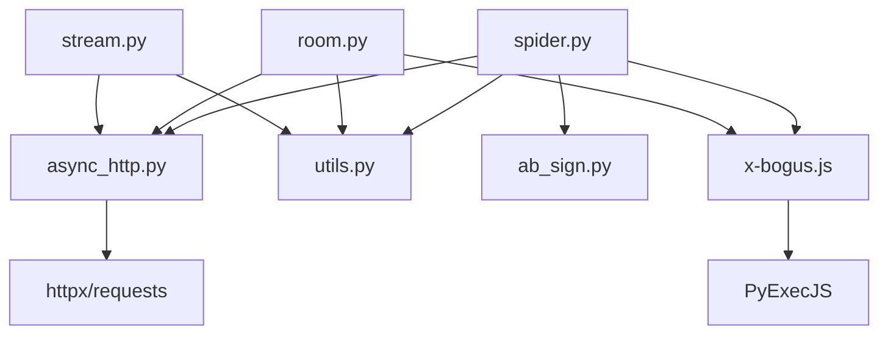

# 数据提取机制

<cite>
**本文档引用的文件**
- [room.py](file://src/room.py)
- [spider.py](file://src/spider.py)
- [utils.py](file://src/utils.py)
- [stream.py](file://src/stream.py)
- [async_http.py](file://src/http_clients/async_http.py)
- [sync_http.py](file://src/http_clients/sync_http.py)
- [ab_sign.py](file://src/ab_sign.py)
- [x-bogus.js](file://src/javascript/x-bogus.js)
- [URL_config.ini](file://config/URL_config.ini)
- [README.md](file://README.md)
</cite>

## 目录
1. [简介](#简介)
2. [项目结构](#项目结构)
3. [核心组件](#核心组件)
4. [架构总览](#架构总览)
5. [详细组件分析](#详细组件分析)
6. [依赖关系分析](#依赖关系分析)
7. [性能考量](#性能考量)
8. [故障排除指南](#故障排除指南)
9. [结论](#结论)

## 简介
本文件针对 DouyinLiveRecorder 的数据提取机制进行全面技术文档化，重点覆盖从网页与 API 中提取直播数据的核心算法与技术实现，包括正则表达式匹配、JSON 解析、DOM 树遍历等技术；深入解析 room.py 中的房间信息处理机制（房间 ID 解析、用户 secID 提取、直播状态判断等）；总结数据提取的通用模式、错误处理策略与数据验证方法，并提供性能优化建议与具体代码示例路径。

## 项目结构
项目采用模块化设计，核心模块包括：
- 数据提取与解析：spider.py、room.py
- 工具与辅助：utils.py、http_clients/async_http.py、http_clients/sync_http.py
- 加密与签名：ab_sign.py、javascript/x-bogus.js
- 配置与入口：config/URL_config.ini、README.md

**图表来源**
- [spider.py:1-800](file://src/spider.py#L1-L800)
- [room.py:1-151](file://src/room.py#L1-L151)
- [stream.py:1-446](file://src/stream.py#L1-L446)
- [async_http.py:1-60](file://src/http_clients/async_http.py#L1-L60)
- [sync_http.py:1-89](file://src/http_clients/sync_http.py#L1-L89)
- [ab_sign.py:1-455](file://src/ab_sign.py#L1-L455)
- [x-bogus.js:1-564](file://src/javascript/x-bogus.js#L1-L564)
- [URL_config.ini:1-5](file://config/URL_config.ini#L1-L5)
- [README.md:1-682](file://README.md#L1-L682)

**章节来源**
- [README.md:72-100](file://README.md#L72-L100)

## 核心组件
- 数据提取与解析模块（spider.py）：负责从各平台网页与 API 接口提取直播数据，包含正则表达式匹配、JSON 解析、URL 列表解析、CDN 与质量选择等。
- 房间信息处理模块（room.py）：负责从短链或主页解析房间 ID、用户 secID、抖音号，以及调用 X-Bogus 签名生成。
- 流地址解析模块（stream.py）：负责将房间数据转换为可用的 m3u8/flv 地址，包含质量映射、CDN 选择与有效性检查。
- 网络请求模块（async_http.py、sync_http.py）：统一处理异步/同步 HTTP 请求，支持代理、重定向、Cookie 返回等。
- 工具与装饰器（utils.py）：提供通用工具函数、错误追踪装饰器、MD5、JSONP 转换、查询参数解析等。
- 加密与签名（ab_sign.py、x-bogus.js）：实现 a_bogus 与 X-Bogus 签名生成，用于绕过风控与反爬。

**章节来源**
- [spider.py:1-800](file://src/spider.py#L1-L800)
- [room.py:1-151](file://src/room.py#L1-L151)
- [stream.py:1-446](file://src/stream.py#L1-L446)
- [async_http.py:1-60](file://src/http_clients/async_http.py#L1-L60)
- [sync_http.py:1-89](file://src/http_clients/sync_http.py#L1-L89)
- [utils.py:1-206](file://src/utils.py#L1-L206)
- [ab_sign.py:1-455](file://src/ab_sign.py#L1-L455)
- [x-bogus.js:1-564](file://src/javascript/x-bogus.js#L1-L564)

## 架构总览
系统采用“模块化分层 + 异步网络 + 动态签名”的架构：
- 输入层：直播 URL（短链、主页、房间页、分享页等）
- 解析层：正则表达式与 JSON 解析提取关键字段
- 签名层：X-Bogus（JavaScript）与 a_bogus（Python）动态生成
- 请求层：异步 HTTP 客户端，支持代理与重定向
- 输出层：标准化的直播数据结构（含标题、主播名、状态、流地址）

**图表来源**
- [spider.py:68-141](file://src/spider.py#L68-L141)
- [room.py:52-106](file://src/room.py#L52-L106)
- [async_http.py:10-46](file://src/http_clients/async_http.py#L10-L46)
- [ab_sign.py:444-455](file://src/ab_sign.py#L444-L455)
- [x-bogus.js:500-564](file://src/javascript/x-bogus.js#L500-L564)
- [stream.py:41-78](file://src/stream.py#L41-L78)

## 详细组件分析

### 房间信息处理（room.py）
房间信息处理模块负责从不同类型的直播 URL 中解析出房间 ID、用户 secID、抖音号等关键信息，并生成必要的签名参数。

- 房间 ID 与用户 secID 解析
  - 通过短链或主页访问，跟随重定向，使用正则表达式从重定向 URL 中提取房间 ID 与 sec_user_id。
  - 示例路径：[get_sec_user_id:52-75](file://src/room.py#L52-L75)

- 抖音号获取
  - 通过用户主页 URL 获取 unique_id，用于后续房间数据查询。
  - 示例路径：[get_unique_id:78-105](file://src/room.py#L78-L105)

- X-Bogus 签名生成
  - 读取 JavaScript 文件，使用 PyExecJS 调用签名函数，结合 User-Agent 与查询参数生成 X-Bogus。
  - 示例路径：[get_xbogus:42-48](file://src/room.py#L42-L48)

- 直播间 webID 获取
  - 调用房间重放信息接口，传入必要参数与 X-Bogus，解析返回 JSON 获取 web_rid。
  - 示例路径：[get_live_room_id:109-143](file://src/room.py#L109-L143)

**图表来源**
- [room.py:52-143](file://src/room.py#L52-L143)

**章节来源**
- [room.py:42-143](file://src/room.py#L42-L143)

### 多平台直播数据抓取（spider.py）
spider.py 是数据提取的核心模块，负责从各平台网页与 API 接口提取直播数据，包含以下关键技术点：

- 正则表达式匹配
  - 从 HTML 中提取 JSON 字符串，使用多种正则模式匹配不同场景的数据块。
  - 示例路径：[get_douyin_stream_data:230-282](file://src/spider.py#L230-L282)

- JSON 解析与数据结构重组
  - 解析 JSON 字符串，提取房间信息、主播昵称、流地址等字段，并进行结构化重组。
  - 示例路径：[get_douyin_stream_data:240-278](file://src/spider.py#L240-L278)

- CDN 与质量选择
  - 从流地址映射中选择合适分辨率与码率，支持多 CDN 与质量等级。
  - 示例路径：[get_douyin_stream_url:41-78](file://src/stream.py#L41-L78)

- a_bogus 签名生成
  - 使用 ab_sign.py 生成 a_bogus，用于特定接口的签名验证。
  - 示例路径：[get_douyin_web_stream_data:96-97](file://src/spider.py#L96-L97)

**图表来源**
- [spider.py:68-141](file://src/spider.py#L68-L141)
- [async_http.py:10-46](file://src/http_clients/async_http.py#L10-L46)
- [ab_sign.py:444-455](file://src/ab_sign.py#L444-L455)

**章节来源**
- [spider.py:68-282](file://src/spider.py#L68-L282)
- [stream.py:41-78](file://src/stream.py#L41-L78)

### 流地址解析与质量控制（stream.py）
stream.py 将标准化的直播数据转换为可用的流地址，支持多平台与多质量选择。

- 质量映射与索引
  - 定义质量映射表，将输入的质量字符串映射到内部索引，便于排序与选择。
  - 示例路径：[get_quality_index:29-37](file://src/stream.py#L29-L37)

- CDN 与质量选择
  - 从流地址列表中按质量排序，选择可用的 m3u8/flv 地址，并进行有效性检查。
  - 示例路径：[get_douyin_stream_url:41-78](file://src/stream.py#L41-L78)

- 多平台适配
  - 针对不同平台（如 TikTok、快手、虎牙等）提供专门的解析逻辑与质量控制。
  - 示例路径：[get_tiktok_stream_url:82-153](file://src/stream.py#L82-L153)

**图表来源**
- [stream.py:41-78](file://src/stream.py#L41-L78)

**章节来源**
- [stream.py:29-153](file://src/stream.py#L29-L153)

### 网络请求与代理处理（async_http.py、sync_http.py）
网络层提供统一的 HTTP 请求接口，支持异步与同步两种模式，并内置代理处理与 Cookie 返回能力。

- 异步请求
  - 支持 GET/POST、重定向、Cookie 返回、HTTPS 验证等。
  - 示例路径：[async_req:10-46](file://src/http_clients/async_http.py#L10-L46)

- 同步请求
  - 支持 gzip 解压、代理、异常处理等。
  - 示例路径：[sync_req:20-88](file://src/http_clients/sync_http.py#L20-L88)

- 代理处理
  - 自动规范化代理地址，支持 http/https。
  - 示例路径：[handle_proxy_addr:162-168](file://src/utils.py#L162-L168)

**章节来源**
- [async_http.py:10-60](file://src/http_clients/async_http.py#L10-L60)
- [sync_http.py:20-89](file://src/http_clients/sync_http.py#L20-L89)
- [utils.py:162-168](file://src/utils.py#L162-L168)

### 加密与签名（ab_sign.py、x-bogus.js）
为应对平台风控与反爬，系统实现了两类签名生成器：

- a_bogus（Python 实现）
  - 基于 SM3、RC4、自定义编码表等算法生成签名，用于特定接口。
  - 示例路径：[ab_sign:444-455](file://src/ab_sign.py#L444-L455)

- X-Bogus（JavaScript 实现）
  - 通过 PyExecJS 调用 x-bogus.js 中的 sign 函数，结合查询参数与 User-Agent 生成签名。
  - 示例路径：[get_xbogus:42-48](file://src/room.py#L42-L48)

**章节来源**
- [ab_sign.py:1-455](file://src/ab_sign.py#L1-L455)
- [x-bogus.js:500-564](file://src/javascript/x-bogus.js#L500-L564)
- [room.py:42-48](file://src/room.py#L42-L48)

## 依赖关系分析
- 模块耦合
  - spider.py 依赖 async_http.py、utils.py、ab_sign.py、x-bogus.js，形成“数据抓取-网络-工具-签名”闭环。
  - room.py 依赖 async_http.py、utils.py、x-bogus.js，专注于房间信息解析。
  - stream.py 依赖 async_http.py、utils.py，负责流地址解析与质量控制。

- 外部依赖
  - httpx、PyExecJS、requests 等第三方库用于网络与 JavaScript 执行。
  - 示例路径：[requirements.txt:1-7](file://requirements.txt#L1-L7)

**图表来源**
- [spider.py:27-32](file://src/spider.py#L27-L32)
- [room.py:10-15](file://src/room.py#L10-L15)
- [stream.py:20-24](file://src/stream.py#L20-L24)
- [async_http.py:2-4](file://src/http_clients/async_http.py#L2-L4)
- [sync_http.py:1-9](file://src/http_clients/sync_http.py#L1-L9)
- [ab_sign.py:1-5](file://src/ab_sign.py#L1-L5)
- [x-bogus.js:1-3](file://src/javascript/x-bogus.js#L1-L3)
- [requirements.txt:1-7](file://requirements.txt#L1-L7)

**章节来源**
- [requirements.txt:1-7](file://requirements.txt#L1-L7)

## 性能考量
- 异步网络请求
  - 使用 httpx.AsyncClient 并发请求，减少等待时间，提升整体吞吐。
  - 示例路径：[async_req:10-34](file://src/http_clients/async_http.py#L10-L34)

- 签名生成优化
  - 将 JavaScript 签名逻辑封装为独立模块，避免重复加载与编译。
  - 示例路径：[x-bogus.js:500-564](file://src/javascript/x-bogus.js#L500-L564)

- 数据解析缓存
  - 对于重复请求的页面或接口，可引入缓存策略（如基于 URL 的缓存）以减少网络开销。
  - 建议：在 utils.py 中增加缓存装饰器或缓存工具函数。

- 质量选择与降级
  - 当首选质量不可用时，自动降级选择次优质量，保证录制连续性。
  - 示例路径：[get_douyin_stream_url:65-69](file://src/stream.py#L65-L69)

- 代理与超时
  - 合理设置超时与重试策略，避免单点故障影响整体流程。
  - 示例路径：[async_req:16-23](file://src/http_clients/async_http.py#L16-L23)

[本节提供通用指导，无需特定文件分析]

## 故障排除指南
- URL 类型不支持
  - 现象：重定向 URL 不包含特定标识，抛出 UnsupportedUrlError。
  - 处理：检查输入 URL 是否为短链或主页，必要时转换为标准房间页链接。
  - 示例路径：[get_sec_user_id:61-70](file://src/room.py#L61-L70)

- JSON 解析失败
  - 现象：正则匹配不到预期 JSON，或 JSON 结构变化导致解析异常。
  - 处理：增加备用正则模式与异常捕获，必要时回退到备用解析方法。
  - 示例路径：[get_douyin_stream_data:243-282](file://src/spider.py#L243-L282)

- 签名生成异常
  - 现象：JavaScript 环境缺失或签名生成失败。
  - 处理：确保 Node.js 已正确安装与配置，或在 Python 端实现兼容方案。
  - 示例路径：[ensure_nodejs_installed:179-204](file://src/initializer.py#L179-L204)

- 代理与网络问题
  - 现象：请求超时、403、404 等。
  - 处理：检查代理地址格式与可用性，调整超时与重试策略。
  - 示例路径：[handle_proxy_addr:162-168](file://src/utils.py#L162-L168)

**章节来源**
- [room.py:61-70](file://src/room.py#L61-L70)
- [spider.py:243-282](file://src/spider.py#L243-L282)
- [utils.py:162-168](file://src/utils.py#L162-L168)
- [initializer.py:179-204](file://src/initializer.py#L179-L204)

## 结论
DouyinLiveRecorder 的数据提取机制通过“模块化分层 + 异步网络 + 动态签名”的架构，实现了对多平台直播数据的稳定抓取与高质量流地址解析。room.py 负责房间信息解析与签名生成，spider.py 负责多平台数据抓取与结构化，stream.py 负责质量选择与有效性验证。配合 utils.py 的通用工具与装饰器、async_http.py 的网络请求能力，以及 ab_sign.py 与 x-bogus.js 的签名生成，形成了完整的数据提取流水线。建议在生产环境中进一步完善缓存、代理与异常处理策略，以提升稳定性与性能。