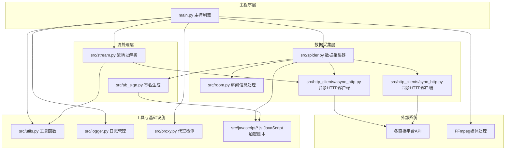
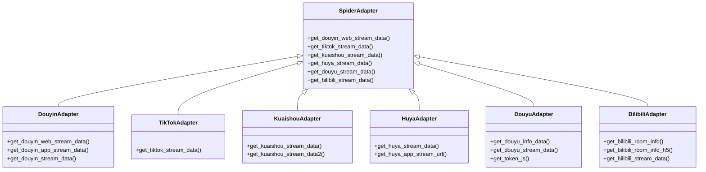
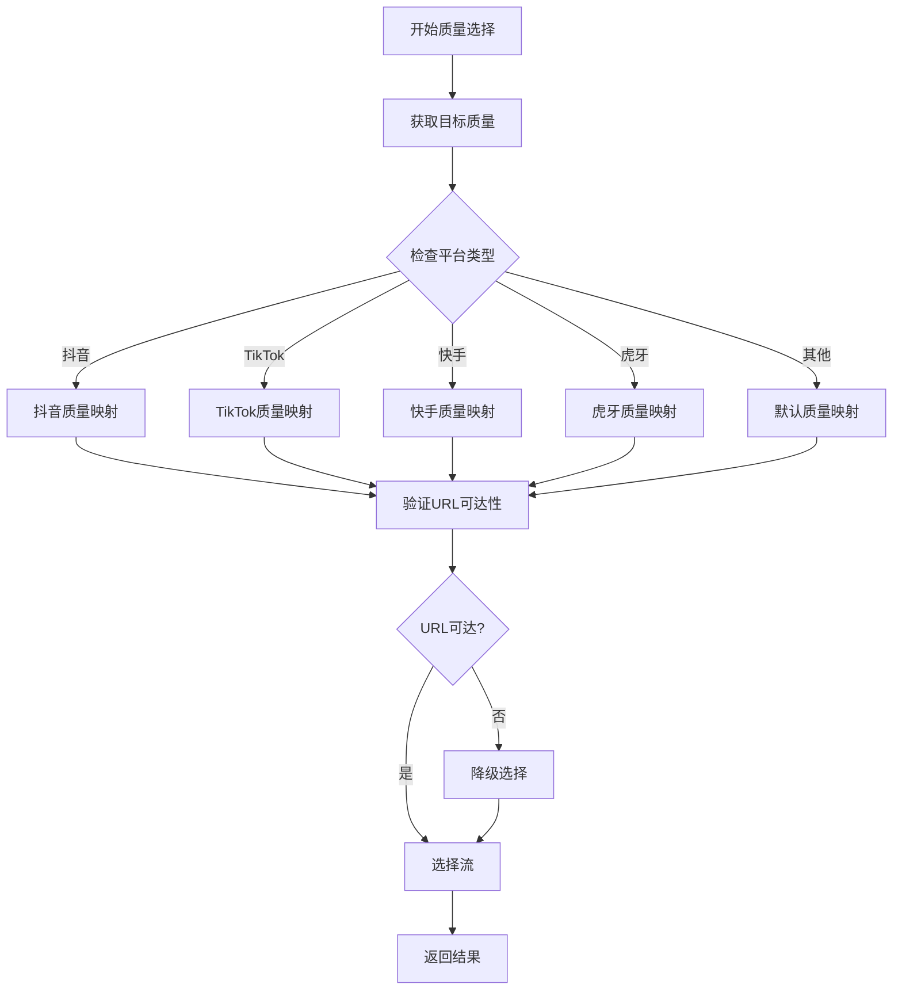
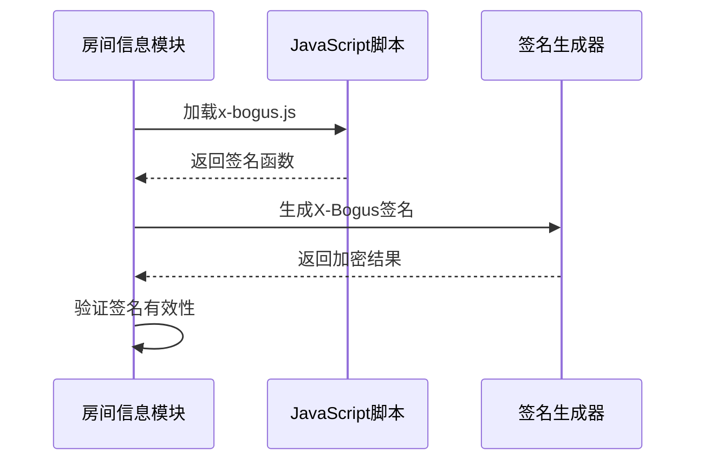
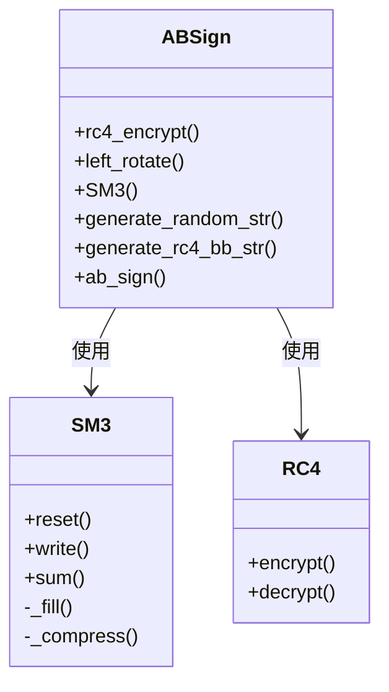
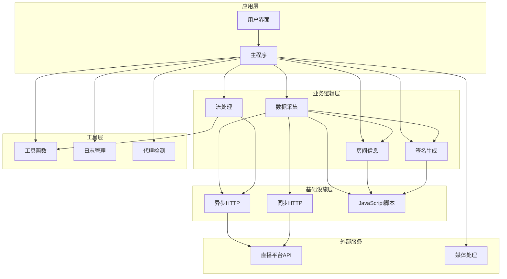
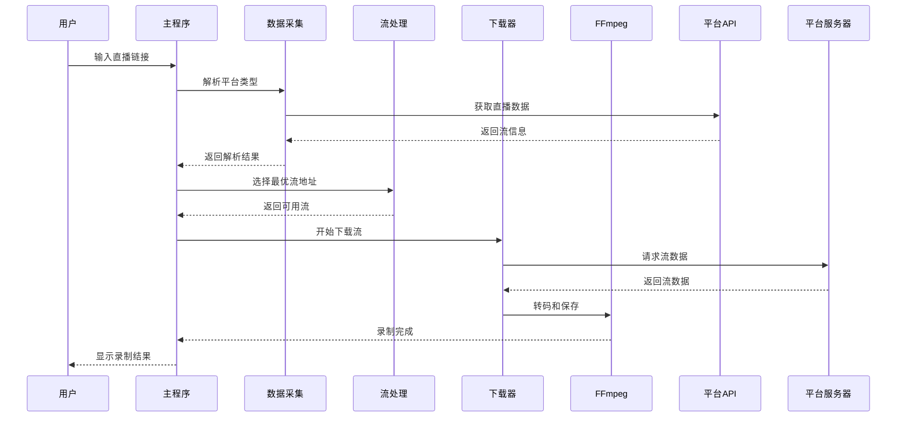
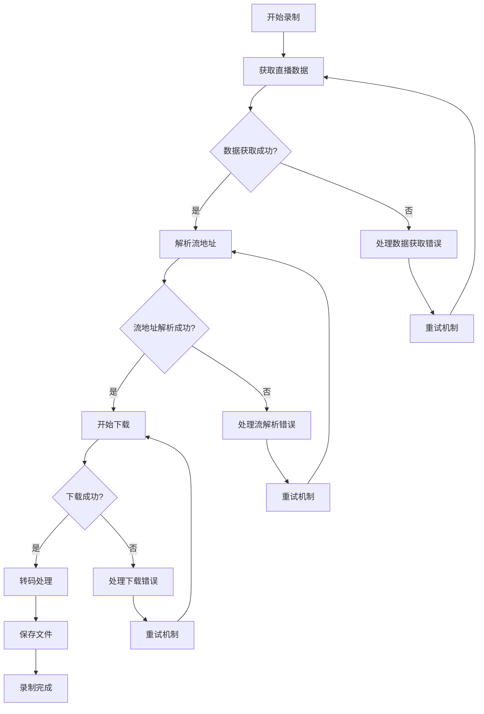
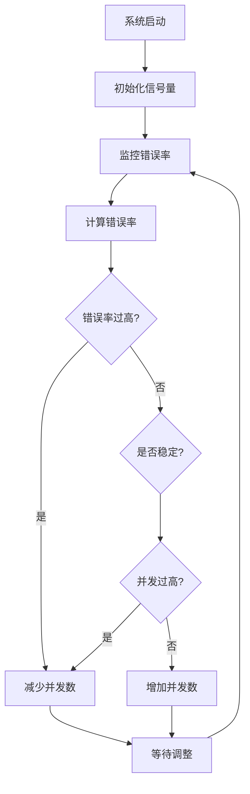
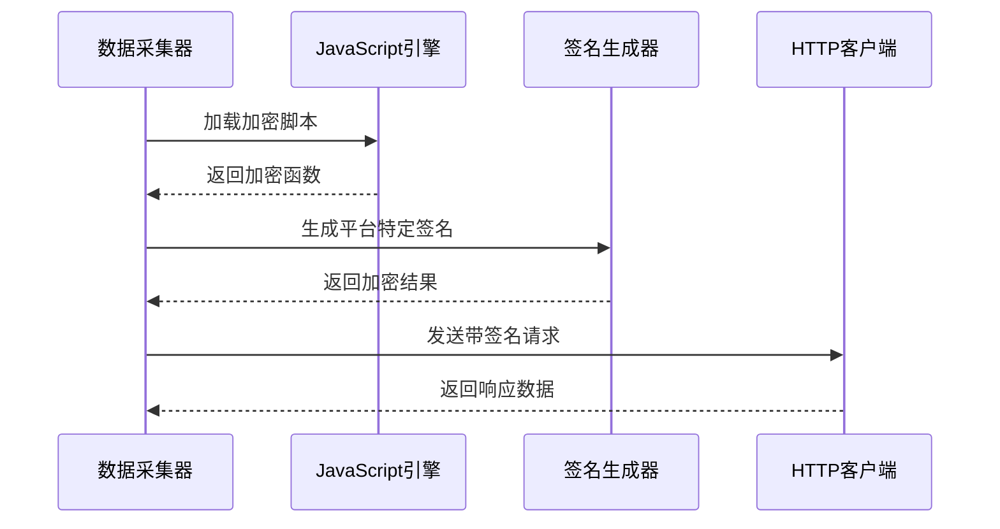

# 核心功能模块

<cite>
**本文档引用的文件**
- [main.py](file://main.py)
- [spider.py](file://src/spider.py)
- [stream.py](file://src/stream.py)
- [room.py](file://src/room.py)
- [ab_sign.py](file://src/ab_sign.py)
- [utils.py](file://src/utils.py)
- [logger.py](file://src/logger.py)
- [async_http.py](file://src/http_clients/async_http.py)
- [sync_http.py](file://src/http_clients/sync_http.py)
- [proxy.py](file://src/proxy.py)
- [x-bogus.js](file://src/javascript/x-bogus.js)
- [taobao-sign.js](file://src/javascript/taobao-sign.js)
- [haixiu.js](file://src/javascript/haixiu.js)
- [liveme.js](file://src/javascript/liveme.js)
- [migu.js](file://src/javascript/migu.js)
</cite>

## 目录
1. [项目概述](#项目概述)
2. [系统架构总览](#系统架构总览)
3. [核心组件详解](#核心组件详解)
4. [模块交互关系图](#模块交互关系图)
5. [数据流分析](#数据流分析)
6. [并发控制与任务管理](#并发控制与任务管理)
7. [反爬虫与安全机制](#反爬虫与安全机制)
8. [性能优化策略](#性能优化策略)
9. [故障排查指南](#故障排查指南)
10. [总结](#总结)

## 项目概述

DouyinLiveRecorder是一个多平台直播录制工具，支持抖音、快手、虎牙、斗鱼、B站等多个直播平台。该项目采用Python开发，结合JavaScript加密算法实现，具备强大的跨平台兼容性和反爬虫能力。

## 系统架构总览



**图表来源**
- [main.py](file://main.py)
- [spider.py](file://src/spider.py)
- [stream.py](file://src/stream.py)
- [async_http.py](file://src/http_clients/async_http.py)

## 核心组件详解

### 主程序控制器 (main.py)

主程序作为整个系统的调度中心，负责协调各个模块的工作流程。其核心功能包括：

#### 调度机制
- **任务队列管理**：维护录制任务的队列，支持并发控制
- **动态配置调整**：根据网络状况动态调整并发数量
- **监控面板**：实时显示录制状态和系统信息

#### 并发控制策略
```mermaid
sequenceDiagram
participant MAIN as 主程序
participant SEMAPHORE as 信号量
participant SPIDER as 数据采集器
participant STREAM as 流处理器
MAIN->>SEMAPHORE : 请求并发许可
SEQUENCE : 并发控制循环
MAIN->>SPIDER : 获取直播数据
SPIDER-->>MAIN : 返回流信息
MAIN->>STREAM : 解析流地址
STREAM-->>MAIN : 返回可用流
MAIN->>MAIN : 下载流媒体
end
MAIN->>SEMAPHORE : 释放并发许可
```

**图表来源**
- [main.py](file://main.py)

#### 任务管理功能
- **录制状态跟踪**：实时监控录制进度和状态
- **错误处理机制**：自动重试和错误恢复
- **资源清理**：确保录制完成后正确释放资源

**章节来源**
- [main.py](file://main.py)

### 数据采集模块 (spider.py)

数据采集模块负责从各个直播平台获取直播流信息，采用平台适配器设计模式：

#### 平台适配器设计


**图表来源**
- [spider.py](file://src/spider.py)

#### 关键特性
- **异步数据获取**：使用async/await提高并发效率
- **错误重试机制**：自动处理网络异常和平台限制
- **数据解析优化**：针对不同平台的HTML结构进行专门解析

**章节来源**
- [spider.py](file://src/spider.py)

### 流处理模块 (stream.py)

流处理模块负责解析和选择最优的直播流地址：

#### 质量选择算法


**图表来源**
- [stream.py](file://src/stream.py)

#### 核心功能
- **多格式支持**：同时处理HLS和FLV格式
- **智能质量选择**：根据网络状况自动选择最佳质量
- **CDN优化**：针对不同CDN进行优化处理

**章节来源**
- [stream.py](file://src/stream.py)

### 房间信息处理 (room.py)

房间信息处理模块专门负责处理抖音等平台的房间ID和用户信息：

#### 加密算法集成


**图表来源**
- [room.py](file://src/room.py)
- [x-bogus.js](file://src/javascript/x-bogus.js)

**章节来源**
- [room.py](file://src/room.py)

### 签名生成模块 (ab_sign.py)

签名生成模块实现了复杂的加密算法，用于绕过平台的安全验证：

#### 加密算法架构


**图表来源**
- [ab_sign.py](file://src/ab_sign.py)

**章节来源**
- [ab_sign.py](file://src/ab_sign.py)

### 工具函数模块 (utils.py)

工具函数模块提供了系统运行所需的各种辅助功能：

#### 核心工具类
- **颜色输出类**：提供彩色终端输出
- **配置管理**：INI文件读写和配置更新
- **文件操作**：MD5计算、去重、磁盘容量检查
- **代理处理**：代理地址标准化和验证

**章节来源**
- [utils.py](file://src/utils.py)

### 日志管理模块 (logger.py)

日志管理模块基于loguru库实现，提供多级别的日志记录：

#### 日志配置
- **标准输出**：彩色终端显示
- **文件日志**：详细调试信息
- **按级别过滤**：区分错误和普通信息
- **轮转管理**：自动清理旧日志文件

**章节来源**
- [logger.py](file://src/logger.py)

## 模块交互关系图



**图表来源**
- [main.py](file://main.py)
- [spider.py](file://src/spider.py)
- [stream.py](file://src/stream.py)
- [room.py](file://src/room.py)
- [ab_sign.py](file://src/ab_sign.py)

## 数据流分析

### 完整录制流程



**图表来源**
- [main.py](file://main.py)
- [spider.py](file://src/spider.py)
- [stream.py](file://src/stream.py)

### 错误处理流程



**图表来源**
- [main.py](file://main.py)

## 并发控制与任务管理

### 并发控制机制

系统采用信号量和动态调整相结合的方式实现智能并发控制：

#### 动态并发调节


**图表来源**
- [main.py](file://main.py)

#### 任务队列管理
- **优先级调度**：根据任务紧急程度分配资源
- **资源隔离**：不同平台使用独立的资源池
- **超时控制**：防止长时间占用资源

**章节来源**
- [main.py](file://main.py)

## 反爬虫与安全机制

### 多层次防护策略

系统实现了多层次的反爬虫防护机制：

#### JavaScript加密脚本
系统集成了多个JavaScript加密脚本，用于生成各种平台所需的签名：

| 脚本名称 | 平台用途 | 加密算法 |
|---------|----------|----------|
| x-bogus.js | 抖音/今日头条 | 自定义加密算法 |
| taobao-sign.js | 淘宝相关 | MD5哈希 |
| haixiu.js | 嗨秀平台 | 参数排序加密 |
| liveme.js | LiveMe平台 | MD5签名 |
| migu.js | 咪咕视频 | WASM加密 |

#### 签名生成流程


**图表来源**
- [spider.py](file://src/spider.py)
- [x-bogus.js](file://src/javascript/x-bogus.js)

#### 代理检测与切换
系统具备智能代理检测功能，能够自动识别和使用系统代理设置：

**章节来源**
- [proxy.py](file://src/proxy.py)
- [spider.py](file://src/spider.py)

## 性能优化策略

### 网络优化
- **连接复用**：使用HTTP/2协议提高传输效率
- **超时控制**：合理设置请求超时时间
- **重试机制**：智能重试失败的请求

### 内存管理
- **流式下载**：避免大文件内存占用
- **资源清理**：及时释放不再使用的资源
- **垃圾回收**：定期触发Python垃圾回收

### 处理器优化
- **异步处理**：充分利用异步I/O优势
- **并发控制**：避免过度并发导致的性能下降
- **缓存机制**：缓存常用的配置和数据

## 故障排查指南

### 常见问题诊断

#### 网络连接问题
1. **检查代理设置**：确认代理服务器可用性
2. **验证DNS解析**：确保域名能够正确解析
3. **测试防火墙**：检查是否有网络限制

#### 平台兼容性问题
1. **更新加密脚本**：确保JavaScript加密脚本最新
2. **检查用户代理**：使用正确的浏览器标识
3. **验证Cookies**：确保登录状态有效

#### 录制质量问题
1. **检查网络带宽**：确保有足够的带宽支持
2. **调整质量设置**：根据网络状况调整录制质量
3. **验证FFmpeg安装**：确保FFmpeg正确安装

**章节来源**
- [logger.py](file://src/logger.py)
- [utils.py](file://src/utils.py)

## 总结

DouyinLiveRecorder通过模块化的设计和多层次的技术实现，构建了一个功能强大、稳定性高的直播录制系统。其核心特点包括：

1. **模块化架构**：清晰的职责分离和良好的扩展性
2. **智能并发控制**：动态调整并发数量适应网络状况
3. **多平台支持**：统一的接口适配多个直播平台
4. **反爬虫能力**：集成多种加密算法绕过平台防护
5. **完善的错误处理**：自动重试和故障恢复机制

该系统为开发者提供了良好的学习和参考价值，展示了现代网络爬虫技术的最佳实践。