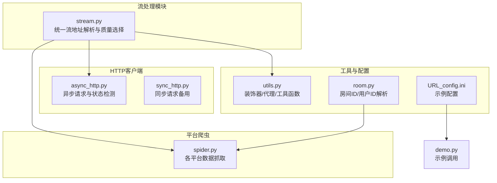
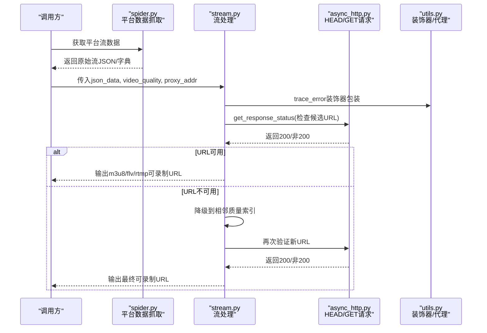
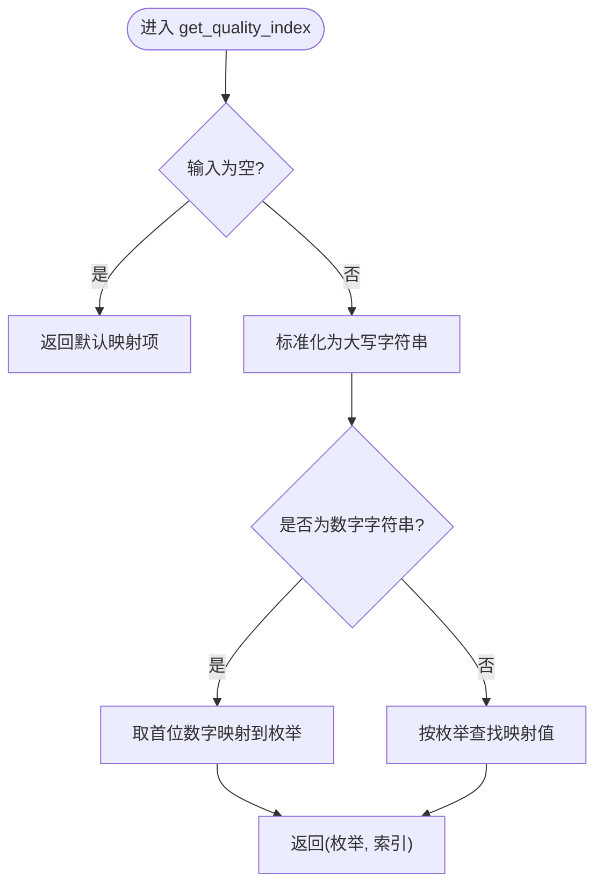
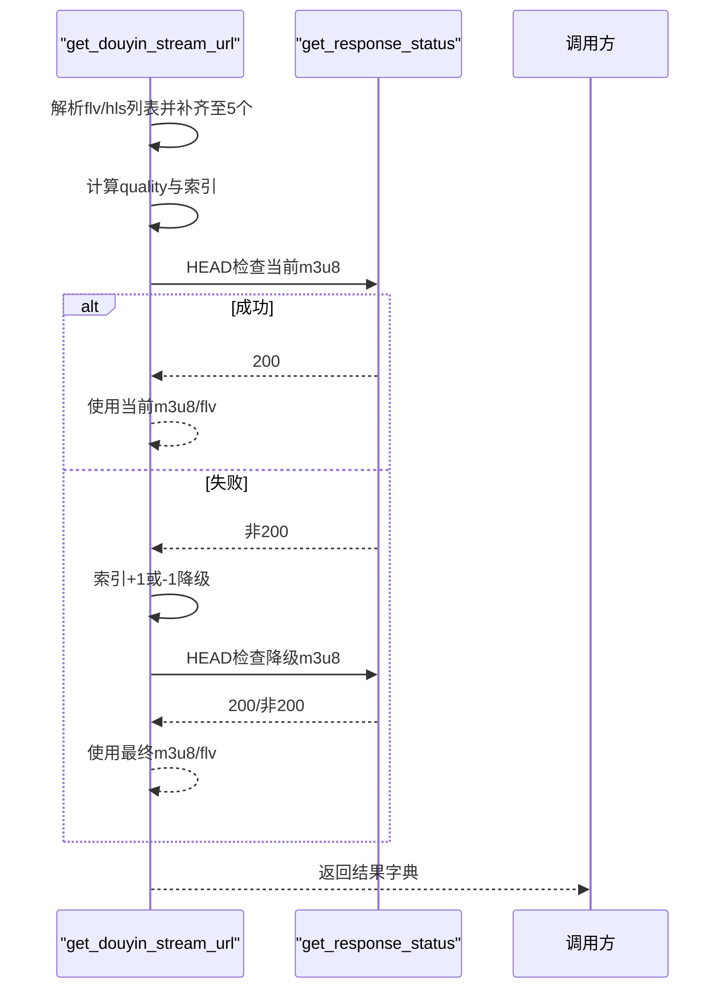
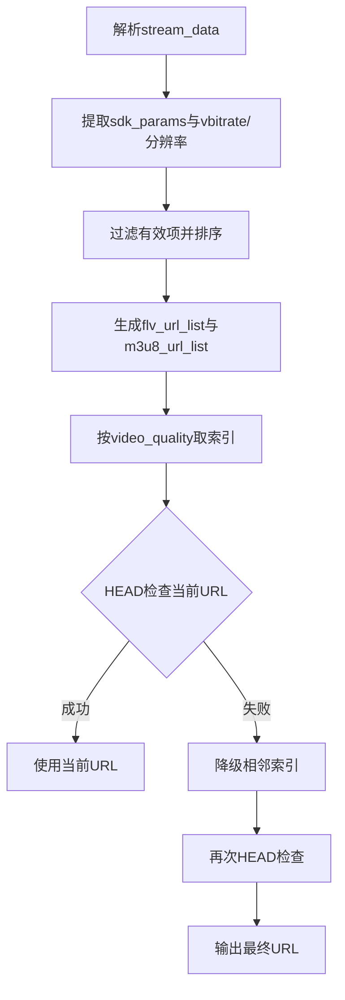
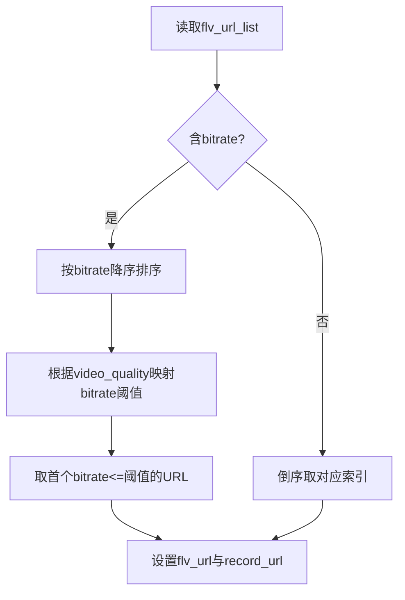
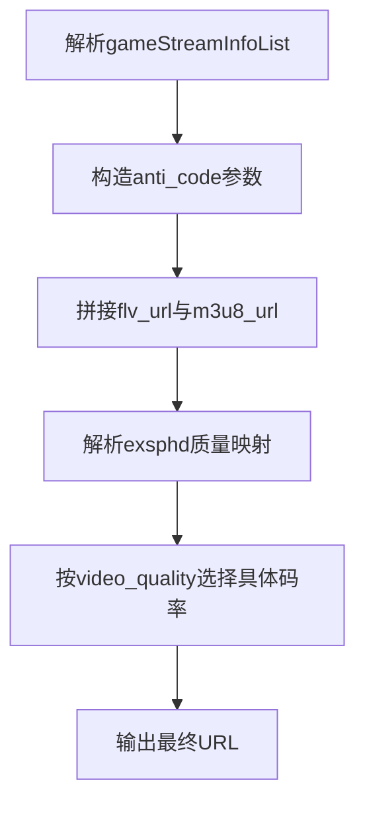
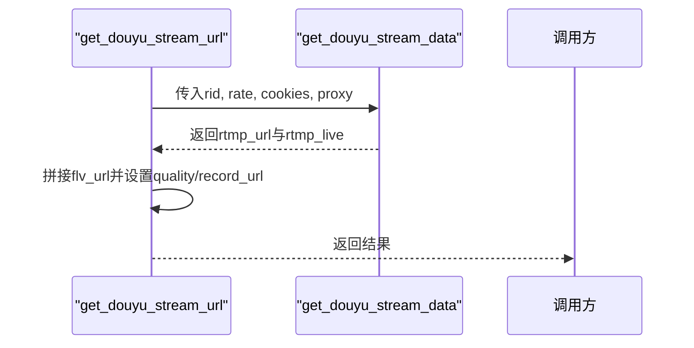
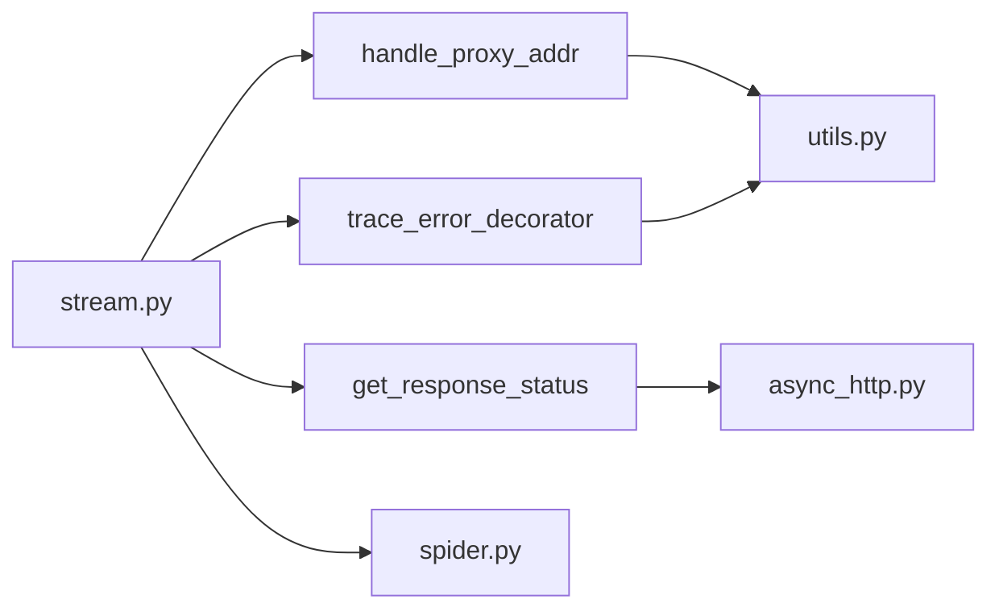

# 流处理模块

<cite>
**本文引用的文件列表**
- [stream.py](file://src/stream.py)
- [spider.py](file://src/spider.py)
- [async_http.py](file://src/http_clients/async_http.py)
- [sync_http.py](file://src/http_clients/sync_http.py)
- [utils.py](file://src/utils.py)
- [room.py](file://src/room.py)
- [URL_config.ini](file://config/URL_config.ini)
- [demo.py](file://demo.py)
</cite>

## 目录
1. [简介](#简介)
2. [项目结构](#项目结构)
3. [核心组件](#核心组件)
4. [架构总览](#架构总览)
5. [详细组件分析](#详细组件分析)
6. [依赖关系分析](#依赖关系分析)
7. [性能考量](#性能考量)
8. [故障排查指南](#故障排查指南)
9. [结论](#结论)
10. [附录](#附录)

## 简介
本文件面向DouyinLiveRecorder的流处理模块，聚焦于src/stream.py中的流地址解析、质量选择算法与格式转换处理，系统阐述HLS、FLV、RTMP等不同直播协议的处理方式，并给出流地址验证机制、质量选择策略与格式转换算法的实现要点。同时提供最佳实践、性能优化建议与常见问题解决方案，并通过具体代码路径示例帮助读者快速定位实现细节。

## 项目结构
流处理模块位于src/stream.py，围绕“平台适配 + 协议解析 + 质量选择 + 地址验证 + 格式转换”的职责划分组织。主要依赖如下：
- 异步HTTP客户端：用于发起HEAD/GET请求并验证可用性
- 工具函数：错误追踪装饰器、代理地址处理、通用工具
- 平台爬虫：从各平台页面或API抓取原始流数据
- 房间信息：辅助解析房间ID、用户ID等前置信息

图表来源
- [stream.py:1-446](file://src/stream.py#L1-446)
- [async_http.py:1-60](file://src/http_clients/async_http.py#L1-60)
- [sync_http.py:1-89](file://src/http_clients/sync_http.py#L1-89)
- [utils.py:1-206](file://src/utils.py#L1-206)
- [room.py:1-151](file://src/room.py#L1-151)
- [URL_config.ini:1-5](file://config/URL_config.ini#L1-5)
- [demo.py:1-228](file://demo.py#L1-228)

章节来源
- [stream.py:1-446](file://src/stream.py#L1-446)
- [async_http.py:1-60](file://src/http_clients/async_http.py#L1-60)
- [sync_http.py:1-89](file://src/http_clients/sync_http.py#L1-89)
- [utils.py:1-206](file://src/utils.py#L1-206)
- [room.py:1-151](file://src/room.py#L1-151)
- [URL_config.ini:1-5](file://config/URL_config.ini#L1-5)
- [demo.py:1-228](file://demo.py#L1-228)

## 核心组件
- 质量映射与索引：定义OD/BD/UHD/HD/SD/LD到内部索引的映射，支持数字字符串与枚举字符串两种输入形式
- 平台适配函数：针对抖音、TikTok、快手、虎牙、斗鱼、YY、B站、网易等平台分别解析流地址
- 通用流地址选择：基于play_url_list的多源地址选择与spec模式控制
- 流地址验证：通过HEAD请求检测URL可达性，失败时自动降级到相邻质量
- 协议处理：HLS(.m3u8)、FLV(.flv)、RTMP三种协议的拼接与参数注入
- 格式转换：部分平台通过附加参数或后缀拼接实现格式切换（如codec、exsphd）

章节来源
- [stream.py:26-78](file://src/stream.py#L26-L78)
- [stream.py:82-153](file://src/stream.py#L82-L153)
- [stream.py:156-206](file://src/stream.py#L156-L206)
- [stream.py:209-299](file://src/stream.py#L209-L299)
- [stream.py:302-325](file://src/stream.py#L302-L325)
- [stream.py:329-346](file://src/stream.py#L329-L346)
- [stream.py:349-378](file://src/stream.py#L349-L378)
- [stream.py:382-408](file://src/stream.py#L382-L408)
- [stream.py:411-446](file://src/stream.py#L411-L446)

## 架构总览
下图展示从平台爬虫获取原始流数据到最终输出可录制URL的关键流程，包括质量选择与地址验证。

图表来源
- [spider.py:144-226](file://src/spider.py#L144-L226)
- [stream.py:41-78](file://src/stream.py#L41-L78)
- [async_http.py:49-59](file://src/http_clients/async_http.py#L49-L59)
- [utils.py:38-51](file://src/utils.py#L38-L51)

## 详细组件分析

### 质量选择与索引
- 支持输入类型：字符串枚举（OD/BD/UHD/HD/SD/LD）、数字字符串（取对应枚举）
- 映射规则：OD/BD默认为0；UHD=1；HD=2；SD=3；LD=4
- 索引计算：若输入为数字字符串，取首位作为索引；否则按映射表取值
- 容错补齐：当候选列表长度不足5时，通过末尾复制补齐，避免越界

图表来源
- [stream.py:29-37](file://src/stream.py#L29-L37)

章节来源
- [stream.py:26-37](file://src/stream.py#L26-L37)

### 抖音流地址解析（HLS/FLV）
- 数据来源：从平台爬虫返回的json_data中提取flv_pull_url与hls_pull_url_map
- 质量选择：根据video_quality获取索引，取对应位置的m3u8与flv地址
- 地址验证：先尝试当前质量的m3u8，若HEAD请求非200，则降级到相邻质量
- 输出字段：anchor_name、is_live、title、quality、m3u8_url、flv_url、record_url

图表来源
- [stream.py:41-78](file://src/stream.py#L41-L78)
- [async_http.py:49-59](file://src/http_clients/async_http.py#L49-L59)

章节来源
- [stream.py:41-78](file://src/stream.py#L41-L78)

### TikTok流地址解析（HLS/FLV）
- 数据来源：从平台爬虫返回的LiveRoom结构，解析pull_data中的stream_data
- 质量排序：按vbitrate与分辨率综合排序，生成有序列表
- 参数注入：若URL包含“.flv”或“.m3u8”，追加codec参数；否则追加“&codec=...”
- 地址验证：先检查当前质量的m3u8/flv，若不可用则降级相邻质量

图表来源
- [stream.py:82-153](file://src/stream.py#L82-L153)
- [async_http.py:49-59](file://src/http_clients/async_http.py#L49-L59)

章节来源
- [stream.py:82-153](file://src/stream.py#L82-L153)

### 快手流地址解析（HLS/FLV）
- 数据来源：m3u8_url_list与flv_url_list（可能含bitrate字段）
- 质量策略：
  - 若flv含bitrate：按bitrate降序排序，按video_quality映射到目标上限，取首个不超过阈值的URL
  - 若flv不含bitrate：按倒序取对应索引
- 输出：设置is_live、quality、m3u8_url、flv_url、record_url

图表来源
- [stream.py:156-206](file://src/stream.py#L156-L206)

章节来源
- [stream.py:156-206](file://src/stream.py#L156-L206)

### 虎牙流地址解析（HLS/FLV）
- 数据来源：gameStreamInfoList中的sFlvUrl/sHlsUrl等字段
- 反防盗策略：解析旧的anti_code，计算新的wsSecret等参数，拼接到URL查询串
- 质量映射：从旧anti_code中解析exsphd参数，映射到UHD/HD/SD/LD
- 输出：设置is_live、title、quality、m3u8_url、flv_url、record_url

图表来源
- [stream.py:209-299](file://src/stream.py#L209-L299)

章节来源
- [stream.py:209-299](file://src/stream.py#L209-L299)

### 斗鱼流地址解析（RTMP）
- 数据来源：通过spider.get_douyu_stream_data获取RTMP流
- 质量策略：根据video_quality映射rate（OD/BD=0，UHD=3，HD=2，SD/HD=1）
- 输出：设置quality、flv_url（拼接rtmp_url/rtmp_live）、record_url

图表来源
- [stream.py:302-325](file://src/stream.py#L302-L325)
- [spider.py:583-609](file://src/spider.py#L583-L609)

章节来源
- [stream.py:302-325](file://src/stream.py#L302-L325)
- [spider.py:583-609](file://src/spider.py#L583-L609)

### YY流地址解析（FLV）
- 数据来源：avp_info_res中的stream_line_addr
- 输出：设置is_live、title、quality=OD、flv_url、record_url

章节来源
- [stream.py:329-346](file://src/stream.py#L329-L346)

### B站流地址解析（HLS）
- 数据来源：通过spider.get_bilibili_stream_data获取播放URL
- 质量策略：根据video_quality映射qn（OD=10000，BD=400，UHD=250，HD=150，SD=80，LD=80）
- 输出：设置anchor_name、is_live、title、quality、record_url

章节来源
- [stream.py:349-378](file://src/stream.py#L349-L378)
- [spider.py:707-766](file://src/spider.py#L707-L766)

### 网易流地址解析（HLS/FLV）
- 数据来源：m3u8_url与stream_list.resolution
- 质量策略：按blueray/ultra/high/standard顺序排序，取对应quality的CDN首项
- 输出：设置is_live、anchor_name、title、quality、m3u8_url、flv_url、record_url

章节来源
- [stream.py:382-408](file://src/stream.py#L382-L408)

### 通用流地址选择（play_url_list）
- 数据来源：统一的play_url_list，补齐至5个
- 选择逻辑：按video_quality获取索引，支持指定hls_extra_key与flv_extra_key
- 输出：根据url_type=all/m3u8/flv返回对应URL与record_url

章节来源
- [stream.py:411-446](file://src/stream.py#L411-L446)

## 依赖关系分析
- 错误处理：统一通过trace_error装饰器捕获异常并记录日志
- 代理处理：通过utils.handle_proxy_addr规范化代理地址
- HTTP请求：异步HEAD请求用于URL可达性验证，GET请求用于获取m3u8列表
- 平台数据：依赖spider模块提供的各平台原始数据

图表来源
- [stream.py:40-40](file://src/stream.py#L40-L40)
- [utils.py:38-51](file://src/utils.py#L38-L51)
- [utils.py:162-168](file://src/utils.py#L162-L168)
- [async_http.py:49-59](file://src/http_clients/async_http.py#L49-L59)
- [spider.py:144-226](file://src/spider.py#L144-L226)

章节来源
- [stream.py:40-40](file://src/stream.py#L40-L40)
- [utils.py:38-51](file://src/utils.py#L38-L51)
- [utils.py:162-168](file://src/utils.py#L162-L168)
- [async_http.py:49-59](file://src/http_clients/async_http.py#L49-L59)
- [spider.py:144-226](file://src/spider.py#L144-L226)

## 性能考量
- 请求并发与超时：异步HTTP客户端支持并发请求与可配置超时，建议在批量校验URL时合理设置超时与重试
- 代理与HTTP/2：部分平台请求开启HTTP/2与代理，有助于提升网络稳定性与速度
- 质量降级策略：当当前质量URL不可用时自动降级，减少失败重试成本
- 列表补齐：对候选列表进行补齐，避免索引越界导致的异常
- 日志与错误追踪：通过装饰器统一捕获异常，便于定位问题与统计失败率

章节来源
- [async_http.py:10-46](file://src/http_clients/async_http.py#L10-L46)
- [async_http.py:49-59](file://src/http_clients/async_http.py#L49-L59)
- [utils.py:38-51](file://src/utils.py#L38-L51)
- [stream.py:58-70](file://src/stream.py#L58-L70)
- [stream.py:127-141](file://src/stream.py#L127-L141)
- [stream.py:174-203](file://src/stream.py#L174-L203)

## 故障排查指南
- URL不可达
  - 现象：HEAD请求返回非200
  - 处理：自动降级到相邻质量；若仍失败，检查代理、网络与平台风控
  - 参考路径：[stream.py:65-69](file://src/stream.py#L65-L69)、[stream.py:136-141](file://src/stream.py#L136-L141)、[stream.py:190-194](file://src/stream.py#L190-L194)
- 质量参数无效
  - 现象：虎牙平台抛出无效质量异常
  - 处理：确认video_quality是否在exsphd映射范围内
  - 参考路径：[stream.py:284-286](file://src/stream.py#L284-L286)
- 平台数据缺失
  - 现象：某些平台未返回stream_url或play_url_list
  - 处理：检查平台爬虫返回结构，确认is_live状态与数据完整性
  - 参考路径：[spider.py:144-226](file://src/spider.py#L144-L226)
- 代理与证书
  - 现象：HTTPS请求失败或被拦截
  - 处理：启用verify=false（仅限调试），或更换代理节点
  - 参考路径：[async_http.py:24-46](file://src/http_clients/async_http.py#L24-L46)

章节来源
- [stream.py:65-69](file://src/stream.py#L65-L69)
- [stream.py:136-141](file://src/stream.py#L136-L141)
- [stream.py:190-194](file://src/stream.py#L190-L194)
- [stream.py:284-286](file://src/stream.py#L284-L286)
- [spider.py:144-226](file://src/spider.py#L144-L226)
- [async_http.py:24-46](file://src/http_clients/async_http.py#L24-L46)

## 结论
流处理模块通过统一的质量索引与平台适配函数，实现了对HLS、FLV、RTMP等多种协议的兼容处理。其关键特性包括：
- 可靠的质量选择与降级策略
- 针对平台差异的参数注入与反防盗处理
- 基于HEAD请求的地址验证与容错
- 通用的play_url_list选择器，便于扩展新平台

在实际使用中，建议结合代理与HTTP/2配置优化网络性能，并通过日志与错误追踪快速定位问题。

## 附录
- 使用示例与调用链参考
  - 示例调用：见demo.py中的LIVE_STREAM_CONFIG与test_live_stream
  - 参考路径：[demo.py:8-227](file://demo.py#L8-L227)
- 配置文件示例
  - URL_config.ini包含示例URL
  - 参考路径：[URL_config.ini:1-5](file://config/URL_config.ini#L1-L5)

章节来源
- [demo.py:8-227](file://demo.py#L8-L227)
- [URL_config.ini:1-5](file://config/URL_config.ini#L1-L5)