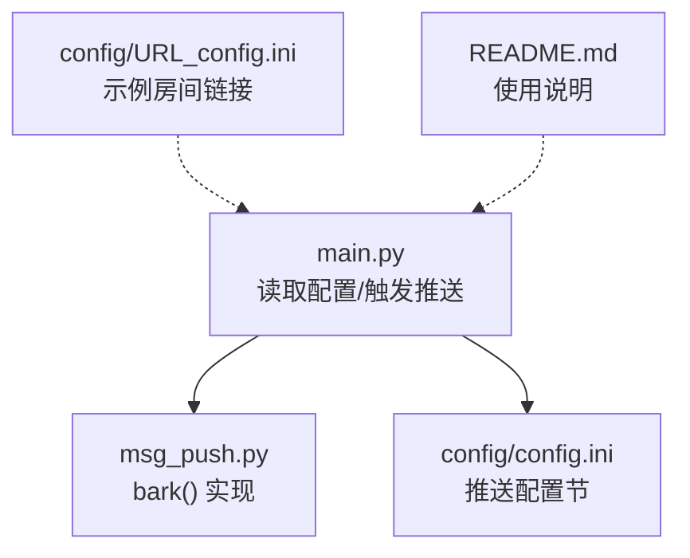
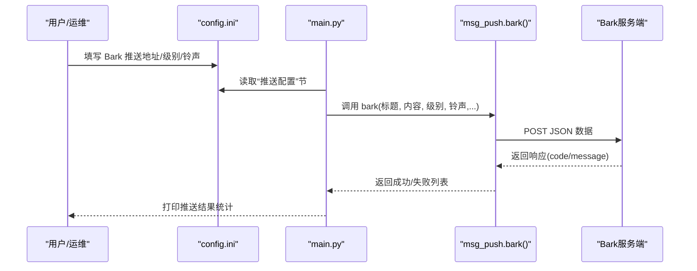
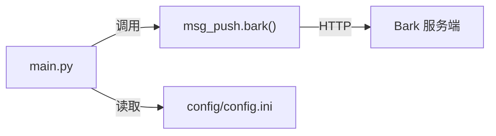
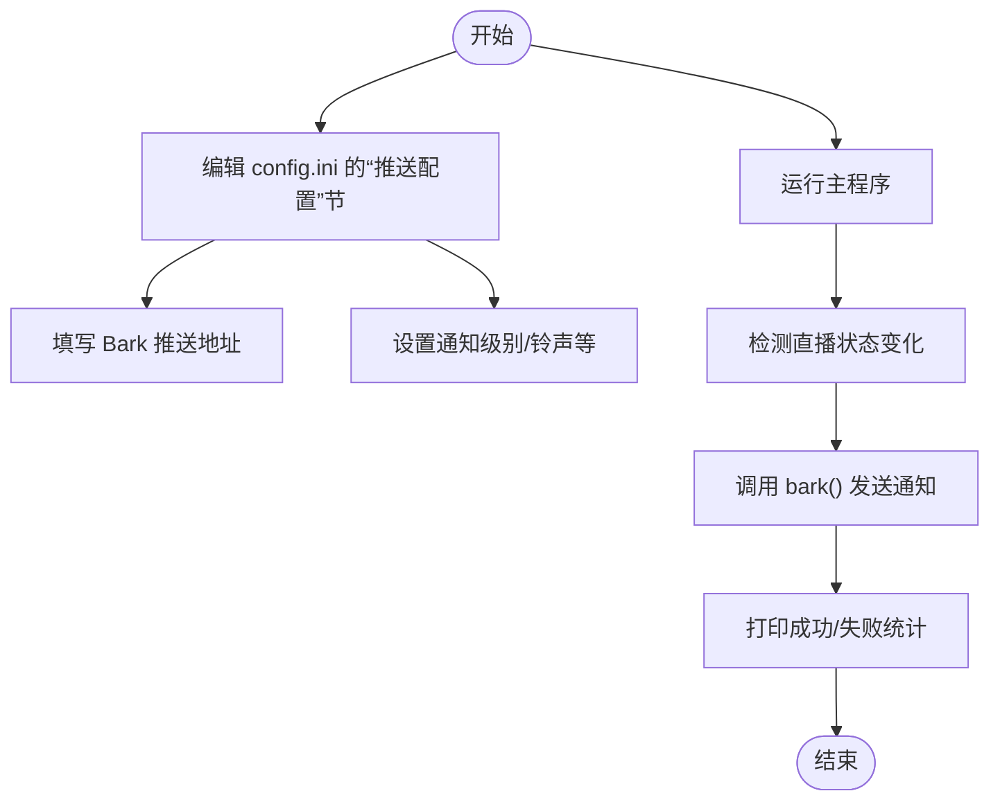

# Bark推送

<cite>
**本文引用的文件**
- [msg_push.py](file://msg_push.py)
- [main.py](file://main.py)
- [README.md](file://README.md)
- [config/config.ini](file://config/config.ini)
- [config/URL_config.ini](file://config/URL_config.ini)
</cite>

## 目录
1. [简介](#简介)
2. [项目结构](#项目结构)
3. [核心组件](#核心组件)
4. [架构总览](#架构总览)
5. [详细组件分析](#详细组件分析)
6. [依赖分析](#依赖分析)
7. [性能考量](#性能考量)
8. [故障排查指南](#故障排查指南)
9. [结论](#结论)
10. [附录](#附录)

## 简介
本文件面向使用者与维护者，系统性说明项目中的 Bark 推送能力：如何在本地或服务器部署 Bark 服务端，如何在客户端获取推送地址，如何在本项目中配置与调用 bark() 函数，以及如何结合项目整体流程实现直播状态通知。同时给出参数说明、配置示例、个性化设置、批量推送管理、通知样式与持久化等技术细节。

## 项目结构
与 Bark 推送相关的模块与文件分布如下：
- 推送实现：msg_push.py 提供 bark() 等多种推送方法
- 配置入口：main.py 读取 config.ini 的“推送配置”节，注入 Bark 推送参数
- 配置样例：config/config.ini 包含“推送配置”节及各项键位
- 示例配置：config/URL_config.ini 提供示例直播房间链接
- 使用说明：README.md 提供项目总体使用说明

图表来源
- [main.py](file://main.py)
- [msg_push.py](file://msg_push.py)
- [config/config.ini](file://config/config.ini)
- [config/URL_config.ini](file://config/URL_config.ini)
- [README.md](file://README.md)

章节来源
- [main.py](file://main.py)
- [msg_push.py](file://msg_push.py)
- [config/config.ini](file://config/config.ini)
- [config/URL_config.ini](file://config/URL_config.ini)
- [README.md](file://README.md)

## 核心组件
- bark() 函数：负责向一个或多个 Bark 推送地址发送 JSON 请求，返回成功与失败列表
- 推送触发：在直播状态变化时，由主流程调用 bark() 并传入标题、内容与个性化参数
- 配置项：通过 config.ini 的“推送配置”节读取 Bark 推送地址、级别、铃声等

章节来源
- [msg_push.py](file://msg_push.py)
- [main.py](file://main.py)

## 架构总览
下图展示从配置到推送的关键交互路径：

图表来源
- [main.py](file://main.py)
- [msg_push.py](file://msg_push.py)
- [config/config.ini](file://config/config.ini)

## 详细组件分析

### Bark 推送函数 bark() 参数说明
bark() 支持对单个或多个推送地址进行批量推送（逗号分隔）。其关键参数含义如下：
- api: 推送目标地址，支持逗号分隔的多个地址
- title: 通知标题，默认为 "message"
- content: 通知正文，默认为 "test"
- level: 通知级别，如 "active"/"timeSensitive"/"passive" 等
- badge: 应用徽章数
- auto_copy: 是否自动复制正文到剪贴板
- sound: 铃声名称
- icon: 图标 URL
- group: 分组名称
- is_archive: 是否归档
- url: 点击跳转链接

返回值为字典，包含成功与失败的地址列表，便于统计与重试。

章节来源
- [msg_push.py](file://msg_push.py)

### 配置项与读取流程
- 配置文件：config/config.ini 的“推送配置”节包含以下键：
  - 直播状态推送渠道：用于控制是否启用各类推送（含 Bark）
  - bark推送接口链接：Bark 推送地址
  - bark推送中断级别：通知级别
  - bark推送铃声：推送铃声
  - 自定义推送标题/开播/关播内容
  - 其他推送渠道配置（如钉钉、微信、TG、邮件、Ntfy、PushPlus）
- 读取逻辑：main.py 在初始化阶段从 config.ini 读取上述键值，并在推送时作为参数传入 bark()

章节来源
- [main.py](file://main.py)
- [config/config.ini](file://config/config.ini)

### 推送触发与集成
- 触发时机：当直播状态发生变化（如开播/关播）时，主流程会按配置选择推送渠道
- 调用方式：将标题、内容与个性化参数（如级别、铃声）传入 bark()
- 结果处理：打印成功/失败数量，便于监控与排障

章节来源
- [main.py](file://main.py)

### 通知样式与消息持久化
- 通知样式：可通过 level、sound、icon、group 等参数定制外观与行为
- 消息持久化：Bark 服务端通常会保留历史消息，便于设备间同步与查阅
- 设备同步：同一账户在不同设备上可看到一致的历史消息与分组

章节来源
- [msg_push.py](file://msg_push.py)

### 批量推送管理
- 地址批量：在配置中使用逗号分隔多个 Bark 地址，bark() 会逐一推送
- 结果统计：返回成功/失败列表，便于后续重试或告警
- 注意事项：若某地址失败，不影响其他地址的推送；建议对失败地址单独重试

章节来源
- [msg_push.py](file://msg_push.py)

### 配置示例与个性化设置
- 获取推送地址
  - 在本地或自建服务器部署 Bark 服务端后，获取对应的推送地址（通常形如 https://.../key/）
  - 将该地址填入 config.ini 的“bark推送接口链接”
- 个性化设置
  - 通知级别：根据重要程度选择 "active"/"timeSensitive"/"passive"
  - 铃声：指定服务端支持的铃声名称
  - 图标/分组/归档/链接：按需设置，提升可读性与可操作性
- 标题与内容
  - 可通过“自定义推送标题”统一风格
  - 开播/关播内容可分别配置，便于区分场景

章节来源
- [config/config.ini](file://config/config.ini)
- [main.py](file://main.py)
- [msg_push.py](file://msg_push.py)

## 依赖分析
- 模块耦合
  - main.py 仅通过函数调用与配置读取依赖 msg_push.bark()
  - 配置读取集中在 main.py，降低跨模块耦合
- 外部依赖
  - 依赖 HTTP 客户端（urllib）向 Bark 服务端发起请求
  - 依赖配置文件提供参数来源

图表来源
- [main.py](file://main.py)
- [msg_push.py](file://msg_push.py)
- [config/config.ini](file://config/config.ini)

章节来源
- [main.py](file://main.py)
- [msg_push.py](file://msg_push.py)
- [config/config.ini](file://config/config.ini)

## 性能考量
- 批量推送的并发与超时
  - bark() 对每个地址独立请求，建议控制地址数量与重试策略
  - 超时时间默认较短，网络不稳定时可考虑重试机制
- 网络与服务端稳定性
  - 服务端可用性直接影响推送成功率
  - 建议在高可用环境下部署 Bark 服务端，并监控响应延迟与错误率

## 故障排查指南
- 常见问题
  - 推送地址无效：确认地址格式与末尾斜杠
  - 服务端返回非 200：检查服务端日志与网络连通性
  - 参数不生效：确认 config.ini 中键名与大小写一致
- 定位方法
  - 查看主流程打印的成功/失败计数
  - 检查 config.ini 的“推送配置”节是否正确填写
  - 使用最小化示例（仅填写必要键）验证流程

章节来源
- [msg_push.py](file://msg_push.py)
- [main.py](file://main.py)
- [config/config.ini](file://config/config.ini)

## 结论
本项目通过 bark() 函数与配置驱动，实现了灵活、可扩展的 Bark 推送能力。结合批量地址支持与结果统计，能够在直播状态变化时及时通知用户。建议在生产环境中合理设置通知级别与铃声，完善服务端高可用与监控，以获得稳定可靠的推送体验。

## 附录

### 配置键位速览（来自 config.ini 的“推送配置”节）
- 直播状态推送渠道
- bark推送接口链接
- bark推送中断级别
- bark推送铃声
- 自定义推送标题
- 自定义开播推送内容
- 自定义关播推送内容
- 只推送通知不录制
- 直播推送检测频率（秒）

章节来源
- [config/config.ini](file://config/config.ini)
- [main.py](file://main.py)

### 使用流程（概念示意）

图表来源
- [main.py](file://main.py)
- [msg_push.py](file://msg_push.py)
- [config/config.ini](file://config/config.ini)