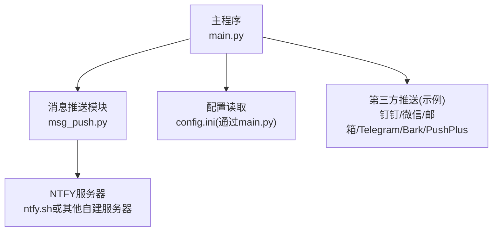
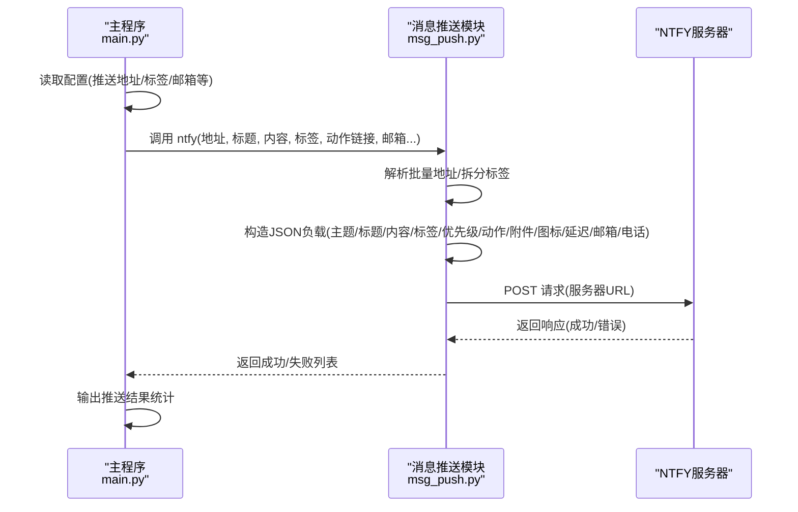
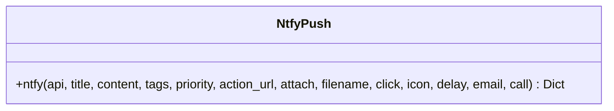
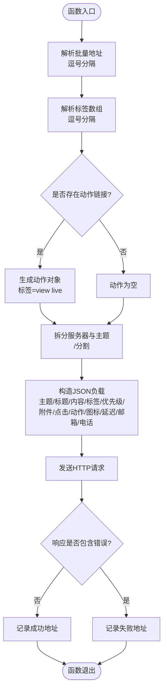
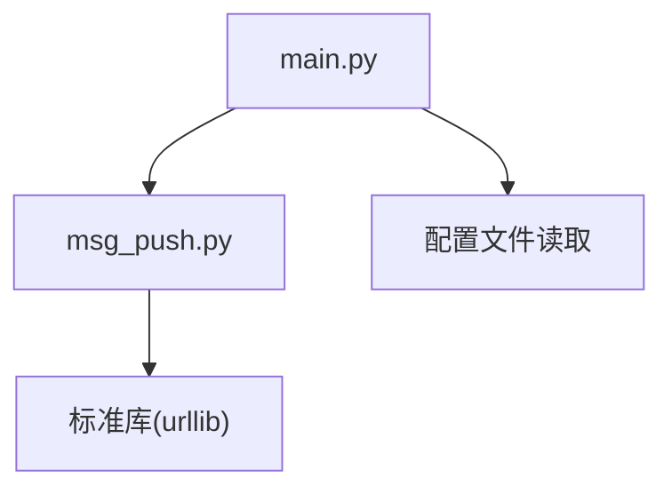

# NTFY推送

<cite>
**本文档引用的文件**
- [msg_push.py](file://msg_push.py)
- [main.py](file://main.py)
- [README.md](file://README.md)
- [requirements.txt](file://requirements.txt)
</cite>

## 目录
1. [简介](#简介)
2. [项目结构](#项目结构)
3. [核心组件](#核心组件)
4. [架构总览](#架构总览)
5. [详细组件分析](#详细组件分析)
6. [依赖关系分析](#依赖关系分析)
7. [性能考量](#性能考量)
8. [故障排查指南](#故障排查指南)
9. [结论](#结论)
10. [附录](#附录)

## 简介
本节介绍NTFY推送功能在项目中的定位与作用。NTFY是一种基于HTTP的推送协议，支持主题订阅、标签、优先级、动作按钮、附件、图标、延迟等多种特性。本项目通过统一的消息推送模块实现了对NTFY的封装，允许用户在直播状态变化时向NTFY服务器推送通知，并可携带直播链接、标签、优先级等参数。

- 项目中NTFY推送由独立模块提供，支持批量推送地址（逗号分隔）、标签数组、动作按钮、附件、图标、延迟、邮箱、电话等参数。
- 主程序在配置中启用NTFY推送后，会在直播状态变更时调用NTFY推送函数，实现跨平台通知。

章节来源
- [README.md: 545](file://README.md#L545)
- [msg_push.py: 168-213:168-213](file://msg_push.py#L168-L213)
- [main.py: 327-344:327-344](file://main.py#L327-L344)

## 项目结构
与NTFY推送相关的文件与职责如下：
- msg_push.py：提供多种推送能力，其中包含ntfy()函数，负责将消息发送到NTFY服务器。
- main.py：主程序入口，负责读取配置、组装推送内容，并在直播状态变化时调用推送函数。
- README.md：项目说明，包含NTFY推送功能的新增记录与使用背景。
- requirements.txt：项目依赖，包含httpx等网络相关库，为推送模块提供HTTP客户端能力。

图表来源
- [main.py: 327-344:327-344](file://main.py#L327-L344)
- [msg_push.py: 168-213:168-213](file://msg_push.py#L168-L213)

章节来源
- [main.py: 68-70:68-70](file://main.py#L68-L70)
- [requirements.txt: 1-7:1-7](file://requirements.txt#L1-L7)

## 核心组件
- ntfy()函数：实现NTFY推送的核心逻辑，支持批量推送地址、标签数组、动作按钮、附件、图标、延迟、邮箱、电话等参数。
- 推送调度：主程序在直播状态变化时，按配置选择推送渠道并调用相应函数，其中包含NTFY推送。

章节来源
- [msg_push.py: 168-213:168-213](file://msg_push.py#L168-L213)
- [main.py: 327-344:327-344](file://main.py#L327-L344)

## 架构总览
下图展示了NTFY推送在系统中的调用流程与数据流向：

图表来源
- [main.py: 327-344:327-344](file://main.py#L327-L344)
- [msg_push.py: 168-213:168-213](file://msg_push.py#L168-L213)

## 详细组件分析

### ntfy()函数参数说明
ntfy()函数接收以下参数，用于控制推送行为与内容：
- api: NTFY推送地址，支持逗号分隔的多个地址；每个地址应包含服务器URL与主题。
- title: 推送标题，默认为"message"。
- content: 推送内容，默认为"test"。
- tags: 标签字符串，支持逗号分隔的多个标签；默认为"tada"。
- priority: 推送优先级，整数，默认为3。
- action_url: 动作链接，当提供时会生成“查看直播”动作按钮。
- attach: 附件URL，用于推送媒体附件。
- filename: 附件文件名，配合attach使用。
- click: 点击行为URL，点击通知时触发。
- icon: 图标URL，用于显示通知图标。
- delay: 延迟策略，用于延后推送生效。
- email: 邮箱地址，用于将通知同时投递到邮箱。
- call: 电话号码，用于将通知投递到电话。

参数解析与构造要点：
- 批量地址解析：将逗号分隔的api字符串拆分为多个地址，逐个发送。
- 标签解析：将逗号分隔的tags字符串拆分为数组。
- 动作按钮：当action_url存在时，生成动作对象，标签为"view live"。
- JSON负载：包含主题(topic)、标题(title)、内容(message)、标签(tags)、优先级(priority)、附件(attach/ filename)、点击(click)、动作(actions)、图标(icon)、延迟(delay)、邮箱(email)、电话(call)等字段。

章节来源
- [msg_push.py: 168-213:168-213](file://msg_push.py#L168-L213)

### 主程序中的NTFY集成
主程序在读取配置后，将NTFY相关参数注入到推送函数中：
- ntfy_api：NTFY推送地址。
- ntfy_tags：NTFY推送标签。
- ntfy_email：NTFY推送邮箱。
- live_url：直播链接，作为动作按钮的URL。

推送调度逻辑：
- push_message()函数根据配置选择推送渠道，当包含"NTFY"时，调用ntfy()并将直播URL作为动作链接传入。

章节来源
- [main.py: 1854-1856:1854-1856](file://main.py#L1854-L1856)
- [main.py: 340-342:340-342](file://main.py#L340-L342)

### 类关系图（代码级）

图表来源
- [msg_push.py: 168-213:168-213](file://msg_push.py#L168-L213)

### 推送流程图（算法实现）

图表来源
- [msg_push.py: 168-213:168-213](file://msg_push.py#L168-L213)

## 依赖关系分析
- 模块依赖：主程序导入msg_push模块中的ntfy函数；msg_push模块内部使用urllib进行HTTP请求。
- 第三方库：requirements.txt中包含httpx，虽然ntfy函数未直接使用httpx，但项目整体具备HTTP客户端能力。

图表来源
- [main.py: 34-36:34-36](file://main.py#L34-L36)
- [requirements.txt: 1-7:1-7](file://requirements.txt#L1-L7)

章节来源
- [main.py: 34-36:34-36](file://main.py#L34-L36)
- [requirements.txt: 1-7:1-7](file://requirements.txt#L1-L7)

## 性能考量
- 批量推送：ntfy()函数支持逗号分隔的多个推送地址，逐个发送，注意网络并发与超时控制。
- 超时设置：HTTP请求设置了固定超时时间，建议结合网络状况评估是否需要调整。
- 并发与重试：主程序未对ntfy推送进行重试机制，若需增强可靠性，可在调用侧增加重试逻辑。

章节来源
- [msg_push.py: 195-212:195-212](file://msg_push.py#L195-L212)

## 故障排查指南
常见问题与处理建议：
- 推送地址格式错误：确保每个api地址包含服务器URL与主题，使用"/"分割。
- 标签与动作：标签应为合法的NTFY标签集合；动作按钮仅在提供action_url时生效。
- HTTP错误：当NTFY服务器返回错误时，函数会捕获HTTPError并打印错误信息。
- 异常处理：一般异常会被捕获并记录失败地址，便于后续排查。
- 配置项缺失：若配置中未设置NTFY相关参数，主程序不会触发NTFY推送。

章节来源
- [msg_push.py: 206-212:206-212](file://msg_push.py#L206-L212)
- [main.py: 1854-1856:1854-1856](file://main.py#L1854-L1856)

## 结论
本项目通过msg_push模块中的ntfy()函数，提供了对NTFY推送协议的完整封装，支持批量地址、标签、动作按钮、附件、图标、延迟、邮箱、电话等参数。主程序在配置启用后，能够在直播状态变化时自动推送通知，并将直播链接作为动作按钮传递给NTFY服务器，实现跨平台的即时通知体验。

## 附录

### NTFY推送配置示例
- 启用渠道：在配置中设置直播状态推送渠道包含"NTFY"。
- 推送地址：填写NTFY服务器地址与主题，支持多个地址以逗号分隔。
- 标签：填写NTFY标签，多个标签以逗号分隔。
- 邮箱：填写邮箱地址，使通知同时投递到邮箱。
- 动作链接：填写直播链接，将在通知中生成“查看直播”动作按钮。

章节来源
- [main.py: 1836](file://main.py#L1836)
- [main.py: 1854-1856:1854-1856](file://main.py#L1854-L1856)
- [main.py: 340-342:340-342](file://main.py#L340-L342)

### NTFY协议特性与安全
- 协议特性：支持主题订阅、标签、优先级、动作按钮、附件、图标、延迟、邮箱与电话等。
- 安全性：项目未内置认证机制，建议使用受信任的NTFY服务器或自建服务器，并在服务器端配置访问控制与TLS加密。
- 跨平台支持：通过HTTP协议实现，可在任意支持HTTP的平台使用。

章节来源
- [msg_push.py: 177-193:177-193](file://msg_push.py#L177-L193)