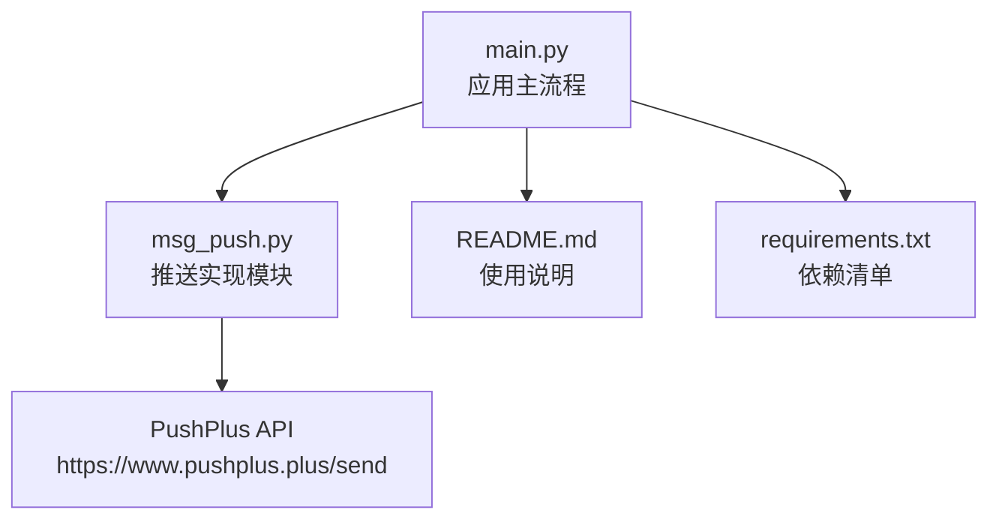
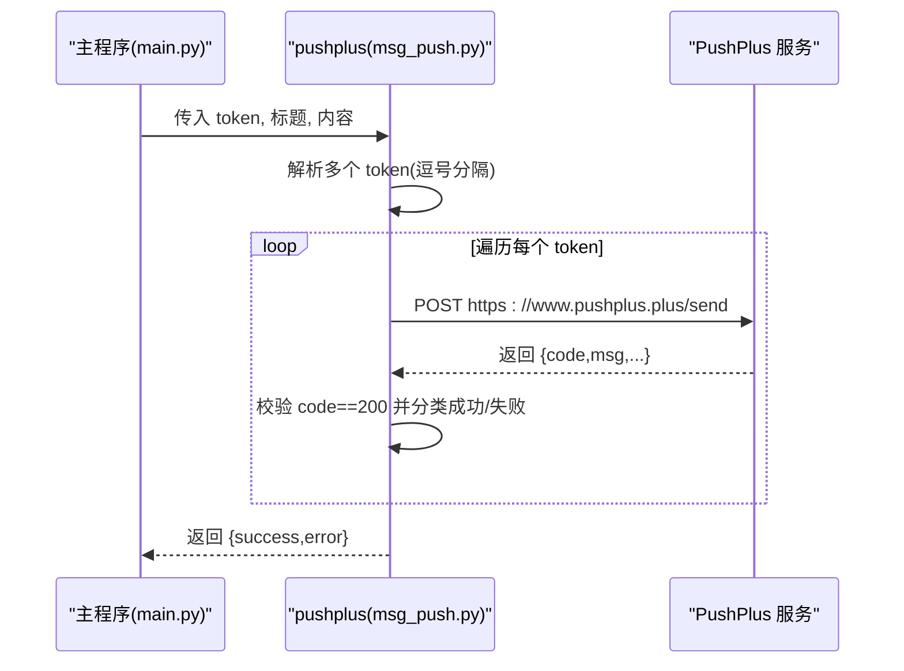
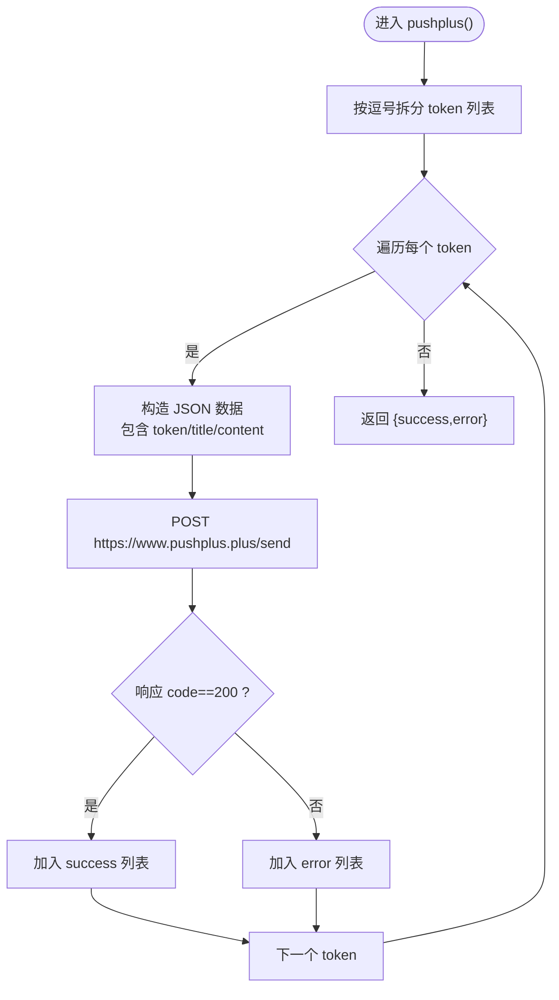
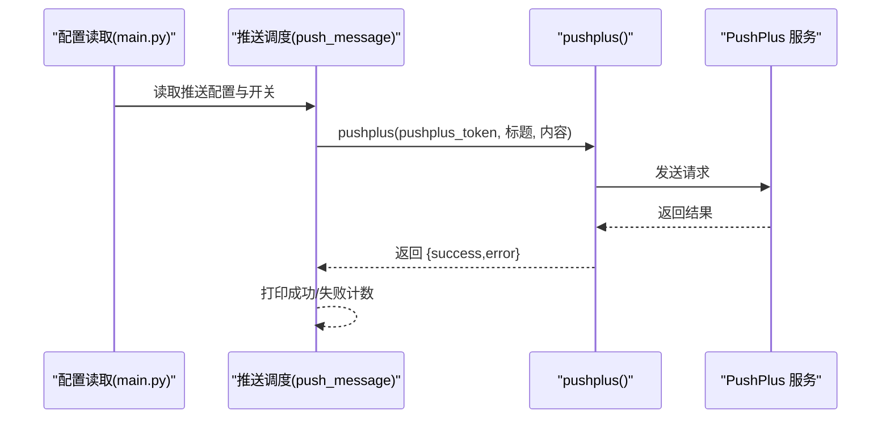
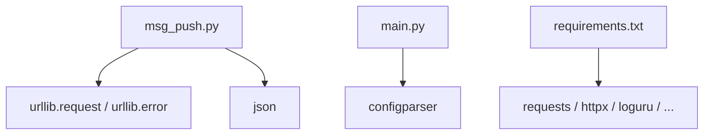

# PushPlus推送

<cite>
**本文档引用的文件**
- [msg_push.py](file://msg_push.py)
- [main.py](file://main.py)
- [README.md](file://README.md)
- [requirements.txt](file://requirements.txt)
</cite>

## 目录
1. [简介](#简介)
2. [项目结构](#项目结构)
3. [核心组件](#核心组件)
4. [架构总览](#架构总览)
5. [详细组件分析](#详细组件分析)
6. [依赖分析](#依赖分析)
7. [性能与可靠性](#性能与可靠性)
8. [故障排查指南](#故障排查指南)
9. [结论](#结论)
10. [附录](#附录)

## 简介
本章节面向使用 PushPlus 推送能力的用户，提供从配置到调用、从参数说明到最佳实践的完整文档。PushPlus 是一个统一的消息推送通道聚合平台，支持多种推送渠道与模板。在本项目中，PushPlus 推送通过独立模块封装，便于在直播状态变更时统一触发。

- PushPlus 官方文档入口：https://www.pushplus.plus/doc/

## 项目结构
与 PushPlus 相关的关键文件与职责如下：
- msg_push.py：集中实现各类推送方法，包含 pushplus() 函数及其调用示例。
- main.py：应用主流程，负责读取配置、组装推送内容、按配置选择推送渠道并调用 pushplus()。
- README.md：项目总体介绍与使用说明。
- requirements.txt：运行依赖清单。

**图表来源**
- [main.py:327-344](file://main.py#L327-L344)
- [msg_push.py:216-249](file://msg_push.py#L216-L249)
- [README.md:104-121](file://README.md#L104-L121)
- [requirements.txt:1-7](file://requirements.txt#L1-L7)

**章节来源**
- [main.py:327-344](file://main.py#L327-L344)
- [msg_push.py:216-249](file://msg_push.py#L216-L249)
- [README.md:104-121](file://README.md#L104-L121)
- [requirements.txt:1-7](file://requirements.txt#L1-L7)

## 核心组件
- pushplus() 函数：封装 PushPlus 推送逻辑，支持多 Token 批量推送与错误统计。
- 推送调度：在主流程中按配置选择推送渠道，统一调用 pushplus()。

关键要点
- 支持传入多个 Token（逗号分隔），逐个推送并统计成功/失败数量。
- 返回结构包含 success 与 error 列表，便于上层判断与日志输出。
- 调用目标地址固定为 PushPlus 的发送接口。

**章节来源**
- [msg_push.py:216-249](file://msg_push.py#L216-L249)
- [main.py:327-344](file://main.py#L327-L344)

## 架构总览
下图展示 PushPlus 在项目中的调用链路与数据流向：

**图表来源**
- [main.py:327-344](file://main.py#L327-L344)
- [msg_push.py:216-249](file://msg_push.py#L216-L249)

## 详细组件分析

### pushplus() 函数详解
- 功能：向 PushPlus 发送推送消息，支持多 Token 批量推送。
- 输入参数
  - token: 字符串。支持单个或多个 Token（逗号分隔）。
  - title: 字符串。推送标题。
  - content: 字符串。推送正文内容。
- 输出结果
  - 返回字典，包含 success 与 error 两个键，分别列出成功/失败的 token。
- 实现要点
  - 将 token 按逗号拆分为列表，逐个构造 JSON 请求体并发送。
  - 依据返回 JSON 的 code 字段判断是否成功；非 200 视为失败。
  - 异常捕获并记录错误信息，同时将对应 token 归入 error。

**图表来源**
- [msg_push.py:216-249](file://msg_push.py#L216-L249)

**章节来源**
- [msg_push.py:216-249](file://msg_push.py#L216-L249)

### 配置与调用流程
- 配置项（来自配置文件）
  - 推送渠道 live_status_push：包含 PUSHPLUS 时启用 PushPlus 推送。
  - pushplus 推送 token pushplus_token：PushPlus 的访问令牌。
  - 自定义推送标题 push_message_title：推送标题，默认“直播间状态更新通知”。
  - 开播/关播推送内容 begin_push_message_text / over_push_message_text：可选自定义内容。
- 调用时机
  - 开播/关播事件触发时，按配置选择渠道并调用 pushplus()。
  - 返回结果用于打印成功/失败数量，便于监控。

**图表来源**
- [main.py:1836-1864](file://main.py#L1836-L1864)
- [main.py:327-344](file://main.py#L327-L344)
- [msg_push.py:216-249](file://msg_push.py#L216-L249)

**章节来源**
- [main.py:1836-1864](file://main.py#L1836-L1864)
- [main.py:327-344](file://main.py#L327-L344)

### 参数说明与配置项对照
- pushplus() 参数
  - token: 支持多个 Token（逗号分隔），实现多通道/多用户推送。
  - title: 标题文本。
  - content: 正文内容。
- 配置文件项
  - 推送渠道 live_status_push：包含 PUSHPLUS 时启用。
  - pushplus 推送 token pushplus_token：PushPlus 的访问令牌。
  - 自定义推送标题 push_message_title：推送标题默认值。
  - 开播/关播推送内容 begin_push_message_text / over_push_message_text：可选自定义内容。

注意
- 配置项均通过配置读取函数统一获取，不存在则写入默认值并创建配置文件。

**章节来源**
- [main.py:1836-1864](file://main.py#L1836-L1864)
- [msg_push.py:216-249](file://msg_push.py#L216-L249)

### 配置示例与使用建议
- 获取 Token
  - 登录 PushPlus 平台，进入个人中心获取 Token。
- 配置文件设置
  - 在配置文件的“推送配置”节中设置：
    - 推送渠道：live_status_push 包含 PUSHPLUS
    - pushplus 推送 token：pushplus_token 填写获取到的 Token
    - 自定义推送标题：push_message_title（可选）
    - 开播/关播内容：begin_push_message_text / over_push_message_text（可选）
- 多 Token 推送
  - 在 pushplus_token 中填入多个 Token，使用英文逗号分隔，实现多通道/多用户广播。

**章节来源**
- [main.py:1836-1864](file://main.py#L1836-L1864)
- [msg_push.py:216-249](file://msg_push.py#L216-L249)

## 依赖分析
- 运行依赖
  - requests、httpx 等网络库用于 HTTP 请求。
  - loguru、PyCryptodome、distro、tqdm、PyExecJS 等辅助库。
- PushPlus 调用依赖
  - 仅依赖标准库 urllib 与 json 进行 HTTP 请求与 JSON 解析。
  - 无第三方 HTTP 库硬性依赖，便于在受限环境下部署。

**图表来源**
- [msg_push.py:10-22](file://msg_push.py#L10-L22)
- [requirements.txt:1-7](file://requirements.txt#L1-L7)

**章节来源**
- [requirements.txt:1-7](file://requirements.txt#L1-L7)
- [msg_push.py:10-22](file://msg_push.py#L10-L22)

## 性能与可靠性
- 并发与重试
  - pushplus() 逐个推送 token，未内置重试机制；如需高可用，建议在上层调用处增加重试策略。
- 超时控制
  - 请求超时设置为 10 秒，可根据网络状况调整。
- 批量推送
  - 支持多 Token 批量推送，适合多用户/多通道场景；注意服务端限流与配额。
- 错误处理
  - 对异常与非 200 响应进行捕获与分类，便于定位问题。

**章节来源**
- [msg_push.py:232-247](file://msg_push.py#L232-L247)

## 故障排查指南
常见问题与处理建议
- 无法收到推送
  - 检查 pushplus_token 是否正确填写。
  - 确认 live_status_push 已包含 PUSHPLUS。
  - 查看返回结果中的 error 列表，定位失败 token。
- 返回非 200
  - 查看服务端返回的 msg 字段，确认 Token 有效性与配额情况。
- 网络异常
  - 检查本地网络与防火墙设置，必要时配置代理。
  - 如需更高可靠性，可在调用处增加重试与降级策略。

定位线索
- 返回结构包含 success 与 error，便于统计与日志输出。
- 异常信息会打印到控制台，便于快速定位。

**章节来源**
- [msg_push.py:240-247](file://msg_push.py#L240-L247)

## 结论
PushPlus 在本项目中提供了统一、简洁的推送能力。通过配置文件与 pushplus() 函数，用户可轻松实现多 Token 批量推送与灵活的内容定制。建议结合项目主流程的推送调度机制，按需开启开播/关播推送，并在生产环境中完善重试与监控策略。

## 附录

### API 文档与服务特点
- 官方文档入口：https://www.pushplus.plus/doc/
- 服务特点（摘自官方文档）
  - 多通道聚合：支持多种推送渠道与模板。
  - 简洁易用：提供统一接口与标准化响应。
  - 模板与格式：支持富文本、Markdown 等多种消息格式（详见官方文档）。

**章节来源**
- [msg_push.py:217-220](file://msg_push.py#L217-L220)

### 使用限制与最佳实践
- 使用限制
  - 请遵守 PushPlus 平台的配额与速率限制，避免触发风控。
- 最佳实践
  - 使用多 Token 实现多用户/多通道广播。
  - 在上层调用处增加重试与降级策略，提升可靠性。
  - 结合项目主流程的推送开关与内容定制，实现开播/关播差异化推送。

**章节来源**
- [main.py:1836-1864](file://main.py#L1836-L1864)
- [msg_push.py:216-249](file://msg_push.py#L216-L249)