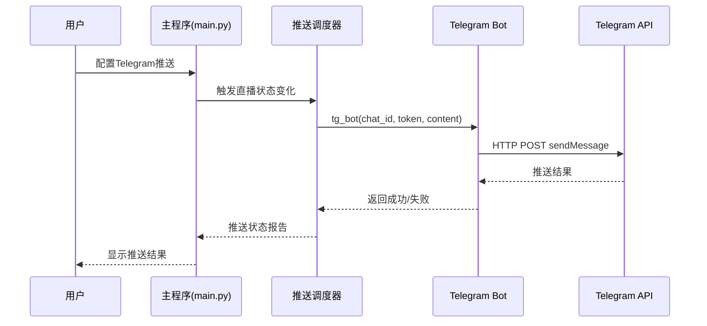
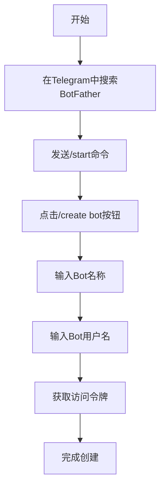
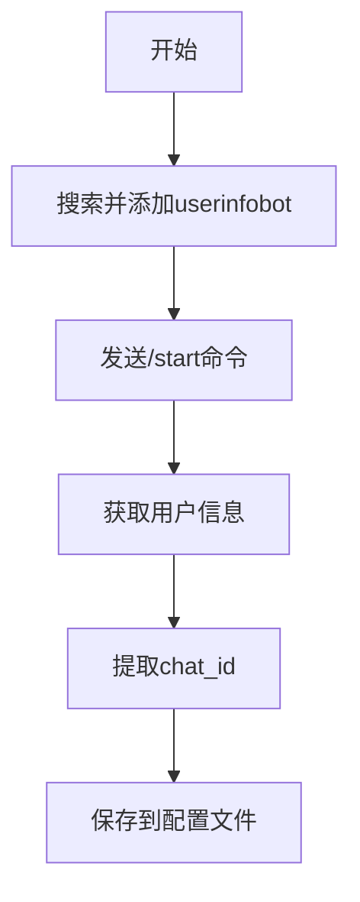
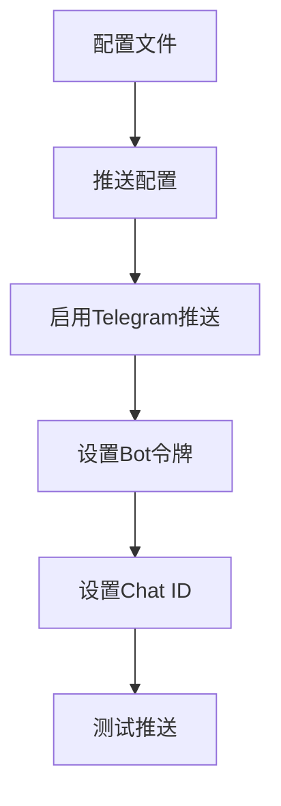
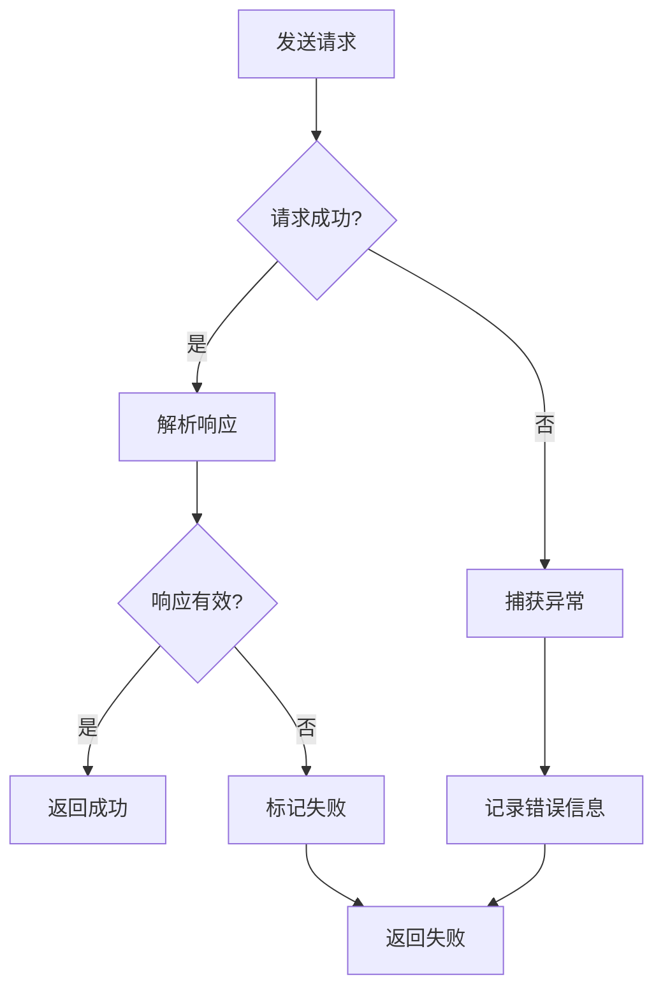
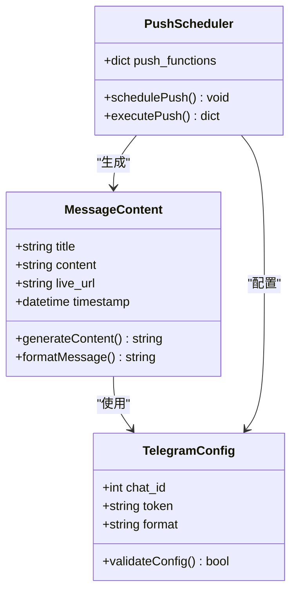
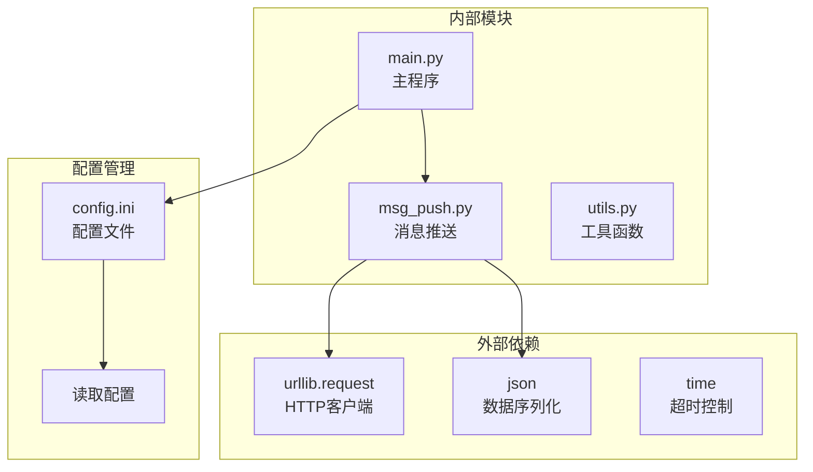
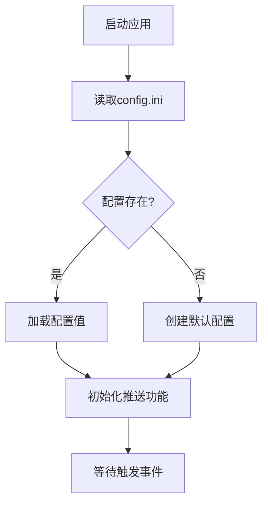
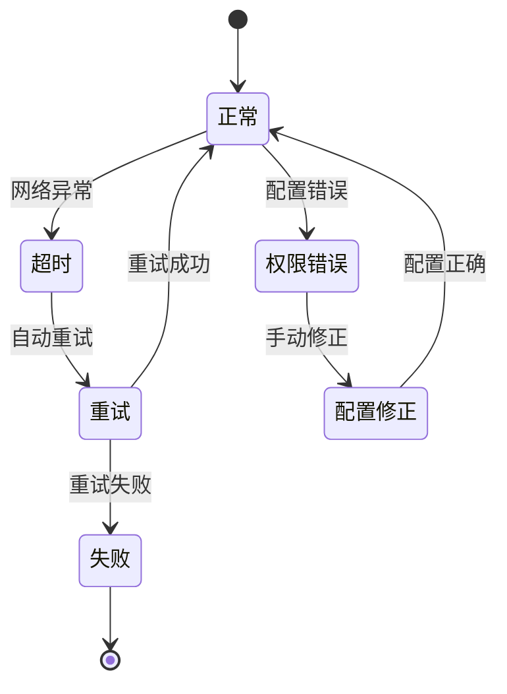

# Telegram推送

<cite>
**本文档引用的文件**
- [msg_push.py](file://msg_push.py)
- [main.py](file://main.py)
- [README.md](file://README.md)
- [demo.py](file://demo.py)
</cite>

## 目录
1. [简介](#简介)
2. [项目结构](#项目结构)
3. [核心组件](#核心组件)
4. [架构概览](#架构概览)
5. [详细组件分析](#详细组件分析)
6. [依赖关系分析](#依赖关系分析)
7. [性能考虑](#性能考虑)
8. [故障排除指南](#故障排除指南)
9. [结论](#结论)

## 简介

Telegram推送功能是DouyinLiveRecorder直播录制工具的重要组成部分，允许用户在直播状态发生变化时接收实时通知。该功能通过Telegram Bot API实现，支持私聊推送和群组推送两种模式。

Telegram推送功能具有以下特点：
- 实时直播状态通知
- 支持多种推送渠道集成
- 简洁的API接口设计
- 完善的错误处理机制
- 支持批量推送配置

## 项目结构

该项目采用模块化设计，Telegram推送功能位于独立的消息推送模块中：

```mermaid
graph TB
subgraph "项目结构"
A[main.py<br/>主程序入口]
B[msg_push.py<br/>消息推送模块]
C[config/<br/>配置文件]
D[src/<br/>源代码模块]
end
subgraph "推送功能模块"
E[tg_bot()<br/>Telegram推送函数]
F[push_message()<br/>推送调度器]
G[配置管理<br/>config.ini]
end
A --> B
B --> E
A --> F
F --> E
A --> G
```

**图表来源**
- [main.py:327-354](file://main.py#L327-L354)
- [msg_push.py:114-129](file://msg_push.py#L114-L129)

**章节来源**
- [main.py:327-354](file://main.py#L327-L354)
- [msg_push.py:114-129](file://msg_push.py#L114-L129)

## 核心组件

### tg_bot()函数

`tg_bot()`函数是Telegram推送功能的核心实现，负责与Telegram Bot API进行通信。

**函数签名**: `tg_bot(chat_id: int, token: str, content: str) -> Dict[str, Any]`

**参数说明**:
- `chat_id`: Telegram聊天ID，支持个人私聊和群组ID
- `token`: Telegram Bot访问令牌，从BotFather获取
- `content`: 要发送的消息内容

**返回值**:
- 成功时返回: `{"success": [1], "error": []}`
- 失败时返回: `{"success": [], "error": [1]}`

**实现特点**:
- 使用HTTP请求发送JSON格式数据
- 设置15秒超时时间
- 包含完整的异常处理机制
- 返回标准化的结果格式

**章节来源**
- [msg_push.py:114-129](file://msg_push.py#L114-L129)

### 推送调度器

`push_message()`函数负责协调各种推送渠道，包括Telegram推送。

**功能特性**:
- 支持多种推送渠道集成
- 动态配置推送目标
- 统一的错误处理机制
- 实时推送状态反馈

**章节来源**
- [main.py:327-354](file://main.py#L327-L354)

## 架构概览

Telegram推送功能在整个系统中的位置和交互关系如下：



**图表来源**
- [main.py:327-354](file://main.py#L327-L354)
- [msg_push.py:114-129](file://msg_push.py#L114-L129)

## 详细组件分析

### Telegram Bot配置流程

#### 1. 创建Bot (BotFather)



**操作步骤**:
1. 在Telegram中搜索"BotFather"机器人
2. 发送 `/start` 命令启动
3. 点击 `/newbot` 创建新Bot
4. 输入Bot名称（例如：MyLiveNotifier）
5. 输入Bot用户名（必须以bot结尾，如：my_live_notifier_bot）
6. 记录生成的访问令牌

#### 2. 获取Chat ID



**获取方式**:
1. 在Telegram中搜索"userinfobot"
2. 发送 `/start` 命令
3. 查看返回的用户信息
4. 提取chat_id字段值
5. 保存到config.ini配置文件

#### 3. 配置推送渠道



**配置选项**:
- `live_status_push`: 启用的推送渠道（如："TG"）
- `tgapi令牌`: Telegram Bot访问令牌
- `tg聊天id(个人或者群组id)`: 目标聊天ID

**章节来源**
- [main.py:1844-1845](file://main.py#L1844-L1845)

### API调用方法

#### HTTP请求结构

Telegram推送使用标准的HTTP POST请求：

**请求URL**: `https://api.telegram.org/bot{token}/sendMessage`

**请求头**:
- `Content-Type: application/json`

**请求体**:
```json
{
    "chat_id": 123456789,
    "text": "直播状态更新通知"
}
```

#### 错误处理机制



**异常类型**:
- 网络连接超时
- API响应错误
- 配置参数无效
- 权限不足

**章节来源**
- [msg_push.py:114-129](file://msg_push.py#L114-L129)

### 消息格式设置

#### 文本消息格式

Telegram支持多种文本格式：

**基本格式**:
- 普通文本消息
- Markdown格式
- HTML格式

**消息限制**:
- 最大长度：4096字符
- 支持表情符号
- 支持特殊字符

#### 自定义消息内容



**图表来源**
- [main.py:327-354](file://main.py#L327-L354)

**章节来源**
- [main.py:327-354](file://main.py#L327-L354)

## 依赖关系分析

### 组件耦合度



**依赖关系特点**:
- 低耦合设计，模块职责明确
- 最小化外部依赖
- 内置配置管理系统
- 异常处理机制完善

**章节来源**
- [msg_push.py:10-22](file://msg_push.py#L10-L22)
- [main.py:34-36](file://main.py#L34-L36)

### 配置管理

#### 配置文件结构

| 配置项 | 类型 | 描述 | 示例 |
|--------|------|------|------|
| `live_status_push` | 字符串 | 启用的推送渠道 | "TG,微信,钉钉" |
| `tgapi令牌` | 字符串 | Telegram Bot访问令牌 | "123456789:ABC-DEF1234ghIkl-mnOPQrstUVWxyz789" |
| `tg聊天id(个人或者群组id)` | 整数 | 目标聊天ID | 123456789 |

#### 配置读取流程



**章节来源**
- [main.py:1836-1845](file://main.py#L1836-L1845)

## 性能考虑

### 请求优化策略

1. **超时控制**: 设置15秒超时时间，避免长时间阻塞
2. **重试机制**: 支持自动重试失败的推送请求
3. **并发处理**: 支持多渠道并行推送
4. **资源管理**: 合理管理HTTP连接和内存使用

### 错误恢复



## 故障排除指南

### 常见问题及解决方案

#### 1. Bot令牌无效

**症状**: 推送失败，显示令牌错误
**解决方案**:
1. 重新在BotFather中创建Bot
2. 确认令牌格式正确
3. 检查令牌是否过期

#### 2. Chat ID获取失败

**症状**: 无法收到推送消息
**解决方案**:
1. 确保已添加userinfobot
2. 检查Chat ID格式（整数类型）
3. 验证目标用户是否已启动Bot

#### 3. 网络连接问题

**症状**: 推送超时或连接失败
**解决方案**:
1. 检查网络连接状态
2. 配置代理设置（如需要）
3. 增加超时时间

#### 4. 权限不足

**症状**: API返回权限错误
**解决方案**:
1. 确保Bot已启动
2. 检查目标用户是否已阻止Bot
3. 验证群组权限设置

**章节来源**
- [msg_push.py:127-129](file://msg_push.py#L127-L129)

### 调试技巧

1. **启用详细日志**: 查看推送过程中的详细信息
2. **测试连接**: 使用简单的测试消息验证配置
3. **检查API状态**: 确认Telegram API可用性
4. **验证参数**: 确保所有必需参数都已正确设置

## 结论

Telegram推送功能为DouyinLiveRecorder提供了强大的实时通知能力。通过简洁的API设计和完善的错误处理机制，用户可以轻松实现直播状态的实时推送。

**主要优势**:
- 配置简单，易于使用
- 支持多种推送渠道
- 完善的错误处理
- 良好的性能表现
- 丰富的配置选项

**适用场景**:
- 直播录制监控
- 直播状态通知
- 团队协作提醒
- 个人直播管理

通过合理配置和使用，Telegram推送功能能够显著提升直播录制工具的实用性和用户体验。