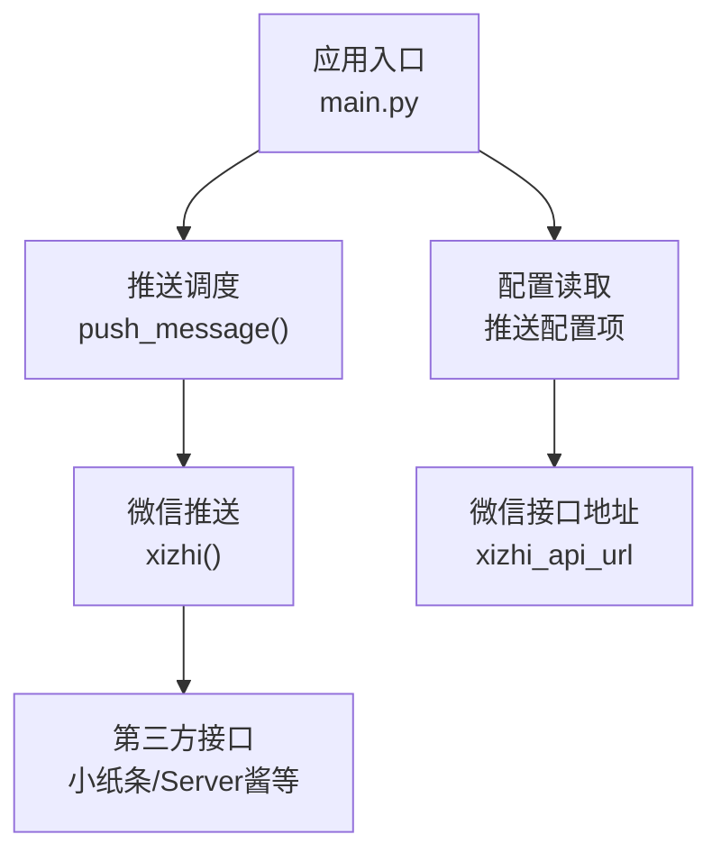
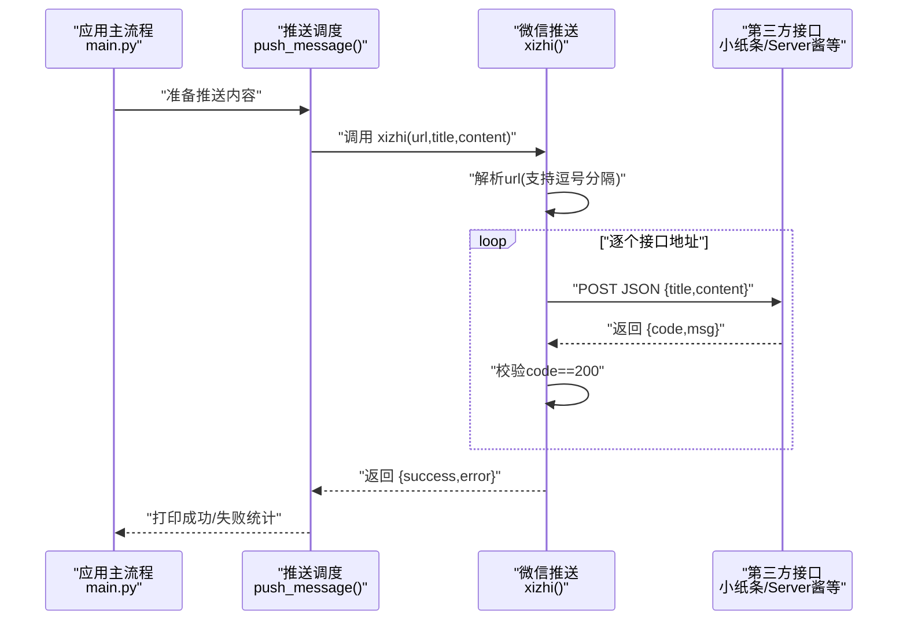
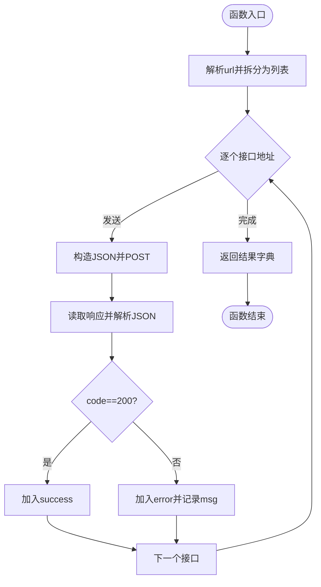
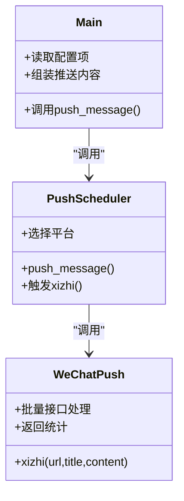
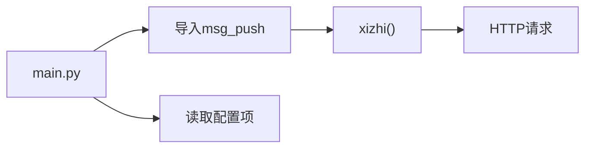

# 微信推送

<cite>
**本文引用的文件**
- [msg_push.py](file://msg_push.py)
- [main.py](file://main.py)
- [README.md](file://README.md)
- [config/URL_config.ini](file://config/URL_config.ini)
</cite>

## 目录
1. [简介](#简介)
2. [项目结构](#项目结构)
3. [核心组件](#核心组件)
4. [架构总览](#架构总览)
5. [详细组件分析](#详细组件分析)
6. [依赖关系分析](#依赖关系分析)
7. [性能与可靠性](#性能与可靠性)
8. [故障排查指南](#故障排查指南)
9. [结论](#结论)
10. [附录](#附录)

## 简介
本章节面向“微信推送”功能的使用者与维护者，提供从配置到调用、从消息格式到推送时机的完整说明。重点覆盖：
- 个人推送接口与第三方平台API（如小纸条、Server酱等）的接入方式
- xizhi() 函数的参数与行为说明
- 推送接口获取方法、使用限制与兼容性要点
- 在项目中的集成方式与调用流程

## 项目结构
与微信推送直接相关的模块与入口如下：
- msg_push.py：封装各类推送能力，包含微信推送函数 xizhi()
- main.py：应用主流程，负责读取配置、组装推送内容并在合适时机调用推送函数
- README.md：项目总体说明，包含推送功能的历史与使用背景
- config/URL_config.ini：示例URL配置文件，用于演示如何添加/管理直播房间链接

图表来源
- [main.py:327-354](file://main.py#L327-L354)
- [msg_push.py:59-82](file://msg_push.py#L59-L82)

章节来源
- [main.py:327-354](file://main.py#L327-L354)
- [msg_push.py:59-82](file://msg_push.py#L59-L82)
- [README.md:104-121](file://README.md#L104-L121)
- [config/URL_config.ini:1-5](file://config/URL_config.ini#L1-L5)

## 核心组件
- xizhi(url, title, content)：微信推送核心函数，支持批量接口地址（逗号分隔），统一发送相同标题与内容
- push_message(record_name, live_url, content)：应用层统一推送调度，按配置选择目标平台并触发对应推送
- 配置项：来自配置文件的“微信推送接口链接”等项，驱动推送行为

章节来源
- [msg_push.py:59-82](file://msg_push.py#L59-L82)
- [main.py:327-354](file://main.py#L327-L354)
- [main.py:1835-1837](file://main.py#L1835-L1837)

## 架构总览
微信推送在项目中的调用链路如下：

图表来源
- [main.py:327-354](file://main.py#L327-L354)
- [msg_push.py:59-82](file://msg_push.py#L59-L82)

## 详细组件分析

### xizhi() 函数详解
- 功能：向一个或多个微信推送接口发送JSON消息，支持批量地址（逗号分隔）
- 输入参数
  - url: 字符串，支持多个接口地址，用英文逗号分隔；若包含中文逗号将被替换为英文逗号
  - title: 字符串，推送标题
  - content: 字符串，推送正文
- 请求与响应
  - 请求：application/json，POST到每个接口地址
  - 响应：期望返回包含“code”字段的对象；当code为200时表示成功
- 返回值：字典，包含“success”和“error”两个键，分别列出成功与失败的接口地址
- 异常处理：捕获异常并记录错误信息，同时将对应接口地址加入“error”

图表来源
- [msg_push.py:59-82](file://msg_push.py#L59-L82)

章节来源
- [msg_push.py:59-82](file://msg_push.py#L59-L82)

### 配置与调用集成
- 配置项
  - “微信推送接口链接”：用于驱动 xizhi() 的 url 参数
  - “直播状态推送渠道”：控制是否启用微信推送
  - “自定义推送标题/内容”：可定制推送标题与内容模板
- 调用方式
  - 应用在合适时机（如开播/关播）调用 push_message()，内部根据配置选择“微信”渠道并传入标题与内容
  - push_message() 会并发/异步触发各平台推送，包括微信

图表来源
- [main.py:327-354](file://main.py#L327-L354)
- [main.py:1835-1837](file://main.py#L1835-L1837)
- [msg_push.py:59-82](file://msg_push.py#L59-L82)

章节来源
- [main.py:327-354](file://main.py#L327-L354)
- [main.py:1835-1837](file://main.py#L1835-L1837)

### 第三方平台API（小纸条、Server酱等）
- 接口形态：均以HTTP POST 接收JSON消息，字段通常包含标题与内容
- 使用方法：将第三方平台提供的“单点推送接口链接”填入“微信推送接口链接”，即可复用 xizhi() 的调用逻辑
- 批量支持：可在配置中填入多个接口地址（英文逗号分隔），实现一次性推送到多个平台

章节来源
- [msg_push.py:59-82](file://msg_push.py#L59-L82)
- [msg_push.py:262-266](file://msg_push.py#L262-L266)

### 消息格式与推送时机
- 消息格式：JSON，包含标题与内容两个字段
- 推送时机：由应用层在开播、关播或周期性检测时触发；可通过配置项控制是否仅推送不录制、推送检测频率等

章节来源
- [msg_push.py:64-67](file://msg_push.py#L64-L67)
- [main.py:1085-1101](file://main.py#L1085-L1101)
- [main.py:1858-1864](file://main.py#L1858-L1864)

## 依赖关系分析
- 模块耦合
  - main.py 通过导入 msg_push.py 中的 xizhi() 实现微信推送
  - main.py 通过配置项决定是否启用微信推送及如何组织推送内容
- 外部依赖
  - HTTP客户端：使用标准库HTTP请求发起推送
  - 配置文件：读取推送配置项，初始化运行参数

图表来源
- [main.py:34-36](file://main.py#L34-L36)
- [msg_push.py:10-22](file://msg_push.py#L10-L22)

章节来源
- [main.py:34-36](file://main.py#L34-L36)
- [msg_push.py:10-22](file://msg_push.py#L10-L22)

## 性能与可靠性
- 批量接口处理：xizhi() 支持多个接口地址，逐个发送，便于扩展到多个平台
- 超时与异常：请求设置超时，异常被捕获并记录，不影响整体流程
- 成功/失败统计：返回字典包含成功与失败列表，便于监控与重试策略制定

章节来源
- [msg_push.py:62-67](file://msg_push.py#L62-L67)
- [msg_push.py:68-82](file://msg_push.py#L68-L82)

## 故障排查指南
- 常见问题
  - 接口返回非200：检查第三方平台接口文档与参数，确认返回体中“code”字段含义
  - 地址格式错误：确认填入的“微信推送接口链接”为有效HTTP(S)地址
  - 中文逗号：配置中若使用中文逗号，会被自动替换为英文逗号；建议统一使用英文逗号
  - 超时或网络异常：检查网络连通性与代理设置
- 定位方法
  - 查看返回字典中的“error”列表，定位失败接口
  - 关注控制台输出的错误信息，包含失败原因与接口地址

章节来源
- [msg_push.py:74-82](file://msg_push.py#L74-L82)
- [msg_push.py:262-266](file://msg_push.py#L262-L266)

## 结论
微信推送在本项目中通过 xizhi() 函数实现，具备良好的扩展性与容错能力。通过配置项可灵活启用与定制推送行为，结合第三方平台API（如小纸条、Server酱等），满足多样化的推送需求。建议在生产环境中：
- 统一使用英文逗号分隔多个接口地址
- 明确第三方接口的返回规范，确保“code”字段为200时视为成功
- 结合应用层的推送时机策略，合理设置推送频率与内容模板

## 附录

### A. 配置项速查
- 微信推送接口链接：填入第三方平台提供的单点推送接口
- 直播状态推送渠道：包含“微信”时启用微信推送
- 自定义推送标题：推送标题模板
- 自定义开播/关播推送内容：推送内容模板
- 只推送通知不录制：可选关闭录制，仅推送
- 直播推送检测频率：单位秒

章节来源
- [main.py:1835-1837](file://main.py#L1835-L1837)
- [main.py:1858-1864](file://main.py#L1858-L1864)

### B. 示例与最佳实践
- 示例：在配置中填入第三方平台接口地址，即可复用 xizhi() 的调用逻辑
- 批量：在配置中填入多个接口地址（英文逗号分隔），实现一次性推送到多个平台
- 消息格式：保持标题与内容字段，遵循第三方平台的字段命名约定

章节来源
- [msg_push.py:59-82](file://msg_push.py#L59-L82)
- [msg_push.py:262-266](file://msg_push.py#L262-L266)