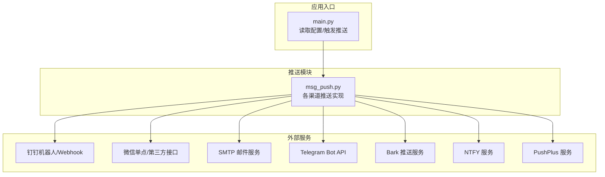
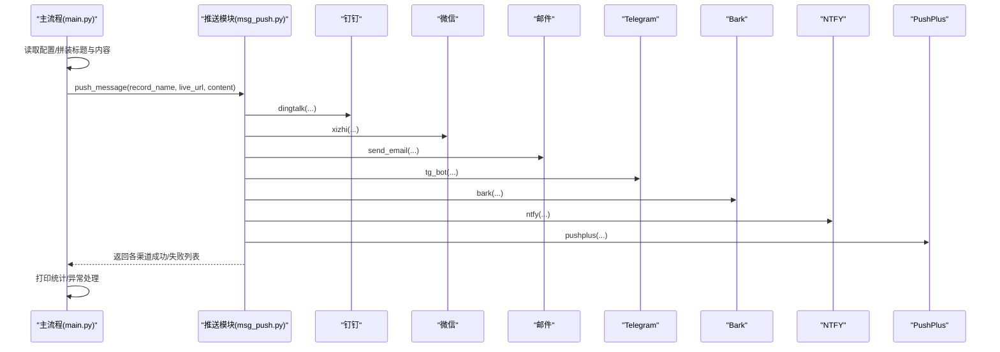
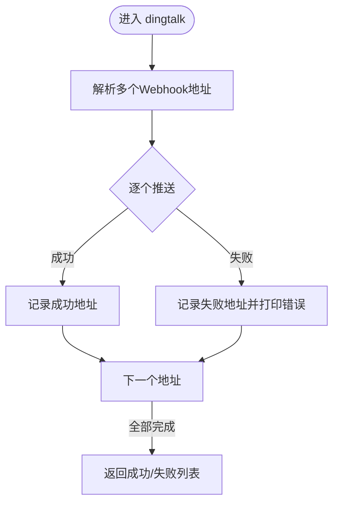
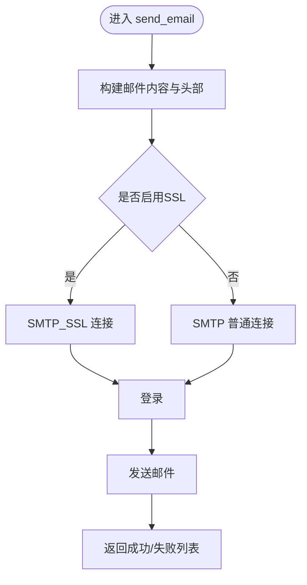
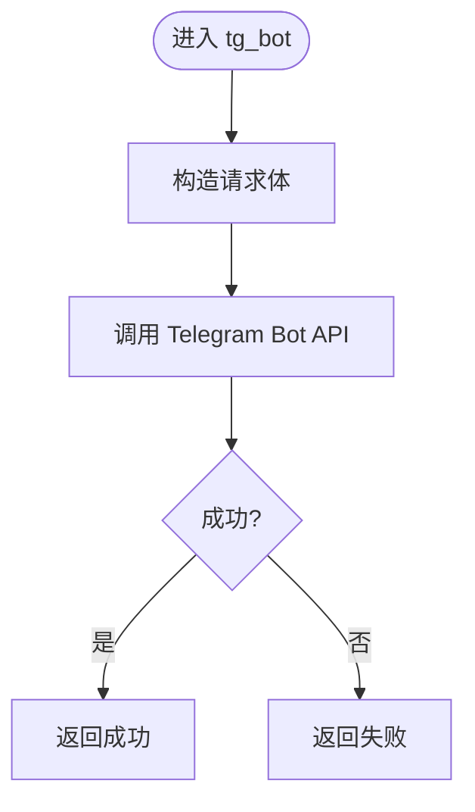
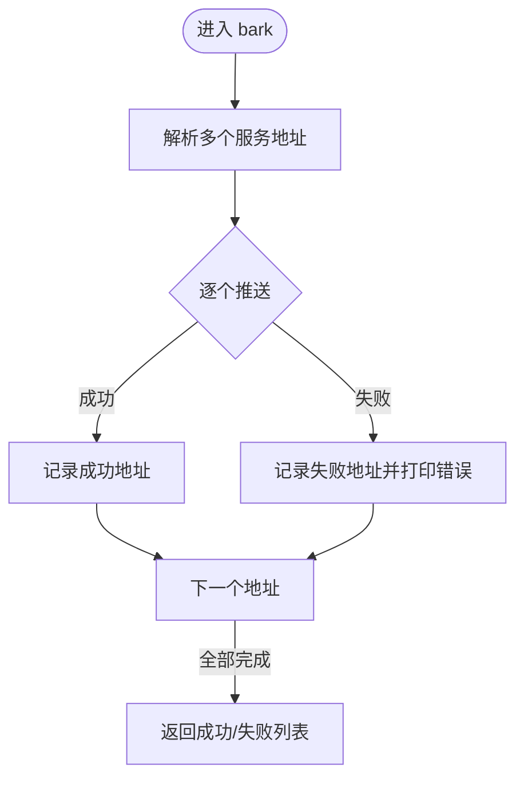
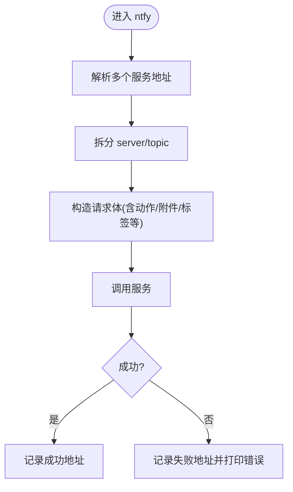
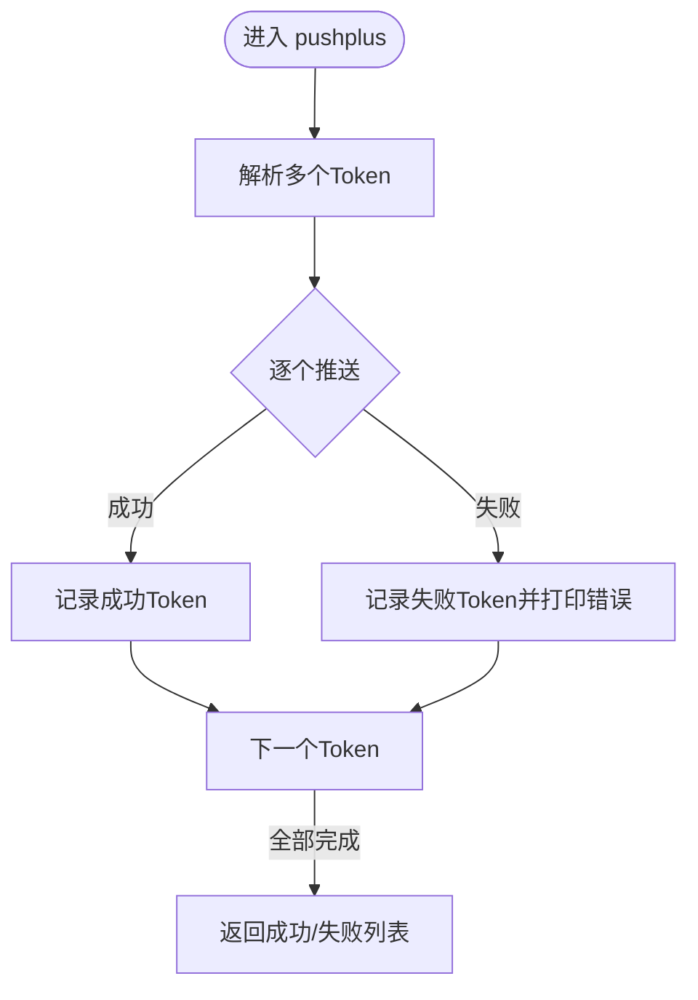
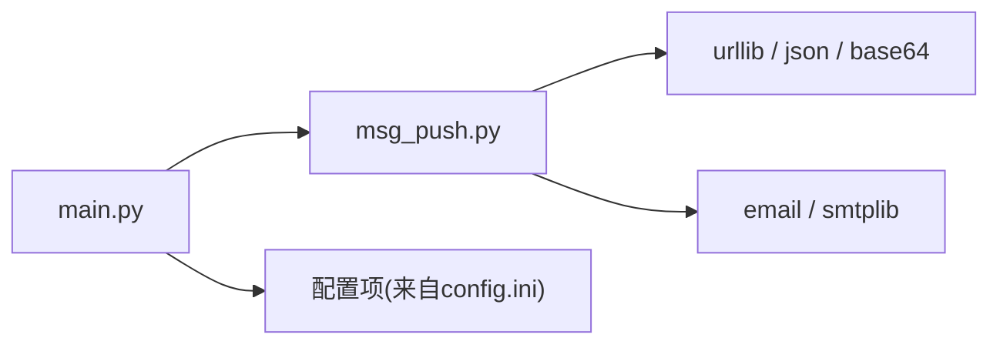

# 消息推送系统

<cite>
**本文引用的文件**
- [msg_push.py](file://msg_push.py)
- [main.py](file://main.py)
- [README.md](file://README.md)
- [requirements.txt](file://requirements.txt)
- [config/URL_config.ini](file://config/URL_config.ini)
</cite>

## 目录
1. [简介](#简介)
2. [项目结构](#项目结构)
3. [核心组件](#核心组件)
4. [架构总览](#架构总览)
5. [详细组件分析](#详细组件分析)
6. [依赖关系分析](#依赖关系分析)
7. [性能与可靠性](#性能与可靠性)
8. [故障排除指南](#故障排除指南)
9. [结论](#结论)
10. [附录](#附录)

## 简介
本文件为“消息推送系统”的功能文档，聚焦于直播录制工具中的消息推送能力，覆盖钉钉、微信、邮件、Telegram、Bark、NTFY、PushPlus 等渠道的集成与使用。文档从系统架构、组件职责、数据与控制流、错误处理、性能与安全等方面进行深入说明，并提供配置示例、模板定制、批量推送管理、故障排除与最佳实践。

## 项目结构
推送系统位于独立模块中，由消息推送模块与主流程模块协作完成：
- 消息推送模块：封装各渠道的推送方法与通用逻辑
- 主流程模块：负责读取配置、组装推送内容、调度各渠道推送
- 配置文件：集中管理各渠道的接入参数与开关

图表来源
- [main.py:327-354](file://main.py#L327-L354)
- [msg_push.py:25-249](file://msg_push.py#L25-L249)

章节来源
- [main.py:68-71](file://main.py#L68-L71)
- [main.py:1835-1864](file://main.py#L1835-L1864)
- [config/URL_config.ini:1-5](file://config/URL_config.ini#L1-L5)

## 核心组件
- 钉钉推送：支持文本消息与@全体/指定手机号；支持批量Webhook地址
- 微信推送：支持单点接口与常见第三方通道
- 邮件推送：基于SMTP，支持SSL与端口配置
- Telegram推送：基于Bot API发送文本消息
- Bark推送：支持多参数（级别、铃声、图标、分组等）
- NTFY推送：支持主题、标签、优先级、动作按钮、附件等
- PushPlus推送：基于Token的云端推送服务

章节来源
- [msg_push.py:25-82](file://msg_push.py#L25-L82)
- [msg_push.py:85-112](file://msg_push.py#L85-L112)
- [msg_push.py:114-129](file://msg_push.py#L114-L129)
- [msg_push.py:132-165](file://msg_push.py#L132-L165)
- [msg_push.py:168-213](file://msg_push.py#L168-L213)
- [msg_push.py:216-249](file://msg_push.py#L216-L249)

## 架构总览
推送流程由主流程模块统一调度，按配置启用相应渠道，组装标题与正文，调用对应推送函数并汇总结果。

图表来源
- [main.py:327-354](file://main.py#L327-L354)
- [msg_push.py:25-249](file://msg_push.py#L25-L249)

## 详细组件分析

### 钉钉推送（dingtalk）
- 触发条件：配置启用“钉钉”渠道，传入Webhook地址、可选手机号与@全体标记
- 内容格式：文本消息，支持@全体或指定手机号
- 批量推送：支持逗号分隔的多个Webhook地址
- 错误处理：捕获异常并打印失败地址与错误信息

图表来源
- [msg_push.py:25-56](file://msg_push.py#L25-L56)

章节来源
- [msg_push.py:25-56](file://msg_push.py#L25-L56)

### 微信推送（xizhi）
- 触发条件：配置启用“微信”渠道，传入单点接口地址
- 内容格式：标题与正文
- 批量推送：支持逗号分隔的多个接口地址
- 错误处理：捕获异常并打印失败地址与错误信息

图表来源
- [msg_push.py:59-82](file://msg_push.py#L59-L82)

章节来源
- [msg_push.py:59-82](file://msg_push.py#L59-L82)

### 邮件推送（send_email）
- 触发条件：配置启用“邮箱”渠道，提供SMTP服务器、端口、SSL开关、发件人凭据与收件人
- 内容格式：纯文本正文，支持发件人昵称Base64编码
- 批量推送：支持逗号分隔的多个收件人
- 错误处理：捕获SMTP异常并打印失败收件人列表

图表来源
- [msg_push.py:85-112](file://msg_push.py#L85-L112)

章节来源
- [msg_push.py:85-112](file://msg_push.py#L85-L112)

### Telegram推送（tg_bot）
- 触发条件：配置启用“TG”，提供Bot令牌与聊天ID
- 内容格式：文本消息
- 错误处理：捕获异常并打印失败信息

图表来源
- [msg_push.py:114-129](file://msg_push.py#L114-L129)

章节来源
- [msg_push.py:114-129](file://msg_push.py#L114-L129)

### Bark推送（bark）
- 触发条件：配置启用“BARK”，提供服务地址
- 内容格式：标题、正文、级别、徽章、自动复制、铃声、图标、分组、归档、跳转链接等
- 批量推送：支持逗号分隔的多个服务地址
- 错误处理：捕获异常并打印失败地址与错误信息

图表来源
- [msg_push.py:132-165](file://msg_push.py#L132-L165)

章节来源
- [msg_push.py:132-165](file://msg_push.py#L132-L165)

### NTFY推送（ntfy）
- 触发条件：配置启用“NTFY”，提供服务地址（含主题）
- 内容格式：标题、消息、标签、优先级、动作按钮、附件、点击跳转、图标、延迟、邮箱、通话等
- 批量推送：支持逗号分隔的多个服务地址
- 错误处理：捕获HTTP错误与异常并打印失败地址与错误信息

图表来源
- [msg_push.py:168-213](file://msg_push.py#L168-L213)

章节来源
- [msg_push.py:168-213](file://msg_push.py#L168-L213)

### PushPlus推送（pushplus）
- 触发条件：配置启用“PUSHPLUS”，提供Token
- 内容格式：标题、正文
- 批量推送：支持逗号分隔的多个Token
- 错误处理：捕获异常并打印失败Token与错误信息

图表来源
- [msg_push.py:216-249](file://msg_push.py#L216-L249)

章节来源
- [msg_push.py:216-249](file://msg_push.py#L216-L249)

## 依赖关系分析
- 推送模块依赖标准库（urllib、smtplib、json、base64、email等）
- 主流程模块导入推送模块并按配置调度
- 外部依赖通过HTTP/HTTPS调用各服务API

图表来源
- [msg_push.py:10-22](file://msg_push.py#L10-L22)
- [main.py:34-36](file://main.py#L34-L36)

章节来源
- [requirements.txt:1-7](file://requirements.txt#L1-L7)
- [msg_push.py:10-22](file://msg_push.py#L10-L22)
- [main.py:34-36](file://main.py#L34-L36)

## 性能与可靠性
- 超时控制：各HTTP调用设置超时，避免阻塞主线程
- 异常隔离：每个渠道独立try/except，失败不影响其他渠道
- 批量地址处理：对逗号分隔的多个地址逐一推送，分别记录成功/失败
- 并发推送：主流程以线程方式触发推送，避免阻塞录制流程
- 动态节流：主流程具备动态调整并发请求的机制，间接提升整体稳定性

章节来源
- [msg_push.py:42-56](file://msg_push.py#L42-L56)
- [msg_push.py:68-82](file://msg_push.py#L68-L82)
- [msg_push.py:100-112](file://msg_push.py#L100-L112)
- [msg_push.py:120-129](file://msg_push.py#L120-L129)
- [msg_push.py:151-165](file://msg_push.py#L151-L165)
- [msg_push.py:195-213](file://msg_push.py#L195-L213)
- [msg_push.py:232-249](file://msg_push.py#L232-L249)
- [main.py:1087-1091](file://main.py#L1087-L1091)
- [main.py:298-325](file://main.py#L298-L325)

## 故障排除指南
- 钉钉/微信/Bark/NTFY/PushPlus失败
  - 现象：打印失败地址与错误信息
  - 排查要点：确认地址格式、网络可达性、服务端返回码/错误信息
  - 参考路径：各渠道的异常捕获与打印逻辑
- 邮件发送失败
  - 现象：打印失败收件人列表
  - 排查要点：SMTP服务器、端口、SSL开关、发件人凭据、收件人列表
- Telegram失败
  - 现象：打印失败信息
  - 排查要点：Bot令牌与聊天ID有效性、网络可达性
- 配置未生效
  - 现象：未触发推送
  - 排查要点：确认“直播状态推送渠道”包含目标渠道，且各参数已正确填写
- 批量地址无效
  - 现象：部分成功、部分失败
  - 排查要点：逐个验证地址可用性，关注返回码与错误信息

章节来源
- [msg_push.py:52-56](file://msg_push.py#L52-L56)
- [msg_push.py:78-82](file://msg_push.py#L78-L82)
- [msg_push.py:109-112](file://msg_push.py#L109-L112)
- [msg_push.py:127-129](file://msg_push.py#L127-L129)
- [msg_push.py:160-165](file://msg_push.py#L160-L165)
- [msg_push.py:205-213](file://msg_push.py#L205-L213)
- [msg_push.py:243-249](file://msg_push.py#L243-L249)
- [main.py:1835-1864](file://main.py#L1835-L1864)

## 结论
本推送系统以模块化设计实现多渠道消息推送，具备良好的扩展性与健壮性。通过配置驱动与批量地址支持，满足多样化的推送需求。建议在生产环境中结合监控与重试策略，进一步提升可靠性与可观测性。

## 附录

### 配置项一览（推送相关）
- 直播状态推送渠道：启用的渠道集合（如“微信,钉钉,邮箱,TG,BARK,NTFY,PUSHPLUS”）
- 钉钉推送接口链接：Webhook地址（支持逗号分隔多个）
- 钉钉通知@对象(填手机号)：被@用户的手机号
- 钉钉通知@全体(是/否)：是否@全体
- 微信推送接口链接：单点接口地址（支持逗号分隔多个）
- SMTP邮件服务器：SMTP主机
- 是否使用SMTP服务SSL加密(是/否)：是否启用SSL
- SMTP邮件服务器端口：端口号
- 邮箱登录账号：发件人账号
- 发件人密码(授权码)：发件人授权码
- 发件人邮箱：发件人邮箱
- 发件人显示昵称：发件人显示昵称
- 收件人邮箱：收件人邮箱（支持逗号分隔多个）
- tgapi令牌：Telegram Bot令牌
- tg聊天id(个人或者群组id)：聊天ID
- bark推送接口链接：服务地址（支持逗号分隔多个）
- bark推送中断级别：如 active
- bark推送铃声：如 bell
- ntfy推送地址：服务地址（含主题）
- ntfy推送标签：标签（支持逗号分隔多个）
- ntfy推送邮箱：通知邮箱
- pushplus推送token：Token（支持逗号分隔多个）
- 自定义推送标题：推送标题
- 自定义开播推送内容：开播时的推送内容模板
- 自定义关播推送内容：关播时的推送内容模板
- 只推送通知不录制(是/否)：仅推送不录制
- 直播推送检测频率(秒)：推送检测周期
- 开播推送开启(是/否)：是否发送开播推送
- 关播推送开启(是/否)：是否发送关播推送

章节来源
- [main.py:1835-1864](file://main.py#L1835-L1864)

### 推送模板与占位符
- 开播/关播推送内容支持占位符替换：
  - [直播间名称]：将被替换为实际直播房间名称
  - [时间]：将被替换为推送发生的时间
- 示例模板（可配置）：
  - 开播模板：例如“直播间状态更新：[直播间名称] 正在直播中，时间：[时间]”
  - 关播模板：例如“直播间状态更新：[直播间名称] 已结束直播，时间：[时间]”

章节来源
- [main.py:1081-1101](file://main.py#L1081-L1101)

### 批量推送管理
- 多地址/多Token场景：各渠道均支持逗号分隔的多个地址或Token，系统会逐个推送并分别记录成功/失败
- 地址校验：建议在配置前逐个验证地址可用性，减少批量失败

章节来源
- [msg_push.py:28-41](file://msg_push.py#L28-L41)
- [msg_push.py:62-74](file://msg_push.py#L62-L74)
- [msg_push.py:137-150](file://msg_push.py#L137-L150)
- [msg_push.py:173-193](file://msg_push.py#L173-L193)
- [msg_push.py:223-230](file://msg_push.py#L223-L230)

### 安全与最佳实践
- 凭据保护：敏感信息（如邮箱授权码、Telegram令牌、PushPlus Token）应妥善保管，避免硬编码
- 网络安全：优先使用HTTPS服务地址，启用SSL加密（如适用）
- 限流与降噪：合理设置推送检测频率，避免过于频繁触发
- 日志与监控：结合系统日志与外部监控，及时发现并定位推送异常

章节来源
- [msg_push.py:100-112](file://msg_push.py#L100-L112)
- [main.py:1861-1864](file://main.py#L1861-L1864)