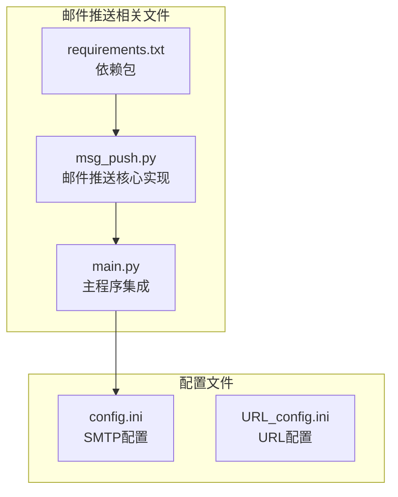
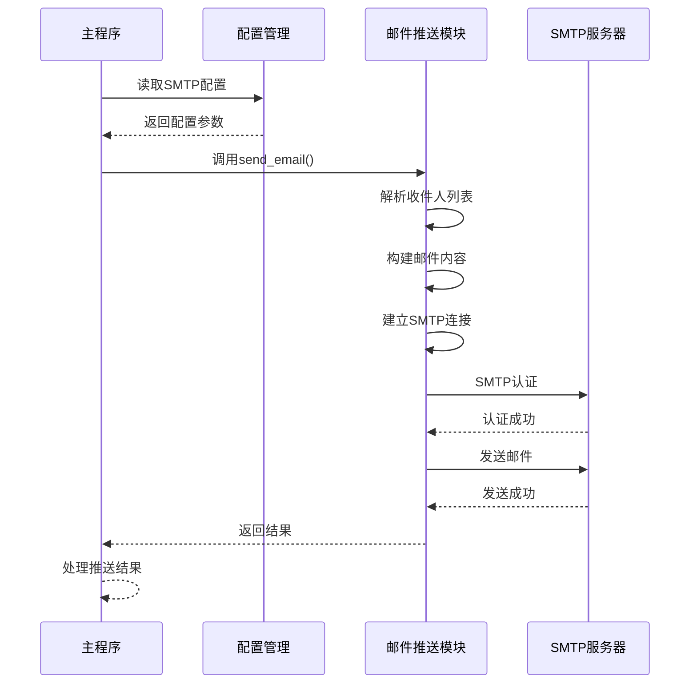
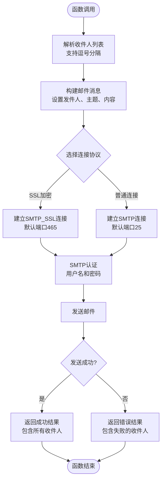
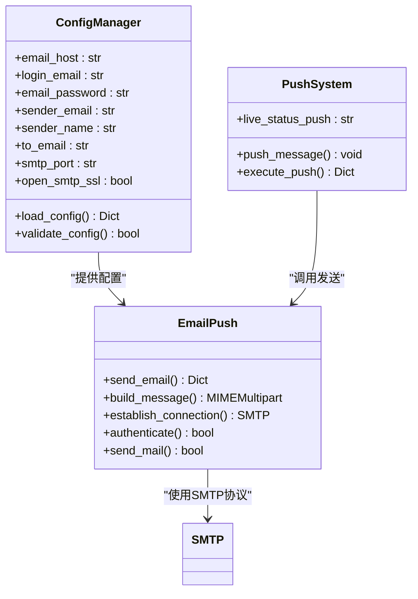
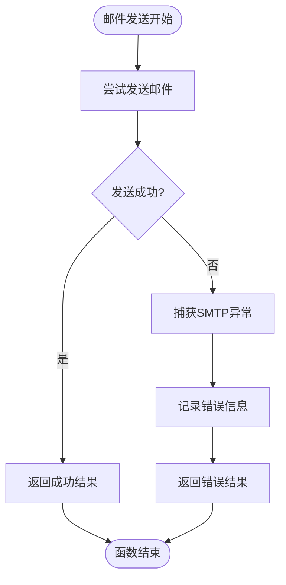
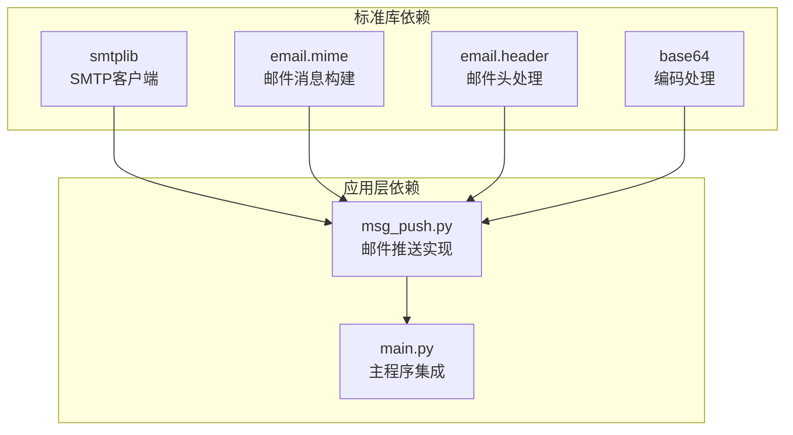
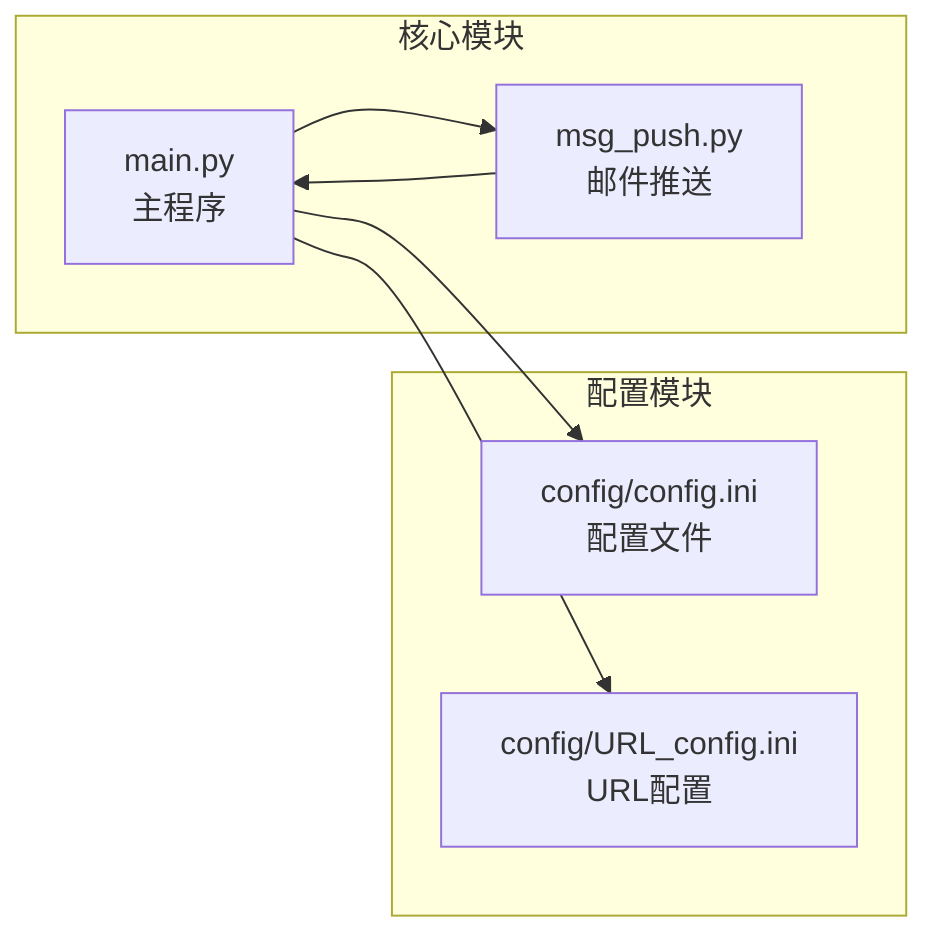

# 邮件推送

<cite>
**本文档引用的文件**
- [msg_push.py](file://msg_push.py)
- [main.py](file://main.py)
- [requirements.txt](file://requirements.txt)
</cite>

## 目录
1. [简介](#简介)
2. [项目结构](#项目结构)
3. [核心组件](#核心组件)
4. [架构概览](#架构概览)
5. [详细组件分析](#详细组件分析)
6. [依赖关系分析](#依赖关系分析)
7. [性能考虑](#性能考虑)
8. [故障排除指南](#故障排除指南)
9. [结论](#结论)

## 简介

本文档详细介绍了DouyinLiveRecorder项目中的邮件推送功能。该功能基于Python标准库的smtplib模块实现，支持通过各种主流邮件服务商的SMTP服务器发送邮件通知。系统提供了完整的SMTP配置选项，包括SSL/TLS加密连接、多种端口选择以及详细的错误处理机制。

邮件推送功能可以与直播监控系统集成，在直播开始、结束或其他重要事件发生时自动发送通知邮件。该功能支持多收件人管理、自定义发件人信息以及灵活的配置选项。

## 项目结构

邮件推送功能主要分布在以下文件中：

**图表来源**
- [msg_push.py:1-296](file://msg_push.py#L1-L296)
- [main.py:327-355](file://main.py#L327-L355)

**章节来源**
- [msg_push.py:1-296](file://msg_push.py#L1-L296)
- [main.py:1846-1853](file://main.py#L1846-L1853)

## 核心组件

### send_email()函数

send_email()函数是邮件推送的核心实现，负责建立SMTP连接、认证并发送邮件。该函数具有以下关键特性：

- **参数验证**：自动处理多个收件人的逗号分隔输入
- **SSL/TLS支持**：根据配置选择SMTP或SMTP_SSL连接
- **发件人信息**：支持自定义发件人昵称和邮箱地址
- **内容格式**：支持纯文本邮件内容
- **错误处理**：完善的异常捕获和错误返回机制

### 配置管理系统

系统通过配置文件集中管理所有SMTP相关的配置参数：

- SMTP服务器地址
- 认证凭据（用户名和密码）
- 发件人信息（邮箱和显示名称）
- 收件人列表
- 连接参数（端口和加密方式）

**章节来源**
- [msg_push.py:85-112](file://msg_push.py#L85-L112)
- [main.py:1846-1853](file://main.py#L1846-L1853)

## 架构概览

邮件推送功能采用模块化设计，与主程序通过清晰的接口进行集成：

**图表来源**
- [main.py:327-355](file://main.py#L327-L355)
- [msg_push.py:85-112](file://msg_push.py#L85-L112)

## 详细组件分析

### send_email()函数实现

send_email()函数实现了完整的邮件发送流程：

**图表来源**
- [msg_push.py:85-112](file://msg_push.py#L85-L112)

#### 函数参数详解

| 参数名 | 类型 | 必需 | 默认值 | 描述 |
|--------|------|------|--------|------|
| email_host | str | 是 | 无 | SMTP服务器地址 |
| login_email | str | 是 | 无 | 登录邮箱地址 |
| email_pass | str | 是 | 无 | 邮箱密码或授权码 |
| sender_email | str | 是 | 无 | 发件人邮箱地址 |
| sender_name | str | 是 | 无 | 发件人显示名称 |
| to_email | str | 是 | 无 | 收件人邮箱列表（逗号分隔） |
| title | str | 是 | 无 | 邮件主题 |
| content | str | 是 | 无 | 邮件正文内容 |
| smtp_port | str | 否 | None | SMTP服务器端口号 |
| open_ssl | bool | 否 | True | 是否使用SSL加密 |

#### 配置选项说明

**SMTP服务器配置**
- 支持常见的邮件服务商（如QQ邮箱、163邮箱等）
- 可配置自定义SMTP服务器地址
- 自动处理端口选择（SSL: 465, 普通: 25）

**认证信息配置**
- 使用邮箱登录账号进行SMTP认证
- 建议使用邮箱提供的"授权码"而非登录密码
- 支持多种邮箱服务商的认证方式

**发件人信息**
- 支持自定义发件人显示名称
- 显示名称支持Base64编码处理
- 发件人邮箱必须与认证邮箱一致

**收件人管理**
- 支持单个或多个收件人
- 收件人列表使用逗号分隔
- 自动处理中文逗号和英文逗号

**章节来源**
- [msg_push.py:85-112](file://msg_push.py#L85-L112)

### 集成配置系统

邮件推送功能与主程序的集成通过配置文件实现：

**图表来源**
- [main.py:1846-1853](file://main.py#L1846-L1853)
- [msg_push.py:85-112](file://msg_push.py#L85-L112)

#### 配置文件参数

| 配置项 | 参数名 | 描述 | 示例值 |
|--------|--------|------|--------|
| SMTP邮件服务器 | email_host | SMTP服务器地址 | smtp.qq.com |
| 邮箱登录账号 | login_email | 邮箱登录用户名 | user@example.com |
| 发件人密码 | email_password | 邮箱密码或授权码 | your_auth_code |
| 发件人邮箱 | sender_email | 实际发件人邮箱 | user@example.com |
| 发件人显示昵称 | sender_name | 显示的发件人名称 | Live Recorder |
| 收件人邮箱 | to_email | 收件人邮箱列表 | recipient1@example.com,recipient2@example.com |
| SMTP邮件服务器端口 | smtp_port | SMTP服务器端口号 | 465 |
| 是否使用SMTP服务SSL加密 | open_smtp_ssl | 是否启用SSL加密 | 是 |

**章节来源**
- [main.py:1846-1853](file://main.py#L1846-L1853)

### 错误处理机制

系统实现了多层次的错误处理机制：

**图表来源**
- [msg_push.py:109-111](file://msg_push.py#L109-L111)

#### 错误类型及处理

| 错误类型 | 触发条件 | 处理方式 | 影响范围 |
|----------|----------|----------|----------|
| SMTP认证失败 | 用户名或密码错误 | 返回错误列表 | 单个收件人 |
| 连接超时 | 网络问题或服务器不可达 | 返回错误列表 | 所有收件人 |
| 邮件格式错误 | 邮件内容或头信息格式问题 | 返回错误列表 | 所有收件人 |
| 权限不足 | 邮箱未开启SMTP服务 | 返回错误列表 | 所有收件人 |

**章节来源**
- [msg_push.py:109-111](file://msg_push.py#L109-L111)

## 依赖关系分析

### 外部依赖

邮件推送功能依赖以下Python标准库：

**图表来源**
- [msg_push.py:10-18](file://msg_push.py#L10-L18)
- [requirements.txt:1-7](file://requirements.txt#L1-7)

### 内部依赖关系

邮件推送功能与主程序的依赖关系：

**图表来源**
- [main.py:34-36](file://main.py#L34-L36)
- [main.py:1846-1853](file://main.py#L1846-L1853)

**章节来源**
- [msg_push.py:10-18](file://msg_push.py#L10-L18)
- [requirements.txt:1-7](file://requirements.txt#L1-7)

## 性能考虑

### 连接管理

- **连接复用**：每次发送都建立新的SMTP连接，确保连接安全但可能影响性能
- **超时设置**：连接和操作都有合理的超时设置（通常为10-15秒）
- **资源清理**：异常情况下会正确关闭SMTP连接

### 并发处理

- **单线程发送**：每个邮件发送都是独立的，不支持并发发送
- **阻塞特性**：邮件发送会阻塞当前线程直到完成或超时
- **批量处理**：支持单次发送给多个收件人，减少连接次数

### 内存使用

- **消息构建**：使用MIME消息构建器，内存占用相对较小
- **内容处理**：支持大文本内容，但建议控制邮件大小
- **字符编码**：统一使用UTF-8编码，支持中文内容

## 故障排除指南

### 常见配置问题

**问题1：SMTP认证失败**
- 检查邮箱是否开启了SMTP服务
- 确认使用的是邮箱授权码而非登录密码
- 验证邮箱域名和服务器地址是否正确

**问题2：连接超时**
- 检查网络连接是否正常
- 尝试不同的SMTP端口（465 vs 25）
- 确认防火墙设置允许SMTP连接

**问题3：SSL连接问题**
- 确认open_smtp_ssl配置是否正确
- 检查SSL证书是否有效
- 尝试禁用SSL加密进行测试

### 调试建议

1. **启用详细日志**：观察控制台输出的错误信息
2. **逐步测试**：先测试单个收件人，再扩展到多个收件人
3. **验证配置**：使用配置文件中的示例进行验证
4. **网络诊断**：使用telnet或openssl测试SMTP服务器连通性

### 安全配置最佳实践

- **使用授权码**：优先使用邮箱提供的授权码而非登录密码
- **最小权限原则**：为邮件推送功能分配最小必要的权限
- **定期轮换**：定期更换授权码和配置信息
- **网络隔离**：在受信任的网络环境中运行邮件推送功能

**章节来源**
- [msg_push.py:109-111](file://msg_push.py#L109-L111)

## 结论

DouyinLiveRecorder项目的邮件推送功能提供了完整、可靠的邮件通知解决方案。通过模块化的架构设计和完善的错误处理机制，该功能能够满足直播监控系统的邮件通知需求。

主要优势包括：
- 简洁易用的API接口
- 完善的配置管理
- 强大的错误处理能力
- 灵活的SSL/TLS支持
- 多收件人管理功能

建议在生产环境中：
- 使用专门的邮箱账户用于邮件推送
- 定期测试SMTP连接的稳定性
- 监控邮件发送的成功率
- 建立适当的告警机制

该功能为直播监控系统提供了重要的通知能力，能够及时向用户推送直播状态变化等重要信息。