# 钉钉推送

<cite>
**本文档引用的文件**
- [msg_push.py](file://msg_push.py)
- [main.py](file://main.py)
- [README.md](file://README.md)
- [config/URL_config.ini](file://config/URL_config.ini)
</cite>

## 目录
1. [简介](#简介)
2. [项目结构](#项目结构)
3. [核心组件](#核心组件)
4. [架构概览](#架构概览)
5. [详细组件分析](#详细组件分析)
6. [依赖关系分析](#依赖关系分析)
7. [性能考虑](#性能考虑)
8. [故障排除指南](#故障排除指南)
9. [结论](#结论)

## 简介

本文档详细介绍了DouyinLiveRecorder项目中的钉钉推送功能。该项目是一个可循环值守的直播录制工具，支持多种直播平台的录制和直播状态推送。钉钉推送功能允许用户在直播状态发生变化时接收实时通知。

## 项目结构

项目采用模块化设计，主要包含以下关键组件：

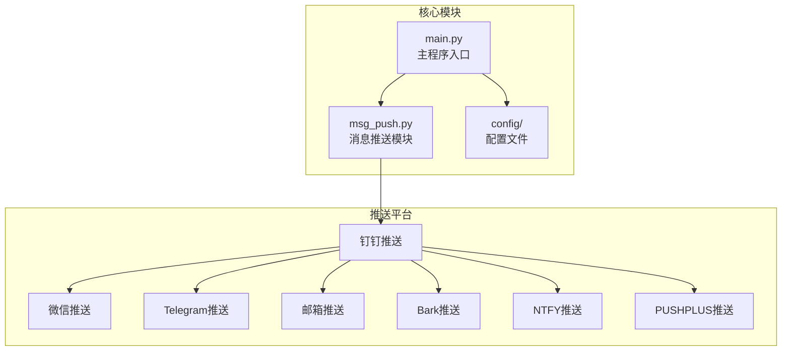

**图表来源**
- [msg_push.py:1-296](file://msg_push.py#L1-L296)
- [main.py:327-354](file://main.py#L327-L354)

**章节来源**
- [msg_push.py:1-296](file://msg_push.py#L1-L296)
- [main.py:327-354](file://main.py#L327-L354)

## 核心组件

### 钉钉推送函数

项目实现了专门的钉钉推送函数，支持批量推送和@提醒功能：

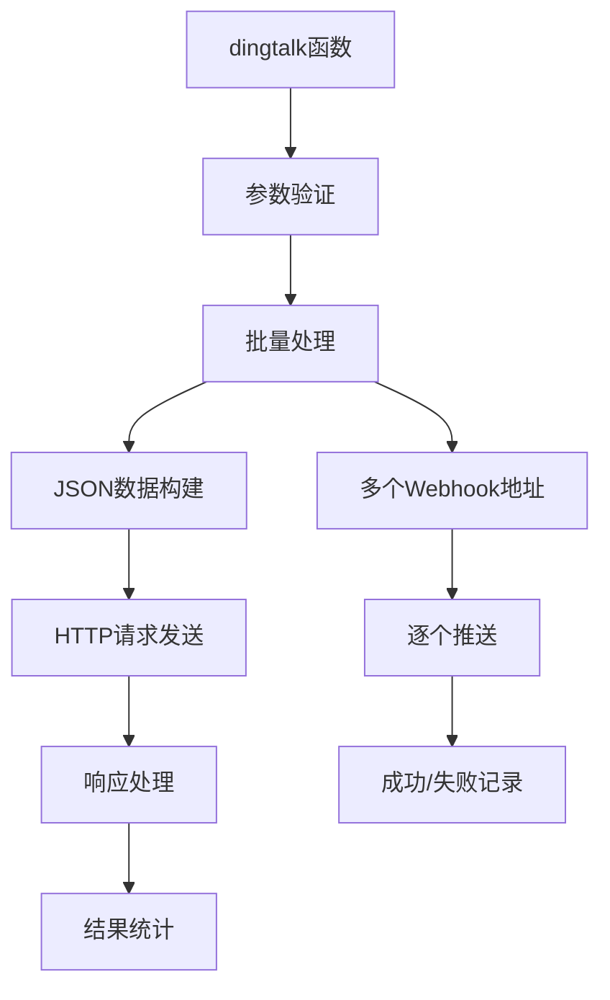

**图表来源**
- [msg_push.py:25-56](file://msg_push.py#L25-L56)

### 主程序集成

主程序通过统一的消息推送接口集成各种推送平台：

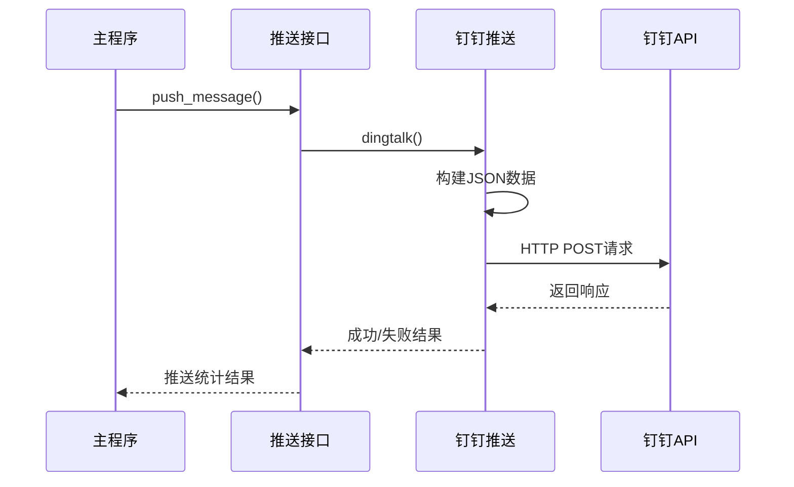

**图表来源**
- [main.py:327-354](file://main.py#L327-L354)
- [msg_push.py:25-56](file://msg_push.py#L25-L56)

**章节来源**
- [msg_push.py:25-56](file://msg_push.py#L25-L56)
- [main.py:327-354](file://main.py#L327-L354)

## 架构概览

### 推送系统架构

```mermaid
graph LR
subgraph "配置层"
A[config.ini<br/>推送配置]
B[URL_config.ini<br/>直播配置]
end
subgraph "业务逻辑层"
C[push_message()<br/>消息推送]
D[dingtalk()<br/>钉钉推送]
E[xizhi()<br/>微信推送]
F[send_email()<br/>邮箱推送]
end
subgraph "外部服务"
G[钉钉Webhook]
H[微信API]
I[SMTP服务器]
J[Telegram Bot]
K[Bark服务器]
L[NTFY服务器]
M[PUSHPLUS API]
end
A --> C
B --> C
C --> D
C --> E
C --> F
D --> G
E --> H
F --> I
G --> J
H --> K
I --> L
J --> M
```

**图表来源**
- [main.py:327-354](file://main.py#L327-L354)
- [msg_push.py:59-250](file://msg_push.py#L59-L250)

### 数据流图

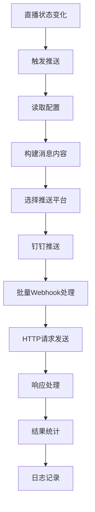

**图表来源**
- [main.py:327-354](file://main.py#L327-L354)
- [msg_push.py:25-56](file://msg_push.py#L25-L56)

## 详细组件分析

### 钉钉推送函数实现

#### 函数签名和参数说明

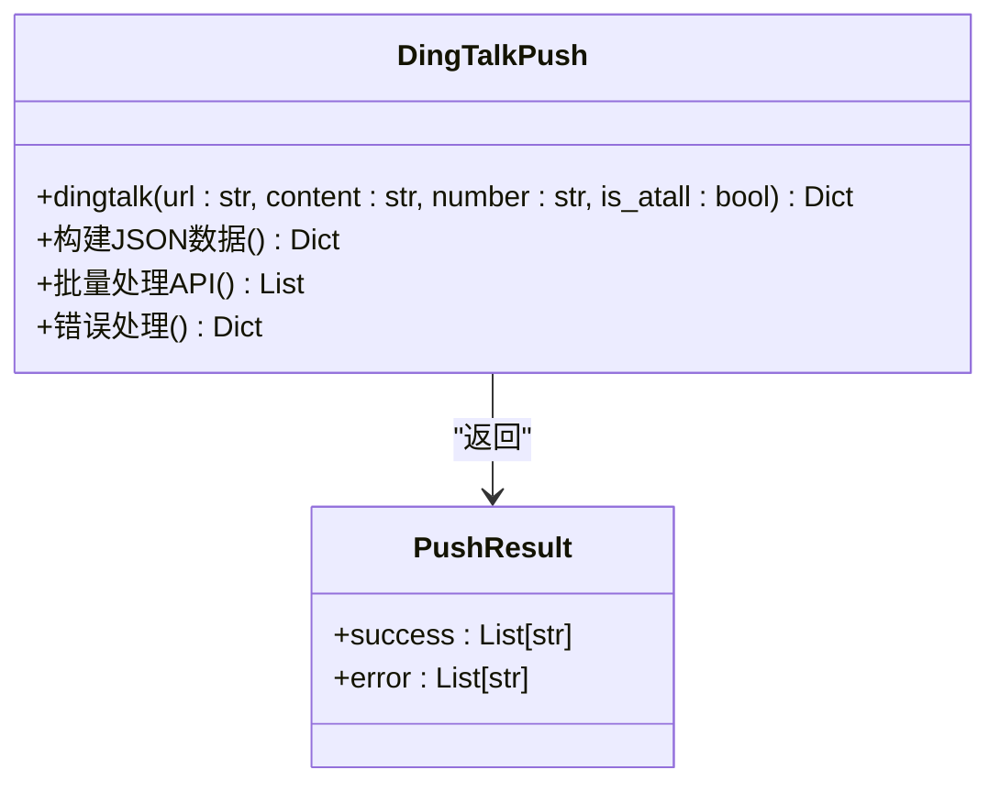

**图表来源**
- [msg_push.py:25-56](file://msg_push.py#L25-L56)

#### 参数详细说明

| 参数名称 | 类型 | 默认值 | 必填 | 描述 |
|---------|------|--------|------|------|
| url | str | - | 是 | 钉钉Webhook地址，支持多个地址用逗号分隔 |
| content | str | - | 是 | 推送的消息内容 |
| number | str | None | 否 | 被@用户的手机号码 |
| is_atall | bool | False | 否 | 是否@全体成员 |

#### JSON数据结构

钉钉推送使用标准的钉钉Webhook格式：

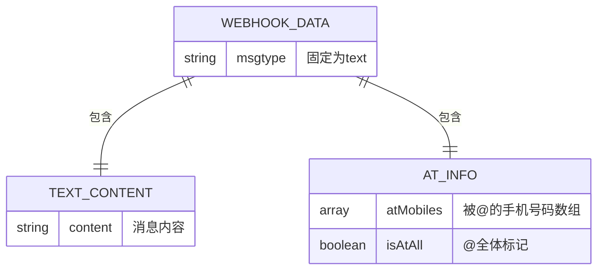

**图表来源**
- [msg_push.py:30-41](file://msg_push.py#L30-L41)

**章节来源**
- [msg_push.py:25-56](file://msg_push.py#L25-L56)

### 批量推送管理

#### 批处理机制

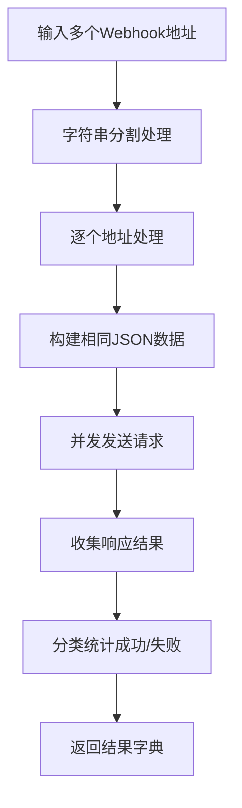

**图表来源**
- [msg_push.py:28-56](file://msg_push.py#L28-L56)

#### 结果返回格式

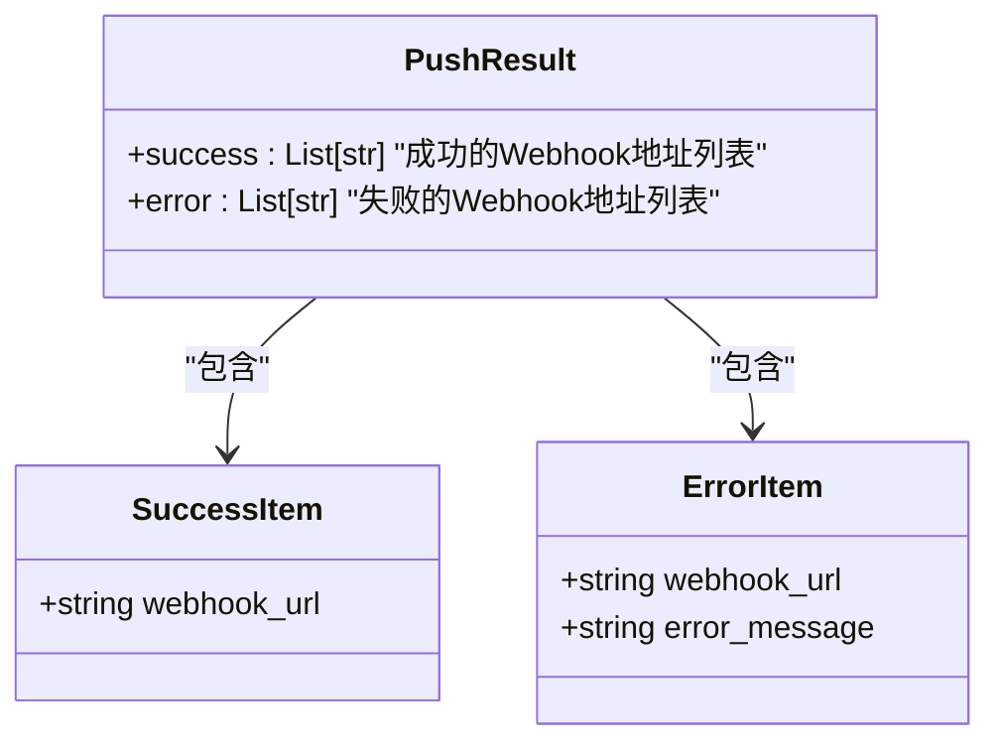

**图表来源**
- [msg_push.py:25-56](file://msg_push.py#L25-L56)

**章节来源**
- [msg_push.py:25-56](file://msg_push.py#L25-L56)

### 错误处理机制

#### 异常处理流程

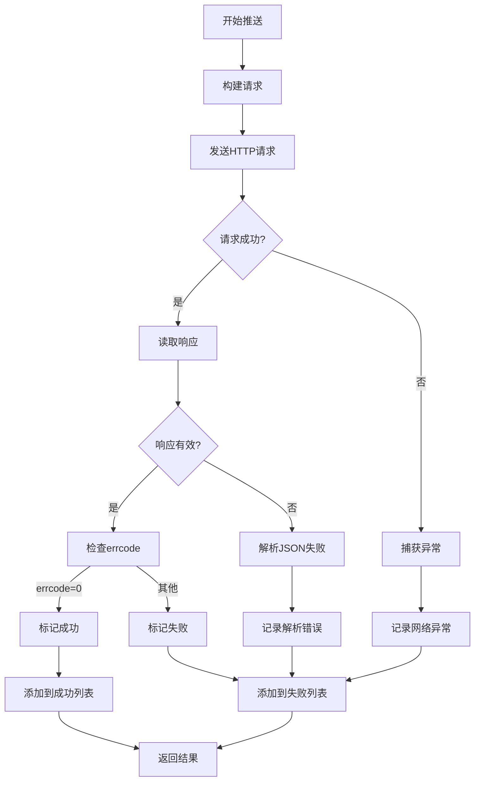

**图表来源**
- [msg_push.py:42-55](file://msg_push.py#L42-L55)

#### 错误类型分类

| 错误类型 | 触发条件 | 处理方式 |
|---------|---------|---------|
| 网络异常 | HTTP请求失败 | 记录错误并标记为失败 |
| JSON解析错误 | 响应非JSON格式 | 记录解析错误 |
| API响应错误 | errcode!=0 | 记录钉钉返回的错误信息 |
| 超时错误 | 请求超过10秒 | 标记为失败并记录超时信息 |

**章节来源**
- [msg_push.py:42-55](file://msg_push.py#L42-L55)

### 主程序集成

#### 推送配置读取

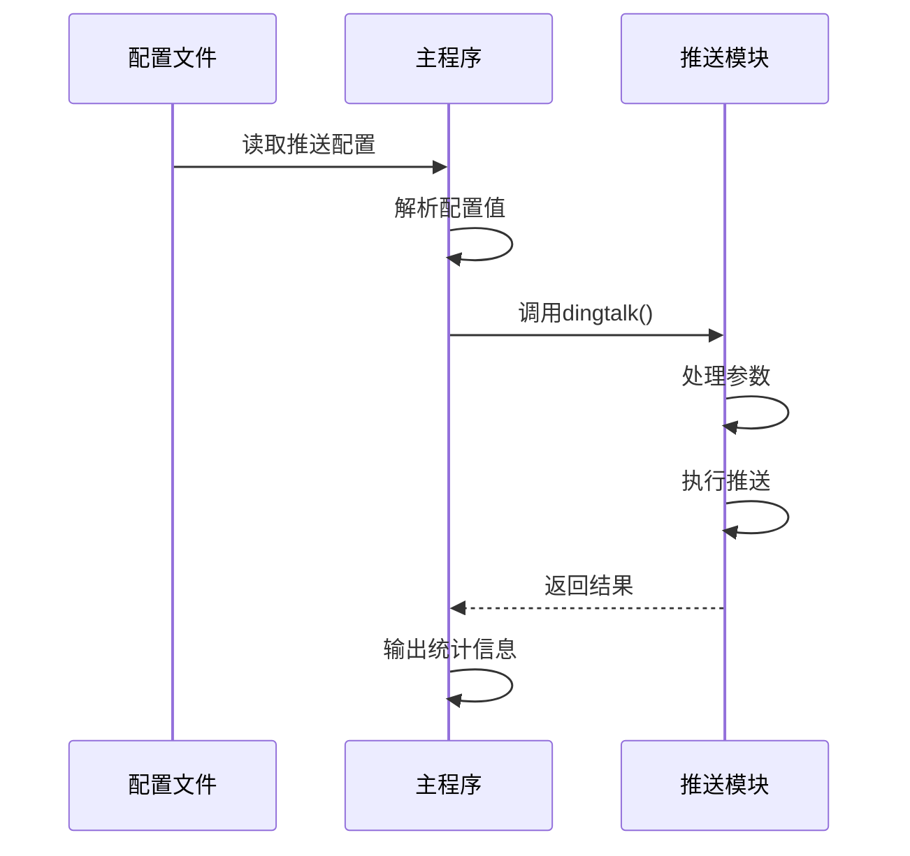

**图表来源**
- [main.py:1842-1843](file://main.py#L1842-L1843)
- [main.py:327-354](file://main.py#L327-L354)

#### 推送触发时机

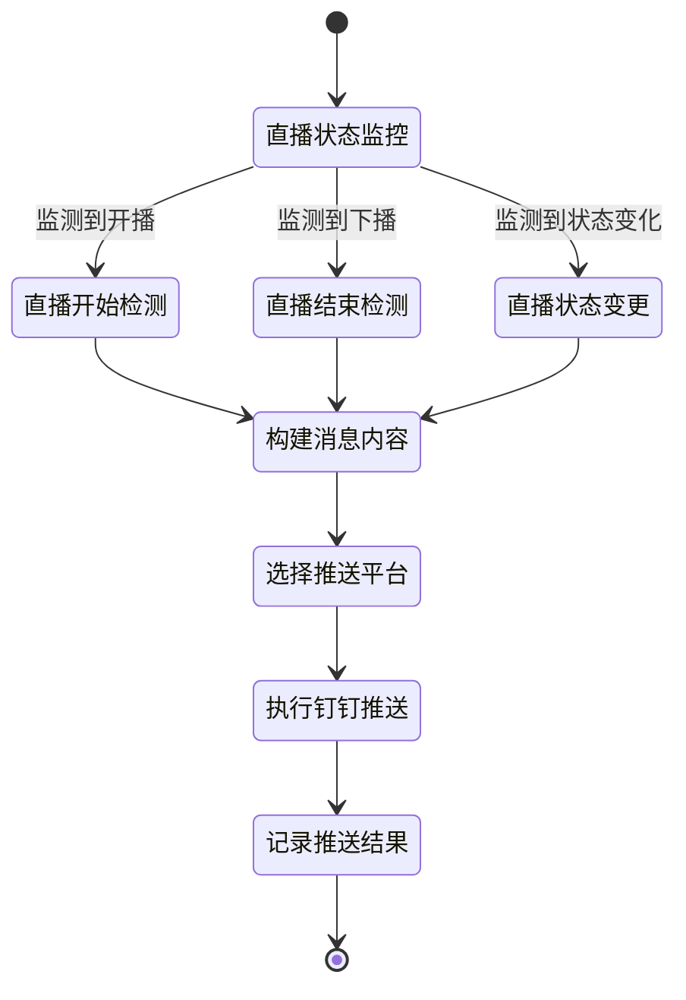

**图表来源**
- [main.py:327-354](file://main.py#L327-L354)

**章节来源**
- [main.py:1842-1843](file://main.py#L1842-L1843)
- [main.py:327-354](file://main.py#L327-L354)

## 依赖关系分析

### 外部依赖

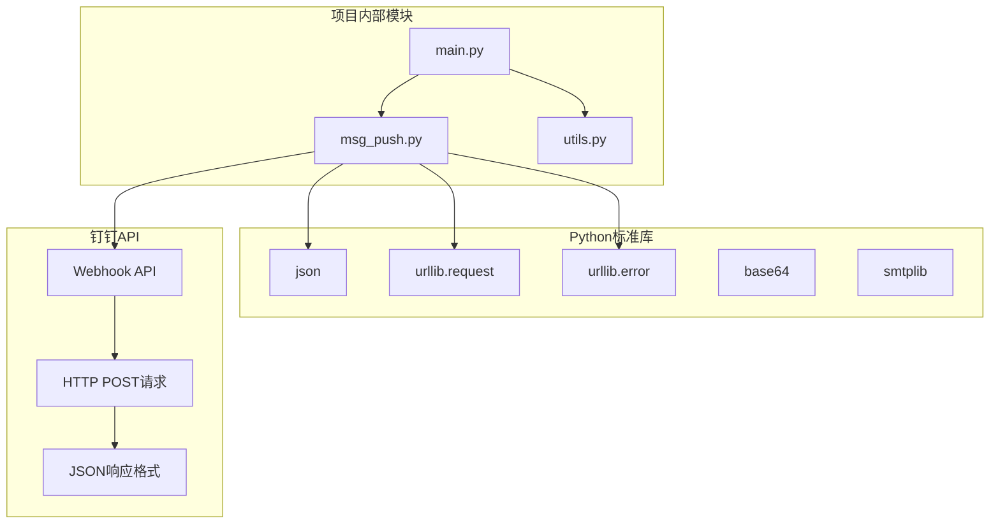

**图表来源**
- [msg_push.py:10-18](file://msg_push.py#L10-L18)
- [msg_push.py:25-56](file://msg_push.py#L25-L56)

### 内部模块依赖

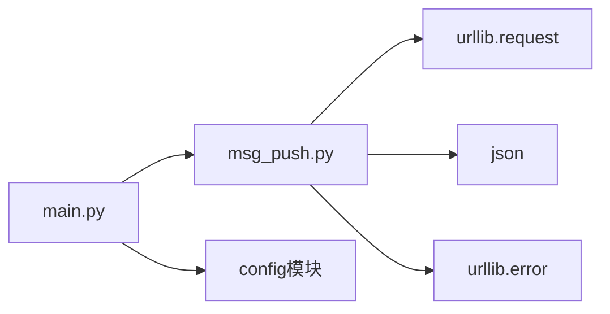

**图表来源**
- [main.py:34-36](file://main.py#L34-L36)
- [msg_push.py:10-18](file://msg_push.py#L10-L18)

**章节来源**
- [main.py:34-36](file://main.py#L34-L36)
- [msg_push.py:10-18](file://msg_push.py#L10-L18)

## 性能考虑

### 并发处理

钉钉推送采用串行处理每个Webhook地址，避免了并发请求可能导致的API限制问题。每个请求都有10秒超时时间，确保不会阻塞主程序执行。

### 网络优化

- 使用HTTP 1.1连接
- 设置合理的超时时间
- 避免不必要的重试
- 批量处理减少连接建立开销

### 错误恢复

- 自动重试机制：无内置重试，遇到错误立即标记失败
- 容错处理：单个Webhook失败不影响其他地址的推送
- 日志记录：详细记录每次推送的失败原因

## 故障排除指南

### 常见问题及解决方案

#### Webhook地址无效

**问题症状**：推送结果显示失败，错误信息包含"invalid webhook"或类似提示

**解决方法**：
1. 确认Webhook地址格式正确
2. 检查机器人权限设置
3. 验证企业内部网络访问权限

#### @提醒功能失效

**问题症状**：消息成功发送但@提醒未生效

**解决方法**：
1. 确认手机号码格式正确（11位数字）
2. 检查手机号码是否为企业成员
3. 验证@全体功能是否启用

#### 批量推送部分失败

**问题症状**：多个Webhook地址中部分成功部分失败

**解决方法**：
1. 检查失败地址的可用性
2. 分别测试每个Webhook地址
3. 查看失败的具体错误信息

#### 超时问题

**问题症状**：推送请求超过10秒无响应

**解决方法**：
1. 检查网络连接稳定性
2. 考虑增加超时时间
3. 检查钉钉服务器状态

### 调试技巧

#### 启用详细日志

在主程序中可以查看推送统计信息：
- 成功推送数量
- 失败推送数量
- 失败原因分析

#### 手动测试

可以使用示例代码测试钉钉推送功能：

```python
# 示例：测试钉钉推送
webhook_url = "your_webhook_url_here"
content = "测试消息内容"
phone_number = "13800000000"  # 可选
is_atall = False  # 可选

result = dingtalk(webhook_url, content, phone_number, is_atall)
print(f"成功: {len(result['success'])}")
print(f"失败: {len(result['error'])}")
```

**章节来源**
- [msg_push.py:252-260](file://msg_push.py#L252-L260)

## 结论

钉钉推送功能为DouyinLiveRecorder提供了可靠的直播状态通知能力。通过批量处理、错误处理和统计反馈机制，确保了推送服务的稳定性和可靠性。

### 功能特点总结

1. **批量推送支持**：支持同时向多个Webhook地址发送消息
2. **@提醒功能**：支持@特定用户和@全体成员
3. **错误处理完善**：提供详细的错误信息和失败统计
4. **性能优化**：合理的超时设置和资源管理
5. **易于集成**：与主程序无缝集成，配置简单

### 最佳实践建议

1. **配置验证**：在部署前验证Webhook地址和权限设置
2. **监控告警**：定期检查推送成功率
3. **错误处理**：建立完善的错误处理和恢复机制
4. **性能监控**：关注网络延迟和API响应时间
5. **安全考虑**：保护Webhook地址的安全性

通过合理配置和使用，钉钉推送功能能够有效提升直播监控系统的用户体验和运维效率。