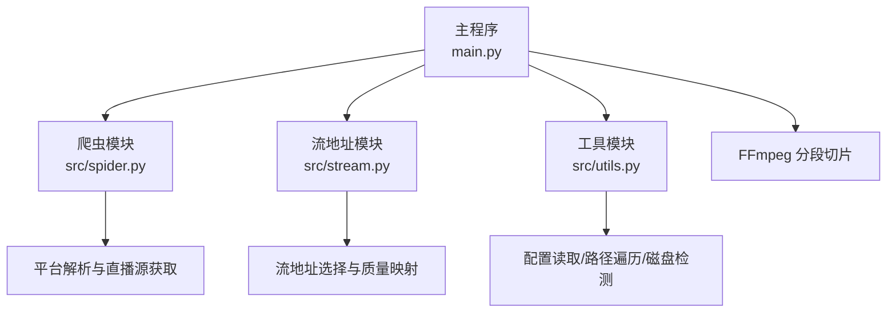
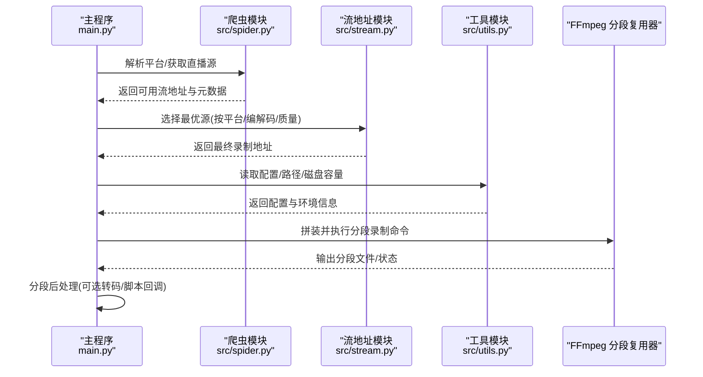
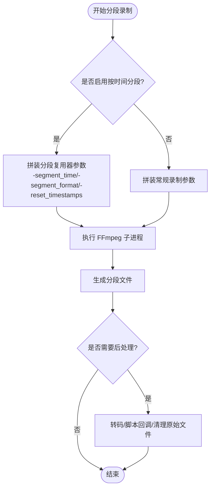
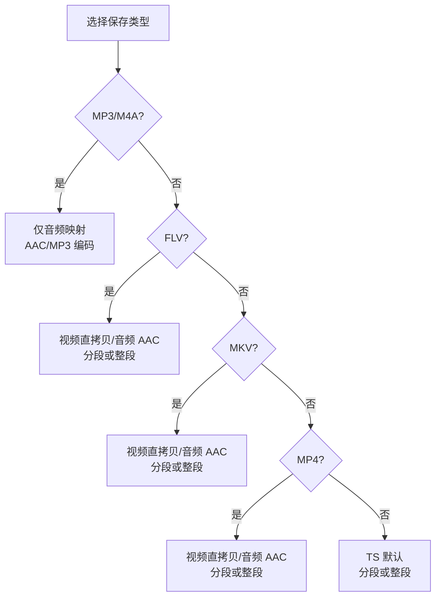
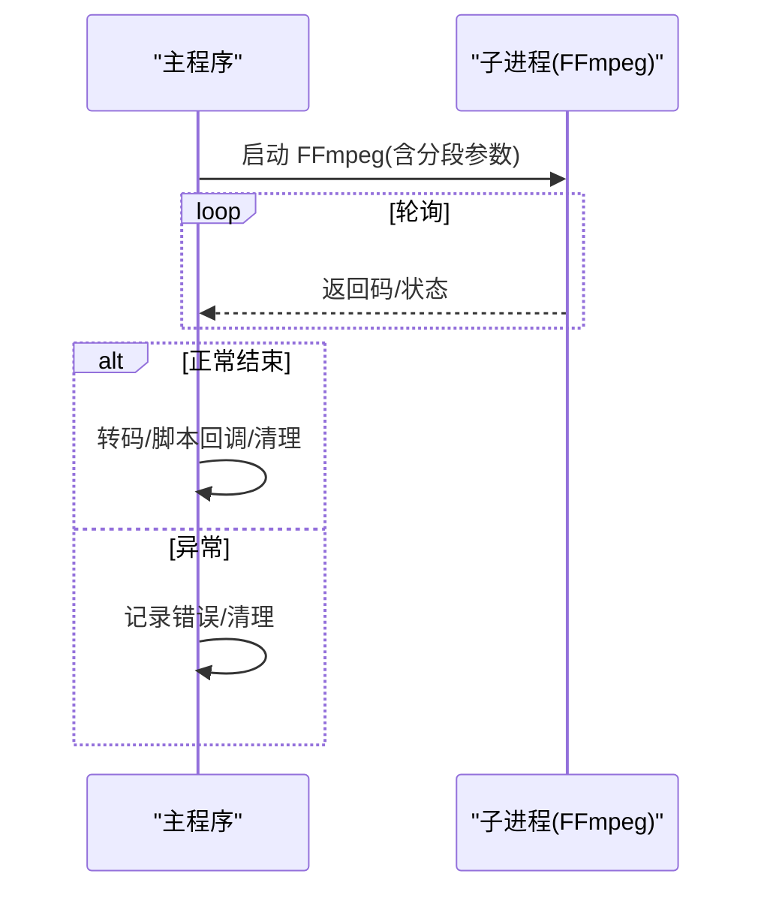
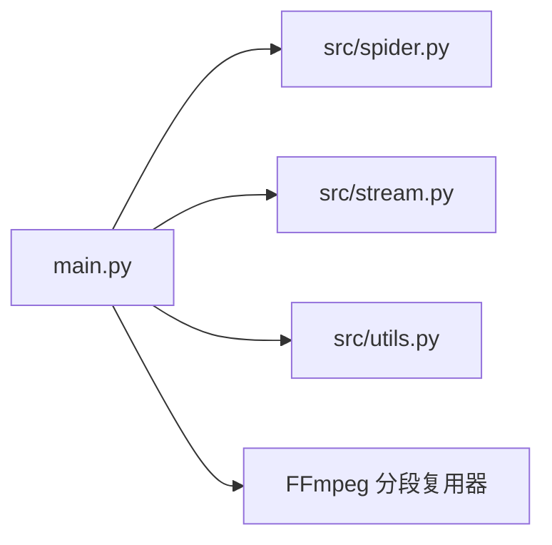

# 分段录制

<cite>
**本文引用的文件**
- [main.py](file://main.py)
- [src/stream.py](file://src/stream.py)
- [src/spider.py](file://src/spider.py)
- [src/utils.py](file://src/utils.py)
- [README.md](file://README.md)
</cite>

## 目录
1. [简介](#简介)
2. [项目结构](#项目结构)
3. [核心组件](#核心组件)
4. [架构总览](#架构总览)
5. [详细组件分析](#详细组件分析)
6. [依赖分析](#依赖分析)
7. [性能考量](#性能考量)
8. [故障排查指南](#故障排查指南)
9. [结论](#结论)
10. [附录](#附录)

## 简介
本技术文档聚焦于项目中的“分段录制”能力，系统性阐述其原理、参数配置、流程控制与应用场景。分段录制通过 FFmpeg 的分段复用器按时间切片生成独立片段文件，便于长期直播录制、存储空间管理与并发处理优化。本文同时给出参数调优建议、性能监控方法与故障恢复策略，并提供可操作的配置示例与最佳实践。

## 项目结构
- 录制主流程集中在主程序入口，负责采集直播源、拼装 FFmpeg 命令、触发录制与分段切片、转码与后续脚本执行。
- 平台解析与流地址选择由爬虫与流地址模块协作完成，保障不同平台的可用源与格式兼容。
- 工具模块提供通用配置读取、路径遍历、磁盘容量检测等辅助能力，支撑分段录制的运行时决策。

图表来源
- [main.py:1175-1600](file://main.py#L1175-L1600)
- [src/spider.py:1-200](file://src/spider.py#L1-L200)
- [src/stream.py:1-120](file://src/stream.py#L1-L120)
- [src/utils.py:65-115](file://src/utils.py#L65-L115)

章节来源
- [main.py:1175-1600](file://main.py#L1175-L1600)
- [src/spider.py:1-200](file://src/spider.py#L1-L200)
- [src/stream.py:1-120](file://src/stream.py#L1-L120)
- [src/utils.py:65-115](file://src/utils.py#L65-L115)

## 核心组件
- 分段切片引擎
  - 通过 FFmpeg 的分段复用器按设定的时间间隔切片，生成带序号的片段文件，支持多种封装格式（TS、FLV、MP4、MKV）。
  - 关键参数：分段时长、分段格式、时间戳重置、封装优化标志等。
- 录制命令组装
  - 根据平台特性与保存类型，动态拼装 FFmpeg 输入参数、协议白名单、缓冲区、重连策略、时间戳修正等。
- 转码与后处理
  - 分段完成后，可对片段进行二次转码（如 MP4），或在非分段模式下直接转码成品文件。
- 子进程管理与生命周期
  - 通过子进程执行 FFmpeg，轮询进程状态，支持中断信号、脚本回调与资源清理。

章节来源
- [main.py:189-217](file://main.py#L189-L217)
- [main.py:1175-1600](file://main.py#L1175-L1600)
- [main.py:420-491](file://main.py#L420-L491)

## 架构总览
分段录制在主程序中以“命令拼装—子进程执行—后处理”的流水线形式运行。平台解析与流地址选择为上游输入，FFmpeg 分段复用器作为核心处理单元，产出片段文件；随后根据配置决定是否转码与删除原始文件。

图表来源
- [main.py:1175-1600](file://main.py#L1175-L1600)
- [src/spider.py:1-200](file://src/spider.py#L1-L200)
- [src/stream.py:1-120](file://src/stream.py#L1-L120)
- [src/utils.py:65-115](file://src/utils.py#L65-L115)

## 详细组件分析

### 分段切片引擎（FFmpeg 分段复用器）
- 触发机制
  - 当启用按时间分段时，主程序在不同保存类型分支中注入分段复用器参数，使 FFmpeg 按设定时长切片。
- 切片算法
  - 基于分段时长与封装格式，生成带序号的片段文件，支持重置时间戳以保证片段可独立播放。
- 关键参数
  - 分段时长：由配置项提供，单位秒。
  - 分段格式：支持 TS、FLV、MP4、MKV 等。
  - 时间戳重置：避免跨片段时间戳累积。
  - 封装优化：如 MP4 的关键帧与空 MOOV 标志，提升随机访问与播放体验。
- 文件命名
  - 采用统一前缀+序号后缀的命名规则，便于后续检索与索引。

图表来源
- [main.py:1480-1540](file://main.py#L1480-L1540)
- [main.py:1520-1590](file://main.py#L1520-L1590)
- [main.py:189-217](file://main.py#L189-L217)

章节来源
- [main.py:189-217](file://main.py#L189-L217)
- [main.py:1480-1540](file://main.py#L1480-L1540)
- [main.py:1520-1590](file://main.py#L1520-L1590)

### 录制命令组装与平台适配
- 输入参数
  - 用户代理、协议白名单、分析时长、探测大小、缓冲区、最大复用队列、时间戳修正、负时间戳避免等。
- 平台差异
  - 针对海外平台、特定平台（如 SHOPEE、咪咕）调整超时、探测与缓冲参数。
  - 针对仅支持 FLV 的平台，强制使用 FLV 下载器或分段 FLV。
- 保存类型分支
  - MP3/M4A：仅音频映射，AAC/MP3 编码，分段或整段输出。
  - FLV：视频/音频直拷贝，分段或整段输出。
  - MKV：封装为 Matroska，分段或整段输出。
  - MP4：视频直拷贝，音频 AAC，分段或整段输出。
  - TS：默认录制格式，分段或整段输出。

图表来源
- [main.py:1238-1290](file://main.py#L1238-L1290)
- [main.py:1352-1390](file://main.py#L1352-L1390)
- [main.py:1426-1473](file://main.py#L1426-L1473)
- [main.py:1474-1520](file://main.py#L1474-L1520)
- [main.py:1521-1590](file://main.py#L1521-L1590)

章节来源
- [main.py:1175-1205](file://main.py#L1175-L1205)
- [main.py:1238-1290](file://main.py#L1238-L1290)
- [main.py:1352-1390](file://main.py#L1352-L1390)
- [main.py:1426-1473](file://main.py#L1426-L1473)
- [main.py:1474-1520](file://main.py#L1474-L1520)
- [main.py:1521-1590](file://main.py#L1521-L1590)

### 子进程管理与生命周期
- 子进程执行
  - 通过子进程启动 FFmpeg，传递标准参数与分段命令。
- 生命周期控制
  - 轮询进程状态，支持中断信号（Windows 使用 Ctrl+C 或脚本终止，类 Unix 使用 SIGINT）。
  - 录制结束或异常时，执行后处理（转码、脚本回调、清理）。
- 状态反馈
  - 返回码为 0 表示成功，否则记录错误并清理状态。

图表来源
- [main.py:420-491](file://main.py#L420-L491)

章节来源
- [main.py:420-491](file://main.py#L420-L491)

### 分段参数配置与策略选择
- 分段时间设置
  - 通过配置项提供分段时长（秒），用于 FFmpeg 的分段时长参数。
- 分段格式选择
  - 支持 TS、FLV、MP4、MKV 等格式，按保存类型分支注入相应封装参数。
- 命名规则
  - 采用统一前缀+时间戳+序号的命名规则，便于检索与索引。
- 策略选择
  - 按时间分段：适合长时间录制与并发处理，便于分片管理与索引生成。
  - 按大小分段：当前实现以时间为主，如需按大小分段可扩展 FFmpeg 参数（例如使用分段复用器的大小阈值参数）。

章节来源
- [main.py:189-217](file://main.py#L189-L217)
- [main.py:1480-1540](file://main.py#L1480-L1540)
- [main.py:1520-1590](file://main.py#L1520-L1590)

### 应用场景
- 长时间直播录制
  - 按时间分段可避免单文件过大，便于后续编辑与检索。
- 存储空间管理
  - 分段文件更易清理与归档，降低单文件损坏影响范围。
- 并发处理优化
  - 分段文件可并行转码、索引与上传，提升整体吞吐。

章节来源
- [README.md:480-482](file://README.md#L480-L482)

## 依赖分析
- 主程序依赖爬虫与流地址模块获取直播源，依赖工具模块读取配置与路径信息。
- 分段录制依赖 FFmpeg 提供的分段复用器能力，参数由主程序动态拼装。

图表来源
- [main.py:1175-1600](file://main.py#L1175-L1600)
- [src/spider.py:1-200](file://src/spider.py#L1-L200)
- [src/stream.py:1-120](file://src/stream.py#L1-L120)
- [src/utils.py:65-115](file://src/utils.py#L65-L115)

章节来源
- [main.py:1175-1600](file://main.py#L1175-L1600)
- [src/spider.py:1-200](file://src/spider.py#L1-L200)
- [src/stream.py:1-120](file://src/stream.py#L1-L120)
- [src/utils.py:65-115](file://src/utils.py#L65-L115)

## 性能考量
- 缓冲与探测参数
  - 针对海外平台与特定平台，主程序会增大分析时长、探测大小与缓冲区，以提升稳定性。
- 重连与容错
  - 设置合理的重连延迟与流式重连策略，减少网络抖动对录制的影响。
- 分段时长权衡
  - 分段越短，索引与并发处理越灵活，但文件数量越多；分段越长，文件数量减少，但单文件体积大、索引成本高。
- 转码策略
  - 分段后转码可并行处理，缩短整体等待时间；整段转码一次性完成，节省 CPU 开销但耗时较长。

章节来源
- [main.py:1161-1173](file://main.py#L1161-L1173)
- [main.py:1190-1195](file://main.py#L1190-L1195)

## 故障排查指南
- FFmpeg 返回码异常
  - 检查网络与代理配置、协议白名单、输入地址有效性与平台差异参数。
- 分段文件缺失或不完整
  - 核对分段时长与格式参数，确认时间戳重置与封装标志设置。
- 磁盘空间不足
  - 使用工具模块的磁盘容量检测函数，预留充足空间或调整分段策略。
- 子进程异常退出
  - 检查中断信号处理与日志输出，确认录制结束后是否正确清理资源。

章节来源
- [main.py:420-491](file://main.py#L420-L491)
- [src/utils.py:149-159](file://src/utils.py#L149-L159)

## 结论
分段录制通过 FFmpeg 分段复用器实现了按时间切片的稳定录制，结合主程序的参数拼装与平台适配，满足多平台、多格式的录制需求。合理配置分段时长与格式、优化缓冲与重连策略、并行化后处理，可显著提升长期录制的可靠性与效率。

## 附录

### 分段参数调优建议
- 分段时长
  - 建议 5–15 分钟，兼顾索引灵活性与文件数量。
- 分段格式
  - TS：通用性强，适合大多数场景。
  - MP4：便于随机访问，需注意关键帧与 MOOV 标志。
  - FLV/MKV：按平台与播放器兼容性选择。
- 命名规则
  - 建议包含时间戳与序号，便于检索与索引生成。

章节来源
- [main.py:1480-1540](file://main.py#L1480-L1540)
- [main.py:1520-1590](file://main.py#L1520-L1590)

### 性能监控方法
- 日志输出
  - 通过 FFmpeg 的日志级别与主程序的日志输出，监控录制状态与异常。
- 磁盘容量
  - 使用磁盘容量检测函数，定期检查剩余空间，避免录制中断。
- 进程状态
  - 轮询子进程返回码，及时发现异常并清理资源。

章节来源
- [main.py:420-491](file://main.py#L420-L491)
- [src/utils.py:149-159](file://src/utils.py#L149-L159)

### 故障恢复策略
- 自动重试
  - 在网络异常时，适当增大重连延迟与探测参数，提高成功率。
- 分段恢复
  - 分段文件可独立恢复，优先恢复最近分段，减少损失。
- 资源清理
  - 异常退出时确保临时文件与锁释放，避免占用磁盘与进程资源。

章节来源
- [main.py:1161-1173](file://main.py#L1161-L1173)
- [main.py:420-491](file://main.py#L420-L491)

### 配置示例与最佳实践
- 配置项
  - 分段时长：通过配置项设置分段秒数。
  - 保存类型：TS/FLV/MP4/MKV/MP3/M4A。
  - 是否转码：分段后转码可并行处理。
- 最佳实践
  - 长时间录制建议按时间分段，TS 格式通用性强。
  - 海外平台适当增大缓冲与探测参数。
  - 分段后转码并清理原始文件，释放磁盘空间。

章节来源
- [main.py:1175-1600](file://main.py#L1175-L1600)
- [README.md:480-482](file://README.md#L480-L482)