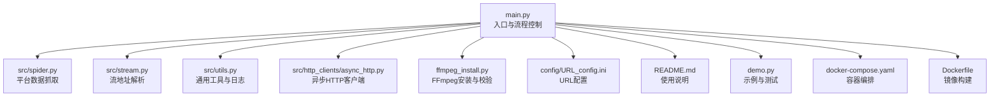
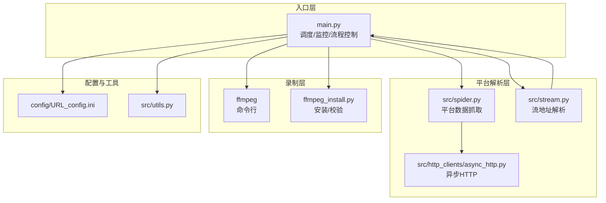
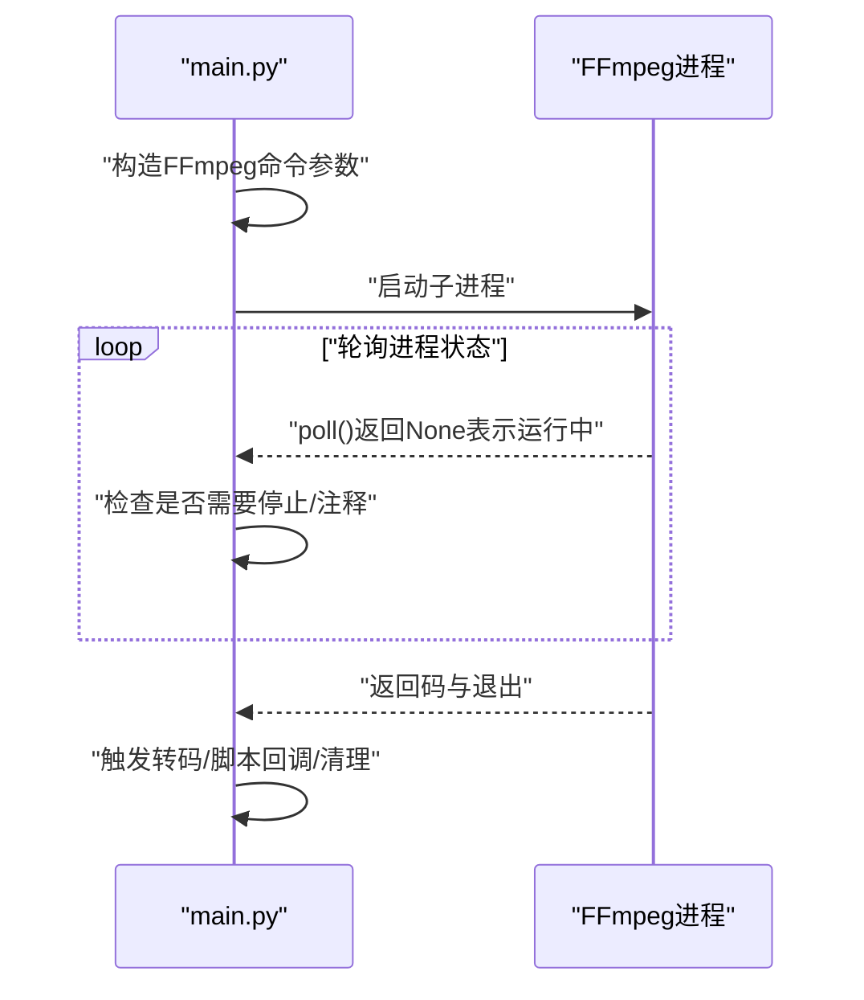
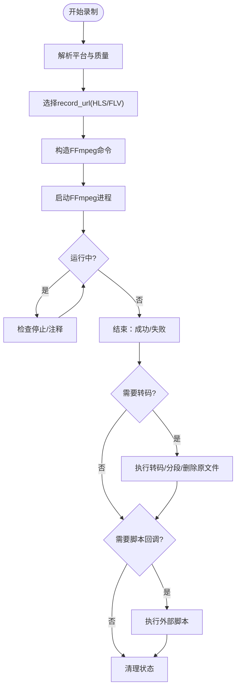
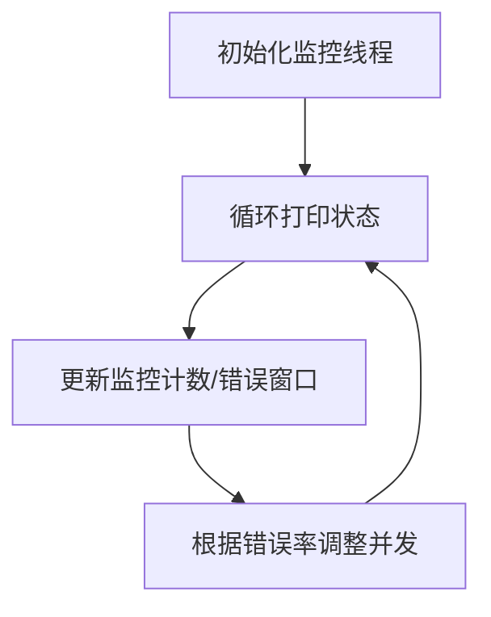
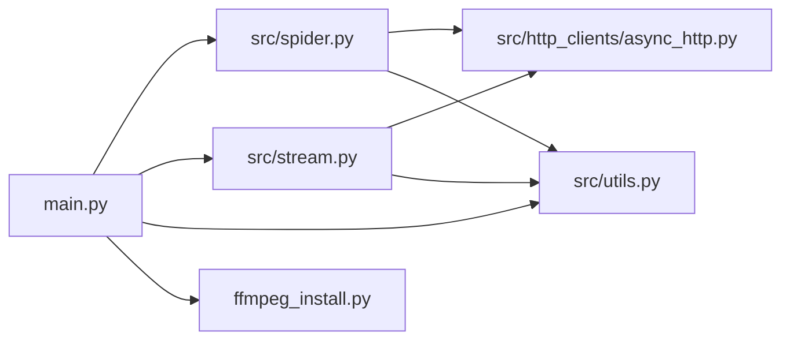

# 录制控制

<cite>
**本文引用的文件**
- [main.py](file://main.py)
- [ffmpeg_install.py](file://ffmpeg_install.py)
- [src/stream.py](file://src/stream.py)
- [src/spider.py](file://src/spider.py)
- [src/utils.py](file://src/utils.py)
- [src/http_clients/async_http.py](file://src/http_clients/async_http.py)
- [config/URL_config.ini](file://config/URL_config.ini)
- [README.md](file://README.md)
- [demo.py](file://demo.py)
- [docker-compose.yaml](file://docker-compose.yaml)
- [Dockerfile](file://Dockerfile)
</cite>

## 目录
1. [引言](#引言)
2. [项目结构](#项目结构)
3. [核心组件](#核心组件)
4. [架构总览](#架构总览)
5. [详细组件分析](#详细组件分析)
6. [依赖分析](#依赖分析)
7. [性能考量](#性能考量)
8. [故障排查指南](#故障排查指南)
9. [结论](#结论)
10. [附录](#附录)

## 引言
本技术文档围绕“录制控制系统”展开，系统基于 FFmpeg 实现多平台直播源录制，覆盖 TS/FLV 格式录制、录制质量控制、录制参数优化、进程管理与异常处理、录制监控与状态管理、流程控制（启动/暂停/停止/中断）、FFmpeg 安装配置与环境变量设置、性能调优与实用指南等内容。文档同时提供命令行示例、配置参数说明与故障排除方法，帮助开发者与运维人员快速理解与部署。

## 项目结构
项目采用模块化设计，核心入口为 main.py，负责调度与流程控制；爬虫与解析逻辑集中在 src/spider.py 与 src/stream.py；FFmpeg 安装与可用性检查由 ffmpeg_install.py 提供；异步 HTTP 请求封装在 src/http_clients/async_http.py；配置文件位于 config/ 目录；Docker 化部署通过 docker-compose.yaml 与 Dockerfile 支持。

图表来源
- [main.py:1-120](file://main.py#L1-L120)
- [src/spider.py:1-60](file://src/spider.py#L1-L60)
- [src/stream.py:1-40](file://src/stream.py#L1-L40)
- [src/utils.py:1-40](file://src/utils.py#L1-L40)
- [src/http_clients/async_http.py:1-40](file://src/http_clients/async_http.py#L1-L40)
- [ffmpeg_install.py:1-40](file://ffmpeg_install.py#L1-L40)
- [config/URL_config.ini:1-5](file://config/URL_config.ini#L1-L5)
- [README.md:100-120](file://README.md#L100-L120)
- [demo.py:1-40](file://demo.py#L1-L40)
- [docker-compose.yaml:1-16](file://docker-compose.yaml#L1-L16)
- [Dockerfile:1-20](file://Dockerfile#L1-L20)

章节来源
- [main.py:1-120](file://main.py#L1-L120)
- [README.md:100-120](file://README.md#L100-L120)

## 核心组件
- FFmpeg 集成与命令行参数
  - 分段录制：使用 ffmpeg 的 segment 分段输出，支持按时间切片与格式选择。
  - 转码与封装：支持 MP4 封装与 H.264 重编码，或直接复制视频/音频流。
  - 音频转码：AAC 转封装，保留音频质量。
- 录制控制与流程
  - 启动录制：根据平台解析出 record_url（HLS/FLV），构造 FFmpeg 命令并启动子进程。
  - 暂停/停止：通过向 FFmpeg 子进程写入终止信号（Windows 使用 q，类 Unix 使用 SIGINT）实现优雅退出。
  - 中断：当注释掉 URL 或收到外部停止信号时，清理录制状态并回收资源。
- 录制监控与状态管理
  - 录制集合与运行列表：维护 recording、running_list、url_comments 等集合，实时展示录制状态。
  - 错误率自适应：动态调整并发请求数，降低错误率过高时的负载。
  - 时间文件与字幕：可生成时间戳文件与字幕文件辅助定位。
- 录制质量与参数优化
  - 平台差异化选择：优先 FLV（如抖音/TikTok）或 HLS（如虎牙等），并根据编解码与质量映射选择最优源。
  - 质量映射：将“原画/蓝光/超清/高清/标清/流畅”映射为平台内部质量索引，自动回退。
- FFmpeg 安装与环境
  - 自动安装：Windows/macOS/Linux 平台分别提供安装策略；自动注入 PATH。
  - 可用性校验：启动时检查 ffmpeg -version，失败则尝试自动安装。

章节来源
- [main.py:189-271](file://main.py#L189-L271)
- [main.py:420-491](file://main.py#L420-L491)
- [main.py:90-135](file://main.py#L90-L135)
- [main.py:298-325](file://main.py#L298-L325)
- [src/stream.py:29-78](file://src/stream.py#L29-L78)
- [ffmpeg_install.py:161-222](file://ffmpeg_install.py#L161-L222)

## 架构总览
系统整体采用“入口调度 + 平台解析 + FFmpeg 录制”的三层架构。入口层负责任务编排与状态管理；平台解析层负责从各平台抓取直播数据并选择最优流；录制层负责调用 FFmpeg 执行录制与转码。

图表来源
- [main.py:545-800](file://main.py#L545-L800)
- [src/spider.py:68-142](file://src/spider.py#L68-L142)
- [src/stream.py:41-153](file://src/stream.py#L41-L153)
- [src/http_clients/async_http.py:10-60](file://src/http_clients/async_http.py#L10-L60)
- [ffmpeg_install.py:161-222](file://ffmpeg_install.py#L161-L222)
- [config/URL_config.ini:1-5](file://config/URL_config.ini#L1-L5)
- [src/utils.py:1-40](file://src/utils.py#L1-L40)

## 详细组件分析

### FFmpeg 集成与命令行参数
- 分段录制
  - 关键参数：输入源、视频/音频复制、分段时长、分段格式、复位时间戳、MOOV 参数等。
  - 行为：将长流按设定时长切分为独立片段，便于后续处理与存储。
- MP4 转码与封装
  - 可选重编码：libx264、预设 veryfast、CRF 23、像素格式 yuv420p。
  - 直接复制：仅复制视频/音频流，零重编码，节省 CPU。
- 音频转码
  - AAC 转封装，保留采样率与码率，输出为 m4a。
- 进程管理
  - 使用 subprocess.Popen 启动 FFmpeg，轮询进程状态，支持优雅中断与脚本回调。

图表来源
- [main.py:420-491](file://main.py#L420-L491)
- [main.py:189-271](file://main.py#L189-L271)

章节来源
- [main.py:189-271](file://main.py#L189-L271)
- [main.py:420-491](file://main.py#L420-L491)

### 录制控制与流程
- 启动录制
  - 解析平台与质量，选择 record_url（HLS/FLV），构造 FFmpeg 命令并启动。
- 暂停/停止
  - Windows：向 FFmpeg 子进程 stdin 写入终止字符。
  - 类 Unix：发送 SIGINT 信号。
- 中断
  - 当 URL 被注释或收到外部停止信号时，清理录制状态并等待进程退出。
- 脚本回调
  - 录制完成后可执行外部脚本（支持 Python/Bash/批处理），传递录制名称、保存路径、保存类型、是否分段、是否转码等参数。

图表来源
- [main.py:545-800](file://main.py#L545-L800)
- [main.py:420-491](file://main.py#L420-L491)

章节来源
- [main.py:545-800](file://main.py#L545-L800)
- [main.py:420-491](file://main.py#L420-L491)

### 录制监控与状态管理
- 实时监控面板
  - 展示监测数量、并发线程数、代理状态、分段开关、时间文件生成、录制质量与格式、瞬时错误数、当前时间。
- 录制状态集合
  - recording、running_list、url_comments、url_tuples_list 等集合维护当前录制任务与注释状态。
- 动态并发调节
  - 基于最近窗口的错误率，动态增减并发线程数，避免平台风控与网络波动影响。

图表来源
- [main.py:90-135](file://main.py#L90-L135)
- [main.py:298-325](file://main.py#L298-L325)

章节来源
- [main.py:90-135](file://main.py#L90-L135)
- [main.py:298-325](file://main.py#L298-L325)

### 录制质量控制与参数优化
- 质量映射
  - 将“原画/蓝光/超清/高清/标清/流畅”映射为平台内部质量索引，自动回退。
- 平台差异化策略
  - 抖音/TikTok：优先 FLV，若为 H.265 则回退 HLS。
  - 虎牙：CDN 优先级排序，HTTPS 修正与特定替换。
  - B站：QN 映射与接口回退。
- 编解码与质量选择
  - 依据平台返回的码率/分辨率排序，选择最接近目标质量的流。

章节来源
- [src/stream.py:29-78](file://src/stream.py#L29-L78)
- [src/stream.py:156-206](file://src/stream.py#L156-L206)
- [src/stream.py:210-299](file://src/stream.py#L210-L299)
- [src/stream.py:350-378](file://src/stream.py#L350-L378)
- [src/stream.py:411-446](file://src/stream.py#L411-L446)

### FFmpeg 安装与环境配置
- 自动安装
  - Windows：下载压缩包并解压，注入 PATH。
  - macOS：Homebrew 安装。
  - Linux：优先 yum，否则 apt。
- 可用性校验
  - 启动时执行 ffmpeg -version，失败则尝试自动安装并再次校验。
- 环境变量
  - 将 ffmpeg 路径加入 PATH，确保子进程可直接调用。

章节来源
- [ffmpeg_install.py:63-158](file://ffmpeg_install.py#L63-L158)
- [ffmpeg_install.py:202-222](file://ffmpeg_install.py#L202-L222)
- [main.py:80](file://main.py#L80)

### Docker 化部署
- 镜像构建
  - 基于 Python 3.11 slim，安装 Node.js、FFmpeg、时区设置。
- 容器编排
  - 挂载 config、logs、backup_config、downloads 目录，保持配置与录制文件持久化。
- 运行建议
  - 建议使用 ts 格式保存，避免容器中断导致文件损坏。

章节来源
- [Dockerfile:1-20](file://Dockerfile#L1-L20)
- [docker-compose.yaml:1-16](file://docker-compose.yaml#L1-L16)
- [README.md:474-482](file://README.md#L474-L482)

## 依赖分析
- 组件耦合
  - main.py 依赖 spider/stream 提供的流地址，依赖 ffmpeg_install 校验 FFmpeg，依赖 utils 提供工具函数与日志。
  - spider/stream 依赖 httpx 异步 HTTP 客户端，依赖 utils 的代理处理与工具函数。
- 外部依赖
  - FFmpeg：系统命令行工具。
  - httpx：异步 HTTP 客户端。
  - PyExecJS：JS 执行（部分平台签名）。
- 潜在循环依赖
  - 未发现直接循环依赖；模块间通过函数调用与导入组织。

图表来源
- [main.py:30-40](file://main.py#L30-L40)
- [src/spider.py:20-32](file://src/spider.py#L20-L32)
- [src/stream.py:17-25](file://src/stream.py#L17-L25)
- [src/http_clients/async_http.py:1-8](file://src/http_clients/async_http.py#L1-L8)
- [src/utils.py:1-18](file://src/utils.py#L1-L18)
- [ffmpeg_install.py:18](file://ffmpeg_install.py#L18)

章节来源
- [main.py:30-40](file://main.py#L30-L40)
- [src/spider.py:20-32](file://src/spider.py#L20-L32)
- [src/stream.py:17-25](file://src/stream.py#L17-L25)
- [src/http_clients/async_http.py:1-8](file://src/http_clients/async_http.py#L1-L8)
- [src/utils.py:1-18](file://src/utils.py#L1-L18)
- [ffmpeg_install.py:18](file://ffmpeg_install.py#L18)

## 性能考量
- 并发与错误率自适应
  - 通过错误率滑动窗口动态调整并发线程数，降低平台风控与网络抖动带来的失败率。
- FFmpeg 参数优化
  - 分段录制时启用复位时间戳与空 MOOV 标记，提升分段兼容性。
  - 转码时使用 veryfast 预设与 CRF 23，平衡质量与性能。
- I/O 与磁盘空间
  - 录制前检查磁盘剩余空间，避免磁盘耗尽导致录制失败。
- 平台差异
  - 针对不同平台选择最优流（HLS/FLV）与 CDN，减少带宽与延迟。

章节来源
- [main.py:298-325](file://main.py#L298-L325)
- [main.py:189-271](file://main.py#L189-L271)
- [src/utils.py:149-159](file://src/utils.py#L149-L159)

## 故障排查指南
- FFmpeg 未安装或不可用
  - 现象：启动时报错或无法录制。
  - 处理：使用自动安装脚本或手动安装；确认 PATH 已包含 ffmpeg。
- 录制中断或文件损坏
  - 现象：容器中断或手动中断导致文件损坏。
  - 处理：使用 ts 格式保存；避免在容器内强制中断。
- 平台无法解析或风控
  - 现象：平台返回状态异常或无法获取流。
  - 处理：检查代理设置；针对特定平台（如 TikTok）启用代理；必要时更新 Cookie。
- 并发过高导致失败
  - 现象：频繁失败或平台封禁。
  - 处理：降低并发；利用错误率自适应机制；延长循环监测间隔。
- 分段录制异常
  - 现象：分段文件缺失或不完整。
  - 处理：检查分段时长与格式参数；确认 FFmpeg 版本与参数兼容。

章节来源
- [ffmpeg_install.py:202-222](file://ffmpeg_install.py#L202-L222)
- [README.md:474-482](file://README.md#L474-L482)
- [main.py:298-325](file://main.py#L298-L325)
- [src/spider.py:286-314](file://src/spider.py#L286-L314)

## 结论
本录制控制系统通过模块化设计与 FFmpeg 集成，实现了跨平台、高可靠性的直播录制能力。系统具备完善的流程控制、监控与异常处理机制，并提供 Docker 化部署方案。通过质量映射、参数优化与错误率自适应，能够在复杂网络环境下稳定运行。建议在生产环境中优先使用 ts 格式、合理设置并发与分段参数，并结合代理与 Cookie 策略提升成功率。

## 附录

### 常用命令行示例（路径引用）
- 启动录制
  - [main.py:545-800](file://main.py#L545-L800)
- FFmpeg 分段录制命令
  - [main.py:189-217](file://main.py#L189-L217)
- FFmpeg 转码为 MP4
  - [main.py:219-252](file://main.py#L219-L252)
- FFmpeg 音频转码为 m4a
  - [main.py:254-271](file://main.py#L254-L271)
- FFmpeg 安装与校验
  - [ffmpeg_install.py:161-222](file://ffmpeg_install.py#L161-L222)

### 配置参数说明
- URL 配置
  - [config/URL_config.ini:1-5](file://config/URL_config.ini#L1-L5)
- 使用说明与平台支持
  - [README.md:104-121](file://README.md#L104-L121)
- Docker 配置
  - [docker-compose.yaml:1-16](file://docker-compose.yaml#L1-L16)
  - [Dockerfile:1-20](file://Dockerfile#L1-L20)

### 示例与测试
- 平台测试入口
  - [demo.py:213-228](file://demo.py#L213-L228)