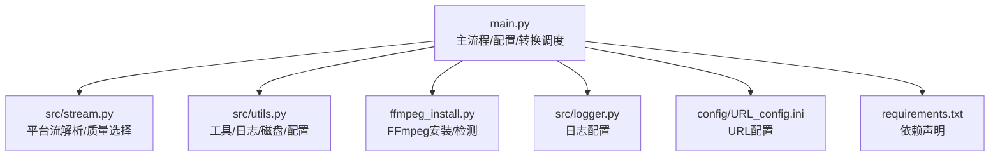
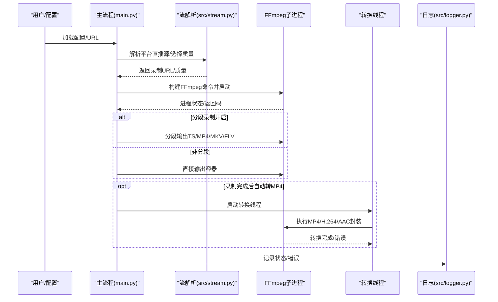
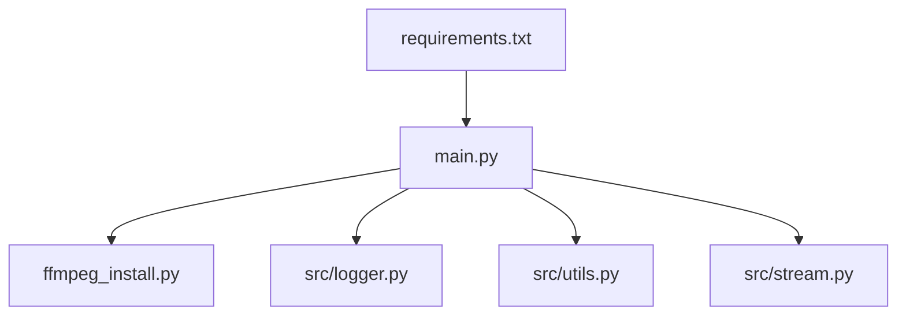

# 格式转换

<cite>
**本文引用的文件**
- [main.py](file://main.py)
- [ffmpeg_install.py](file://ffmpeg_install.py)
- [src/stream.py](file://src/stream.py)
- [src/utils.py](file://src/utils.py)
- [src/logger.py](file://src/logger.py)
- [requirements.txt](file://requirements.txt)
- [config/URL_config.ini](file://config/URL_config.ini)
</cite>

## 目录
1. [简介](#简介)
2. [项目结构](#项目结构)
3. [核心组件](#核心组件)
4. [架构总览](#架构总览)
5. [详细组件分析](#详细组件分析)
6. [依赖关系分析](#依赖关系分析)
7. [性能与并发](#性能与并发)
8. [故障排查](#故障排查)
9. [结论](#结论)
10. [附录](#附录)

## 简介
本文件面向“格式转换”功能，系统性梳理项目中基于 FFmpeg 的视频格式转换能力，覆盖以下主题：
- 视频格式转换：MP4 转码、TS/MKV/FLV 输出、分段录制、合并策略
- 音频处理：AAC 提取、MP3 编码、音频分段输出
- 字幕生成：时间轴字幕文件生成
- 参数配置：编码器选择、质量控制、压缩比、色彩空间、容器格式
- 流程控制：批量转换、进度监控、错误处理、资源管理
- 特殊场景：H.264 编码、AAC 音频提取、ASS/SRT 字幕生成
- 性能优化：并发策略、内存管理、磁盘空间限制、动态并发调节

## 项目结构
项目采用模块化设计，围绕“直播录制 + 格式转换”的主流程组织代码：
- 主入口负责配置加载、任务调度、FFmpeg 子进程控制与回调
- 工具模块提供日志、颜色输出、磁盘容量检查、配置读写等通用能力
- 流媒体模块负责各平台直播源解析与质量选择
- 安装模块负责 FFmpeg 自动安装与可用性检测

图表来源
- [main.py:1-2155](file://main.py#L1-L2155)
- [src/stream.py:1-446](file://src/stream.py#L1-L446)
- [src/utils.py:1-206](file://src/utils.py#L1-L206)
- [ffmpeg_install.py:1-222](file://ffmpeg_install.py#L1-L222)
- [src/logger.py:1-44](file://src/logger.py#L1-L44)
- [config/URL_config.ini:1-5](file://config/URL_config.ini#L1-L5)
- [requirements.txt:1-7](file://requirements.txt#L1-L7)

章节来源
- [main.py:1713-1725](file://main.py#L1713-L1725)
- [src/stream.py:1-446](file://src/stream.py#L1-L446)
- [src/utils.py:1-206](file://src/utils.py#L1-L206)
- [ffmpeg_install.py:1-222](file://ffmpeg_install.py#L1-L222)
- [src/logger.py:1-44](file://src/logger.py#L1-L44)
- [config/URL_config.ini:1-5](file://config/URL_config.ini#L1-L5)
- [requirements.txt:1-7](file://requirements.txt#L1-L7)

## 核心组件
- FFmpeg 调用封装
  - 分段录制：按时间切片输出 TS/MP4/MKV/FLV
  - 转码与封装：MP4/H.264/AAC/容器选择
  - 音频提取与编码：AAC/MP3
- 转换调度与并发
  - 录制完成后自动转 MP4（可选 H.264 重编码）
  - 分段录制完成后逐段转 MP4（可选删除原文件）
- 字幕生成
  - 按秒生成时间轴字幕文件（SRT/ASS），用于时间定位
- 配置与参数
  - 通过配置项控制：分段录制、转 MP4、H.264 重编码、删除原文件、生成时间字幕、自定义脚本等
- 错误处理与日志
  - 统一使用日志模块记录错误；录制过程中动态调整并发，降低错误率

章节来源
- [main.py:188-271](file://main.py#L188-L271)
- [main.py:1474-1602](file://main.py#L1474-L1602)
- [main.py:1731-1828](file://main.py#L1731-L1828)
- [src/logger.py:1-44](file://src/logger.py#L1-L44)

## 架构总览
下图展示“录制—转换—输出”的整体流程，以及关键组件之间的交互。

图表来源
- [main.py:1474-1602](file://main.py#L1474-L1602)
- [main.py:188-271](file://main.py#L188-L271)
- [src/stream.py:1-446](file://src/stream.py#L1-L446)
- [src/logger.py:1-44](file://src/logger.py#L1-L44)

## 详细组件分析

### FFmpeg 调用与参数配置
- 分段录制
  - 支持 TS/MP4/MKV/FLV 分段输出，按固定时长切片，容器格式可选
  - 关键参数：分段时长、分段格式、复用标志、快速启动等
- 封装与转码
  - MP4 输出：可选择直接复制视频/音频流，或对视频进行 H.264 重编码
  - 音频：AAC 提取/编码，MP3 编码，支持 ADTS 包装
- 字幕生成
  - 生成时间轴字幕文件（SRT/ASS），每秒一条时间戳，便于定位

章节来源
- [main.py:188-271](file://main.py#L188-L271)
- [main.py:1474-1602](file://main.py#L1474-L1602)
- [main.py:1731-1828](file://main.py#L1731-L1828)

### 转换流程控制
- 批量转换
  - 录制完成后扫描分段目录，逐段触发 MP4 转换
  - 可配置是否删除原文件
- 进度监控
  - 通过子进程轮询与信号控制，支持中途停止
- 错误处理
  - 统一捕获子进程返回码与异常，记录错误并动态调整并发
- 资源管理
  - 磁盘空间阈值检查，低于阈值时拒绝新录制
  - 日志文件按大小轮转与保留

章节来源
- [main.py:420-491](file://main.py#L420-L491)
- [main.py:1693-1710](file://main.py#L1693-L1710)
- [src/utils.py:149-159](file://src/utils.py#L149-L159)
- [src/logger.py:1-44](file://src/logger.py#L1-L44)

### 特殊转换场景
- H.264 编码
  - 可选 H.264 重编码，设置预设与 CRF，确保兼容性
- AAC 音频提取
  - 仅提取音频并封装为 AAC，支持 ADTS 包装
- ASS/SRT 字幕生成
  - 生成带时间戳的字幕文件，用于时间定位与辅助

章节来源
- [main.py:219-271](file://main.py#L219-L271)
- [main.py:273-296](file://main.py#L273-L296)

### 参数配置详解
- 录制设置（来自配置文件）
  - 保存路径、是否按作者/时间/标题分文件夹、文件名是否包含标题、是否去除表情
  - 保存格式（TS/MP4/MKV/FLV/音频）、录制质量（原画/超清/高清/标清/流畅）
  - 是否使用代理、代理地址、并发线程数、循环时间、排队读取时间
  - 分段录制开关、分段时间、录制空间阈值、是否转 MP4、是否 H.264 重编码
  - 是否删除原文件、是否生成时间字幕、是否执行自定义脚本及脚本命令
- 平台代理白名单与额外代理平台
- Cookie/Authorization/账号密码等平台凭据

章节来源
- [main.py:1731-1828](file://main.py#L1731-L1828)
- [config/URL_config.ini:1-5](file://config/URL_config.ini#L1-L5)

## 依赖关系分析
- FFmpeg 安装与检测
  - 自动检测系统 PATH 中是否存在 FFmpeg，不存在则按平台自动安装
- Python 依赖
  - requests、loguru、pycryptodome、distro、tqdm、httpx[http2]、PyExecJS
- 日志
  - 使用 loguru 输出到控制台与文件，区分 INFO 与其他级别

图表来源
- [requirements.txt:1-7](file://requirements.txt#L1-L7)
- [main.py:1-2155](file://main.py#L1-L2155)
- [ffmpeg_install.py:1-222](file://ffmpeg_install.py#L1-L222)
- [src/logger.py:1-44](file://src/logger.py#L1-L44)
- [src/utils.py:1-206](file://src/utils.py#L1-L206)
- [src/stream.py:1-446](file://src/stream.py#L1-L446)

章节来源
- [requirements.txt:1-7](file://requirements.txt#L1-L7)
- [ffmpeg_install.py:161-222](file://ffmpeg_install.py#L161-L222)

## 性能与并发
- 动态并发调节
  - 基于错误窗口计算错误率，动态增减并发线程数，避免网络抖动导致的失败风暴
- 磁盘空间限制
  - 在开始录制前检查目标路径剩余空间，低于阈值时拒绝新录制
- 分段录制
  - 将长时间录制拆分为多个片段，降低单文件体积与内存占用
- 转码策略
  - 默认复制流以减少 CPU 开销；需要兼容性时再启用 H.264 重编码
- 日志轮转
  - 控制台与文件日志分离，文件日志按大小轮转，避免日志膨胀

章节来源
- [main.py:298-325](file://main.py#L298-L325)
- [main.py:1933-1939](file://main.py#L1933-L1939)
- [main.py:1474-1602](file://main.py#L1474-L1602)
- [src/logger.py:21-31](file://src/logger.py#L21-L31)

## 故障排查
- FFmpeg 未安装
  - 程序启动时检测 FFmpeg，未找到则尝试自动安装；若失败需手动安装
- 录制失败
  - 捕获子进程返回码与异常，记录错误并增加循环延迟；错误过多时延长等待时间
- 并发过高导致失败
  - 启用动态并发调节，根据错误率自动降速
- 磁盘空间不足
  - 设置空间阈值，低于阈值时拒绝新录制并提示
- 字幕生成异常
  - 时间字幕文件按秒生成，若录制被注释或停止，线程会退出

章节来源
- [ffmpeg_install.py:161-222](file://ffmpeg_install.py#L161-L222)
- [main.py:1468-1473](file://main.py#L1468-L1473)
- [main.py:298-325](file://main.py#L298-L325)
- [main.py:1933-1939](file://main.py#L1933-L1939)
- [main.py:420-491](file://main.py#L420-L491)

## 结论
本项目围绕 FFmpeg 构建了完整的直播录制与格式转换体系，具备：
- 灵活的容器与编码策略（复制流/重编码）
- 可配置的分段录制与批量转换
- 完善的错误处理与并发控制
- 实用的字幕生成与日志管理
在实际部署中，建议结合业务需求合理设置并发、分段时长与转码策略，并定期清理日志与中间文件，以获得最佳稳定性与性能。

## 附录

### FFmpeg 命令与参数要点（基于源码）
- 分段录制
  - 输入：原始录制文件
  - 输出：按时间切片的 TS/MP4/MKV/FLV 片段
  - 关键参数：分段时长、分段格式、复用标志、快速启动
- MP4 转码
  - 复制流：直接封装为 MP4
  - 重编码：H.264 编码、预设、CRF、色彩空间转换
- 音频处理
  - 提取音频并封装为 AAC 或 MP3，支持 ADTS 包装
- 字幕生成
  - 每秒生成一条时间戳字幕，格式可选 SRT/ASS

章节来源
- [main.py:188-271](file://main.py#L188-L271)
- [main.py:1474-1602](file://main.py#L1474-L1602)