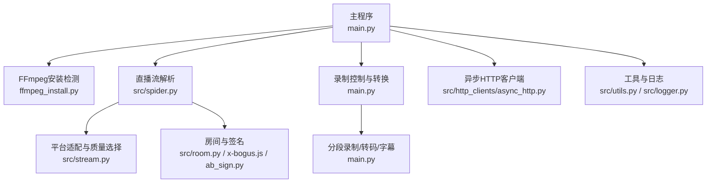
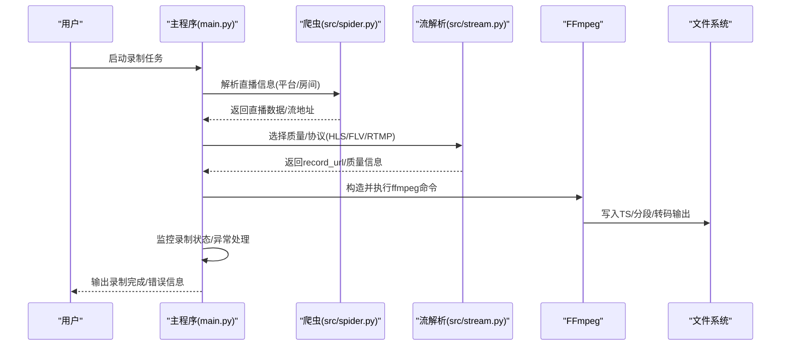
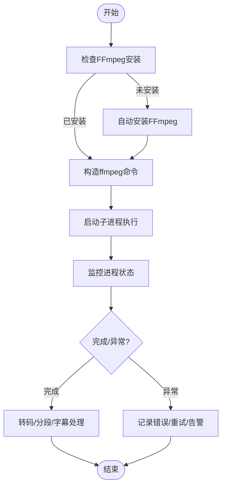
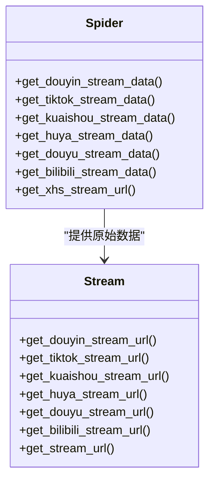
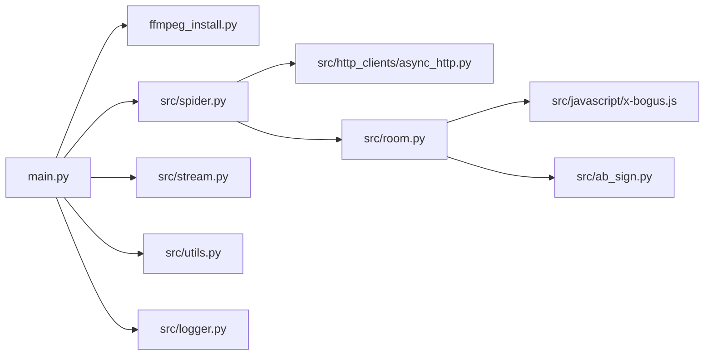

# 视频处理功能

<cite>
**本文档引用的文件**
- [main.py](file://main.py)
- [ffmpeg_install.py](file://ffmpeg_install.py)
- [src/stream.py](file://src/stream.py)
- [src/spider.py](file://src/spider.py)
- [src/room.py](file://src/room.py)
- [src/utils.py](file://src/utils.py)
- [src/http_clients/async_http.py](file://src/http_clients/async_http.py)
- [src/logger.py](file://src/logger.py)
- [src/javascript/x-bogus.js](file://src/javascript/x-bogus.js)
- [src/ab_sign.py](file://src/ab_sign.py)
- [README.md](file://README.md)
- [config/URL_config.ini](file://config/URL_config.ini)
</cite>

## 目录
1. [简介](#简介)
2. [项目结构](#项目结构)
3. [核心组件](#核心组件)
4. [架构总览](#架构总览)
5. [详细组件分析](#详细组件分析)
6. [依赖关系分析](#依赖关系分析)
7. [性能考量](#性能考量)
8. [故障排除指南](#故障排除指南)
9. [结论](#结论)
10. [附录](#附录)

## 简介
本文件面向视频处理功能的技术文档，重点阐述FFmpeg集成实现、命令行参数配置、录制参数优化、录制控制（TS格式录制、分段录制、质量控制）、格式转换处理（MP4转码、音频处理、字幕生成、视频合并）、录制监控机制、异常检测与状态管理、FFmpeg安装配置与环境变量设置、性能调优及实用指南。文档同时提供命令行示例、配置参数说明与故障排除方法，帮助开发者与运维人员快速理解并部署该功能。

## 项目结构
该项目采用模块化设计，围绕“直播采集-流解析-FFmpeg录制-转换与合并-监控与推送”的链路组织代码。关键模块包括：
- 主流程与录制控制：main.py
- FFmpeg安装与检测：ffmpeg_install.py
- 直播流解析与质量选择：src/stream.py、src/spider.py
- 房间与签名工具：src/room.py、src/javascript/x-bogus.js、src/ab_sign.py
- 工具与日志：src/utils.py、src/http_clients/async_http.py、src/logger.py
- 配置与示例：config/URL_config.ini、README.md

图表来源
- [main.py](file://main.py)
- [ffmpeg_install.py](file://ffmpeg_install.py)
- [src/spider.py](file://src/spider.py)
- [src/stream.py](file://src/stream.py)
- [src/room.py](file://src/room.py)
- [src/javascript/x-bogus.js](file://src/javascript/x-bogus.js)
- [src/ab_sign.py](file://src/ab_sign.py)
- [src/http_clients/async_http.py](file://src/http_clients/async_http.py)
- [src/utils.py](file://src/utils.py)
- [src/logger.py](file://src/logger.py)

章节来源
- [README.md](file://README.md)
- [main.py](file://main.py)
- [ffmpeg_install.py](file://ffmpeg_install.py)
- [src/spider.py](file://src/spider.py)
- [src/stream.py](file://src/stream.py)
- [src/room.py](file://src/room.py)
- [src/javascript/x-bogus.js](file://src/javascript/x-bogus.js)
- [src/ab_sign.py](file://src/ab_sign.py)
- [src/http_clients/async_http.py](file://src/http_clients/async_http.py)
- [src/utils.py](file://src/utils.py)
- [src/logger.py](file://src/logger.py)

## 核心组件
- FFmpeg集成与命令行封装：通过子进程调用ffmpeg，统一处理TS录制、分段、转码、音频处理、字幕生成与合并。
- 直播流解析与质量选择：针对不同平台解析直播源，支持HLS/FLV/RTMP等多种协议，并按质量映射选择最优流。
- 录制控制与状态管理：支持TS格式录制、分段录制、录制质量控制、录制状态监控与异常处理。
- 转换与合并：提供MP4转码（含强制h264）、音频提取与封装、字幕生成与合并等能力。
- 安装与环境：自动检测与安装FFmpeg，设置PATH环境变量，保证跨平台可用性。

章节来源
- [main.py](file://main.py)
- [ffmpeg_install.py](file://ffmpeg_install.py)
- [src/stream.py](file://src/stream.py)
- [src/spider.py](file://src/spider.py)

## 架构总览
下图展示从直播采集到最终输出的端到端流程，涵盖FFmpeg命令构造、参数传递、状态监控与异常处理。

图表来源
- [main.py](file://main.py)
- [src/spider.py](file://src/spider.py)
- [src/stream.py](file://src/stream.py)

## 详细组件分析

### FFmpeg集成与命令行封装
- 自动安装与检测：根据操作系统自动安装FFmpeg并注入PATH，确保ffmpeg命令可用。
- 子进程调用：通过subprocess.Popen执行ffmpeg命令，支持stdin信号终止、stderr捕获与错误处理。
- 命令构造策略：
  - TS录制：直接拉取HLS/FLV流并写入TS文件。
  - 分段录制：使用segment格式与时长参数进行分段，支持复用容器格式与关键帧片段标志。
  - MP4转码：可选强制h264编码、预设与CRF控制、像素格式转换；或直接复制视频/音频流。
  - 音频处理：提取音频并封装为AAC，设置码率与封装器。
  - 字幕生成：按时间戳生成SRT/ASS字幕文件，支持实时更新。
- 状态监控：轮询进程返回码，结合脚本回调与消息推送，实现录制完成/异常通知。

图表来源
- [ffmpeg_install.py](file://ffmpeg_install.py)
- [main.py](file://main.py)

章节来源
- [ffmpeg_install.py](file://ffmpeg_install.py)
- [main.py](file://main.py)

### 直播流解析与质量选择
- 平台适配：针对抖音、TikTok、快手、虎牙、斗鱼、B站、小红书、SOOP、网易CC、PandaTV、猫耳FM、Look直播、WinkTV、TTingLive、PopkonTV、TwitCasting、百度直播、微博直播、酷狗直播、TwitchTV、LiveMe、花椒直播、ShowRoom、Acfun、映客直播、知乎直播、CHZZK、嗨秀直播、VV星球直播、17Live、浪Live、畅聊直播、飘飘直播、六间房直播、乐嗨直播、花猫直播、Shopee、Youtube、淘宝、京东、Faceit、咪咕、连接直播、来秀直播、Picarto等平台提供独立解析逻辑。
- 质量映射：将“原画/蓝光/超清/高清/标清/流畅”等质量描述映射为平台特定的码率/分辨率参数，优先选择可用且稳定的流。
- 协议选择：优先HLS，必要时回退到FLV/RTMP；对H265等不支持的协议进行规避或降级处理。
- 反防盗链：部分平台需要携带特定Headers或进行签名处理，代码内置签名与反爬逻辑。

图表来源
- [src/spider.py](file://src/spider.py)
- [src/stream.py](file://src/stream.py)

章节来源
- [src/spider.py](file://src/spider.py)
- [src/stream.py](file://src/stream.py)

### 录制控制与状态管理
- TS格式录制：默认保存为TS格式，便于后续分段与转码。
- 分段录制：按设定时长切片，支持复用容器与关键帧标志，减少碎片化。
- 质量控制：根据平台与网络状况动态调整质量，避免卡顿与丢帧。
- 异常检测：通过错误窗口与动态请求上限调节，降低网络波动影响。
- 状态监控：实时显示录制数量、并发线程数、代理状态、分段开关、质量等级等信息。

章节来源
- [main.py](file://main.py)
- [src/utils.py](file://src/utils.py)

### 格式转换处理
- MP4转码：
  - 可选强制h264编码，设置预设与CRF，确保兼容性与体积平衡。
  - 支持像素格式转换与音频流复制。
- 音频处理：
  - 提取音频并封装为AAC，设置码率与封装器，保持音画同步。
- 字幕生成：
  - 实时生成SRT/ASS字幕文件，按秒级更新，支持与视频合并。
- 视频合并：
  - 利用FFmpeg的分段与拼接能力，将多段TS合并为完整MP4。

章节来源
- [main.py](file://main.py)

### 安装与环境配置
- FFmpeg安装：
  - Windows：自动下载并解压，注入PATH。
  - Linux/macOS：通过包管理器安装，或Homebrew安装。
- 环境变量：
  - 自动将ffmpeg路径加入PATH，确保命令可用。
- 依赖管理：
  - 通过requirements.txt声明依赖，建议使用uv或pip安装。

章节来源
- [ffmpeg_install.py](file://ffmpeg_install.py)
- [README.md](file://README.md)
- [requirements.txt](file://requirements.txt)

### 日志与监控
- 日志系统：使用loguru输出到控制台与文件，区分调试与信息级别，支持滚动与保留策略。
- 录制监控：定时打印录制状态、错误计数、并发线程数等信息，便于运维观察。

章节来源
- [src/logger.py](file://src/logger.py)
- [main.py](file://main.py)

## 依赖关系分析
- 模块耦合：
  - main.py高度依赖ffmpeg_install.py、src/stream.py、src/spider.py与src/utils.py。
  - src/spider.py与src/stream.py相互协作，前者负责抓取数据，后者负责质量与协议选择。
  - src/room.py与签名脚本配合，保障平台访问合法性。
- 外部依赖：
  - FFmpeg：核心录制与转换工具。
  - httpx：异步HTTP请求，支持HTTP/2与代理。
  - PyExecJS：执行JavaScript签名脚本。
  - loguru：结构化日志输出。

图表来源
- [main.py](file://main.py)
- [ffmpeg_install.py](file://ffmpeg_install.py)
- [src/spider.py](file://src/spider.py)
- [src/stream.py](file://src/stream.py)
- [src/utils.py](file://src/utils.py)
- [src/http_clients/async_http.py](file://src/http_clients/async_http.py)
- [src/room.py](file://src/room.py)
- [src/javascript/x-bogus.js](file://src/javascript/x-bogus.js)
- [src/ab_sign.py](file://src/ab_sign.py)
- [src/logger.py](file://src/logger.py)

章节来源
- [main.py](file://main.py)
- [src/spider.py](file://src/spider.py)
- [src/stream.py](file://src/stream.py)
- [src/room.py](file://src/room.py)
- [src/javascript/x-bogus.js](file://src/javascript/x-bogus.js)
- [src/ab_sign.py](file://src/ab_sign.py)
- [src/http_clients/async_http.py](file://src/http_clients/async_http.py)
- [src/utils.py](file://src/utils.py)
- [src/logger.py](file://src/logger.py)

## 性能考量
- 并发与限速：通过动态调整并发线程数与错误率阈值，平衡吞吐与稳定性。
- 编码参数：合理设置CRF与预设，兼顾体积与质量；在CPU受限场景优先使用硬件加速（如平台支持）。
- I/O优化：分段录制减少单文件过大带来的写入压力；转码阶段尽量使用复制模式以降低CPU占用。
- 网络与代理：对海外平台启用代理，避免网络阻断；合理设置超时与重试策略。

## 故障排除指南
- FFmpeg未安装或不可用：
  - 现象：命令执行失败或抛出未找到ffmpeg异常。
  - 处理：使用自动安装脚本或手动安装并确保PATH正确。
- 录制中断或黑屏：
  - 现象：录制中途停止或输出为空。
  - 处理：检查网络稳定性、代理可用性；确认平台签名与Headers有效；尝试切换HLS/FLV协议。
- 分段录制异常：
  - 现象：分段文件缺失或无法合并。
  - 处理：检查segment参数与时长设置；确认容器格式与关键帧标志；验证输出路径权限。
- 转码失败：
  - 现象：MP4转码报错或输出异常。
  - 处理：检查编码参数（CRF/预设/像素格式）；确保输入流兼容；必要时关闭强制转码。
- 日志定位：
  - 使用src/logger.py输出的详细日志定位问题，关注错误级别与堆栈信息。

章节来源
- [ffmpeg_install.py](file://ffmpeg_install.py)
- [main.py](file://main.py)
- [src/logger.py](file://src/logger.py)

## 结论
该视频处理功能以FFmpeg为核心，结合多平台直播流解析与质量选择，实现了稳定高效的录制、分段、转码与合并能力。通过完善的异常检测、状态监控与日志体系，能够满足生产环境的可靠性要求。建议在部署时优先使用TS录制与分段策略，结合合理的编码参数与并发控制，获得最佳的性能与兼容性表现。

## 附录

### 命令行示例与参数说明
- FFmpeg基础命令（示例路径）
  - TS录制：[main.py](file://main.py)
  - 分段录制：[main.py](file://main.py)
  - MP4转码（复制/强制h264）：[main.py](file://main.py)
  - 音频提取与封装：[main.py](file://main.py)
  - 字幕生成：[main.py](file://main.py)
- 关键参数说明（示例路径）
  - 分段时长与格式：[main.py](file://main.py)
  - CRF与预设：[main.py](file://main.py)
  - 像素格式与封装器：[main.py](file://main.py)

章节来源
- [main.py](file://main.py)

### 配置参数说明
- URL配置：[config/URL_config.ini](file://config/URL_config.ini)
- FFmpeg路径与环境变量：[ffmpeg_install.py](file://ffmpeg_install.py)
- 日志输出与级别：[src/logger.py](file://src/logger.py)

章节来源
- [config/URL_config.ini](file://config/URL_config.ini)
- [ffmpeg_install.py](file://ffmpeg_install.py)
- [src/logger.py](file://src/logger.py)