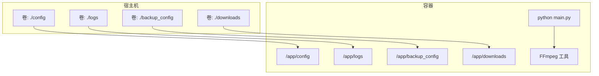
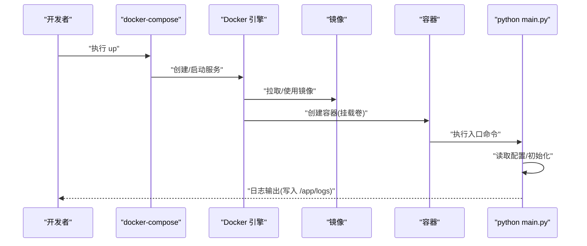
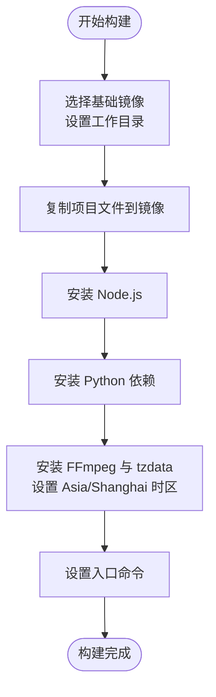
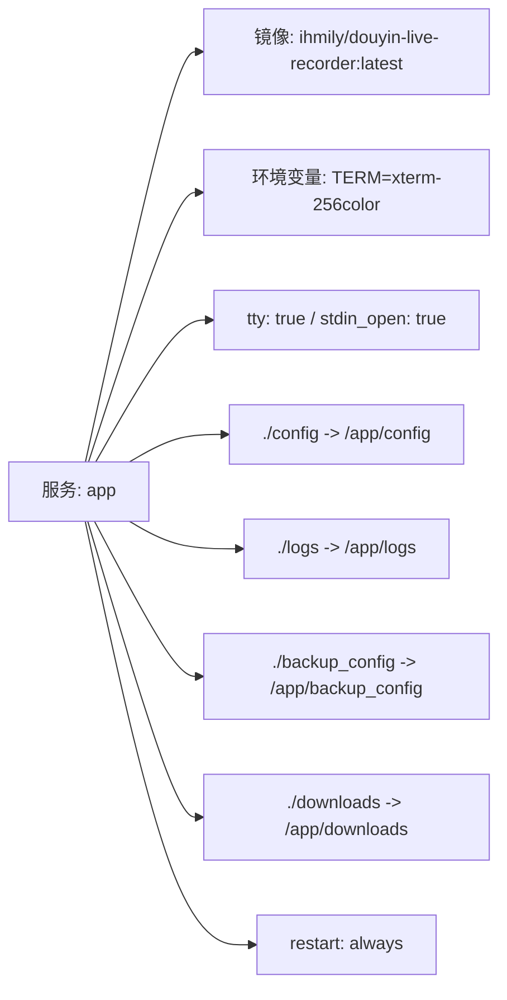
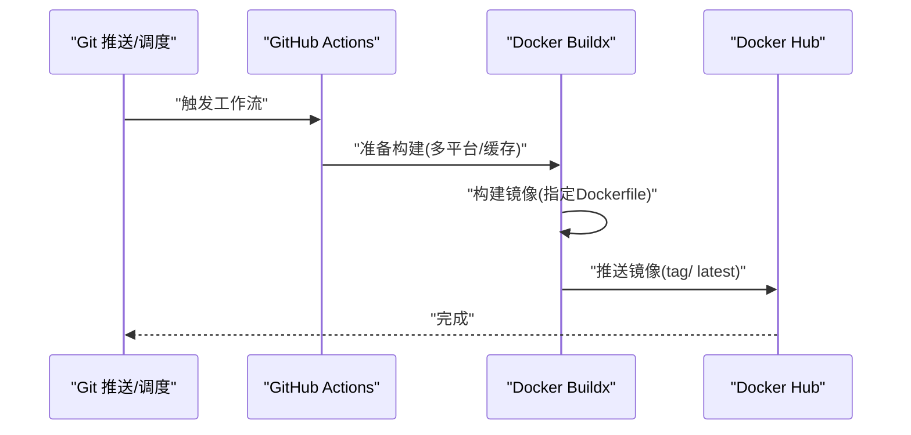
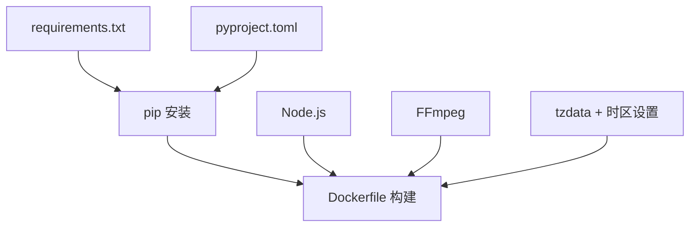

# Docker容器化部署

<cite>
**本文引用的文件**
- [Dockerfile](file://Dockerfile)
- [docker-compose.yaml](file://docker-compose.yaml)
- [requirements.txt](file://requirements.txt)
- [pyproject.toml](file://pyproject.toml)
- [.dockerignore](file://.dockerignore)
- [README.md](file://README.md)
- [main.py](file://main.py)
- [.github/workflows/build-image.yml](file://.github/workflows/build-image.yml)
- [config/URL_config.ini](file://config/URL_config.ini)
</cite>

## 目录
1. [简介](#简介)
2. [项目结构](#项目结构)
3. [核心组件](#核心组件)
4. [架构总览](#架构总览)
5. [详细组件分析](#详细组件分析)
6. [依赖关系分析](#依赖关系分析)
7. [性能与优化](#性能与优化)
8. [故障排查指南](#故障排查指南)
9. [结论](#结论)
10. [附录](#附录)

## 简介
本文件面向希望在Docker环境中部署“直播录制软件”的工程人员与运维人员，系统性阐述Dockerfile构建流程、docker-compose.yaml配置项、镜像构建与优化策略、多阶段构建思路、单容器与多容器编排示例、数据持久化方案，以及容器运行的最佳实践（资源限制、健康检查、日志管理等）。文档严格基于仓库现有文件进行分析与总结，避免臆测。

## 项目结构
该项目采用“单应用容器”模式，容器内运行Python主程序，依赖FFmpeg进行直播流录制；通过卷挂载实现配置、日志、备份与下载目录的数据持久化。GitHub Actions提供跨平台镜像构建与推送流水线。

图表来源
- [docker-compose.yaml:1-16](file://docker-compose.yaml#L1-L16)
- [Dockerfile:1-20](file://Dockerfile#L1-L20)
- [main.py:69-75](file://main.py#L69-L75)

章节来源
- [docker-compose.yaml:1-16](file://docker-compose.yaml#L1-L16)
- [Dockerfile:1-20](file://Dockerfile#L1-L20)
- [README.md:433-482](file://README.md#L433-L482)

## 核心组件
- Dockerfile：定义基础镜像、工作目录、依赖安装（Python、Node.js、FFmpeg）、时区配置与入口命令。
- docker-compose.yaml：定义服务、镜像来源、环境变量、交互模式、卷挂载与重启策略。
- requirements.txt / pyproject.toml：声明Python依赖与版本约束。
- .dockerignore：排除构建上下文中不必要的文件，减少层大小与构建时间。
- GitHub Actions工作流：自动化构建多平台镜像并推送至Docker Hub。
- main.py：应用主入口，负责配置读取、录制流程与日志输出。

章节来源
- [Dockerfile:1-20](file://Dockerfile#L1-L20)
- [docker-compose.yaml:1-16](file://docker-compose.yaml#L1-L16)
- [requirements.txt:1-7](file://requirements.txt#L1-L7)
- [pyproject.toml:1-24](file://pyproject.toml#L1-L24)
- [.dockerignore:1-7](file://.dockerignore#L1-L7)
- [.github/workflows/build-image.yml:1-55](file://.github/workflows/build-image.yml#L1-L55)
- [main.py:69-75](file://main.py#L69-L75)

## 架构总览
下图展示容器启动到应用运行的关键路径，以及卷挂载如何将宿主机目录映射到容器内对应路径。

图表来源
- [docker-compose.yaml:1-16](file://docker-compose.yaml#L1-L16)
- [Dockerfile:19-20](file://Dockerfile#L19-L20)
- [main.py:69-75](file://main.py#L69-L75)

## 详细组件分析

### Dockerfile 构建流程与技术细节
- 基础镜像与工作目录
  - 使用精简Python镜像作为基础，便于控制镜像体积与安全基线。
  - 设置工作目录为应用根路径，后续COPY与RUN均在此上下文中执行。
- 依赖安装
  - 安装Node.js：通过官方NodeSource仓库安装指定版本，满足前端/脚本运行需求。
  - 安装FFmpeg与tzdata：确保录制工具可用与时区正确。
  - Python依赖：使用无缓存模式安装requirements.txt，避免pip缓存层增大镜像体积。
- 环境配置
  - 设置亚洲上海时区并进行非交互式重配置，保证日志与时间一致性。
- 入口命令
  - 容器启动后直接运行主程序入口，简化启动链路。

图表来源
- [Dockerfile:1-20](file://Dockerfile#L1-L20)

章节来源
- [Dockerfile:1-20](file://Dockerfile#L1-L20)
- [requirements.txt:1-7](file://requirements.txt#L1-L7)
- [pyproject.toml:8-17](file://pyproject.toml#L8-L17)

### docker-compose.yaml 配置项详解
- 版本与服务定义
  - 使用现代Compose版本语法，定义单一服务。
- 镜像与构建
  - 默认使用远程镜像；可通过注释掉镜像行并启用build指令实现本地构建。
- 环境与TTY
  - 设置终端类型与交互模式，便于容器内调试与日志查看。
- 卷挂载
  - 将宿主机的配置、日志、备份与下载目录映射到容器内对应路径，实现数据持久化与配置热更新。
- 重启策略
  - 设为始终重启，提升服务可用性。

图表来源
- [docker-compose.yaml:1-16](file://docker-compose.yaml#L1-L16)

章节来源
- [docker-compose.yaml:1-16](file://docker-compose.yaml#L1-L16)
- [README.md:433-482](file://README.md#L433-L482)

### 配置与数据持久化
- 配置文件
  - 应用通过固定路径读取配置与URL列表，容器内对应路径为/app/config。
- 数据目录
  - 日志、备份与下载目录分别映射到/app/logs、/app/backup_config、/app/downloads，便于外部观察与归档。
- 示例配置
  - 提供示例URL配置文件，演示如何添加待录制的直播地址。

章节来源
- [main.py:69-75](file://main.py#L69-L75)
- [docker-compose.yaml:11-15](file://docker-compose.yaml#L11-L15)
- [config/URL_config.ini:1-5](file://config/URL_config.ini#L1-L5)

### GitHub Actions 自动化构建
- 触发条件
  - 推送标签或手动触发。
- 平台与缓存
  - 多平台构建（amd64/arm64），使用Buildx与本地缓存加速。
- 登录与推送
  - 使用Docker Hub凭据登录并推送镜像，打上具体标签与latest标签。
- 构建上下文与Dockerfile
  - 指定上下文与Dockerfile路径，确保流水线稳定。

图表来源
- [.github/workflows/build-image.yml:1-55](file://.github/workflows/build-image.yml#L1-L55)

章节来源
- [.github/workflows/build-image.yml:1-55](file://.github/workflows/build-image.yml#L1-L55)

### 多容器编排与扩展建议
当前仓库提供单服务编排示例。若需扩展，可在compose中新增服务（如消息推送、监控、反向代理等），并通过网络共享与环境变量进行集成。注意保持卷挂载与时区一致，避免重复安装系统级依赖。

[本节为概念性说明，不直接分析具体文件，故无章节来源]

## 依赖关系分析
- Python依赖来源
  - requirements.txt与pyproject.toml共同声明依赖集合，Dockerfile在构建时统一安装。
- Node.js与FFmpeg
  - 通过系统包管理器安装，确保录制与脚本执行能力。
- 时区与系统工具
  - 通过tzdata与时区设置保障日志与任务调度一致性。

图表来源
- [requirements.txt:1-7](file://requirements.txt#L1-L7)
- [pyproject.toml:9-17](file://pyproject.toml#L9-L17)
- [Dockerfile:7-17](file://Dockerfile#L7-L17)

章节来源
- [requirements.txt:1-7](file://requirements.txt#L1-L7)
- [pyproject.toml:1-24](file://pyproject.toml#L1-L24)
- [Dockerfile:1-20](file://Dockerfile#L1-L20)

## 性能与优化
- 构建层优化
  - 使用无缓存安装Python依赖，避免pip缓存层增大镜像体积。
  - 合理合并RUN指令，减少层数与镜像体积。
- 依赖最小化
  - 基于精简Python镜像，仅安装必要系统工具（Node.js、FFmpeg、tzdata）。
- 缓存利用
  - GitHub Actions使用本地缓存加速构建，缩短CI时间。
- 运行期优化
  - 通过卷挂载避免在容器内写入临时文件，降低I/O开销。
  - 使用固定时区，减少时间换算与日志解析成本。

章节来源
- [Dockerfile:7-17](file://Dockerfile#L7-L17)
- [.github/workflows/build-image.yml:28-34](file://.github/workflows/build-image.yml#L28-L34)

## 故障排查指南
- 容器无法启动或立即退出
  - 检查入口命令与依赖是否完整安装。
  - 查看容器日志输出位置（/app/logs）。
- 录制中断导致文件损坏
  - README明确指出容器内手动中断可能导致录制文件损坏，应使用优雅停止方式。
- 时区与日志时间不一致
  - 确认容器内时区设置已生效。
- 配置未生效
  - 确认卷挂载路径与应用读取路径一致，且配置文件存在。

章节来源
- [README.md:474-481](file://README.md#L474-L481)
- [main.py:69-75](file://main.py#L69-L75)
- [Dockerfile:14-17](file://Dockerfile#L14-L17)

## 结论
本项目提供了简洁可靠的单容器部署方案：以精简Python镜像为基础，按需安装Node.js与FFmpeg，结合卷挂载实现配置与数据持久化，并通过GitHub Actions实现跨平台镜像构建与发布。遵循本文最佳实践，可在生产环境中获得稳定、可维护的容器化部署体验。

## 附录

### 部署示例与操作指引
- 单容器快速启动
  - 使用默认远程镜像，直接运行编排文件。
- 本地构建与启动
  - 取消镜像行注释并启用build，随后启动编排。
- 停止容器
  - 使用编排提供的停止命令。

章节来源
- [README.md:433-482](file://README.md#L433-L482)
- [docker-compose.yaml:10-10](file://docker-compose.yaml#L10-L10)

### 多阶段构建建议（概念性）
- 阶段一：构建环境（安装编译工具、Node.js、Python依赖）
- 阶段二：运行环境（仅保留运行所需库与工具）
- 优势：进一步缩小镜像体积、降低攻击面、提升安全性

[本节为概念性说明，不直接分析具体文件，故无章节来源]