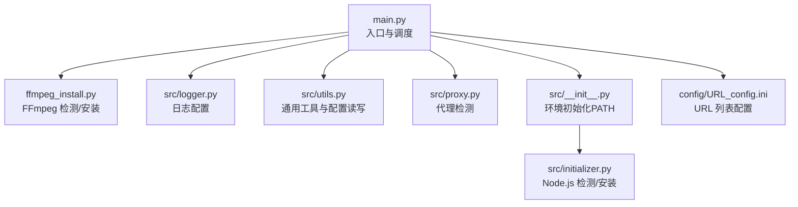
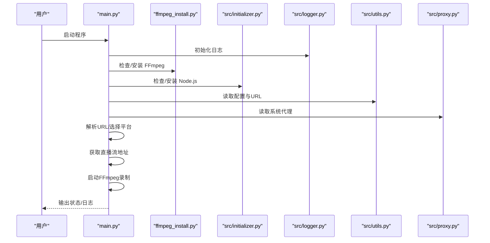
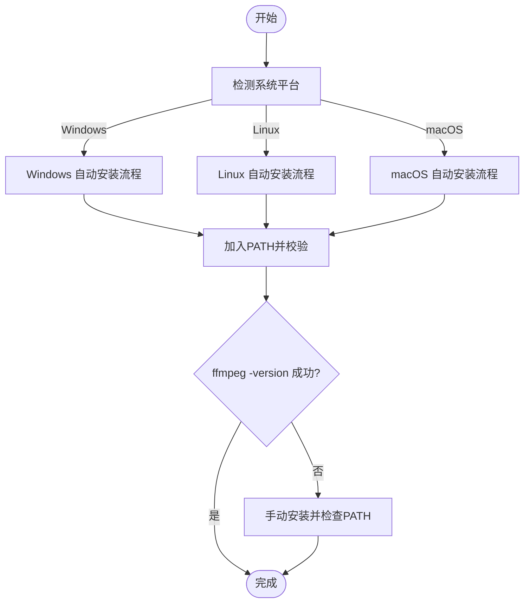
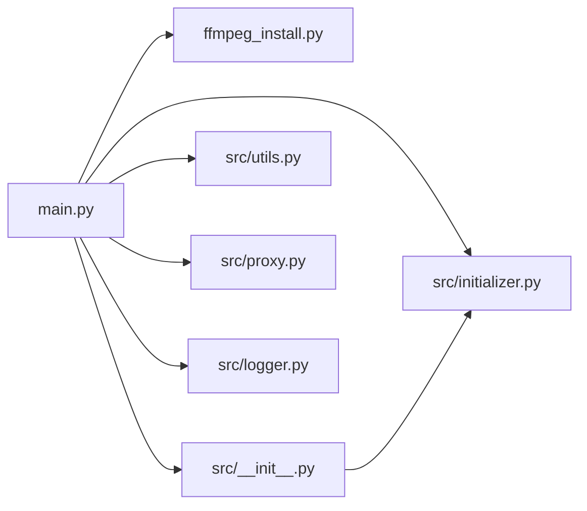

# 本地部署

<cite>
**本文引用的文件**   
- [README.md](file://README.md)
- [requirements.txt](file://requirements.txt)
- [pyproject.toml](file://pyproject.toml)
- [main.py](file://main.py)
- [ffmpeg_install.py](file://ffmpeg_install.py)
- [src/__init__.py](file://src/__init__.py)
- [src/initializer.py](file://src/initializer.py)
- [src/proxy.py](file://src/proxy.py)
- [src/utils.py](file://src/utils.py)
- [src/logger.py](file://src/logger.py)
- [config/URL_config.ini](file://config/URL_config.ini)
- [demo.py](file://demo.py)
</cite>

## 目录
1. [简介](#简介)
2. [项目结构](#项目结构)
3. [核心组件](#核心组件)
4. [架构总览](#架构总览)
5. [详细组件分析](#详细组件分析)
6. [依赖关系分析](#依赖关系分析)
7. [性能与资源考量](#性能与资源考量)
8. [故障排查指南](#故障排查指南)
9. [结论](#结论)
10. [附录](#附录)

## 简介
本项目是一个可循环值守的直播录制工具，基于 FFmpeg 实现多平台直播源录制，支持自定义配置录制以及直播状态推送。本文档面向首次本地部署的用户，覆盖 Python 环境要求、依赖安装、FFmpeg 配置、环境变量设置、Windows/Linux/macOS 平台安装步骤、requirements.txt 依赖项安装方法、Python 虚拟环境创建与激活、FFmpeg 安装与验证、配置文件初始设置、本地运行流程（命令行与 GUI 启动）、常见问题排查等内容。

## 项目结构
项目采用“顶层入口 + 模块化子包”的组织方式，核心入口为 main.py；媒体录制与 FFmpeg 集成由 ffmpeg_install.py 提供；Node.js 环境通过 src/initializer.py 自动检测与安装；日志统一由 src/logger.py 管理；配置文件位于 config/ 目录，包含 URL_config.ini 等。

图示来源
- [main.py:11-40](file://main.py#L11-L40)
- [ffmpeg_install.py:1-222](file://ffmpeg_install.py#L1-L222)
- [src/__init__.py:1-15](file://src/__init__.py#L1-L15)
- [src/initializer.py:1-200](file://src/initializer.py#L1-L200)
- [src/proxy.py:1-93](file://src/proxy.py#L1-L93)
- [src/utils.py:1-200](file://src/utils.py#L1-L200)
- [src/logger.py:1-44](file://src/logger.py#L1-L44)
- [config/URL_config.ini:1-5](file://config/URL_config.ini#L1-L5)

章节来源
- [main.py:11-80](file://main.py#L11-L80)
- [README.md:289-431](file://README.md#L289-L431)

## 核心组件
- Python 环境与依赖
  - Python 版本要求：>=3.10（项目元数据声明），实际使用建议 3.11+（仓库徽章显示 3.11.6）。
  - 依赖清单来自 requirements.txt 与 pyproject.toml，核心库包括 requests、loguru、pycryptodome、distro、tqdm、httpx[http2]、PyExecJS。
- FFmpeg 集成
  - 通过 ffmpeg_install.py 提供自动检测与安装能力，支持 Windows、Linux、macOS；Windows 下可自动下载并加入 PATH；Linux/macOS 优先尝试包管理器安装。
- Node.js 环境
  - 通过 src/initializer.py 检测与安装 Node.js，Windows 使用 zip 包安装，Linux/macOS 通过包管理器安装。
- 日志系统
  - 使用 loguru 输出到控制台与本地日志文件，便于排障与运行监控。
- 配置与运行
  - URL_config.ini 用于配置待录制的直播房间链接；main.py 负责加载配置、调度爬虫与录制流程。

章节来源
- [pyproject.toml:8-17](file://pyproject.toml#L8-L17)
- [requirements.txt:1-7](file://requirements.txt#L1-L7)
- [ffmpeg_install.py:161-222](file://ffmpeg_install.py#L161-L222)
- [src/initializer.py:162-204](file://src/initializer.py#L162-L204)
- [src/logger.py:1-44](file://src/logger.py#L1-L44)
- [config/URL_config.ini:1-5](file://config/URL_config.ini#L1-L5)

## 架构总览
下图展示本地部署与运行的关键交互：入口脚本 main.py 初始化环境（FFmpeg/Node.js/日志/路径），读取配置文件，按平台调用爬虫模块获取直播流地址，最终通过 FFmpeg 录制并可选转码、分段、脚本回调与消息推送。

图示来源
- [main.py:11-80](file://main.py#L11-L80)
- [ffmpeg_install.py:174-222](file://ffmpeg_install.py#L174-L222)
- [src/initializer.py:179-204](file://src/initializer.py#L179-L204)
- [src/logger.py:1-44](file://src/logger.py#L1-L44)
- [src/utils.py:65-108](file://src/utils.py#L65-L108)
- [src/proxy.py:27-93](file://src/proxy.py#L27-L93)

## 详细组件分析

### Python 环境与依赖安装
- Python 版本
  - 项目元数据要求 Python>=3.10；仓库徽章显示 3.11.6。建议使用 3.11+。
- 依赖安装方式
  - 推荐使用 uv（可选，但能自动管理虚拟环境与 Python 版本）；也可使用 pip 安装 requirements.txt。
  - 若 pip 速度较慢，可使用国内镜像源（README 提供了示例）。
- 虚拟环境
  - 使用 python -m venv 创建虚拟环境，或使用 uv venv。
  - 激活方式随平台而异（Bash/Powershell/CMD），README 提供了三类平台的激活命令。

章节来源
- [pyproject.toml:8](file://pyproject.toml#L8)
- [README.md:304-388](file://README.md#L304-L388)
- [requirements.txt:1-7](file://requirements.txt#L1-L7)

### FFmpeg 安装与验证
- Windows
  - README 指明 Windows 可跳过手动安装（程序会自动处理），但也可手动安装。
  - ffmpeg_install.py 支持自动下载并解压到项目目录，随后加入 PATH 并校验版本。
- Linux
  - README 提供 yum/apt 安装命令；ffmpeg_install.py 会优先尝试 yum，失败则尝试 apt。
- macOS
  - README 提供 Homebrew 安装命令；ffmpeg_install.py 通过 brew 安装。
- 验证
  - 通过 subprocess 调用 ffmpeg -version 校验安装结果；若失败，按提示手动安装或检查 PATH。

图示来源
- [ffmpeg_install.py:161-222](file://ffmpeg_install.py#L161-L222)
- [README.md:390-417](file://README.md#L390-L417)

章节来源
- [ffmpeg_install.py:161-222](file://ffmpeg_install.py#L161-L222)
- [README.md:390-417](file://README.md#L390-L417)

### Node.js 环境准备
- src/initializer.py 会在启动时检测 Node.js 是否可用，不可用时按平台自动安装：
  - Windows：下载 zip 包并重命名为 node 目录，加入 PATH。
  - Linux：优先包管理器（RHS/DBS 分支），否则提示手动安装。
  - macOS：通过 brew 安装。
- src/__init__.py 会将 node 执行目录加入 PATH，确保后续 JS 解密逻辑可用。

章节来源
- [src/initializer.py:162-204](file://src/initializer.py#L162-L204)
- [src/__init__.py:10-15](file://src/__init__.py#L10-L15)

### 配置文件初始设置
- URL_config.ini
  - 用于添加待录制的直播房间地址，一行一条；支持在 URL 前加“#”注释以临时停止某房间监测。
  - README 提供了多平台示例链接，便于快速测试。
- 其他配置
  - main.py 会读取 config.ini（由 src/utils.py 的读取/更新函数可见），用于平台 Cookie、代理、推送等高级配置。
  - demo.py 展示了如何调用各平台爬虫函数进行测试。

章节来源
- [config/URL_config.ini:1-5](file://config/URL_config.ini#L1-L5)
- [README.md:104-120](file://README.md#L104-L120)
- [demo.py:8-228](file://demo.py#L8-L228)
- [src/utils.py:65-108](file://src/utils.py#L65-L108)

### 本地运行流程
- 命令行启动
  - 进入项目目录后，先创建并激活虚拟环境，再安装依赖（pip 或 uv），最后运行 python main.py（Linux 使用 python3 main.py）。
- GUI 应用启动
  - README 提示可直接使用 Releases 中打包好的可执行程序（Windows），无需额外安装 Python/FFmpeg。
- 基本配置验证
  - 在 URL_config.ini 添加一条有效直播链接，运行后观察日志与 downloads 目录是否生成录制文件。

章节来源
- [README.md:289-431](file://README.md#L289-L431)
- [main.py:70-76](file://main.py#L70-L76)

## 依赖关系分析
- 入口与环境
  - main.py 导入 ffmpeg_install、src.logger、src.utils、src.proxy、src.initilizer 等模块，负责初始化 PATH、日志、配置读取与运行调度。
- FFmpeg 与 Node.js
  - ffmpeg_install.py 与 src/initializer.py 分别负责 FFmpeg 与 Node.js 的检测与安装，二者均通过系统 PATH 协作。
- 工具与日志
  - src/utils.py 提供配置读写、去重、磁盘容量检测等通用能力；src/logger.py 统一输出格式与落盘策略。

图示来源
- [main.py:11-40](file://main.py#L11-L40)
- [src/__init__.py:1-15](file://src/__init__.py#L1-L15)
- [src/initializer.py:1-200](file://src/initializer.py#L1-L200)
- [src/utils.py:1-200](file://src/utils.py#L1-L200)
- [src/logger.py:1-44](file://src/logger.py#L1-L44)
- [src/proxy.py:1-93](file://src/proxy.py#L1-L93)

章节来源
- [main.py:11-80](file://main.py#L11-L80)

## 性能与资源考量
- 并发与限速
  - main.py 内部存在动态调整并发请求的机制，可根据错误率自动增减并发线程数，降低被反爬封禁风险。
- 录制策略
  - 支持分段录制与转码（可选 h264），合理设置可平衡存储占用与兼容性。
- 磁盘空间
  - utils 提供磁盘容量检测工具，建议在运行前确认目标目录剩余空间充足。

章节来源
- [main.py:298-325](file://main.py#L298-L325)
- [src/utils.py:149-159](file://src/utils.py#L149-L159)

## 故障排查指南
- FFmpeg 未安装或不在 PATH
  - 现象：启动后提示安装失败或无法找到 ffmpeg。
  - 处理：使用 ffmpeg_install.py 的自动安装流程；或手动安装后将可执行文件所在目录加入 PATH。
- Node.js 未安装
  - 现象：JS 解密相关功能报错，提示缺少 Node.js。
  - 处理：通过 src/initializer.py 自动安装，或手动安装后重启终端。
- 权限问题（Linux/macOS）
  - 现象：脚本无执行权限或 shebang 缺失。
  - 处理：为脚本赋予可执行权限（chmod +x），并在文件首行添加合适的 shebang。
- 路径问题
  - 现象：FFmpeg/Node 路径未正确加入 PATH，导致命令不可用。
  - 处理：确认 src/__init__.py 与 ffmpeg_install.py 已将相应目录加入 PATH；重启终端或重新激活虚拟环境。
- 依赖冲突
  - 现象：pip 安装失败或版本冲突。
  - 处理：使用 uv（更稳定的依赖解析与虚拟环境管理）；或更换国内镜像源重试。
- 代理与网络
  - 现象：海外平台无法访问或频繁失败。
  - 处理：在配置中启用代理并正确填写代理地址；必要时使用系统代理检测工具辅助定位。

章节来源
- [ffmpeg_install.py:202-222](file://ffmpeg_install.py#L202-L222)
- [src/initializer.py:179-204](file://src/initializer.py#L179-L204)
- [src/proxy.py:27-93](file://src/proxy.py#L27-L93)
- [main.py:368-374](file://main.py#L368-L374)

## 结论
通过本指南，您可以在 Windows/Linux/macOS 上完成 Python 环境准备、依赖安装、FFmpeg 与 Node.js 的自动/手动安装、配置文件的初始设置，并成功运行录制程序。遇到问题时，可依据“故障排查指南”逐项定位与修复。建议优先使用 uv 管理依赖与虚拟环境，结合 README 的镜像源与平台安装命令，提升安装效率与成功率。

## 附录
- 快速命令摘要（以 README 为准）
  - 克隆仓库与进入目录
  - 创建并激活虚拟环境（Bash/Powershell/CMD）
  - 安装依赖（pip/uv）
  - 安装 FFmpeg（Windows 可跳过；Linux/macOS 使用包管理器或自动安装）
  - 运行程序（python main.py 或 uv run main.py）

章节来源
- [README.md:289-431](file://README.md#L289-L431)