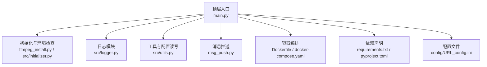
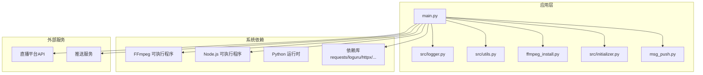
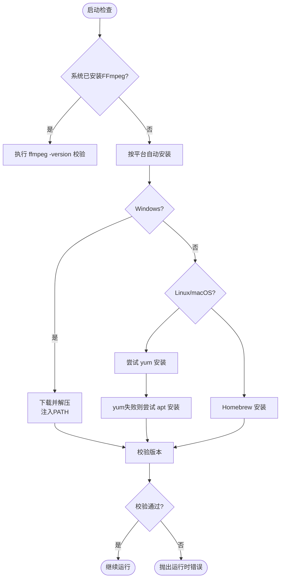
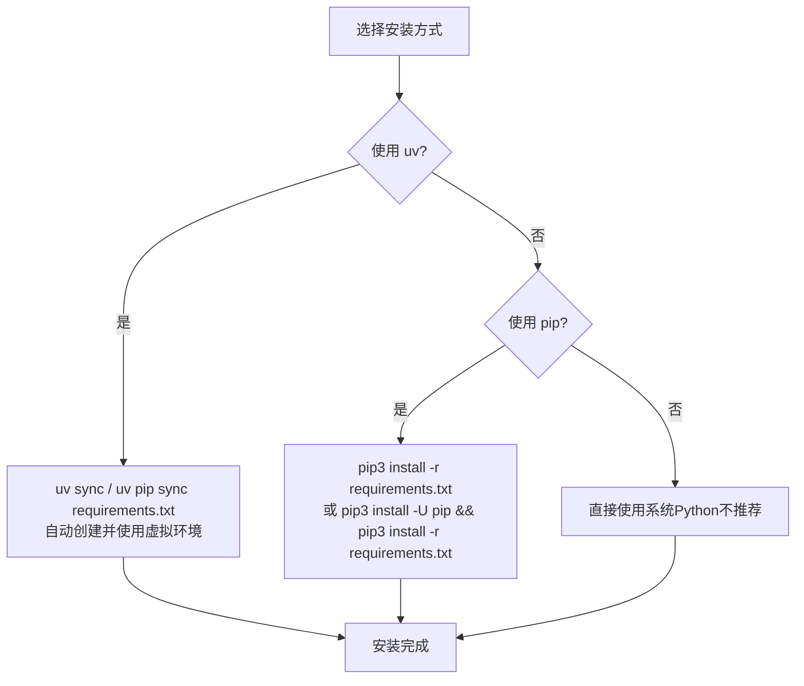
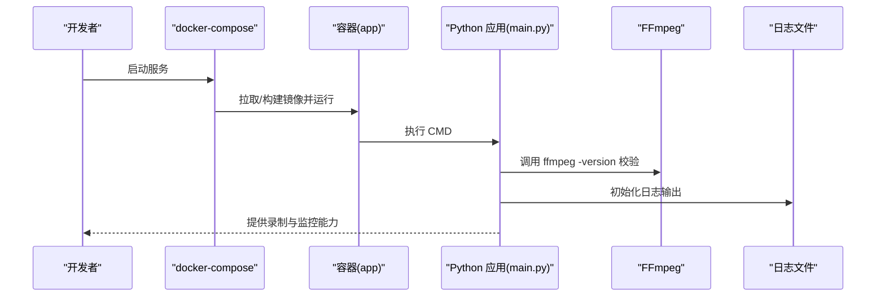
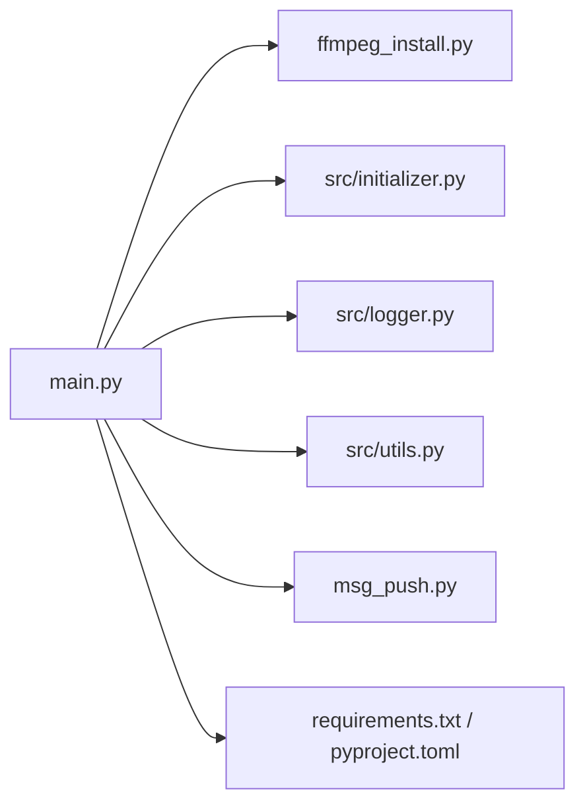

# 环境配置

<cite>
**本文引用的文件**
- [README.md](file://README.md)
- [requirements.txt](file://requirements.txt)
- [pyproject.toml](file://pyproject.toml)
- [Dockerfile](file://Dockerfile)
- [docker-compose.yaml](file://docker-compose.yaml)
- [ffmpeg_install.py](file://ffmpeg_install.py)
- [src/initializer.py](file://src/initializer.py)
- [src/logger.py](file://src/logger.py)
- [src/utils.py](file://src/utils.py)
- [main.py](file://main.py)
- [msg_push.py](file://msg_push.py)
- [upload_baidu.sh](file://upload_baidu.sh)
- [config/URL_config.ini](file://config/URL_config.ini)
</cite>

## 目录
1. [简介](#简介)
2. [项目结构](#项目结构)
3. [核心组件](#核心组件)
4. [架构总览](#架构总览)
5. [详细组件分析](#详细组件分析)
6. [依赖关系分析](#依赖关系分析)
7. [性能考量](#性能考量)
8. [故障排查指南](#故障排查指南)
9. [结论](#结论)
10. [附录](#附录)

## 简介
本文件面向部署与运维人员，提供DouyinLiveRecorder项目的环境配置与验证指南。内容覆盖：
- FFmpeg安装与版本兼容性
- Python依赖管理（requirements.txt、pyproject.toml、uv与pip）
- 配置文件结构与参数说明（URL配置、录制参数、推送设置、日志配置）
- 环境检查清单与验证方法
- 常见问题诊断与解决方案（权限、路径、依赖缺失等）

## 项目结构
项目采用“顶层脚本 + 模块化源码 + 配置与日志”的组织方式，便于在本地与容器中统一部署。

图表来源
- [main.py](file://main.py)
- [ffmpeg_install.py](file://ffmpeg_install.py)
- [src/initializer.py](file://src/initializer.py)
- [src/logger.py](file://src/logger.py)
- [src/utils.py](file://src/utils.py)
- [msg_push.py](file://msg_push.py)
- [Dockerfile](file://Dockerfile)
- [docker-compose.yaml](file://docker-compose.yaml)
- [requirements.txt](file://requirements.txt)
- [pyproject.toml](file://pyproject.toml)
- [config/URL_config.ini](file://config/URL_config.ini)

章节来源
- [README.md](file://README.md)
- [Dockerfile](file://Dockerfile)
- [docker-compose.yaml](file://docker-compose.yaml)

## 核心组件
- FFmpeg安装与校验：自动检测系统并按平台安装，失败时抛出运行时错误。
- Node.js安装与校验：用于JavaScript解密/签名等场景。
- Python依赖管理：requirements.txt与pyproject.toml共同约束版本范围。
- 日志系统：控制台与文件双通道，区分INFO与DEBUG级别。
- 配置读取与更新：统一使用ConfigParser，支持转义与去重。
- 消息推送：支持钉钉、微信、邮箱、Telegram、Bark、Ntfy、PushPlus等。
- 容器化：Dockerfile与docker-compose.yaml提供一键部署。

章节来源
- [ffmpeg_install.py](file://ffmpeg_install.py)
- [src/initializer.py](file://src/initializer.py)
- [requirements.txt](file://requirements.txt)
- [pyproject.toml](file://pyproject.toml)
- [src/logger.py](file://src/logger.py)
- [src/utils.py](file://src/utils.py)
- [msg_push.py](file://msg_push.py)
- [Dockerfile](file://Dockerfile)
- [docker-compose.yaml](file://docker-compose.yaml)

## 架构总览
下图展示从入口到外部系统的调用链路与关键依赖：

图表来源
- [main.py](file://main.py)
- [ffmpeg_install.py](file://ffmpeg_install.py)
- [src/initializer.py](file://src/initializer.py)
- [src/logger.py](file://src/logger.py)
- [src/utils.py](file://src/utils.py)
- [msg_push.py](file://msg_push.py)
- [requirements.txt](file://requirements.txt)
- [pyproject.toml](file://pyproject.toml)

## 详细组件分析

### FFmpeg安装与版本兼容性
- 自动检测机制
  - Windows：下载并解压最新构建，注入PATH后校验版本。
  - Linux：优先尝试yum，失败则回退apt；安装完成后建议重启生效。
  - macOS：通过Homebrew安装，失败提示手动安装。
- 版本与编解码器
  - 项目未硬性要求特定版本，但建议使用较新版本以获得更稳定的HLS/FLV解析与转码能力。
  - 若出现h265 FLV不支持的情况，程序会回退到HLS源。
- 异常处理
  - 安装失败或PATH未生效时，抛出运行时错误，阻止后续流程。

图表来源
- [ffmpeg_install.py](file://ffmpeg_install.py)

章节来源
- [ffmpeg_install.py](file://ffmpeg_install.py)
- [README.md](file://README.md)

### Python依赖管理
- 版本要求
  - 项目要求Python >= 3.10。
- 依赖声明
  - requirements.txt与pyproject.toml均列出核心依赖，包括HTTP客户端、日志、加密、系统检测、进度条、JS执行等。
- 安装方式
  - 推荐使用uv（自动虚拟环境、Python版本管理、镜像源加速），也可使用pip或uv pip sync。
  - 若网络较慢，可使用国内镜像源（README提供示例）。
- 虚拟环境
  - 使用uv venv或python -m venv创建虚拟环境；Windows建议使用PowerShell激活。

图表来源
- [requirements.txt](file://requirements.txt)
- [pyproject.toml](file://pyproject.toml)
- [README.md](file://README.md)

章节来源
- [requirements.txt](file://requirements.txt)
- [pyproject.toml](file://pyproject.toml)
- [README.md](file://README.md)

### Node.js安装与校验
- 用途：执行JavaScript解密/签名等逻辑。
- 自动化：按平台下载并注入PATH，失败时提示手动安装。
- 校验：通过node -v确认可用。

章节来源
- [src/initializer.py](file://src/initializer.py)

### 日志系统
- 控制台输出：彩色时间戳与级别，便于终端观察。
- 文件输出：
  - PlayURL.log：INFO级别，记录播放URL等信息。
  - streamget.log：DEBUG及以上，带函数行号，按大小轮转与保留1天。
- 日志位置：与入口脚本同目录的logs子目录。

章节来源
- [src/logger.py](file://src/logger.py)

### 配置文件与参数说明
- URL配置（URL_config.ini）
  - 每行一个直播房间地址；支持以#开头注释掉某条URL。
  - 可在URL前指定画质，形如“超清，https://...”。
  - 代理设置：可通过配置文件启用代理录制（详见README使用说明）。
- 录制参数（由main.py读取）
  - 录制分段：按秒切片、格式选择、是否删除原始文件。
  - 转码：可强制h264并输出MP4。
  - 时间文件：可生成含时间戳的字幕文件辅助定位。
  - 画质映射：支持原画/蓝光/超清/高清/标清/流畅。
- 推送设置（由msg_push.py消费）
  - 支持多平台推送，参数包括API地址、账号、Token、收件人等。
- 日志配置（由src/logger.py消费）
  - 控制台与文件输出级别、轮转策略、保留策略。

章节来源
- [config/URL_config.ini](file://config/URL_config.ini)
- [main.py](file://main.py)
- [msg_push.py](file://msg_push.py)
- [src/logger.py](file://src/logger.py)

### 容器化部署
- Dockerfile
  - 基于python:3.11-slim，安装Node.js与FFmpeg，复制依赖并设置时区。
  - CMD直接运行main.py。
- docker-compose.yaml
  - 挂载config、logs、backup_config、downloads四个目录，重启策略always。
  - 可取消注释build行以本地构建镜像。

图表来源
- [Dockerfile](file://Dockerfile)
- [docker-compose.yaml](file://docker-compose.yaml)
- [main.py](file://main.py)

章节来源
- [Dockerfile](file://Dockerfile)
- [docker-compose.yaml](file://docker-compose.yaml)

## 依赖关系分析
- 运行时依赖
  - FFmpeg：必须可执行，否则抛错。
  - Node.js：用于JS解密/签名，非必需但影响部分平台解析。
  - Python依赖：由requirements.txt与pyproject.toml共同约束。
- 组件耦合
  - main.py依赖ffmpeg_install.py与src/initializer.py进行环境准备。
  - 日志与配置分别由src/logger.py与src/utils.py提供。
  - 推送模块独立，通过main.py调度。

图表来源
- [main.py](file://main.py)
- [ffmpeg_install.py](file://ffmpeg_install.py)
- [src/initializer.py](file://src/initializer.py)
- [src/logger.py](file://src/logger.py)
- [src/utils.py](file://src/utils.py)
- [msg_push.py](file://msg_push.py)
- [requirements.txt](file://requirements.txt)
- [pyproject.toml](file://pyproject.toml)

章节来源
- [main.py](file://main.py)
- [ffmpeg_install.py](file://ffmpeg_install.py)
- [src/initializer.py](file://src/initializer.py)
- [src/logger.py](file://src/logger.py)
- [src/utils.py](file://src/utils.py)
- [msg_push.py](file://msg_push.py)
- [requirements.txt](file://requirements.txt)
- [pyproject.toml](file://pyproject.toml)

## 性能考量
- 并发与限速
  - 程序内置动态调整并发请求上限的机制，依据错误率窗口自适应。
- 录制分段与转码
  - 分段录制可降低单文件体积与损坏风险；转码为h264可提升兼容性但增加CPU消耗。
- 磁盘空间
  - 建议定期清理downloads目录，必要时监控磁盘容量。

章节来源
- [main.py](file://main.py)
- [src/utils.py](file://src/utils.py)

## 故障排查指南
- FFmpeg未安装或不可用
  - 现象：启动即报错或录制失败。
  - 处理：按平台自动安装或手动安装；确保PATH包含FFmpeg路径。
- Node.js未安装
  - 现象：JS执行报错或部分平台解析失败。
  - 处理：按平台自动安装或手动安装；确保PATH包含Node.js。
- Python依赖缺失或版本不符
  - 现象：导入失败或功能异常。
  - 处理：使用uv或pip安装requirements.txt；必要时升级pip并使用国内镜像源。
- 权限问题（Linux）
  - 现象：脚本无法执行或容器内中断导致文件损坏。
  - 处理：授予脚本可执行权限；容器运行时避免手动中断，推荐使用ts格式保存。
- 路径问题
  - 现象：日志/下载目录不存在或权限不足。
  - 处理：确保logs、downloads、config等目录存在且可写。
- 推送失败
  - 现象：钉钉/微信/邮箱/TG/Bark/Ntfy/PushPlus等推送失败。
  - 处理：核对API地址、Token、收件人等参数；检查网络与超时设置。

章节来源
- [ffmpeg_install.py](file://ffmpeg_install.py)
- [src/initializer.py](file://src/initializer.py)
- [README.md](file://README.md)
- [upload_baidu.sh](file://upload_baidu.sh)

## 结论
通过本指南，您可以在不同平台上完成FFmpeg与Python依赖的安装与校验，理解配置文件与日志体系，并掌握容器化部署与常见问题的诊断方法。建议在生产环境优先使用uv管理依赖与虚拟环境，结合容器化部署以简化运维。

## 附录

### 环境检查清单
- Python版本与依赖
  - Python >= 3.10；依赖安装完成。
- FFmpeg
  - 可执行且版本可用；PATH正确。
- Node.js
  - 可执行且版本可用；PATH正确。
- 配置文件
  - URL_config.ini存在且格式正确；必要参数已填写。
- 目录权限
  - logs、downloads、config、backup_config可读写。
- 推送配置
  - 推送参数有效；网络可达。
- 容器（可选）
  - 镜像构建/拉取成功；卷挂载正确；服务可启动。

章节来源
- [README.md](file://README.md)
- [Dockerfile](file://Dockerfile)
- [docker-compose.yaml](file://docker-compose.yaml)
- [config/URL_config.ini](file://config/URL_config.ini)