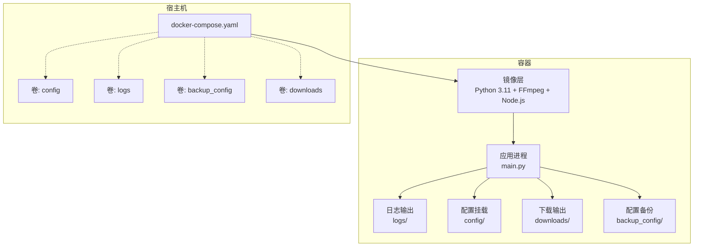
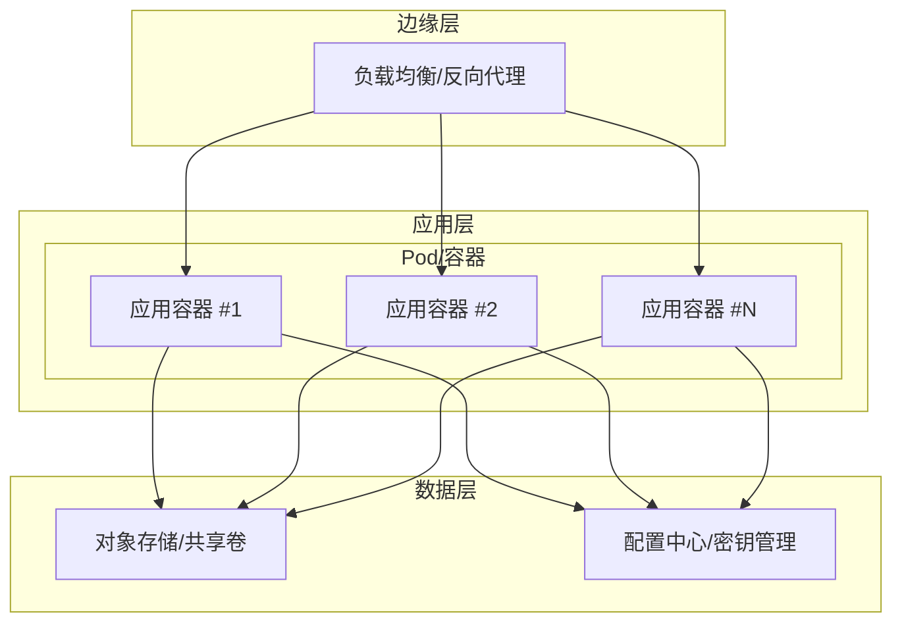
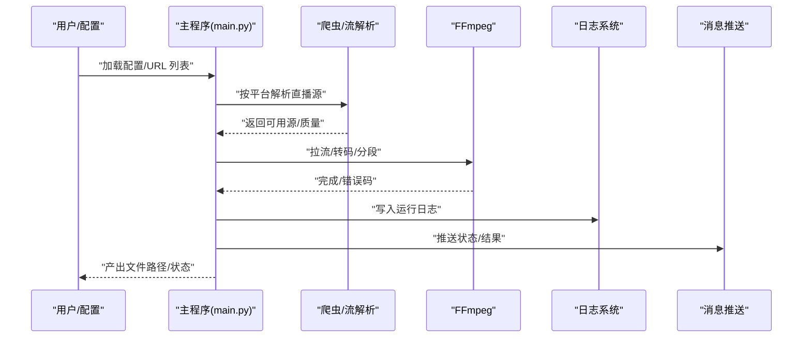
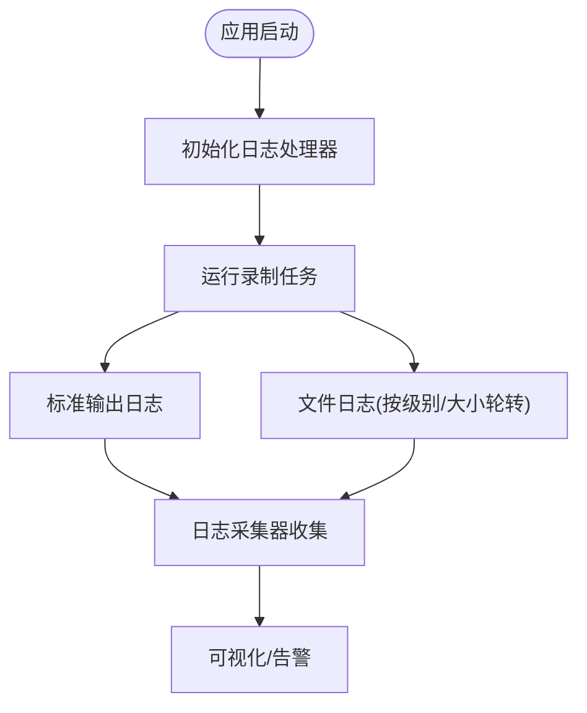
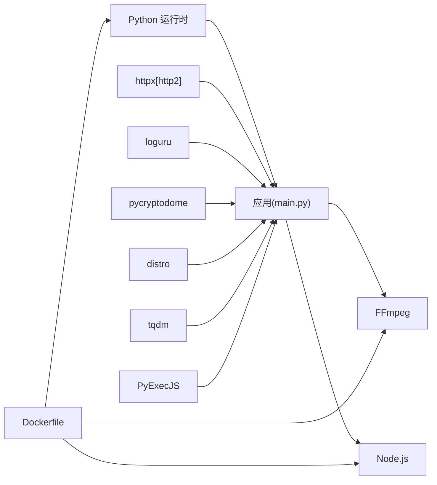

# 生产环境部署

<cite>
**本文引用的文件**   
- [Dockerfile](file://Dockerfile)
- [docker-compose.yaml](file://docker-compose.yaml)
- [requirements.txt](file://requirements.txt)
- [pyproject.toml](file://pyproject.toml)
- [README.md](file://README.md)
- [main.py](file://main.py)
- [src/logger.py](file://src/logger.py)
- [src/utils.py](file://src/utils.py)
- [src/initializer.py](file://src/initializer.py)
- [ffmpeg_install.py](file://ffmpeg_install.py)
- [config/URL_config.ini](file://config/URL_config.ini)
- [msg_push.py](file://msg_push.py)
</cite>

## 目录
1. [引言](#引言)
2. [项目结构](#项目结构)
3. [核心组件](#核心组件)
4. [架构总览](#架构总览)
5. [详细组件分析](#详细组件分析)
6. [依赖分析](#依赖分析)
7. [性能考量](#性能考量)
8. [故障排查指南](#故障排查指南)
9. [结论](#结论)
10. [附录](#附录)

## 引言
本文件面向生产环境部署，围绕“抖音直播录制器”项目，提供从架构设计、高可用与负载均衡、安全配置（含环境变量与敏感信息管理、SSL/TLS）、监控与日志、自动化部署（CI/CD、版本与回滚）、性能优化（资源、并发、缓存、数据库）到故障恢复与安全审计的企业级实践指导。文档严格基于仓库现有代码与配置文件进行分析与总结。

## 项目结构
项目采用“容器化 + 配置挂载”的轻量部署模式，核心由容器编排文件、基础镜像构建、运行入口、日志与工具模块组成；配置通过挂载卷实现与宿主机共享，便于生产环境按需调整。

图表来源
- [Dockerfile:1-20](file://Dockerfile#L1-L20)
- [docker-compose.yaml:1-16](file://docker-compose.yaml#L1-L16)

章节来源
- [Dockerfile:1-20](file://Dockerfile#L1-L20)
- [docker-compose.yaml:1-16](file://docker-compose.yaml#L1-L16)
- [README.md:433-482](file://README.md#L433-L482)

## 核心组件
- 应用入口与业务逻辑
  - 主程序入口负责并发调度、直播源解析、录制流程控制、转码与分段、消息推送、日志输出等。
- 日志与监控
  - 使用结构化日志库输出到标准错误与文件，按级别与大小轮转，便于接入外部日志系统。
- 工具与初始化
  - 提供通用工具（配置读写、磁盘容量检测、代理处理、随机字符串等）与运行前置检查（FFmpeg、Node.js）。
- 容器与依赖
  - 基于精简 Python 镜像构建，安装 FFmpeg 与 Node.js，声明运行入口。

章节来源
- [main.py:1-2155](file://main.py#L1-L2155)
- [src/logger.py:1-44](file://src/logger.py#L1-L44)
- [src/utils.py:1-206](file://src/utils.py#L1-L206)
- [src/initializer.py:1-221](file://src/initializer.py#L1-L221)
- [ffmpeg_install.py:1-222](file://ffmpeg_install.py#L1-L222)
- [requirements.txt:1-7](file://requirements.txt#L1-L7)
- [pyproject.toml:1-24](file://pyproject.toml#L1-L24)

## 架构总览
生产环境推荐采用“单实例容器 + 多副本横向扩展 + 外部存储与配置中心”的组合架构，结合反向代理与健康检查实现高可用与弹性伸缩。

说明
- 负载均衡：对多副本容器进行流量分发，结合就绪/存活探针实现故障剔除与自动恢复。
- 数据层：配置与录制产物通过共享卷或对象存储统一管理，确保跨节点一致性。
- 安全：敏感信息通过配置中心注入，避免硬编码；TLS 终止于边缘层。

（本图为概念性架构示意，不直接映射具体源文件）

## 详细组件分析

### 应用入口与录制流程
- 并发与限流
  - 通过动态窗口错误率计算与锁保护，动态调整并发请求数，降低平台风控与网络抖动风险。
- 录制链路
  - 解析直播源 → 下载/FFmpeg 拉流 → 转码/分段 → 产物落盘 → 可选脚本回调 → 消息推送。
- 健康与信号
  - 捕获终止信号优雅退出，避免录制文件损坏。

图表来源
- [main.py:545-800](file://main.py#L545-L800)
- [main.py:385-492](file://main.py#L385-L492)
- [src/logger.py:1-44](file://src/logger.py#L1-L44)
- [msg_push.py:1-296](file://msg_push.py#L1-L296)

章节来源
- [main.py:298-325](file://main.py#L298-L325)
- [main.py:545-800](file://main.py#L545-L800)
- [main.py:385-492](file://main.py#L385-L492)

### 日志与监控
- 日志策略
  - 标准输出与文件双通道，按级别与大小轮转，保留短期以便快速定位。
- 监控建议
  - 结合日志采集器收集容器日志，建立指标（错误率、并发、录制耗时、磁盘使用）与告警。

图表来源
- [src/logger.py:11-43](file://src/logger.py#L11-L43)

章节来源
- [src/logger.py:1-44](file://src/logger.py#L1-L44)

### 配置与敏感信息管理
- 配置来源
  - URL 列表与运行参数通过挂载卷注入，便于集中管理与热更新。
- 敏感信息
  - 邮箱凭据、推送令牌等通过配置中心注入环境变量或密钥文件，避免明文入仓。
- 安全加固
  - 仅暴露必要端口；启用只读根文件系统与最小权限；对卷进行访问控制。

章节来源
- [docker-compose.yaml:6-15](file://docker-compose.yaml#L6-L15)
- [config/URL_config.ini:1-5](file://config/URL_config.ini#L1-L5)
- [msg_push.py:85-112](file://msg_push.py#L85-L112)

### 健康检查与弹性伸缩
- 健康检查
  - 存活探针定期探测应用进程；就绪探针在配置加载完成后才标记就绪。
- 弹性伸缩
  - 根据并发与错误率动态扩缩容；副本间通过共享存储保持一致性。

章节来源
- [main.py:298-325](file://main.py#L298-L325)
- [docker-compose.yaml:1-16](file://docker-compose.yaml#L1-L16)

### SSL/TLS 与传输安全
- 边缘 TLS 终止
  - 在反向代理层配置证书与强加密套件，应用容器内无需自行处理证书。
- 组件通信
  - 消息推送与第三方 API 调用建议强制使用 HTTPS 与校验证书。

章节来源
- [msg_push.py:114-130](file://msg_push.py#L114-L130)
- [msg_push.py:85-112](file://msg_push.py#L85-L112)

### 自动化部署与版本管理
- CI/CD 管道
  - 触发条件：代码合并/打标签；步骤：构建镜像 → 扫描漏洞 → 推送镜像 → 编排更新 → 健康检查 → 回滚策略。
- 版本与回滚
  - 使用滚动更新与金丝雀发布；失败自动回滚至上一稳定版本。
- 配置变更
  - 通过配置中心下发，避免镜像重构建；变更前进行灰度验证。

章节来源
- [Dockerfile:1-20](file://Dockerfile#L1-L20)
- [docker-compose.yaml:1-16](file://docker-compose.yaml#L1-L16)
- [README.md:433-482](file://README.md#L433-L482)

### 性能优化建议
- 资源分配
  - CPU/内存设置上限，避免资源争抢；根据并发与转码需求预留缓冲。
- 并发配置
  - 动态并发窗口与错误率阈值已在应用内实现，建议结合业务峰值调优。
- 缓存策略
  - 对直播源解析结果与 Cookie/Token 进行短期缓存，减少重复请求。
- 数据库优化
  - 若引入外部存储，建议使用对象存储或块存储，开启压缩与去重；对日志与产物进行生命周期管理。

章节来源
- [main.py:298-325](file://main.py#L298-L325)
- [src/utils.py:65-108](file://src/utils.py#L65-L108)

### 故障恢复与灾难备份
- 故障恢复
  - 容器重启策略与健康检查配合使用；录制中断时通过注释 URL 或脚本触发清理。
- 灾难备份
  - 录制产物与配置定期备份至远端存储；建立异地多活与快照策略。
- 安全审计
  - 审计日志记录关键操作（配置变更、推送开关、回滚事件）；定期审查访问与变更记录。

章节来源
- [docker-compose.yaml:16](file://docker-compose.yaml#L16)
- [main.py:376-383](file://main.py#L376-L383)
- [src/utils.py:85-108](file://src/utils.py#L85-L108)

## 依赖分析
- 运行时依赖
  - Python 运行时、HTTP 客户端、日志库、加密库、进度条、JS 执行引擎。
- 媒体处理依赖
  - FFmpeg 二进制；Node.js 用于部分平台的签名/解密逻辑。
- 容器构建依赖
  - Python 基础镜像、系统包管理器、Node.js 安装脚本。

图表来源
- [requirements.txt:1-7](file://requirements.txt#L1-L7)
- [Dockerfile:1-20](file://Dockerfile#L1-L20)
- [src/initializer.py:162-204](file://src/initializer.py#L162-L204)
- [ffmpeg_install.py:161-200](file://ffmpeg_install.py#L161-L200)

章节来源
- [requirements.txt:1-7](file://requirements.txt#L1-L7)
- [pyproject.toml:9-17](file://pyproject.toml#L9-L17)
- [Dockerfile:1-20](file://Dockerfile#L1-L20)

## 性能考量
- 并发与限流
  - 动态窗口错误率与锁保护的并发调节机制，有助于在高并发下维持稳定性。
- I/O 与存储
  - 录制产物写盘与转码对磁盘 IOPS 有较高要求；建议使用高性能存储并监控剩余空间。
- 网络与代理
  - 针对特定平台启用代理可提升成功率，但会增加延迟；建议按平台白名单启用。
- 转码与格式
  - 按需开启转码与分段，平衡 CPU 占用与产物体积。

章节来源
- [main.py:298-325](file://main.py#L298-L325)
- [src/utils.py:149-159](file://src/utils.py#L149-L159)
- [main.py:189-251](file://main.py#L189-L251)

## 故障排查指南
- 常见问题定位
  - 日志文件：运行日志与播放 URL 日志分别记录不同阶段信息，按级别筛选。
  - 磁盘空间：定期检查剩余空间，避免录制中断。
- FFmpeg/Node.js 缺失
  - 容器内自动检测并尝试安装；若失败，需手动安装或修正镜像。
- 录制中断
  - 通过注释 URL 或脚本触发清理；确认代理与 Cookie 设置。
- 消息推送失败
  - 校验推送地址、令牌与网络连通性；关注第三方返回码。

章节来源
- [src/logger.py:21-43](file://src/logger.py#L21-L43)
- [src/utils.py:149-159](file://src/utils.py#L149-L159)
- [ffmpeg_install.py:174-200](file://ffmpeg_install.py#L174-L200)
- [src/initializer.py:179-204](file://src/initializer.py#L179-L204)
- [main.py:376-383](file://main.py#L376-L383)
- [msg_push.py:25-56](file://msg_push.py#L25-L56)

## 结论
本项目具备良好的容器化与配置分离能力，结合动态并发调节、完善的日志体系与消息推送，适合在生产环境中通过多副本与外部存储实现高可用与可运维性。建议在生产落地时补充：边缘 TLS、配置中心、日志/指标/告警体系、CI/CD 与回滚策略、灾备与审计机制，以满足企业级 SLA 与合规要求。

## 附录
- 快速对照清单
  - 镜像构建：使用仓库提供的 Dockerfile 与 requirements.txt。
  - 配置挂载：按 docker-compose.yaml 挂载 config、logs、backup_config、downloads。
  - 运行入口：CMD 指向 main.py。
  - 健康检查：结合存活/就绪探针与应用内信号处理。
  - 安全：TLS 终止于边缘；敏感信息通过配置中心注入；最小权限与只读根文件系统。
  - 监控：采集日志与指标，设置告警阈值；录制产物与配置定期备份。

章节来源
- [Dockerfile:19](file://Dockerfile#L19)
- [docker-compose.yaml:1-16](file://docker-compose.yaml#L1-L16)
- [README.md:433-482](file://README.md#L433-L482)