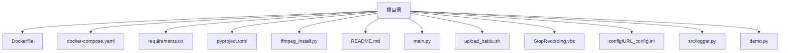
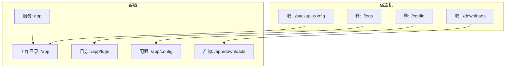
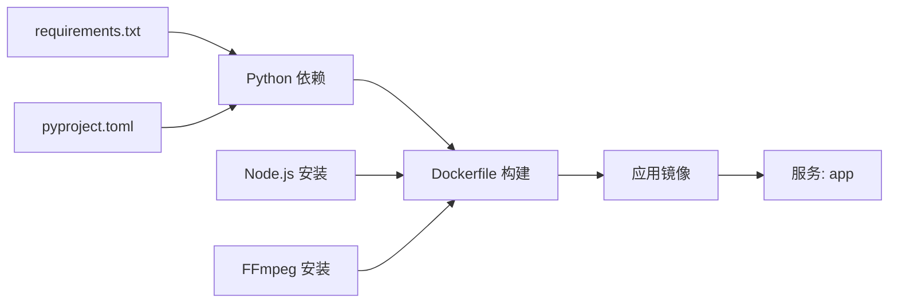

# 部署指南

<cite>
**本文引用的文件**
- [Dockerfile](file://Dockerfile)
- [docker-compose.yaml](file://docker-compose.yaml)
- [requirements.txt](file://requirements.txt)
- [pyproject.toml](file://pyproject.toml)
- [ffmpeg_install.py](file://ffmpeg_install.py)
- [README.md](file://README.md)
- [src/logger.py](file://src/logger.py)
- [main.py](file://main.py)
- [config/URL_config.ini](file://config/URL_config.ini)
- [demo.py](file://demo.py)
- [upload_baidu.sh](file://upload_baidu.sh)
- [StopRecording.vbs](file://StopRecording.vbs)
</cite>

## 目录
1. [简介](#简介)
2. [项目结构](#项目结构)
3. [核心组件](#核心组件)
4. [架构总览](#架构总览)
5. [详细组件分析](#详细组件分析)
6. [依赖关系分析](#依赖关系分析)
7. [性能考量](#性能考量)
8. [故障排除指南](#故障排除指南)
9. [结论](#结论)
10. [附录](#附录)

## 简介
本指南面向希望在生产环境中稳定运行直播录制服务的工程团队与个人用户，覆盖从源码到容器化的完整部署流程，重点包括：
- Dockerfile 构建与镜像优化
- docker-compose 编排与卷挂载
- FFmpeg 安装与环境检查
- 生产最佳实践（环境变量、存储卷、网络与安全）
- 跨平台部署策略（Windows、Linux、macOS）
- 性能调优、监控与日志管理
- 常见问题与排障

## 项目结构
项目采用“源码+容器+配置”的组织方式，核心目录与文件如下：
- 根目录：Dockerfile、docker-compose.yaml、requirements.txt、pyproject.toml、ffmpeg_install.py、README.md、main.py、upload_baidu.sh、StopRecording.vbs
- 配置目录：config/URL_config.ini
- 源码模块：src/logger.py 等
- 示例与测试：demo.py

**图示来源**
- [Dockerfile](file://Dockerfile)
- [docker-compose.yaml](file://docker-compose.yaml)
- [requirements.txt](file://requirements.txt)
- [pyproject.toml](file://pyproject.toml)
- [ffmpeg_install.py](file://ffmpeg_install.py)
- [README.md](file://README.md)
- [main.py](file://main.py)
- [upload_baidu.sh](file://upload_baidu.sh)
- [StopRecording.vbs](file://StopRecording.vbs)
- [config/URL_config.ini](file://config/URL_config.ini)
- [src/logger.py](file://src/logger.py)
- [demo.py](file://demo.py)

**章节来源**
- [Dockerfile](file://Dockerfile)
- [docker-compose.yaml](file://docker-compose.yaml)
- [requirements.txt](file://requirements.txt)
- [pyproject.toml](file://pyproject.toml)
- [ffmpeg_install.py](file://ffmpeg_install.py)
- [README.md](file://README.md)
- [main.py](file://main.py)
- [config/URL_config.ini](file://config/URL_config.ini)
- [src/logger.py](file://src/logger.py)
- [demo.py](file://demo.py)
- [upload_baidu.sh](file://upload_baidu.sh)
- [StopRecording.vbs](file://StopRecording.vbs)

## 核心组件
- 应用入口与调度：main.py 负责读取配置、解析直播源、控制录制流程与消息推送
- 日志系统：src/logger.py 使用 loguru 输出到标准错误与文件，按级别与大小轮转
- FFmpeg 管理：ffmpeg_install.py 提供跨平台安装与可用性检查
- 依赖声明：requirements.txt 与 pyproject.toml 统一声明 Python 依赖
- 容器编排：Dockerfile 与 docker-compose.yaml 实现镜像构建与服务编排

**章节来源**
- [main.py](file://main.py)
- [src/logger.py](file://src/logger.py)
- [ffmpeg_install.py](file://ffmpeg_install.py)
- [requirements.txt](file://requirements.txt)
- [pyproject.toml](file://pyproject.toml)
- [Dockerfile](file://Dockerfile)
- [docker-compose.yaml](file://docker-compose.yaml)

## 架构总览
应用采用“容器内运行 + 外部卷挂载配置与产物”的架构，容器内负责业务逻辑与录制，外部卷持久化配置、日志与录制产物。

**图示来源**
- [docker-compose.yaml](file://docker-compose.yaml)
- [main.py](file://main.py)
- [src/logger.py](file://src/logger.py)

**章节来源**
- [docker-compose.yaml](file://docker-compose.yaml)
- [main.py](file://main.py)
- [src/logger.py](file://src/logger.py)

## 详细组件分析

### Dockerfile 构建与镜像优化
- 基础镜像：使用精简基础镜像，减少攻击面与体积
- 依赖安装：
  - Node.js：通过 NodeSource 源安装，满足部分前置需求
  - Python 依赖：使用 pip 安装 requirements.txt，启用 no-cache-dir 减少层大小
  - FFmpeg：安装 FFmpeg 并设置 Asia/Shanghai 时区
- 入口命令：CMD 指向 main.py

优化建议（结合现有实现）：
- 多阶段构建：将 Node.js 安装与 Python 依赖安装拆分为独立阶段，进一步瘦身最终镜像
- 缓存策略：将 pip 安装置于依赖变更后再执行，提升 CI/CD 缓存命中率
- 时区与语言：在构建阶段统一设置 LC_*，避免运行时重复配置

**章节来源**
- [Dockerfile](file://Dockerfile)
- [requirements.txt](file://requirements.txt)

### docker-compose 编排与卷挂载
- 服务定义：app 使用预构建镜像，或通过 build: . 本地构建
- 环境变量：TERM 设置为 xterm-256color，便于容器内交互
- 终端模式：tty 与 stdin_open 保持交互能力
- 卷挂载：
  - ./config → /app/config：配置持久化
  - ./logs → /app/logs：日志持久化
  - ./backup_config → /app/backup_config：备份持久化
  - ./downloads → /app/downloads：录制产物持久化
- 重启策略：restart: always 提升可用性

最佳实践：
- 使用命名卷替代 bind mount，便于迁移与备份
- 为日志卷设置配额与清理策略，防止磁盘膨胀
- 为 downloads 卷配置只读权限，避免误删

**章节来源**
- [docker-compose.yaml](file://docker-compose.yaml)

### FFmpeg 安装与环境检查
- 自动安装：
  - Windows：下载压缩包并解压到执行目录，注入 PATH
  - macOS：通过 Homebrew 安装
  - Linux：优先 yum，其次 apt
- 环境检查：ensure_ffmpeg_installed 包装器在调用前检查 ffmpeg -version
- 运行时注入：main.py 启动时将 ffmpeg 路径加入系统 PATH

部署建议：
- 在容器内预装 FFmpeg，避免运行时下载与解压
- 为 FFmpeg 增加版本校验与降级回滚策略
- 在 CI/CD 中缓存 FFmpeg 二进制，加速构建

**章节来源**
- [ffmpeg_install.py](file://ffmpeg_install.py)
- [main.py](file://main.py)

### 日志与监控
- 日志配置：
  - 标准错误：彩色 DEBUG 级别输出
  - 文件日志：PlayURL.log INFO 级别；streamget.log 非 INFO 级别，按大小轮转与保留天数控制
- 监控建议：
  - 结合容器日志采集（如 Fluent Bit/Fluentd）与集中式日志系统（如 ELK/Graylog）
  - 对关键指标（并发录制数、错误率、磁盘使用率）建立告警

**章节来源**
- [src/logger.py](file://src/logger.py)

### 生产环境最佳实践
- 环境变量：
  - 通过 docker-compose 的 environment 字段注入运行所需变量（如代理、推送配置）
  - 使用 .env 文件集中管理敏感信息
- 存储卷：
  - config 与 backup_config：定期备份
  - logs：按大小轮转与归档
  - downloads：按平台分目录，定期清理旧文件
- 网络与安全：
  - 仅暴露必要端口，使用防火墙策略
  - 代理配置：对海外平台启用代理，避免地域限制
  - 证书与密钥：使用 Docker secrets 管理敏感配置
- 重启与健康检查：
  - restart: always 与健康检查脚本配合，确保异常自动恢复

**章节来源**
- [docker-compose.yaml](file://docker-compose.yaml)
- [src/logger.py](file://src/logger.py)

### 跨平台部署策略
- Windows：
  - 使用 StopRecording.vbs 停止录制进程，避免录制中断导致文件损坏
  - 容器内运行时注意交互式终端与信号处理
- Linux：
  - 使用 systemd 或 Docker Compose 管理服务生命周期
  - 为脚本赋予可执行权限（chmod +x）
- macOS：
  - 通过 Homebrew 安装 FFmpeg，或在容器内预装

**章节来源**
- [StopRecording.vbs](file://StopRecording.vbs)
- [ffmpeg_install.py](file://ffmpeg_install.py)
- [README.md](file://README.md)

### 性能调优与资源管理
- 并发控制：main.py 中动态调整并发请求线程数，降低错误率
- 录制分段：支持按时间切片，降低单文件体积与内存占用
- 转码策略：按需启用 h264 转码与 MP4 封装，平衡兼容性与性能
- I/O 优化：将 downloads 与 logs 放置在高性能磁盘或 SSD

**章节来源**
- [main.py](file://main.py)

### 监控与告警
- 日志轮转：按大小轮转与保留策略，避免磁盘占满
- 外部脚本：upload_baidu.sh 演示了基于 Docker 日志与文件系统的自动化处理流程，可扩展为通用上传/同步脚本

**章节来源**
- [src/logger.py](file://src/logger.py)
- [upload_baidu.sh](file://upload_baidu.sh)

## 依赖关系分析
- Python 依赖：通过 requirements.txt 与 pyproject.toml 统一声明，确保一致性
- 运行时依赖：FFmpeg、Node.js（用于特定前置需求）
- 容器依赖：Python 3.11-slim 基础镜像

**图示来源**
- [requirements.txt](file://requirements.txt)
- [pyproject.toml](file://pyproject.toml)
- [Dockerfile](file://Dockerfile)

**章节来源**
- [requirements.txt](file://requirements.txt)
- [pyproject.toml](file://pyproject.toml)
- [Dockerfile](file://Dockerfile)

## 性能考量
- 并发与限流：根据平台反爬策略与带宽，动态调整并发线程数
- I/O 与存储：将录制产物与日志分离到不同卷，避免 I/O 竞争
- 转码成本：仅在必要时进行转码，减少 CPU 占用
- 网络代理：对受限平台启用代理，避免请求失败导致重试风暴

[本节为通用指导，无需特定文件引用]

## 故障排除指南
- FFmpeg 未安装：
  - 容器内：通过 ffmpeg_install.py 自动安装或预装镜像
  - 本地：按平台使用包管理器安装
- 录制中断导致文件损坏：
  - 避免手动中断容器；Windows 使用 StopRecording.vbs 停止录制进程
- 日志过大：
  - 检查轮转配置与保留策略，必要时调整 rotation 与 retention
- 外网受限：
  - 对海外平台启用代理；检查代理连通性与有效性

**章节来源**
- [ffmpeg_install.py](file://ffmpeg_install.py)
- [StopRecording.vbs](file://StopRecording.vbs)
- [src/logger.py](file://src/logger.py)
- [README.md](file://README.md)

## 结论
通过容器化与卷挂载，结合 FFmpeg 环境与日志监控，可实现稳定、可扩展的直播录制服务。建议在生产中完善环境变量管理、存储卷策略与健康检查机制，并根据平台特性进行性能与网络优化。

[本节为总结性内容，无需特定文件引用]

## 附录

### 部署示例与配置模板
- 快速启动（使用预构建镜像）
  - docker-compose up
  - 后台运行：docker-compose up -d
- 本地构建镜像
  - 修改 docker-compose.yaml 的 build 字段并取消注释
  - docker-compose up
- 环境变量与卷挂载
  - 在 docker-compose.yaml 的 environment 中添加变量
  - 在 volumes 中挂载本地目录到容器对应路径

**章节来源**
- [docker-compose.yaml](file://docker-compose.yaml)
- [README.md](file://README.md)

### 常见问题与解决方案
- 问：如何避免录制中断导致文件损坏？
  - 答：不要手动中断容器；Windows 使用 StopRecording.vbs；Linux/macOS 使用进程终止脚本或信号处理
- 问：如何启用代理录制海外平台？
  - 答：在配置文件中设置代理地址与启用代理的平台列表
- 问：如何监控录制状态与日志？
  - 答：查看 logs 卷中的 PlayURL.log 与 streamget.log；结合外部日志系统集中管理

**章节来源**
- [README.md](file://README.md)
- [src/logger.py](file://src/logger.py)
- [StopRecording.vbs](file://StopRecording.vbs)