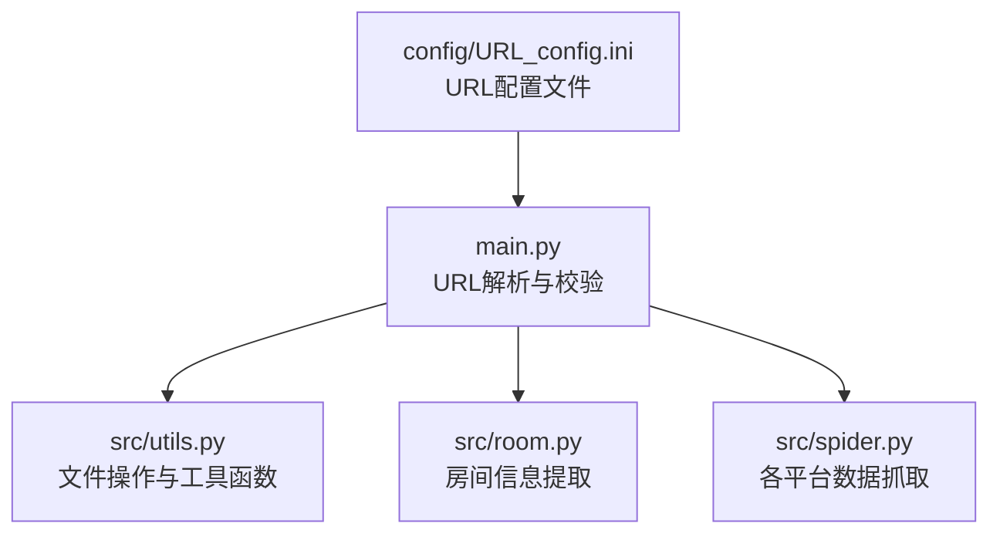
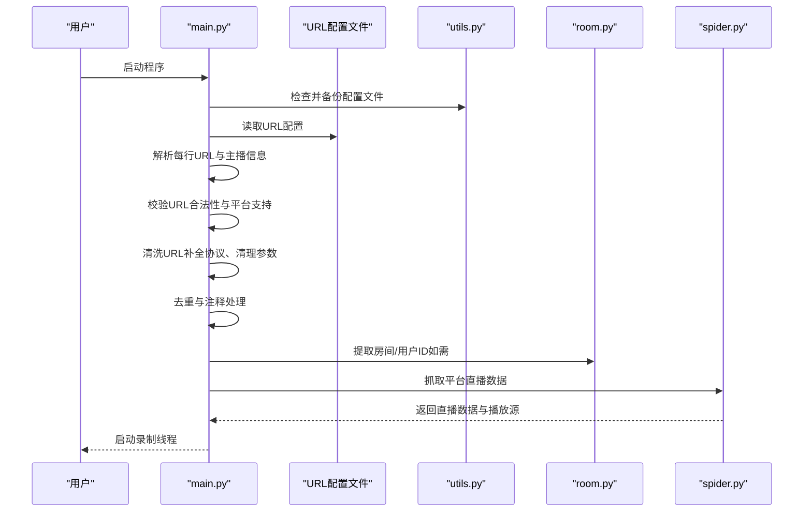
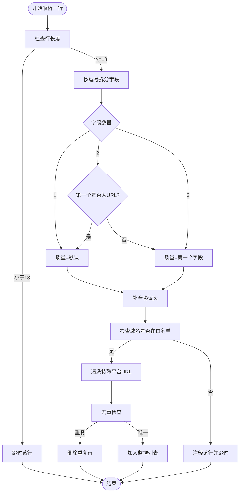
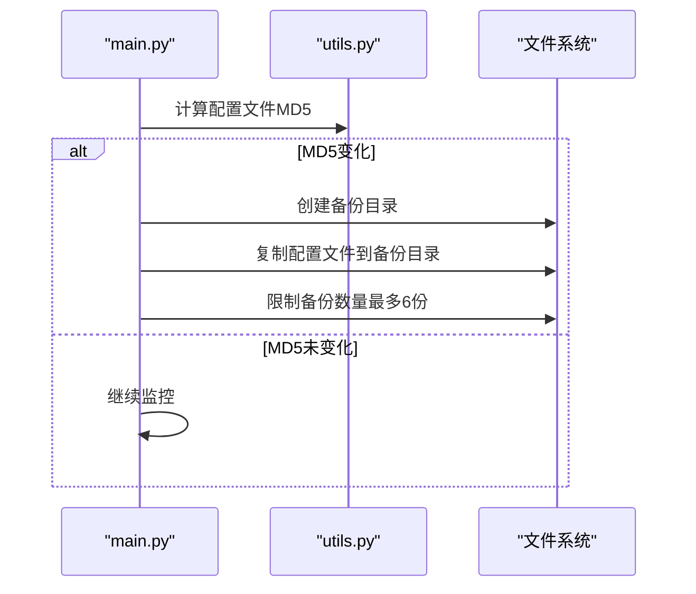
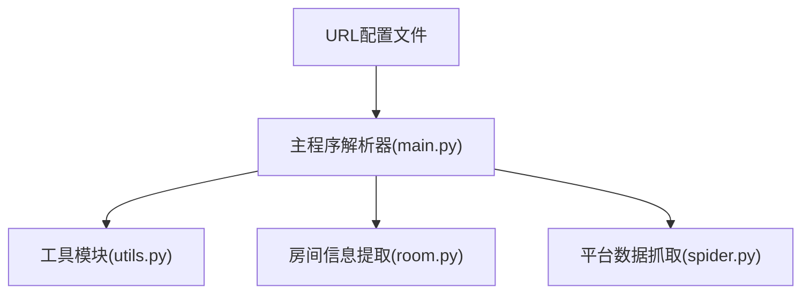

# URL配置管理

<cite>
**本文档引用的文件**
- [config/URL_config.ini](file://config/URL_config.ini)
- [main.py](file://main.py)
- [src/utils.py](file://src/utils.py)
- [src/room.py](file://src/room.py)
- [src/spider.py](file://src/spider.py)
</cite>

## 目录
1. [简介](#简介)
2. [项目结构](#项目结构)
3. [核心组件](#核心组件)
4. [架构总览](#架构总览)
5. [详细组件分析](#详细组件分析)
6. [依赖关系分析](#依赖关系分析)
7. [性能考量](#性能考量)
8. [故障排除指南](#故障排除指南)
9. [结论](#结论)
10. [附录](#附录)

## 简介
本文件系统性地解析了DouyinLiveRecorder项目中的URL配置管理机制，重点围绕config/URL_config.ini配置文件展开，涵盖以下方面：
- 配置文件的结构与格式规范（注释规则、URL格式标准、主播信息标注）
- 添加、编辑、删除直播房间URL的操作流程
- 支持的URL格式类型（抖音、快手、虎牙、斗鱼等）
- URL验证规则与错误处理机制
- 批量添加URL的方法、URL分类管理策略
- 配置文件的备份与恢复操作
- 具体的配置示例与常见问题的解决方案

## 项目结构
该模块位于项目根目录下的config目录，核心逻辑由主程序main.py负责解析与校验URL配置文件，并通过工具模块src/utils.py提供通用的文件操作能力。

图表来源
- [config/URL_config.ini:1-5](file://config/URL_config.ini#L1-L5)
- [main.py:69-71](file://main.py#L69-L71)
- [src/utils.py:1-206](file://src/utils.py#L1-L206)
- [src/room.py:1-151](file://src/room.py#L1-L151)
- [src/spider.py:1-3395](file://src/spider.py#L1-L3395)

章节来源
- [config/URL_config.ini:1-5](file://config/URL_config.ini#L1-L5)
- [main.py:69-71](file://main.py#L69-L71)

## 核心组件
- URL配置文件：用于存储直播房间URL及其附加信息（如主播名），支持注释与批量管理。
- 主程序解析器：负责读取配置文件、解析每行内容、校验URL合法性、去重与清理、生成监控任务。
- 工具模块：提供文件备份、MD5校验、重复行清理、查询参数解析等基础能力。
- 房间信息提取：针对特定平台（如抖音）提取房间ID、用户ID等关键信息。
- 平台数据抓取：根据URL识别平台并抓取直播数据流信息。

章节来源
- [main.py:1942-2155](file://main.py#L1942-L2155)
- [src/utils.py:54-206](file://src/utils.py#L54-L206)
- [src/room.py:52-144](file://src/room.py#L52-L144)
- [src/spider.py:68-282](file://src/spider.py#L68-L282)

## 架构总览
URL配置管理的整体流程如下：
- 初始化阶段：启动时检测并备份配置文件，移除重复行，准备监控列表。
- 解析阶段：逐行读取URL配置文件，识别注释行、分割字段、校验URL有效性与平台支持范围。
- 清洗阶段：对URL进行标准化（补全协议）、清理查询参数、修正特殊平台URL。
- 去重阶段：去除重复URL，避免重复监控。
- 监控阶段：为每个有效URL创建监控线程，按平台调用对应抓取逻辑。

图表来源
- [main.py:1671-1690](file://main.py#L1671-L1690)
- [main.py:1947-2155](file://main.py#L1947-L2155)
- [src/room.py:52-144](file://src/room.py#L52-L144)
- [src/spider.py:68-282](file://src/spider.py#L68-L282)

## 详细组件分析

### URL配置文件结构与格式规范
- 文件位置：config/URL_config.ini
- 编码：UTF-8 with BOM（在读取时以utf-8-sig解码）
- 注释规则：
  - 以“#”开头的整行为注释行，会被忽略或标记为暂停录制。
  - 注释行会自动被写入配置文件时保留。
- 字段分隔：
  - 支持英文逗号“,”或中文逗号“，”作为分隔符。
  - 支持三种字段组合：
    - 仅URL
    - 仅URL + 主播名
    - 仅质量 + URL（质量缺省时使用全局默认）
- 质量字段：
  - 可选值：原画、蓝光、超清、高清、标清、流畅；非法值将被重置为默认值“原画”。
- URL格式标准：
  - 自动补全协议头“https://”，若已有协议则保持不变。
  - 支持平台域名白名单与扩展域名（如“.flv”、“.m3u8”）。
  - 特殊平台URL清洗：对部分平台的URL进行参数清理或规范化。
- 主播信息标注：
  - 使用“主播:”关键字标注主播名，支持多字段合并与清洗。
  - 若未提供主播名，将尝试从平台数据中提取。

章节来源
- [config/URL_config.ini:1-5](file://config/URL_config.ini#L1-L5)
- [main.py:1947-2155](file://main.py#L1947-L2155)

### URL验证规则与错误处理机制
- URL长度与格式校验：
  - 忽略长度小于18的行（防止误判短文本）。
  - 使用正则表达式匹配URL模式，确保包含协议或域名。
- 平台支持范围：
  - 定义了国内与海外平台域名白名单，仅支持白名单内的URL。
  - 对于“.flv”、“.m3u8”结尾的URL也视为有效。
- 特殊平台处理：
  - 对部分平台（如小红书、Shopee、虎牙等）进行URL清洗与参数修正。
  - 对包含查询参数的URL进行清理，避免重复或无效参数影响解析。
- 错误处理：
  - 未知链接：非注释行但不在支持范围内，将被自动注释并跳过。
  - 重复URL：去重后仅保留一条记录。
  - 异常捕获：解析过程中的异常会被记录日志并继续处理其他行。

图表来源
- [main.py:1942-2155](file://main.py#L1942-L2155)

章节来源
- [main.py:1942-2155](file://main.py#L1942-L2155)

### 添加、编辑、删除直播房间URL
- 添加URL：
  - 在URL配置文件中新增一行，格式为“URL,主播: 主播名”或“质量,URL,主播: 主播名”。
  - 支持批量粘贴多行URL，程序会自动去重与清洗。
  - 若未提供质量，默认使用全局配置。
- 编辑URL：
  - 修改现有URL或主播名，程序会在下一轮扫描中自动应用新值。
  - 对于需要清洗的平台URL，程序会自动修正参数。
- 删除URL：
  - 将目标行改为注释（以“#”开头），程序会将其标记为暂停录制。
  - 或直接删除该行，程序会在去重阶段自动移除重复项。

章节来源
- [main.py:1947-2155](file://main.py#L1947-L2155)
- [src/utils.py:138-195](file://src/utils.py#L138-L195)

### 支持的URL格式类型
- 国内平台（示例）：
  - 抖音：live.douyin.com、v.douyin.com、www.douyin.com
  - 快手：live.kuaishou.com
  - 虎牙：www.huya.com
  - 斗鱼：www.douyu.com
  - YY：www.yy.com
  - B站：live.bilibili.com
  - 小红书：www.xiaohongshu.com、xhslink.com
  - 其他：bigo.tv、blued、网易CC、千度热播、猫耳FM、Look、TwitCasting、百度、微博、花椒、流星、Acfun、畅聊、映客、音播、知乎、嗨秀、VV星球、17Live、浪Live、漂漂、六间房、乐嗨、花猫、淘宝、京东、咪咕、连接、来秀
- 海外平台（示例）：
  - TikTok：www.tiktok.com
  - SOOP：sooplive.co.kr、sooplive.com
  - PandaTV：www.pandalive.co.kr
  - WinkTV：www.winktv.co.kr
  - FlexTV：www.flextv.co.kr、www.ttinglive.com
  - PopkonTV：www.popkontv.com
  - TwitchTV：www.twitch.tv
  - LiveMe：www.liveme.com
  - ShowRoom：www.showroom-live.com
  - CHZZK：chzzk.naver.com
  - Shopee：live.shopee.*、.shp.ee
  - Youtube：www.youtube.com、youtu.be
  - Faceit：www.faceit.com
  - Picarto：www.picarto.tv

章节来源
- [main.py:1995-2071](file://main.py#L1995-L2071)

### URL分类管理策略
- 质量选择：
  - 支持原画、蓝光、超清、高清、标清、流畅；非法值将被重置为默认值。
- 分类依据：
  - 通过URL域名判断平台类型，进而选择对应的抓取与解析逻辑。
- 过滤与清洗：
  - 对部分平台URL进行参数清理，避免冗余参数影响稳定性。
  - 对海外平台URL进行特殊处理，确保代理与头部兼容。

章节来源
- [main.py:1984-2155](file://main.py#L1984-L2155)

### 配置文件的备份与恢复
- 自动备份：
  - 启动时创建备份线程，定时检查配置文件MD5变化并自动备份。
  - 备份文件命名包含时间戳，最多保留6份历史备份。
- 手动恢复：
  - 从备份目录选择最近一次备份，覆盖当前配置文件即可恢复。
- 备份触发条件：
  - 配置文件或URL配置文件发生变更时触发备份。

图表来源
- [main.py:1648-1690](file://main.py#L1648-L1690)
- [src/utils.py:54-57](file://src/utils.py#L54-L57)

章节来源
- [main.py:1648-1690](file://main.py#L1648-L1690)
- [src/utils.py:54-57](file://src/utils.py#L54-L57)

### 具体配置示例
- 单行URL（自动补全协议头）
  - 示例：https://live.douyin.com/941838427390
- 带主播名的URL
  - 示例：https://live.douyin.com/941838427390,主播: 斌的世界
- 带质量与主播名的URL
  - 示例：超清,https://live.kuaishou.com/xxxxx,主播: 某某主播
- 注释行（暂停录制）
  - 示例：#https://www.huya.com/xxxxx,主播: 某某主播
- 批量URL（支持多行）
  - 将多个URL分行粘贴，程序会自动去重与清洗。

章节来源
- [config/URL_config.ini:1-5](file://config/URL_config.ini#L1-L5)
- [main.py:1947-2155](file://main.py#L1947-L2155)

### 常见配置错误与解决方案
- 错误：URL不在支持范围内
  - 现象：该行被自动注释并跳过。
  - 解决：确认URL是否属于支持平台，或使用PC网页端地址。
- 错误：质量字段非法
  - 现象：质量字段被重置为默认值“原画”。
  - 解决：使用合法的质量值（原画、蓝光、超清、高清、标清、流畅）。
- 错误：重复URL
  - 现象：重复行被自动删除。
  - 解决：仅保留一条有效URL。
- 错误：URL格式不完整
  - 现象：自动补全协议头，若仍不合法则被跳过。
  - 解决：确保URL包含域名与路径，必要时使用PC网页端地址。
- 错误：特殊平台URL参数异常
  - 现象：URL被清洗或修正。
  - 解决：避免手动修改查询参数，让程序自动处理。

章节来源
- [main.py:1947-2155](file://main.py#L1947-L2155)

## 依赖关系分析
- URL配置文件依赖主程序解析器进行读取与校验。
- 主程序解析器依赖工具模块进行文件备份、MD5校验、重复行清理等。
- 主程序解析器依赖房间信息提取模块与平台数据抓取模块，以完成后续录制流程。

图表来源
- [main.py:69-71](file://main.py#L69-L71)
- [src/utils.py:1-206](file://src/utils.py#L1-L206)
- [src/room.py:1-151](file://src/room.py#L1-L151)
- [src/spider.py:1-3395](file://src/spider.py#L1-L3395)

章节来源
- [main.py:69-71](file://main.py#L69-L71)
- [src/utils.py:1-206](file://src/utils.py#L1-L206)
- [src/room.py:1-151](file://src/room.py#L1-L151)
- [src/spider.py:1-3395](file://src/spider.py#L1-L3395)

## 性能考量
- 并发控制：通过信号量限制同时访问网络的线程数，避免资源争用。
- 动态调整：根据错误率动态调整并发数，提升稳定性。
- IO优化：使用锁保护文件更新，减少竞态条件。
- 备份策略：定时备份配置文件，降低数据丢失风险。

## 故障排除指南
- 无法读取配置文件
  - 检查文件编码是否为UTF-8 with BOM，确保以utf-8-sig读取。
  - 确认文件路径正确且存在。
- URL未生效
  - 检查是否被注释或跳过（未知链接会被注释）。
  - 确认URL属于支持平台，或使用PC网页端地址。
- 录制失败
  - 检查平台代理设置与Cookie配置。
  - 关注日志输出，定位具体错误原因。

章节来源
- [main.py:1783-1800](file://main.py#L1783-L1800)
- [src/utils.py:38-51](file://src/utils.py#L38-L51)

## 结论
本文件系统化梳理了URL配置管理的结构、规则与流程，明确了注释规则、URL格式标准、质量字段、平台支持范围、验证与错误处理机制，并提供了备份与恢复策略及常见问题解决方案。通过这些机制，用户可以高效地维护直播房间URL清单，确保录制流程稳定可靠。

## 附录
- 相关实现参考路径：
  - URL解析与校验：[main.py:1947-2155](file://main.py#L1947-L2155)
  - 文件备份与MD5校验：[main.py:1648-1690](file://main.py#L1648-L1690)、[src/utils.py:54-57](file://src/utils.py#L54-L57)
  - 房间信息提取：[src/room.py:52-144](file://src/room.py#L52-L144)
  - 平台数据抓取：[src/spider.py:68-282](file://src/spider.py#L68-L282)