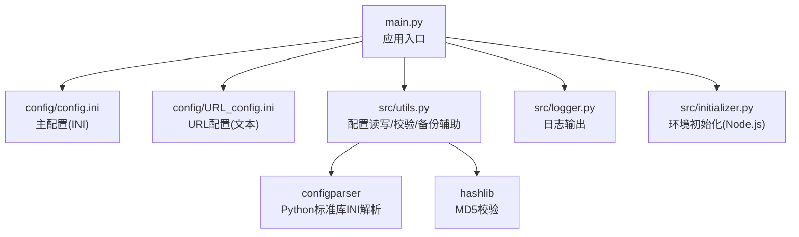
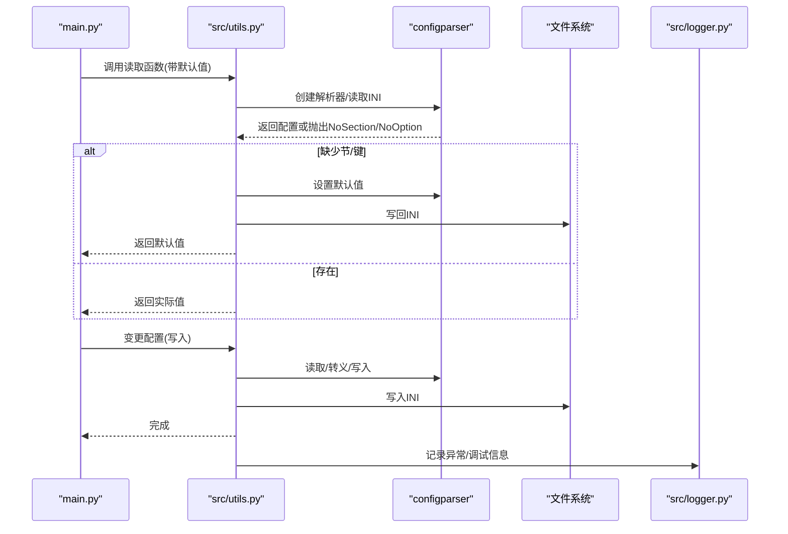
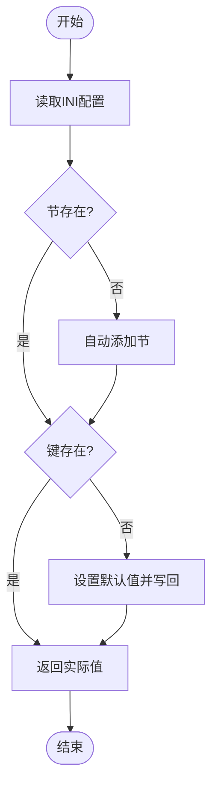
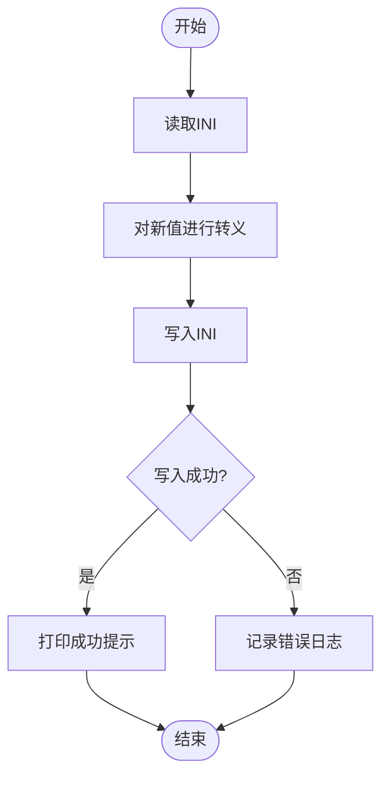
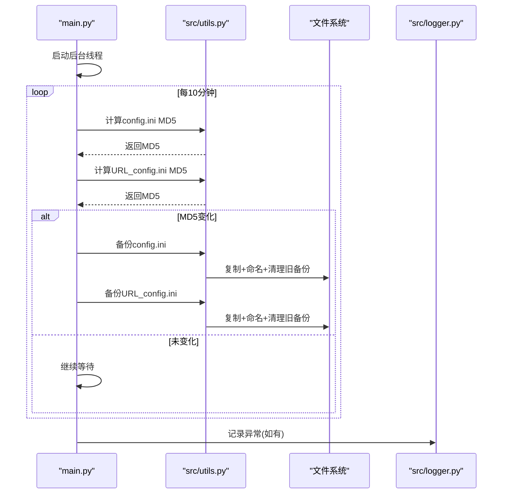
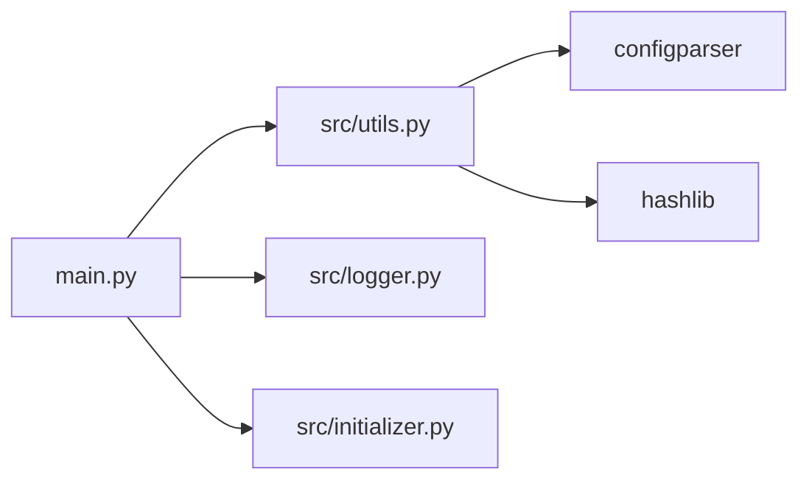

# 工具函数配置

<cite>
**本文引用的文件**
- [src/utils.py](file://src/utils.py)
- [main.py](file://main.py)
- [config/config.ini](file://config/config.ini)
- [config/URL_config.ini](file://config/URL_config.ini)
- [src/logger.py](file://src/logger.py)
- [src/initializer.py](file://src/initializer.py)
</cite>

## 目录
1. [简介](#简介)
2. [项目结构](#项目结构)
3. [核心组件](#核心组件)
4. [架构总览](#架构总览)
5. [详细组件分析](#详细组件分析)
6. [依赖分析](#依赖分析)
7. [性能考量](#性能考量)
8. [故障排查指南](#故障排查指南)
9. [结论](#结论)
10. [附录](#附录)

## 简介
本文件聚焦于工具函数配置模块，系统性梳理并解释项目中与配置管理相关的实现，包括：
- 配置文件读写与校验
- 配置验证规则与默认值策略
- 配置备份与恢复机制
- 配置缓存与热更新思路
- 配置文件格式与迁移兼容
- 自定义配置项添加方法与最佳实践
- 加密存储方案建议与落地步骤

目标读者既包括需要快速上手的使用者，也包括希望深度定制的开发者。

## 项目结构
与配置管理直接相关的文件与职责概览：
- src/utils.py：提供通用工具函数，包含INI配置读取、写入、MD5校验、去重等能力
- main.py：应用入口，负责加载配置、启动备份监控、执行业务逻辑
- config/config.ini：主配置文件（INI格式），承载录制设置、推送配置、Cookie与授权等
- config/URL_config.ini：URL配置文件（文本格式），记录待录制的直播地址
- src/logger.py：日志配置，便于定位配置读写问题
- src/initializer.py：环境初始化，含Node.js检测与安装辅助，间接影响部分配置项生效

图表来源
- [main.py:68-71](file://main.py#L68-L71)
- [src/utils.py:65-108](file://src/utils.py#L65-L108)
- [src/utils.py:54-57](file://src/utils.py#L54-L57)

章节来源
- [main.py:68-71](file://main.py#L68-L71)
- [src/utils.py:65-108](file://src/utils.py#L65-L108)
- [src/utils.py:54-57](file://src/utils.py#L54-L57)

## 核心组件
- 配置读取与默认值注入
  - 通过统一的读取函数在缺失配置时自动创建默认值并写回文件，避免运行期缺省导致的异常
  - 支持多节（录制设置、推送配置、Cookie、Authorization、账号密码）的自动补齐
- 配置写入与转义
  - 写入INI时对特殊字符进行转义，防止解析异常
- 配置变更监控与备份
  - 基于MD5校验的变更检测，周期性触发备份，限制保留数量
- 配置文件格式与兼容
  - 主配置采用INI格式；URL配置采用纯文本，具备注释、去重、格式容错等处理
- 日志与错误处理
  - 所有配置读写异常均通过日志输出，便于定位问题

章节来源
- [src/utils.py:65-108](file://src/utils.py#L65-L108)
- [src/utils.py:54-57](file://src/utils.py#L54-L57)
- [main.py:1730-1751](file://main.py#L1730-L1751)
- [main.py:1671-1690](file://main.py#L1671-L1690)
- [src/logger.py:1-44](file://src/logger.py#L1-44)

## 架构总览
配置管理在应用中的位置与交互如下：

图表来源
- [main.py:1730-1751](file://main.py#L1730-L1751)
- [src/utils.py:65-108](file://src/utils.py#L65-L108)
- [src/logger.py:1-44](file://src/logger.py#L1-44)

## 详细组件分析

### 配置读取与默认值注入
- 设计要点
  - 在读取前自动补齐常见配置节，避免运行期因节缺失报错
  - 使用“读取-捕获异常-写回默认值”的模式，确保配置文件始终包含所需键
- 关键流程
  - 读取INI → 判断节/键是否存在 → 不存在则写入默认值并返回
  - 默认值来源于调用侧传入的默认参数，类型转换由调用方负责
- 适用场景
  - 录制设置、推送配置、Cookie与Authorization、账号密码等

图表来源
- [main.py:1730-1751](file://main.py#L1730-L1751)

章节来源
- [main.py:1730-1751](file://main.py#L1730-L1751)

### 配置写入与转义
- 设计要点
  - 写入前对特殊字符进行转义，避免INI解析异常
  - 写入成功后打印提示，便于人工核对
- 异常处理
  - 读取/写入异常均通过日志输出，避免中断流程

图表来源
- [src/utils.py:85-108](file://src/utils.py#L85-L108)

章节来源
- [src/utils.py:85-108](file://src/utils.py#L85-L108)

### 配置变更监控与备份
- 设计要点
  - 周期性计算配置文件MD5，变化即触发备份
  - 备份文件按时间戳命名，限制保留数量，避免无限增长
- 启动方式
  - 应用启动后创建后台线程持续监控

图表来源
- [main.py:1671-1690](file://main.py#L1671-L1690)
- [src/utils.py:54-57](file://src/utils.py#L54-L57)
- [main.py:1650-1668](file://main.py#L1650-L1668)

章节来源
- [main.py:1671-1690](file://main.py#L1671-L1690)
- [src/utils.py:54-57](file://src/utils.py#L54-L57)
- [main.py:1650-1668](file://main.py#L1650-L1668)

### 配置文件格式与兼容
- config.ini（主配置）
  - INI格式，支持节与键的自动补齐与默认值注入
  - 读取时指定编码，写回时同样使用编码，确保跨平台一致性
- URL_config.ini（URL配置）
  - 文本格式，支持注释（以#开头）、去重、格式容错
  - 启动时自动去重，避免重复录制

章节来源
- [main.py:1730-1751](file://main.py#L1730-L1751)
- [main.py:1725-1728](file://main.py#L1725-L1728)
- [config/config.ini](file://config/config.ini)
- [config/URL_config.ini](file://config/URL_config.ini)

### 配置热更新机制
- 当前实现
  - 应用启动后读取一次配置并缓存于内存；配置变更通过备份监控感知，但不会自动刷新运行时参数
- 建议
  - 对于需要热更新的关键参数，可在业务层增加轮询读取或监听机制（例如定时任务或文件事件监听），并在变更时安全地切换参数
  - 对于一次性启动参数（如线程数、保存路径等），建议重启应用以确保一致性

章节来源
- [main.py:1730-1751](file://main.py#L1730-L1751)
- [main.py:1671-1690](file://main.py#L1671-L1690)

### 配置验证规则
- INI读取验证
  - 通过捕获NoSection/NoOption异常，确保节与键存在
  - 对布尔类配置采用预设映射（如“是/否”到True/False）进行转换
- URL配置验证
  - 去重、注释处理、格式容错（逗号/中文逗号分隔、空格容错）
  - 最小长度校验与主机白名单匹配，过滤无效链接

章节来源
- [main.py:1730-1751](file://main.py#L1730-L1751)
- [main.py:1942-2049](file://main.py#L1942-L2049)

### 配置迁移与兼容处理
- 节与键的自动补齐
  - 首次运行或升级后，自动创建缺失的节与键，避免破坏既有配置
- 默认值注入
  - 通过读取函数注入默认值，确保新版本新增项不影响旧配置
- 编码与格式
  - 统一使用带BOM的UTF-8编码，提升跨平台兼容性

章节来源
- [main.py:1730-1751](file://main.py#L1730-L1751)
- [main.py:1725-1728](file://main.py#L1725-L1728)

### 自定义配置项添加方法
- 添加步骤
  - 在读取处调用统一读取函数，并传入新的节、键与默认值
  - 如需写回默认值，确保调用侧提供合理的默认值与类型
- 示例路径
  - 参考现有读取点：[main.py:1755-1925](file://main.py#L1755-L1925)
  - 参考写入点：[src/utils.py:85-108](file://src/utils.py#L85-L108)

章节来源
- [main.py:1755-1925](file://main.py#L1755-L1925)
- [src/utils.py:85-108](file://src/utils.py#L85-L108)

### 配置参数默认值设置
- 默认值来源
  - 读取函数接收默认值参数；若配置缺失，直接返回并写回
- 类型转换
  - 数值/布尔等类型由调用侧进行转换，避免隐式类型错误

章节来源
- [main.py:1730-1751](file://main.py#L1730-L1751)

### 配置文件加密存储方案
- 方案建议
  - 对敏感字段（Cookie、Token、账号密码）采用对称加密（如AES）存储，密钥由环境变量或专用密钥文件管理
  - 加密字段在写入前加密，读取时解密；运行时仅持有明文副本
- 实施步骤
  - 选择加密算法与填充模式，确保跨平台一致
  - 在写入前调用加密函数，读取时调用解密函数
  - 将密钥与配置文件分离存放，严格控制访问权限
- 注意事项
  - 加密/解密过程需纳入异常处理，失败时回退到明文或拒绝启动
  - 备份策略需考虑加密字段的保护，避免泄露

[本节为概念性指导，不直接分析具体文件，故无章节来源]

## 依赖分析
- 组件耦合
  - main.py高度依赖src/utils.py的配置读写能力
  - 配置变更监控线程与MD5校验函数强耦合
- 外部依赖
  - Python标准库configparser用于INI解析
  - hashlib用于MD5校验
  - 日志模块用于错误与调试输出

图表来源
- [src/utils.py:65-108](file://src/utils.py#L65-L108)
- [src/utils.py:54-57](file://src/utils.py#L54-L57)
- [main.py:1671-1690](file://main.py#L1671-L1690)
- [src/logger.py:1-44](file://src/logger.py#L1-44)
- [src/initializer.py:162-221](file://src/initializer.py#L162-L221)

章节来源
- [src/utils.py:65-108](file://src/utils.py#L65-L108)
- [src/utils.py:54-57](file://src/utils.py#L54-L57)
- [main.py:1671-1690](file://main.py#L1671-L1690)
- [src/logger.py:1-44](file://src/logger.py#L1-44)
- [src/initializer.py:162-221](file://src/initializer.py#L162-L221)

## 性能考量
- 备份监控
  - 每10分钟一次MD5计算，对小中型配置文件开销极低
- 文件读写
  - INI读写采用整文件读取/写入，适合小规模配置；大规模配置建议分节写入或增量更新
- 日志输出
  - 日志异步写入，避免阻塞配置流程

[本节提供一般性建议，不直接分析具体文件，故无章节来源]

## 故障排查指南
- 配置读取失败
  - 检查配置文件是否存在、编码是否正确、节与键是否完整
  - 查看日志输出，定位异常行号
- 写入失败
  - 检查文件权限、磁盘空间、是否被其他进程占用
- 备份失败
  - 检查备份目录权限与容量，确认备份线程是否正常运行
- URL配置异常
  - 检查注释、去重、格式容错逻辑是否生效

章节来源
- [src/logger.py:1-44](file://src/logger.py#L1-44)
- [main.py:1671-1690](file://main.py#L1671-L1690)
- [main.py:1725-1728](file://main.py#L1725-L1728)

## 结论
本配置管理模块以“自动补齐+默认值注入+MD5监控+备份”为核心，兼顾易用性与安全性。对于需要热更新与加密存储的场景，建议在现有基础上扩展监听与加密机制，确保配置变更可控、敏感数据受控。

[本节为总结性内容，不直接分析具体文件，故无章节来源]

## 附录

### 配置文件格式与字段参考
- config.ini（主配置）
  - 节：录制设置、推送配置、Cookie、Authorization、账号密码
  - 键：如语言、是否跳过代理检测、保存路径、是否使用代理、代理地址、线程数、循环时间、分段录制、磁盘阈值、保存格式、录制质量、推送渠道与凭据等
- URL_config.ini（URL配置）
  - 文本格式，支持注释（#）、去重、容错（逗号/中文逗号）

章节来源
- [main.py:1755-1925](file://main.py#L1755-L1925)
- [config/config.ini](file://config/config.ini)
- [config/URL_config.ini](file://config/URL_config.ini)