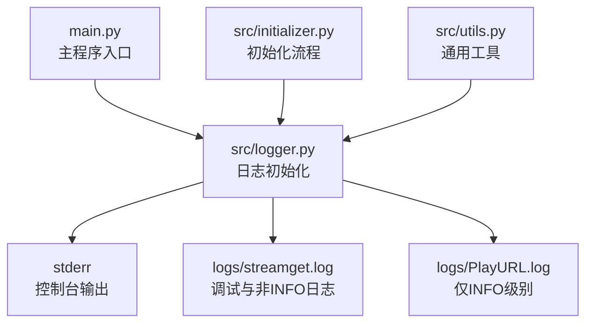
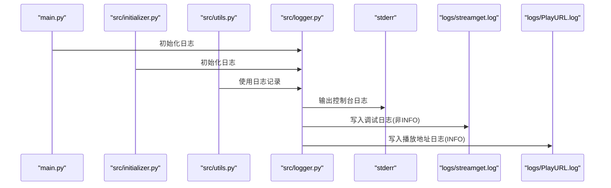
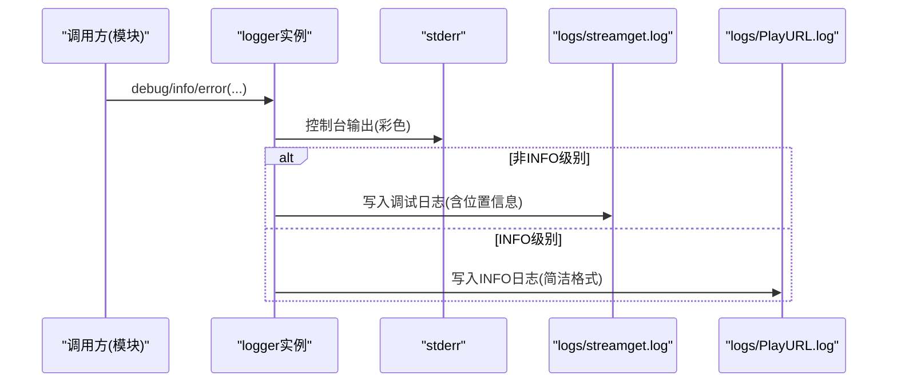
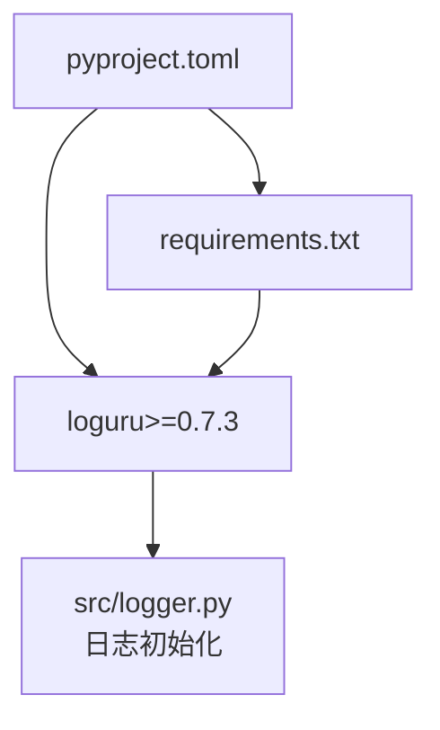

# 日志配置管理

<cite>
**本文引用的文件**
- [src/logger.py](file://src/logger.py)
- [main.py](file://main.py)
- [src/initializer.py](file://src/initializer.py)
- [src/utils.py](file://src/utils.py)
- [requirements.txt](file://requirements.txt)
- [pyproject.toml](file://pyproject.toml)
- [README.md](file://README.md)
</cite>

## 目录
1. [简介](#简介)
2. [项目结构](#项目结构)
3. [核心组件](#核心组件)
4. [架构总览](#架构总览)
5. [详细组件分析](#详细组件分析)
6. [依赖分析](#依赖分析)
7. [性能考量](#性能考量)
8. [故障排查指南](#故障排查指南)
9. [结论](#结论)
10. [附录](#附录)

## 简介
本文件围绕项目中的日志配置与管理进行系统性梳理，重点解析 src/logger.py 中的日志初始化逻辑，涵盖日志级别设置、格式化输出、文件落盘、按大小轮转、保留策略、以及与业务模块的集成方式。同时结合项目中对日志的使用场景，给出性能优化建议、多进程安全处理思路、日志分析与故障排查方法，以及最佳实践。

## 项目结构
日志配置位于 src/logger.py，由主程序入口 main.py 引入并贯穿运行期；其他模块如 src/initializer.py、src/utils.py 也广泛使用日志记录。依赖方面，项目通过 requirements.txt 与 pyproject.toml 明确声明 loguru 的版本要求。

图表来源
- [src/logger.py:1-44](file://src/logger.py#L1-L44)
- [main.py:32](file://main.py#L32)
- [src/initializer.py:19](file://src/initializer.py#L19)
- [src/utils.py:16](file://src/utils.py#L16)

章节来源
- [src/logger.py:1-44](file://src/logger.py#L1-L44)
- [main.py:32](file://main.py#L32)
- [src/initializer.py:19](file://src/initializer.py#L19)
- [src/utils.py:16](file://src/utils.py#L16)
- [requirements.txt:2](file://requirements.txt#L2)
- [pyproject.toml:11](file://pyproject.toml#L11)

## 核心组件
- 日志初始化与管道注册：通过移除默认处理器、添加自定义 sink 实现分级输出。
- 控制台输出：sys.stderr，彩色高亮，统一时间格式。
- 文件输出：
  - streamget.log：DEBUG及以上，包含调用位置信息，按大小轮转并保留1天。
  - PlayURL.log：仅INFO级别，简洁格式，同样按大小轮转并保留1天。
- 编码与并发：UTF-8 编码，enqueue=True 提升多线程安全性。
- 过滤策略：通过 filter 函数区分 INFO 与其他级别，分别写入不同文件。

章节来源
- [src/logger.py:7-43](file://src/logger.py#L7-L43)

## 架构总览
下图展示日志子系统的整体交互：主程序与各模块通过统一的 logger 实例输出，日志经由不同 sink 分发到控制台与文件，文件按大小轮转并保留短期历史。

图表来源
- [src/logger.py:11-43](file://src/logger.py#L11-L43)
- [main.py:32](file://main.py#L32)
- [src/initializer.py:19](file://src/initializer.py#L19)
- [src/utils.py:16](file://src/utils.py#L16)

## 详细组件分析

### 日志初始化与格式化
- 移除默认处理器，避免重复输出。
- 控制台格式包含时间、级别与消息，颜色高亮便于识别。
- 文件格式区分两类：
  - 调试日志：包含模块名、函数名、行号，便于定位问题。
  - INFO日志：仅包含时间与消息，简洁明了。

章节来源
- [src/logger.py:7-17](file://src/logger.py#L7-L17)
- [src/logger.py:21-31](file://src/logger.py#L21-L31)
- [src/logger.py:33-43](file://src/logger.py#L33-L43)

### 日志级别与过滤策略
- DEBUG：用于开发与排障，包含详细上下文。
- INFO：用于关键流程与结果输出，如播放地址等。
- 过滤器：
  - 非INFO级别写入 streamget.log。
  - 仅INFO级别写入 PlayURL.log。

章节来源
- [src/logger.py:24-25](file://src/logger.py#L24-L25)
- [src/logger.py:37-38](file://src/logger.py#L37-L38)

### 文件轮转与保留策略
- 轮转条件：单文件达到 300 KB。
- 保留策略：保留最近 1 天的历史文件。
- 编码：UTF-8，保证中文等字符正确存储。

章节来源
- [src/logger.py:28-30](file://src/logger.py#L28-L30)
- [src/logger.py:40-42](file://src/logger.py#L40-L42)

### 多模块集成与使用
- 主程序 main.py：在异常与流程关键点使用 logger.error 等记录。
- 初始化模块 src/initializer.py：在安装与检测流程中使用 logger.warning/debug/error。
- 工具模块 src/utils.py：在装饰器与异常捕获中使用 logger.error 记录错误信息。

章节来源
- [main.py:134](file://main.py#L134)
- [main.py:152](file://main.py#L152)
- [main.py:214](file://main.py#L214)
- [main.py:249](file://main.py#L249)
- [main.py:369](file://main.py#L369)
- [main.py:372](file://main.py#L372)
- [src/initializer.py:39](file://src/initializer.py#L39)
- [src/initializer.py:86](file://src/initializer.py#L86)
- [src/utils.py:47](file://src/utils.py#L47)

### 关键流程时序图（日志记录）

图表来源
- [src/logger.py:11-43](file://src/logger.py#L11-L43)

## 依赖分析
- 日志框架：loguru 版本要求 >=0.7.3。
- 项目版本与依赖声明：pyproject.toml 与 requirements.txt 明确列出 loguru 依赖。
- README.md 展示项目结构，包含 logs 目录用于存放运行日志文件。

图表来源
- [pyproject.toml:11](file://pyproject.toml#L11)
- [requirements.txt:2](file://requirements.txt#L2)
- [src/logger.py:5](file://src/logger.py#L5)

章节来源
- [pyproject.toml:11](file://pyproject.toml#L11)
- [requirements.txt:2](file://requirements.txt#L2)
- [README.md:78](file://README.md#L78)

## 性能考量
- 并发安全：启用 enqueue=True，避免多线程写入竞争与阻塞。
- I/O 开销控制：INFO 与调试日志分流，减少大文件写入量。
- 轮转粒度：300 KB 轮转，兼顾磁盘占用与读取效率。
- 编码一致性：UTF-8 编码，避免乱码与额外转换成本。
- 建议：
  - 在高并发场景下，可考虑将文件 sink 的写入缓冲与刷新策略进一步细化（例如按时间或消息数量刷新）。
  - 对于大量 INFO 日志，可评估是否需要拆分为更细粒度的 sink，降低单文件压力。
  - 结合业务日志体量，适当调整轮转阈值与保留天数，平衡磁盘空间与可追溯性。

## 故障排查指南
- 日志未输出到文件
  - 检查 logs 目录是否存在及写权限。
  - 确认脚本运行目录与日志路径一致。
- 中文乱码
  - 确保文件 sink 使用 UTF-8 编码。
- 日志过大
  - 当前轮转阈值为 300 KB，可根据实际需求调整。
- 多线程冲突
  - 已启用 enqueue=True，通常无需额外处理；如仍出现异常，检查外部并发写入行为。
- 错误定位
  - 调试日志包含模块名、函数名、行号，优先查看 streamget.log。
  - INFO 日志简洁，适合快速确认流程节点。

章节来源
- [src/logger.py:28-30](file://src/logger.py#L28-L30)
- [src/logger.py:40-42](file://src/logger.py#L40-L42)
- [src/logger.py:24-25](file://src/logger.py#L24-L25)
- [src/logger.py:37-38](file://src/logger.py#L37-L38)

## 结论
本项目的日志体系以 loguru 为核心，通过统一初始化与多 sink 分发，实现了控制台与文件的差异化输出。DEBUG 与 INFO 分流、按大小轮转与短期保留策略，满足了开发调试与生产监控的基本需求。结合多模块集成与性能优化建议，可在保证可观测性的前提下，提升系统稳定性与可维护性。

## 附录

### 配置项速览
- 控制台输出
  - sink：sys.stderr
  - 格式：包含时间、级别、消息
  - 级别：DEBUG
  - 彩色：启用
- 调试日志文件
  - 路径：logs/streamget.log
  - 级别：DEBUG
  - 格式：包含时间、级别、模块名:函数名:行号 - 消息
  - 过滤：排除 INFO
  - 轮转：300 KB
  - 保留：1 天
- INFO 日志文件
  - 路径：logs/PlayURL.log
  - 级别：INFO
  - 格式：包含时间、消息
  - 过滤：仅 INFO
  - 轮转：300 KB
  - 保留：1 天

章节来源
- [src/logger.py:11-43](file://src/logger.py#L11-L43)

### 最佳实践清单
- 统一使用 logger 实例，避免混用标准库 logging。
- 将调试与生产日志分离，便于检索与容量规划。
- 在高并发场景下保持 enqueue=True，避免锁竞争。
- 合理设置轮转阈值与保留策略，平衡磁盘与可追溯性。
- 对关键业务流程增加 INFO 级别日志，辅助监控与告警。
- 使用 UTC 时间或固定时区，避免跨时区排查困难。
- 在容器或 CI 环境中，确保日志目录挂载与权限配置正确。