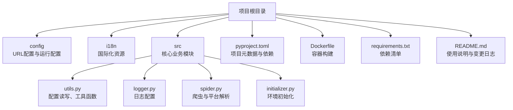
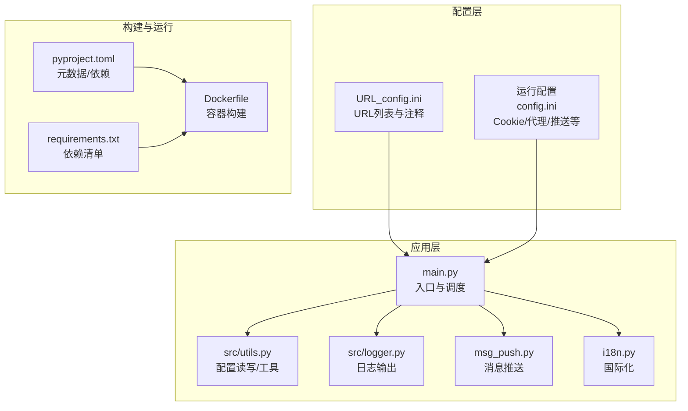
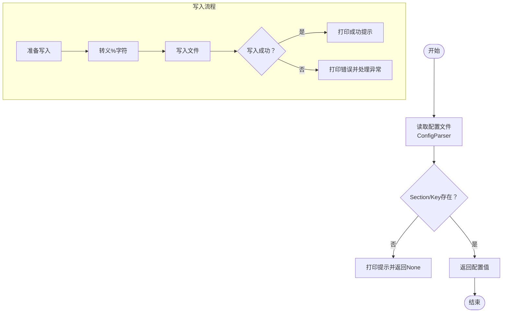
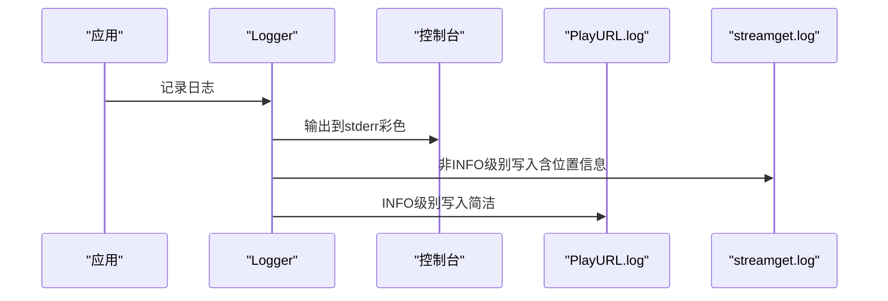
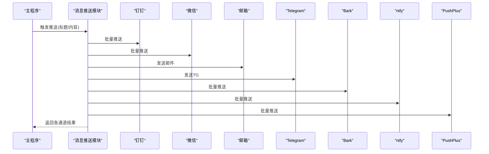
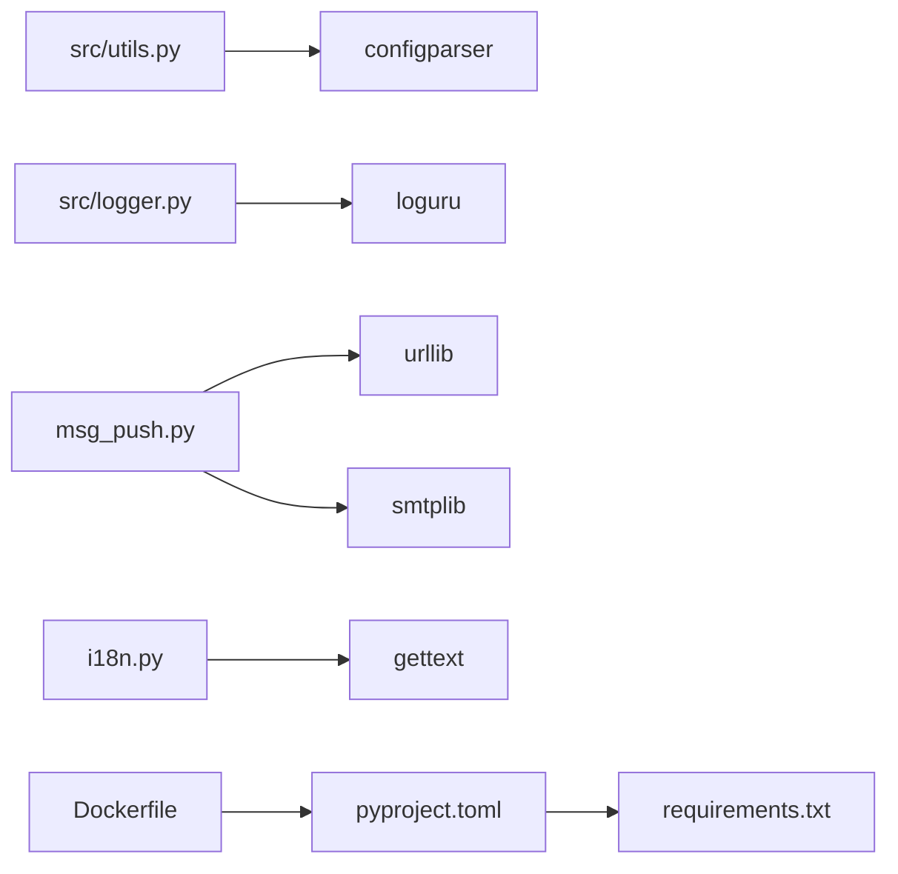

# 配置管理

<cite>
**本文引用的文件**   
- [URL_config.ini](file://config/URL_config.ini)
- [pyproject.toml](file://pyproject.toml)
- [README.md](file://README.md)
- [main.py](file://main.py)
- [src/utils.py](file://src/utils.py)
- [src/logger.py](file://src/logger.py)
- [msg_push.py](file://msg_push.py)
- [i18n.py](file://i18n.py)
- [requirements.txt](file://requirements.txt)
- [Dockerfile](file://Dockerfile)
</cite>

## 目录
1. [简介](#简介)
2. [项目结构](#项目结构)
3. [核心组件](#核心组件)
4. [架构总览](#架构总览)
5. [详细组件分析](#详细组件分析)
6. [依赖分析](#依赖分析)
7. [性能考量](#性能考量)
8. [故障排除指南](#故障排除指南)
9. [结论](#结论)
10. [附录](#附录)

## 简介
本文件系统性梳理并解释该直播录制软件的配置管理体系，覆盖以下方面：
- URL配置文件（URL_config.ini）的结构、字段含义与配置规则
- 主配置文件（pyproject.toml）的元数据、依赖与构建配置
- 配置读写与验证机制、备份与恢复流程
- 日志配置、国际化配置、消息推送配置等高级选项
- 最佳实践、安全建议与批量配置管理方法
- 具体配置示例与常见问题排查

## 项目结构
该仓库采用“按职责分层”的组织方式：核心业务逻辑位于 src 包，配置与资源位于 config、i18n 等目录；顶层提供构建与运行配置（pyproject.toml、Dockerfile、requirements.txt）。

图表来源
- [main.py:69-71](file://main.py#L69-L71)
- [src/utils.py:65-108](file://src/utils.py#L65-L108)
- [src/logger.py:11-43](file://src/logger.py#L11-L43)

章节来源
- [main.py:69-71](file://main.py#L69-L71)
- [pyproject.toml:1-24](file://pyproject.toml#L1-L24)
- [Dockerfile:1-20](file://Dockerfile#L1-L20)
- [requirements.txt:1-7](file://requirements.txt#L1-L7)

## 核心组件
- URL配置文件（URL_config.ini）：用于声明待监测与录制的直播间地址，支持注释、自定义画质与备注。
- 运行配置（config.ini）：由程序在运行时生成与维护，包含平台 Cookie、代理、录制参数、消息推送等。
- 配置读写工具（src/utils.py）：封装 ConfigParser 的读取与写入，提供键值更新、去重、替换等能力。
- 日志配置（src/logger.py）：统一输出到控制台与文件，按级别与过滤策略落盘。
- 消息推送（msg_push.py）：支持钉钉、微信、邮箱、Telegram、Bark、ntfy、PushPlus 等多种通道。
- 国际化（i18n.py）：绑定语言域与文本域，实现运行期文本翻译。
- 构建与依赖（pyproject.toml、Dockerfile、requirements.txt）：定义项目元数据、依赖、构建与容器化流程。

章节来源
- [URL_config.ini:1-5](file://config/URL_config.ini#L1-L5)
- [src/utils.py:65-108](file://src/utils.py#L65-L108)
- [src/logger.py:11-43](file://src/logger.py#L11-L43)
- [msg_push.py:25-249](file://msg_push.py#L25-L249)
- [i18n.py:9-33](file://i18n.py#L9-L33)
- [pyproject.toml:1-24](file://pyproject.toml#L1-L24)
- [Dockerfile:1-20](file://Dockerfile#L1-L20)
- [requirements.txt:1-7](file://requirements.txt#L1-L7)

## 架构总览
下图展示配置管理在系统中的位置与交互：

图表来源
- [main.py:69-71](file://main.py#L69-L71)
- [src/utils.py:65-108](file://src/utils.py#L65-L108)
- [src/logger.py:11-43](file://src/logger.py#L11-L43)
- [msg_push.py:25-249](file://msg_push.py#L25-L249)
- [i18n.py:9-33](file://i18n.py#L9-L33)
- [pyproject.toml:1-24](file://pyproject.toml#L1-L24)
- [Dockerfile:1-20](file://Dockerfile#L1-L20)
- [requirements.txt:1-7](file://requirements.txt#L1-L7)

## 详细组件分析

### URL配置文件（URL_config.ini）
- 文件位置与用途
  - 位置：config/URL_config.ini
  - 作用：声明待监测与录制的直播间地址，每行一条；支持以“#”开头的注释行，用于临时停用某条URL。
- 结构与字段
  - 每行一个直播房间地址字符串。
  - 支持在地址前添加“画质, ”前缀来自定义该房间的录制画质，逗号分隔。
  - 支持以“#”开头的注释行，用于临时禁用某条URL。
- 配置规则
  - 仅允许单行URL；不支持空行与非法URL混杂在同一文件中。
  - 若某条URL被注释，程序在加载时会跳过该URL，不会进行监测与录制。
  - 可通过注释快速暂停个别房间的录制，无需删除原始链接。
- 读取与处理
  - 程序在启动时读取该文件，解析每行URL与其画质前缀，生成待监测队列。
  - 若某URL被注释，程序将其加入“停止录制列表”，并在录制过程中主动中断。
- 示例与参考
  - 示例URL与平台列表可参考项目README中的“直播间链接示例”。

章节来源
- [URL_config.ini:1-5](file://config/URL_config.ini#L1-L5)
- [README.md:108-119](file://README.md#L108-L119)

### 运行配置（config.ini）与配置读写
- 文件位置与用途
  - 位置：config/config.ini（由程序在运行时生成与维护）
  - 作用：存储运行期配置，如各平台Cookie、代理、录制参数、消息推送开关与凭据、国际化语言等。
- 配置读取
  - 使用 ConfigParser 读取，编码为“utf-8-sig”，支持跨平台兼容。
  - 提供统一的读取函数，若Section或Key不存在，会打印提示并返回None。
- 配置写入
  - 提供更新函数，对“%”字符进行转义，防止ConfigParser解析异常。
  - 写入成功后输出提示；异常时捕获并打印错误。
- 工具函数
  - 去重：按行去重，保持顺序唯一。
  - URL替换：在文件内容中查找并替换旧URL为新URL。
  - 查询参数解析：从URL中提取查询参数。
- 备份与恢复
  - 程序在更新配置时具备锁保护与回滚思路（当写入异常时可回写原始内容），但未发现显式的“备份目录”与“自动恢复”实现。
  - 建议：结合外部备份策略（如定期复制config.ini到backup_config目录）以实现可靠恢复。

图表来源
- [src/utils.py:65-108](file://src/utils.py#L65-L108)

章节来源
- [src/utils.py:65-108](file://src/utils.py#L65-L108)
- [src/utils.py:138-146](file://src/utils.py#L138-L146)
- [src/utils.py:189-194](file://src/utils.py#L189-L194)

### 日志配置管理
- 输出目标
  - 控制台：标准错误输出，彩色格式，便于调试。
  - 文件：两个日志文件
    - PlayURL.log：仅记录INFO级别，记录播放URL相关信息。
    - streamget.log：记录非INFO级别，包含调用栈定位信息，带时间戳与文件/行号。
- 保留与轮转
  - retention=1 表示仅保留最近1份日志文件。
  - rotation=300 KB 表示单文件达到300KB后轮转。
- 编码与并发
  - 使用enqueue=True保证多线程写入安全。
  - 文件编码统一为utf-8。

图表来源
- [src/logger.py:11-43](file://src/logger.py#L11-L43)

章节来源
- [src/logger.py:11-43](file://src/logger.py#L11-L43)

### 国际化配置（i18n）
- 语言域绑定
  - 通过 gettext.bindtextdomain 与 gettext.textdomain 绑定语言域与文本域。
  - 设置环境变量 LANG 为 zh_CN.utf8。
- 文本翻译
  - 通过包装 print 实现对包内打印语句的翻译，包外打印保持原文。
- 资源路径
  - 优先使用可执行文件所在目录下的 _internal/i18n；否则回退到 i18n 目录。

章节来源
- [i18n.py:9-33](file://i18n.py#L9-L33)

### 消息推送配置（多通道）
- 支持通道
  - 钉钉、微信、邮箱、Telegram、Bark、ntfy、PushPlus。
- 关键特性
  - 批量推送：支持以逗号分隔的多个地址/令牌，分别尝试推送。
  - 异常处理：对每个通道独立捕获异常并统计成功/失败数量。
  - ntfy：支持tags、priority、action_url等丰富参数。
- 使用方式
  - 在运行配置中启用相应通道并填入凭据或地址，程序在直播状态变化时触发推送。

图表来源
- [msg_push.py:25-249](file://msg_push.py#L25-L249)

章节来源
- [msg_push.py:25-249](file://msg_push.py#L25-L249)

### 主配置文件（pyproject.toml）
- 项目元数据
  - name、version、description、readme、authors、license、requires-python。
- 依赖配置
  - dependencies 列表包含 requests、loguru、pycryptodome、distro、tqdm、httpx[http2]、PyExecJS 等。
- 项目链接
  - urls 字段包含 Homepage、Documentation、Repository、Issues。
- 作用
  - 作为现代Python项目的标准元数据与依赖声明，配合构建工具与发布流程。

章节来源
- [pyproject.toml:1-24](file://pyproject.toml#L1-L24)

### 构建与运行配置
- Dockerfile
  - 基于 python:3.11-slim，安装 Node.js（通过 NodeSource）、FFmpeg、tzdata。
  - 复制项目并安装 requirements.txt。
  - 设置时区为 Asia/Shanghai。
- requirements.txt
  - 与 pyproject.toml 的依赖保持一致，用于 pip 安装。
- README
  - 提供源码运行、容器运行、FFmpeg安装等详细说明。

章节来源
- [Dockerfile:1-20](file://Dockerfile#L1-L20)
- [requirements.txt:1-7](file://requirements.txt#L1-L7)
- [README.md:289-481](file://README.md#L289-L481)

## 依赖分析
- 配置读写依赖
  - 使用 configparser 进行INI文件读写，提供基本的键值更新与转义处理。
- 日志依赖
  - 使用 loguru，支持多sink、过滤、轮转与并发安全。
- 推送依赖
  - 使用 urllib、smtplib、json 等标准库实现HTTP/SMTP推送。
- 国际化依赖
  - 使用 gettext 与环境变量 LANG 实现文本翻译。
- 构建依赖
  - pyproject.toml 与 requirements.txt 保证依赖一致性；Dockerfile 确保容器内环境完整。

图表来源
- [src/utils.py:65-108](file://src/utils.py#L65-L108)
- [src/logger.py:11-43](file://src/logger.py#L11-L43)
- [msg_push.py:25-249](file://msg_push.py#L25-L249)
- [i18n.py:9-33](file://i18n.py#L9-L33)
- [pyproject.toml:1-24](file://pyproject.toml#L1-L24)
- [Dockerfile:1-20](file://Dockerfile#L1-L20)
- [requirements.txt:1-7](file://requirements.txt#L1-L7)

章节来源
- [src/utils.py:65-108](file://src/utils.py#L65-L108)
- [src/logger.py:11-43](file://src/logger.py#L11-L43)
- [msg_push.py:25-249](file://msg_push.py#L25-L249)
- [i18n.py:9-33](file://i18n.py#L9-L33)
- [pyproject.toml:1-24](file://pyproject.toml#L1-L24)
- [Dockerfile:1-20](file://Dockerfile#L1-L20)
- [requirements.txt:1-7](file://requirements.txt#L1-L7)

## 性能考量
- 并发与限流
  - 程序内部维护最大并发请求计数，并根据错误率动态调整，降低被风控概率。
- 日志轮转
  - 小文件轮转（300KB）与保留1份，兼顾磁盘占用与可追溯性。
- 录制参数
  - 支持强制h264转码、分段录制、生成时间文件等，平衡兼容性与体积。
- 代理与平台
  - 针对特定海外平台启用代理，减少网络异常导致的失败。

章节来源
- [main.py:298-325](file://main.py#L298-L325)
- [src/logger.py:21-43](file://src/logger.py#L21-L43)
- [main.py:219-271](file://main.py#L219-L271)

## 故障排除指南
- URL配置问题
  - 症状：某房间不被监测或录制
  - 排查：确认URL前缀是否正确；检查是否被注释；确认画质前缀格式是否为“画质, ”。
- 配置写入失败
  - 症状：更新config.ini后未生效或出现异常
  - 排查：检查是否有“%”字符导致解析异常；确认文件编码为utf-8-sig；查看日志中是否有写入异常提示。
- 日志文件过大或未轮转
  - 症状：日志文件超过预期大小
  - 排查：确认rotation与retention配置；检查磁盘空间；必要时手动清理旧日志。
- 推送失败
  - 症状：某通道推送失败
  - 排查：核对通道凭据/地址；确认网络可达；查看返回码与错误信息；尝试批量地址中的单个地址定位问题。
- 国际化无效
  - 症状：打印文本未翻译
  - 排查：确认locale目录存在且包含对应语言资源；检查环境变量LANG设置；确认print被包装函数拦截。

章节来源
- [URL_config.ini:1-5](file://config/URL_config.ini#L1-L5)
- [src/utils.py:65-108](file://src/utils.py#L65-L108)
- [src/logger.py:21-43](file://src/logger.py#L21-L43)
- [msg_push.py:25-249](file://msg_push.py#L25-L249)
- [i18n.py:9-33](file://i18n.py#L9-L33)

## 结论
该配置管理体系以INI文件为核心，辅以运行期生成的config.ini、日志、国际化与消息推送模块，形成完整的配置闭环。通过ConfigParser与loguru等库实现稳定可靠的读写与输出；通过动态并发与日志轮转提升运行稳定性与可观测性。建议在生产环境中配合备份策略与最小权限原则，确保配置安全与可恢复。

## 附录
- 最佳实践
  - 使用“画质, URL”格式为个别房间定制画质，避免全局影响。
  - 通过注释临时停用房间，无需删除原始链接。
  - 定期备份config.ini，结合容器部署时挂载卷实现持久化。
  - 为敏感字段（Cookie、Token）设置最小权限与轮换策略。
- 安全建议
  - 不在URL中明文携带认证信息；通过config.ini集中管理。
  - 使用代理访问受限平台时，确保代理可用性与安全性。
  - 定期审查日志与推送通道，避免泄露敏感信息。
- 批量配置管理
  - 使用URL替换与去重工具函数进行批量更新与清理。
  - 通过批量地址/令牌实现多通道推送，提升可靠性。