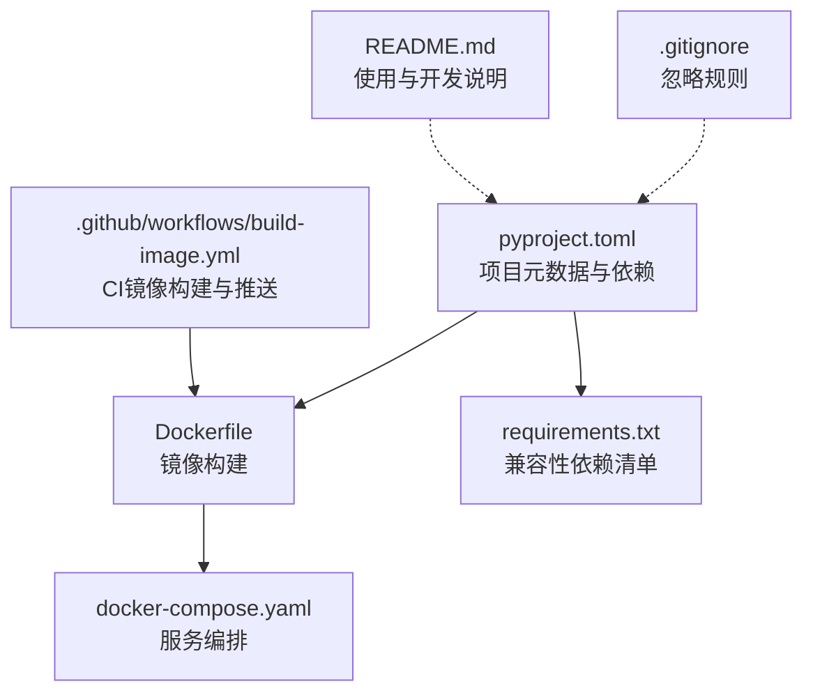
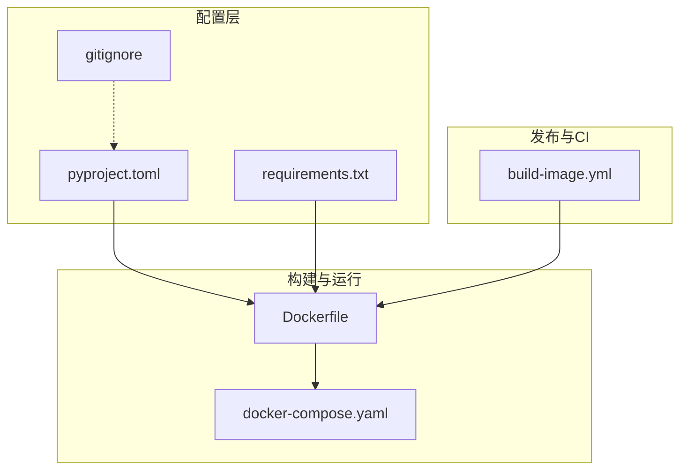
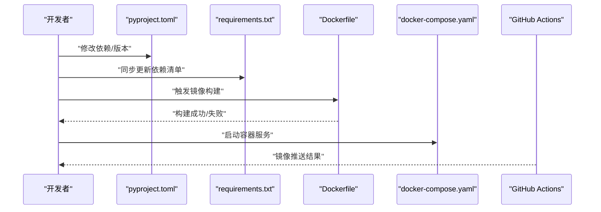
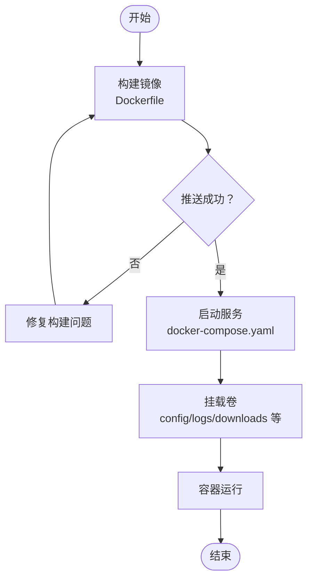
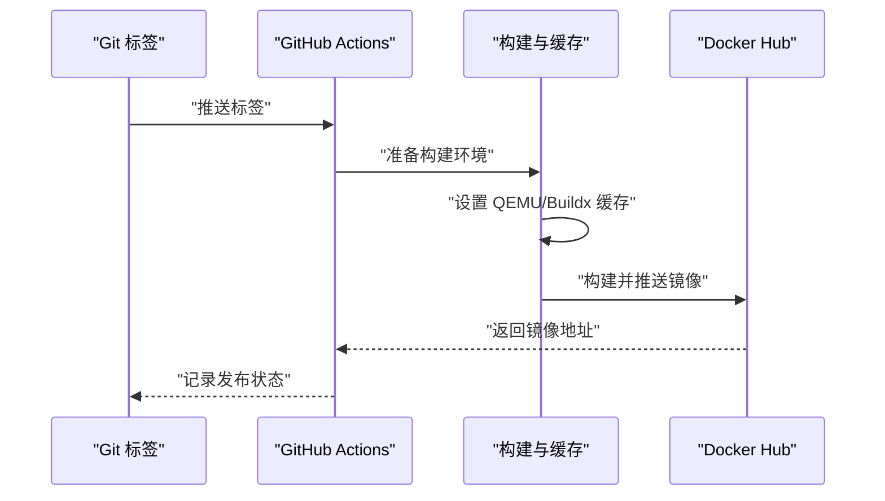
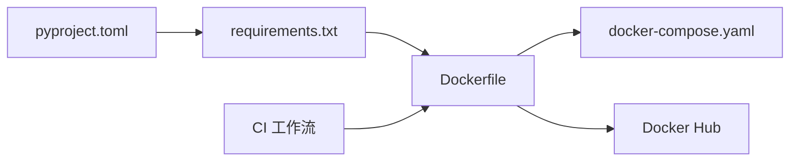

# 项目配置管理

<cite>
**本文引用的文件**
- [pyproject.toml](file://pyproject.toml)
- [requirements.txt](file://requirements.txt)
- [Dockerfile](file://Dockerfile)
- [docker-compose.yaml](file://docker-compose.yaml)
- [README.md](file://README.md)
- [build-image.yml](file://.github/workflows/build-image.yml)
- [.gitignore](file://.gitignore)
</cite>

## 目录
1. [引言](#引言)
2. [项目结构](#项目结构)
3. [核心组件](#核心组件)
4. [架构总览](#架构总览)
5. [详细组件分析](#详细组件分析)
6. [依赖关系分析](#依赖关系分析)
7. [性能考量](#性能考量)
8. [故障排查指南](#故障排查指南)
9. [结论](#结论)
10. [附录](#附录)

## 引言
本文件聚焦于项目的配置管理体系，围绕 pyproject.toml 的结构与配置项进行深入解析，涵盖项目元数据、依赖管理、构建与打包、开发工具配置、容器化与发布流程等方面。同时提供修改配置、添加依赖、配置开发环境与版本发布的实操指引，以及最佳实践、安全建议与冲突处理方法，帮助开发者与使用者高效、稳定地管理项目。

## 项目结构
该项目采用“配置集中、职责分离”的组织方式：
- 配置层：pyproject.toml 提供标准的项目元数据与依赖声明；requirements.txt 作为兼容性与迁移用途保留。
- 构建与运行层：Dockerfile 与 docker-compose.yaml 定义容器镜像构建与服务编排。
- 发布与CI层：GitHub Actions 工作流负责镜像构建与推送。
- 开发与协作层：.gitignore 规范忽略文件，README.md 提供使用与开发说明。

**图示来源**
- [pyproject.toml](file://pyproject.toml)
- [requirements.txt](file://requirements.txt)
- [Dockerfile](file://Dockerfile)
- [docker-compose.yaml](file://docker-compose.yaml)
- [.github/workflows/build-image.yml](file://.github/workflows/build-image.yml)
- [.gitignore](file://.gitignore)
- [README.md](file://README.md)

**章节来源**
- [pyproject.toml](file://pyproject.toml)
- [requirements.txt](file://requirements.txt)
- [Dockerfile](file://Dockerfile)
- [docker-compose.yaml](file://docker-compose.yaml)
- [.github/workflows/build-image.yml](file://.github/workflows/build-image.yml)
- [.gitignore](file://.gitignore)
- [README.md](file://README.md)

## 核心组件
本节对 pyproject.toml 的关键配置块进行逐项解读，并结合其他配置文件说明其作用与影响范围。

- 项目元数据
  - 名称、版本、描述、自述文件、作者、许可证、Python 版本要求、依赖列表、项目链接等。
  - 作用：标准化项目信息，便于包管理器、发布平台与CI识别与处理。
  - 影响范围：包安装、版本约束、许可证合规、文档生成与展示。

- 依赖管理
  - requires-python：限定最低 Python 版本。
  - dependencies：核心运行时依赖，包含网络、日志、加密、系统信息、进度条、HTTP/2、JavaScript 执行等。
  - 与 requirements.txt 的一致性：两者应保持一致，避免重复或遗漏。

- 构建与打包
  - 当前仓库未显式声明构建后端；pyproject.toml 仅提供元数据与依赖。
  - 若需启用现代打包（如 PEP 517/518），应在 [build-system] 中补充后端与要求。

- 开发工具配置
  - 仓库未包含 lint、test、format 等工具的配置文件；建议在 pyproject.toml 中新增相应表以统一管理。
  - CI 工作流未包含 lint/test 步骤，可按需扩展。

- 容器化与发布
  - Dockerfile 基于 Python 官方镜像，安装 Node.js 与 FFmpeg，并以 Python 启动入口。
  - docker-compose.yaml 将关键目录挂载为卷，便于配置与日志持久化。
  - GitHub Actions 工作流在打标签时自动构建并推送多架构镜像至 Docker Hub。

**章节来源**
- [pyproject.toml](file://pyproject.toml)
- [requirements.txt](file://requirements.txt)
- [Dockerfile](file://Dockerfile)
- [docker-compose.yaml](file://docker-compose.yaml)
- [.github/workflows/build-image.yml](file://.github/workflows/build-image.yml)

## 架构总览
下图展示了配置与运行的整体关系：pyproject.toml 作为统一入口，驱动 Docker 构建、容器运行与镜像发布。

**图示来源**
- [pyproject.toml](file://pyproject.toml)
- [requirements.txt](file://requirements.txt)
- [Dockerfile](file://Dockerfile)
- [docker-compose.yaml](file://docker-compose.yaml)
- [.github/workflows/build-image.yml](file://.github/workflows/build-image.yml)
- [.gitignore](file://.gitignore)

## 详细组件分析

### pyproject.toml 结构与配置项详解
- [project] 区块
  - name、version、description：项目标识与描述。
  - readme：自述文件路径，用于生成包说明。
  - authors、license：作者与许可证信息。
  - requires-python：运行时 Python 版本下限。
  - dependencies：运行时依赖列表。
  - urls：项目主页、文档、仓库、问题跟踪等链接。

- [project.urls] 区块
  - 提供项目生态链接，便于用户与工具访问。

- 与 requirements.txt 的关系
  - 两者均列出运行时依赖，应保持同步，避免版本漂移。
  - 推荐优先以 pyproject.toml 为准，requirements.txt 作为兼容导出使用。

- 与 Dockerfile 的关系
  - Dockerfile 通过 pip 安装 requirements.txt，间接消费 pyproject.toml 的依赖声明。
  - 若 Dockerfile 直接使用 pyproject.toml，可简化依赖来源，减少维护成本。

- 与 CI 的关系
  - CI 工作流负责镜像构建与推送，与 pyproject.toml 的版本号、依赖变化无直接耦合，但镜像构建过程会受依赖影响。

**章节来源**
- [pyproject.toml](file://pyproject.toml)
- [requirements.txt](file://requirements.txt)
- [Dockerfile](file://Dockerfile)
- [.github/workflows/build-image.yml](file://.github/workflows/build-image.yml)

### 依赖管理流程（序列图）
下图展示从修改依赖到容器运行的关键步骤。

**图示来源**
- [pyproject.toml](file://pyproject.toml)
- [requirements.txt](file://requirements.txt)
- [Dockerfile](file://Dockerfile)
- [docker-compose.yaml](file://docker-compose.yaml)
- [.github/workflows/build-image.yml](file://.github/workflows/build-image.yml)

### 容器化与服务编排（流程图）
容器运行涉及镜像构建、卷挂载与服务启动。

**图示来源**
- [Dockerfile](file://Dockerfile)
- [docker-compose.yaml](file://docker-compose.yaml)

### 版本发布流程（序列图）
镜像发布由 CI 触发，支持多架构与缓存加速。

**图示来源**
- [.github/workflows/build-image.yml](file://.github/workflows/build-image.yml)

## 依赖关系分析
- 配置文件之间的耦合
  - pyproject.toml 与 requirements.txt：依赖声明的一致性至关重要。
  - Dockerfile 与 requirements.txt：镜像构建依赖 requirements.txt。
  - docker-compose.yaml 与 Dockerfile：服务编排依赖镜像构建结果。
  - CI 工作流与 Dockerfile：CI 构建镜像并推送。

- 外部依赖与集成点
  - Node.js：Dockerfile 安装 Node.js，用于 JavaScript 解密逻辑。
  - FFmpeg：Dockerfile 安装 FFmpeg，用于视频录制与转码。
  - Docker Hub：CI 推送镜像的目标仓库。

**图示来源**
- [pyproject.toml](file://pyproject.toml)
- [requirements.txt](file://requirements.txt)
- [Dockerfile](file://Dockerfile)
- [docker-compose.yaml](file://docker-compose.yaml)
- [.github/workflows/build-image.yml](file://.github/workflows/build-image.yml)

**章节来源**
- [pyproject.toml](file://pyproject.toml)
- [requirements.txt](file://requirements.txt)
- [Dockerfile](file://Dockerfile)
- [docker-compose.yaml](file://docker-compose.yaml)
- [.github/workflows/build-image.yml](file://.github/workflows/build-image.yml)

## 性能考量
- 依赖版本锁定与更新策略
  - 使用范围限定符与固定版本相结合，平衡安全性与稳定性。
  - 定期审阅依赖更新，避免引入破坏性变更。

- 构建缓存与多架构支持
  - CI 使用 Buildx 与本地缓存，提升构建效率。
  - 多架构镜像（amd64/arm64）满足不同硬件平台需求。

- 容器层优化
  - 减少不必要的层与文件拷贝，精简基础镜像。
  - 合理挂载卷，避免容器内写入过多临时文件。

[本节为通用指导，无需特定文件来源]

## 故障排查指南
- 依赖安装失败
  - 检查 Python 版本是否满足 requires-python。
  - 确认 requirements.txt 与 pyproject.toml 依赖一致。
  - 使用国内镜像源加速安装，或在 CI 中配置镜像源。

- 容器启动异常
  - 确认 Node.js 与 FFmpeg 已正确安装。
  - 检查卷挂载路径与权限。
  - 查看容器日志定位错误。

- CI 构建失败
  - 检查 Dockerfile 与 requirements.txt 是否匹配。
  - 确认 Docker Hub 登录凭据与缓存配置。
  - 关注多架构构建的兼容性问题。

**章节来源**
- [Dockerfile](file://Dockerfile)
- [docker-compose.yaml](file://docker-compose.yaml)
- [.github/workflows/build-image.yml](file://.github/workflows/build-image.yml)
- [README.md](file://README.md)

## 结论
本项目通过 pyproject.toml 实现了清晰的项目元数据与依赖声明，配合 Dockerfile、docker-compose.yaml 与 GitHub Actions 工作流，形成了从开发、构建到发布的完整配置链路。建议进一步完善开发工具配置（lint/test/format），并在 CI 中加入质量检查步骤，以提升整体工程化水平与交付质量。

[本节为总结性内容，无需特定文件来源]

## 附录

### 修改项目配置的操作指南
- 修改项目元数据与依赖
  - 在 pyproject.toml 的 [project] 与 [project.dependencies] 中调整。
  - 同步更新 requirements.txt，确保一致性。
  - 参考路径：[pyproject.toml](file://pyproject.toml)，[requirements.txt](file://requirements.txt)

- 添加新依赖
  - 在 pyproject.toml 的 dependencies 列表中追加。
  - 同步更新 requirements.txt 并验证安装。
  - 参考路径：[pyproject.toml](file://pyproject.toml)，[requirements.txt](file://requirements.txt)

- 配置开发环境
  - 使用 uv 或 venv 创建隔离环境。
  - 通过 uv sync 或 pip 安装依赖。
  - 参考路径：[README.md](file://README.md)

- 版本发布流程
  - 推送 Git 标签触发 CI。
  - CI 自动构建并推送多架构镜像。
  - 参考路径：[build-image.yml](file://.github/workflows/build-image.yml)

**章节来源**
- [pyproject.toml](file://pyproject.toml)
- [requirements.txt](file://requirements.txt)
- [README.md](file://README.md)
- [.github/workflows/build-image.yml](file://.github/workflows/build-image.yml)

### 最佳实践与安全建议
- 最佳实践
  - 以 pyproject.toml 为核心配置源，requirements.txt 仅用于兼容导出。
  - 使用语义化版本与固定版本策略，定期审阅更新。
  - 在 CI 中启用构建缓存与多架构支持，提升效率与覆盖性。

- 安全建议
  - 严格控制许可证合规，避免引入不兼容或高风险依赖。
  - 在 CI 中配置镜像源与缓存，降低供应链攻击风险。
  - 定期扫描依赖漏洞，及时升级关键组件。

[本节为通用指导，无需特定文件来源]

### 配置冲突的解决方法
- pyproject.toml 与 requirements.txt 冲突
  - 以 pyproject.toml 为准，将差异同步到 requirements.txt。
  - 使用工具导出 requirements.txt，确保一致性。

- Dockerfile 与依赖声明不一致
  - 确保 Dockerfile 通过 requirements.txt 安装依赖。
  - 或直接在 Dockerfile 中引用 pyproject.toml（如启用现代打包）。

- CI 与本地环境差异
  - 在 CI 中显式设置镜像源与缓存，复现本地行为。
  - 使用相同的基础镜像与 Python 版本。

**章节来源**
- [pyproject.toml](file://pyproject.toml)
- [requirements.txt](file://requirements.txt)
- [Dockerfile](file://Dockerfile)
- [.github/workflows/build-image.yml](file://.github/workflows/build-image.yml)