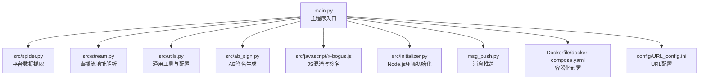
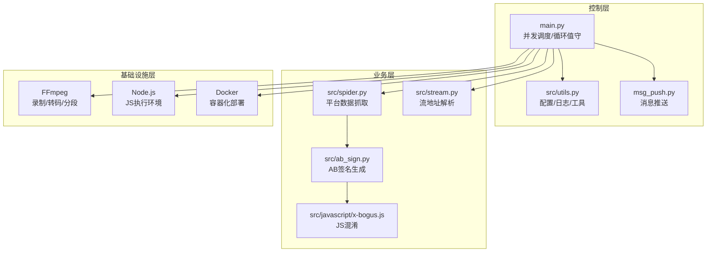
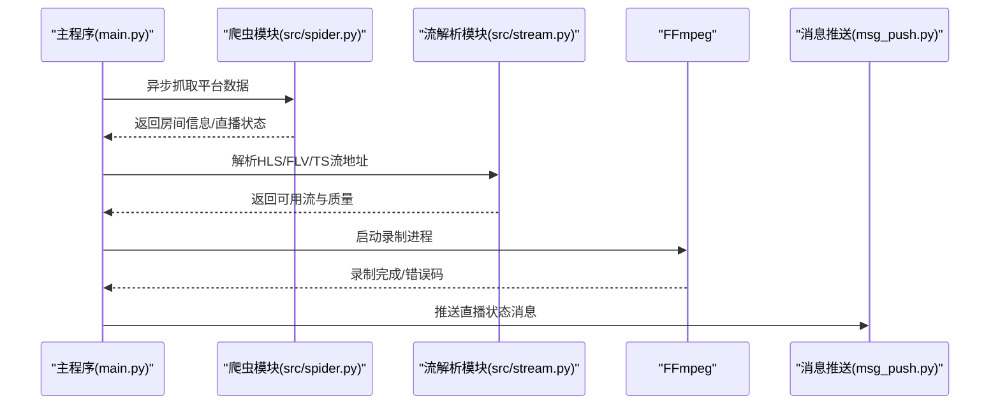
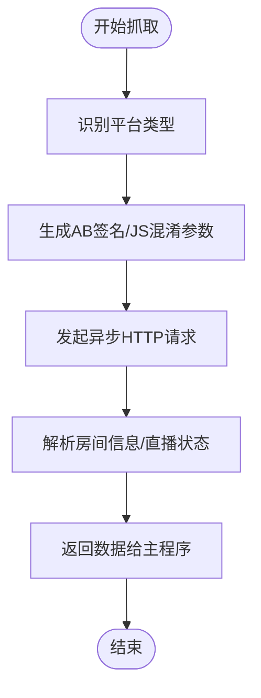
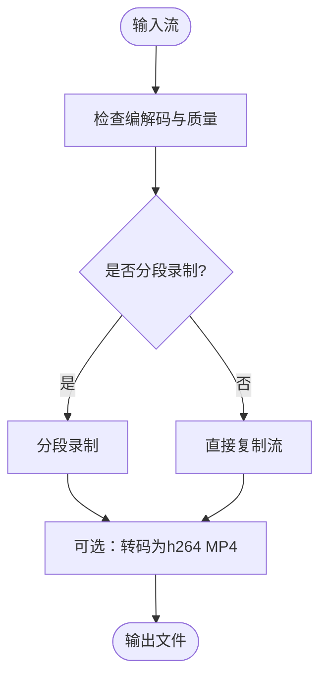
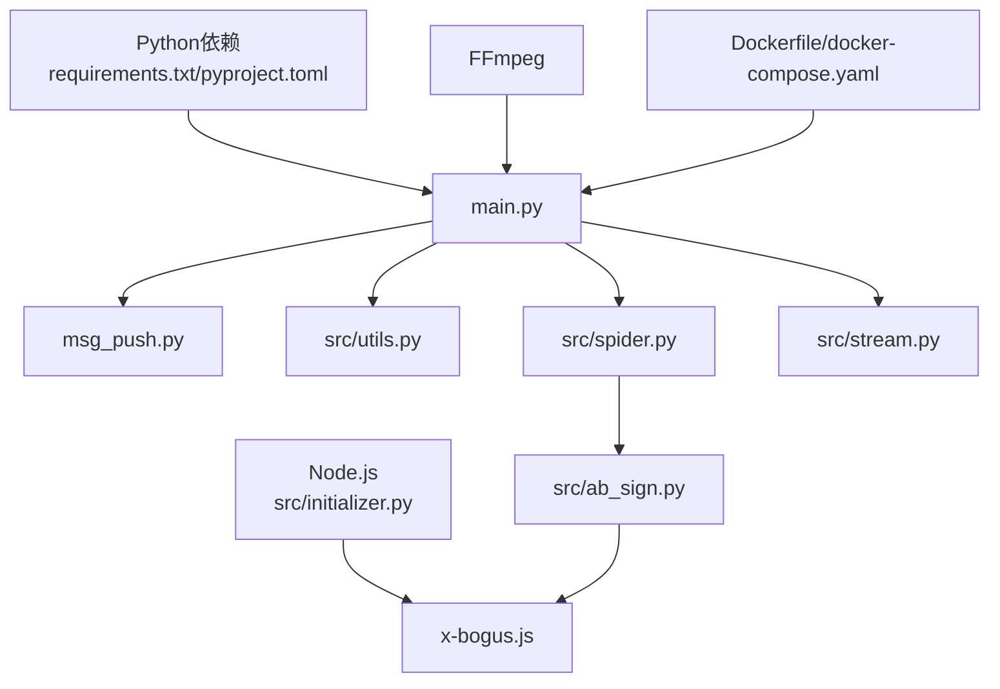

# 项目概述

<cite>
**本文档引用的文件**
- [README.md](file://README.md)
- [main.py](file://main.py)
- [requirements.txt](file://requirements.txt)
- [pyproject.toml](file://pyproject.toml)
- [src/spider.py](file://src/spider.py)
- [src/stream.py](file://src/stream.py)
- [src/utils.py](file://src/utils.py)
- [src/ab_sign.py](file://src/ab_sign.py)
- [src/javascript/x-bogus.js](file://src/javascript/x-bogus.js)
- [src/initializer.py](file://src/initializer.py)
- [Dockerfile](file://Dockerfile)
- [docker-compose.yaml](file://docker-compose.yaml)
- [config/URL_config.ini](file://config/URL_config.ini)
- [msg_push.py](file://msg_push.py)
</cite>

## 目录
1. [项目简介](#项目简介)
2. [项目结构](#项目结构)
3. [核心组件](#核心组件)
4. [架构总览](#架构总览)
5. [详细组件分析](#详细组件分析)
6. [依赖关系分析](#依赖关系分析)
7. [性能考量](#性能考量)
8. [故障排查指南](#故障排查指南)
9. [结论](#结论)
10. [附录](#附录)

## 项目简介
DouyinLiveRecorder 是一款简易的可循环值守直播录制工具，基于 FFmpeg 实现多平台直播源录制。项目支持 40+ 个国内外主流直播平台，覆盖抖音、TikTok、快手、B站、虎牙、斗鱼、YY、小红书、SOOP、网易CC、千度热播、PandaTV、WinkTV、FlexTV、PopkonTV、TwitCasting、百度直播、微博直播、酷狗直播、TwitchTV、LiveMe、ShowRoom、Acfun、映客直播、音播直播、知乎直播、CHZZK、嗨秀直播、VV星球直播、17Live、浪Live、畅聊直播、飘飘直播、六间房直播、乐嗨直播、花猫直播、Shopee、YouTube、淘宝、京东、Faceit、咪咕、连接直播、来秀直播、Picarto 等。

项目采用异步并发架构与循环值守机制，结合 FFmpeg 进行高质量视频录制与转码，支持 TS/FLV/HLS 等多种格式，具备自动录制、直播状态推送、分段录制、转码为 MP4、时间戳文件生成、自定义脚本执行、容器化部署等特性。适合个人用户与企业级场景长期稳定运行。

## 项目结构
项目采用模块化设计，核心代码位于 src 包中，包含爬虫、流地址解析、工具函数、初始化与签名算法等模块；顶层提供主程序入口、Docker 配置、消息推送、配置文件模板等。

**图表来源**
- [main.py](file://main.py)
- [src/spider.py](file://src/spider.py)
- [src/stream.py](file://src/stream.py)
- [src/utils.py](file://src/utils.py)
- [src/ab_sign.py](file://src/ab_sign.py)
- [src/javascript/x-bogus.js](file://src/javascript/x-bogus.js)
- [src/initializer.py](file://src/initializer.py)
- [Dockerfile](file://Dockerfile)
- [docker-compose.yaml](file://docker-compose.yaml)
- [config/URL_config.ini](file://config/URL_config.ini)
- [msg_push.py](file://msg_push.py)

**章节来源**
- [README.md](file://README.md)
- [main.py](file://main.py)

## 核心组件
- 异步并发调度与循环值守：主程序负责读取配置、并发调度各直播任务、动态调整并发数、循环监控与录制。
- 平台数据抓取：针对不同平台的房间页/接口进行异步抓取，解析直播状态与房间信息。
- 流地址解析：统一解析各平台的 HLS/FLV/TS 等直播源，优先选择合适码率与编解码类型。
- FFmpeg 录制与转码：调用 FFmpeg 进行直播流录制、分段、转码为 MP4、生成时间戳字幕文件。
- 消息推送：支持钉钉、微信、邮箱、Telegram、Bark、NTFY、PushPlus 等多种推送渠道。
- 容器化与跨平台：提供 Dockerfile 与 docker-compose，支持 Linux/macOS/Windows 多平台部署。
- Node.js 环境初始化：自动检测并安装 Node.js 以支持 JavaScript 混淆与签名计算。

**章节来源**
- [main.py](file://main.py)
- [src/spider.py](file://src/spider.py)
- [src/stream.py](file://src/stream.py)
- [src/utils.py](file://src/utils.py)
- [src/ab_sign.py](file://src/ab_sign.py)
- [src/javascript/x-bogus.js](file://src/javascript/x-bogus.js)
- [src/initializer.py](file://src/initializer.py)
- [Dockerfile](file://Dockerfile)
- [docker-compose.yaml](file://docker-compose.yaml)
- [msg_push.py](file://msg_push.py)

## 架构总览
整体架构分为三层：控制层（主程序）、业务层（爬虫与流解析）、基础设施层（FFmpeg、Node.js、消息推送）。控制层负责并发调度与录制生命周期管理；业务层负责与各直播平台交互；基础设施层提供录制与环境支撑。

**图表来源**
- [main.py](file://main.py)
- [src/spider.py](file://src/spider.py)
- [src/stream.py](file://src/stream.py)
- [src/utils.py](file://src/utils.py)
- [src/ab_sign.py](file://src/ab_sign.py)
- [src/javascript/x-bogus.js](file://src/javascript/x-bogus.js)
- [Dockerfile](file://Dockerfile)

## 详细组件分析

### 主程序与并发调度
- 读取配置文件，解析直播 URL 列表与质量设置，支持每条 URL 自定义画质。
- 使用信号量控制并发，动态调整最大并发数以适配网络错误率。
- 提供录制状态展示、录制分段、转码为 MP4、生成时间戳字幕文件等功能。
- 支持脚本自定义执行（Python/BAT/BASH），在录制完成后触发。

**图表来源**
- [main.py](file://main.py)
- [src/spider.py](file://src/spider.py)
- [src/stream.py](file://src/stream.py)
- [msg_push.py](file://msg_push.py)

**章节来源**
- [main.py](file://main.py)

### 平台数据抓取与签名算法
- 针对抖音、TikTok、快手、B站、虎牙、斗鱼、YY、小红书、SOOP、网易CC、千度热播、PandaTV、WinkTV、FlexTV、PopkonTV、TwitCasting、百度直播、微博直播、酷狗直播、TwitchTV、LiveMe、ShowRoom、Acfun、映客直播、音播直播、知乎直播、CHZZK、嗨秀直播、VV星球直播、17Live、浪Live、畅聊直播、飘飘直播、六间房直播、乐嗨直播、花猫直播、Shopee、YouTube、淘宝、京东、Faceit、咪咕、连接直播、来秀直播、Picarto 等平台分别实现异步抓取逻辑。
- 使用 AB 签名与 x-bogus JS 混淆生成请求参数，绕过风控与反爬策略。
- 通过 Cookie/Token 等认证信息提升成功率与稳定性。

**图表来源**
- [src/spider.py](file://src/spider.py)
- [src/ab_sign.py](file://src/ab_sign.py)
- [src/javascript/x-bogus.js](file://src/javascript/x-bogus.js)

**章节来源**
- [src/spider.py](file://src/spider.py)
- [src/ab_sign.py](file://src/ab_sign.py)
- [src/javascript/x-bogus.js](file://src/javascript/x-bogus.js)

### FFmpeg 录制与转码流程
- 支持 TS/FLV/HLS 等格式录制，自动选择合适编解码与质量。
- 支持按时间分段录制，生成独立片段文件。
- 支持强制转码为 h264 MP4，便于兼容播放设备。
- 支持生成时间戳字幕文件，便于后期编辑与定位。

**图表来源**
- [main.py](file://main.py)

**章节来源**
- [main.py](file://main.py)

### 消息推送与配置管理
- 支持钉钉、微信、邮箱、Telegram、Bark、NTFY、PushPlus 等推送渠道，可批量配置多个推送地址。
- 配置文件支持自定义 Cookie、Token、代理、画质等参数，便于按平台定制。
- 提供脚本执行能力，可在录制完成后触发外部脚本（Python/BAT/BASH）。

**章节来源**
- [msg_push.py](file://msg_push.py)
- [config/URL_config.ini](file://config/URL_config.ini)
- [main.py](file://main.py)

## 依赖关系分析
- Python 依赖：requests、loguru、pycryptodome、distro、tqdm、httpx[http2]、PyExecJS。
- Node.js：用于执行 JavaScript 混淆与签名计算，自动检测并安装。
- FFmpeg：用于录制、转码、分段处理。
- Docker：提供容器化部署方案，简化跨平台部署。

**图表来源**
- [requirements.txt](file://requirements.txt)
- [pyproject.toml](file://pyproject.toml)
- [src/initializer.py](file://src/initializer.py)
- [Dockerfile](file://Dockerfile)
- [docker-compose.yaml](file://docker-compose.yaml)
- [main.py](file://main.py)
- [src/spider.py](file://src/spider.py)
- [src/stream.py](file://src/stream.py)
- [src/utils.py](file://src/utils.py)
- [src/ab_sign.py](file://src/ab_sign.py)
- [src/javascript/x-bogus.js](file://src/javascript/x-bogus.js)
- [msg_push.py](file://msg_push.py)

**章节来源**
- [requirements.txt](file://requirements.txt)
- [pyproject.toml](file://pyproject.toml)
- [src/initializer.py](file://src/initializer.py)
- [Dockerfile](file://Dockerfile)
- [docker-compose.yaml](file://docker-compose.yaml)

## 性能考量
- 异步并发：使用异步 HTTP 客户端与信号量控制并发，降低阻塞与资源占用。
- 动态并发调整：根据错误率窗口动态调整并发数，提升稳定性与吞吐量。
- 编解码选择：优先选择 FLV/HLS，必要时自动切换；TS 格式更稳定，建议长时间录制使用。
- 分段录制：按时间分段减少单文件体积，便于后续处理与传输。
- 转码策略：仅在需要时进行转码，避免不必要的 CPU 开销。

## 故障排查指南
- Node.js 未安装：初始化模块会自动检测并安装 Node.js，若失败请手动安装并重启。
- FFmpeg 未找到：确保系统已安装 FFmpeg，或使用提供的 Docker 镜像。
- 平台风控/反爬：检查 Cookie/Token 是否有效，必要时启用代理；平台更新后需同步更新抓取逻辑。
- 录制中断/文件损坏：尽量使用 TS 格式并避免手动中断容器；录制完成后可执行脚本进行二次处理。
- 推送失败：检查推送地址与凭据配置，确认网络可达性。

**章节来源**
- [src/initializer.py](file://src/initializer.py)
- [main.py](file://main.py)
- [msg_push.py](file://msg_push.py)

## 结论
DouyinLiveRecorder 以简洁高效的架构实现了多平台直播录制与管理，具备良好的扩展性与稳定性。通过异步并发与循环值守机制，满足长期无人值守录制需求；借助 FFmpeg 与多种推送能力，覆盖从采集到交付的完整链路。无论是初学者还是资深开发者，均可快速上手并按需定制。

## 附录
- 已支持平台清单详见项目 README。
- 使用说明与配置示例详见 README。
- Docker 部署与容器编排配置见 Dockerfile 与 docker-compose.yaml。

**章节来源**
- [README.md](file://README.md)
- [Dockerfile](file://Dockerfile)
- [docker-compose.yaml](file://docker-compose.yaml)